# Stanford CS231N Deep Learning for Computer Vision | Spring 2025 | Lecture 1: Introduction

Professor Fei-Fei Li of the Computer Science Department will co-teach this course with Professor Ehsan Adeli and a graduate student.

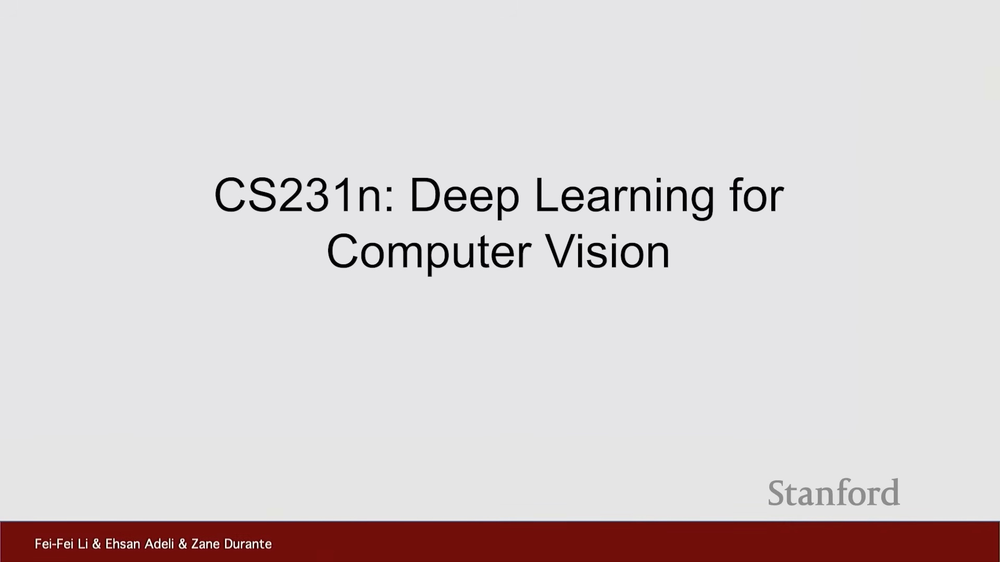

The goal is to explore how Artificial Intelligence ($\text{AI}$) has become an immensely interdisciplinary field. While the core material—computer vision and deep learning—is highly technical, we encourage students to apply these concepts to their respective fields of passion.

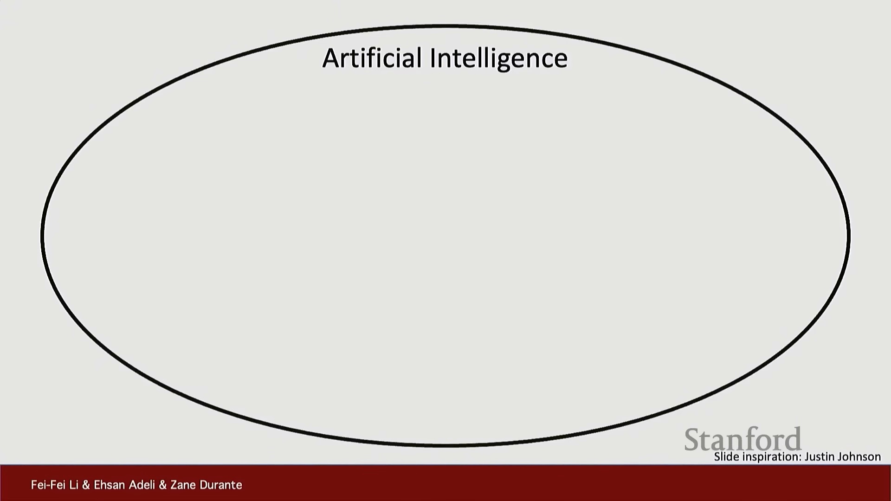

When considering $\text{AI}$ as a large field, computer vision (CV) is recognized as an integral component.

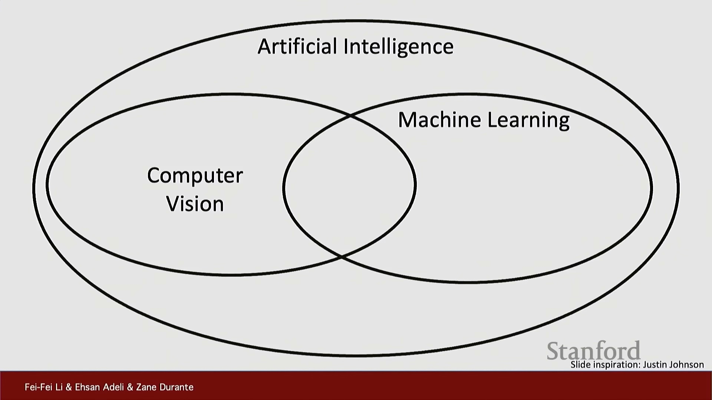

Vision is not merely one part of intelligence; it is considered a cornerstone of understanding general intelligence itself. Solving the mystery of visual intelligence is equivalent to unlocking the broader mysteries of intelligence. The fundamental tools necessary for solving $\text{AI}$ problems are derived from machine learning, or statistical machine learning.

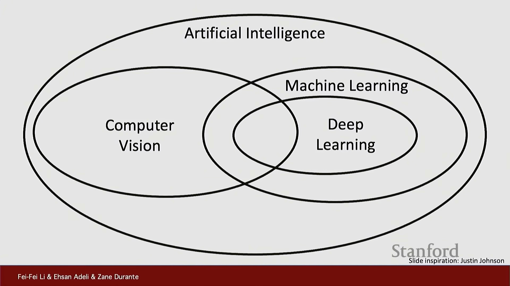

Within this domain, the last decade has seen a massive revolution known as deep learning. Deep learning refers to a collection of algorithmic techniques built around neural networks.

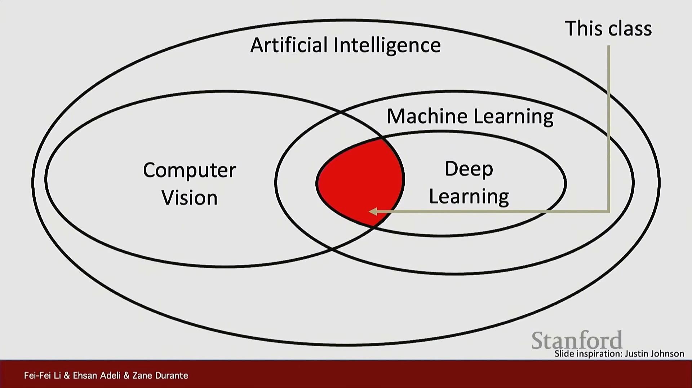

While we cannot cover the entirety of computer vision, nor all of machine learning or deep learning, this course will focus on their critical intersection. Moreover, $\text{AI}$, and specifically CV, is deeply interdisciplinary. Our problems intersect with natural language processing ($\text{NLP}$), speech recognition, robotics, and numerous other fields.

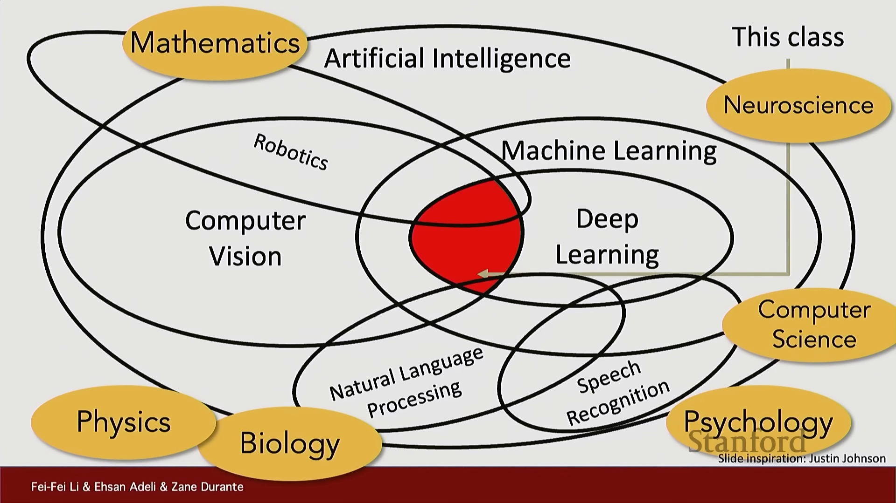

These include mathematics, neuroscience, computer science, psychology, physics, biology, and practical application areas ranging from medicine to law and business. For this initial lecture, we will receive a brief history of both computer vision and deep learning.

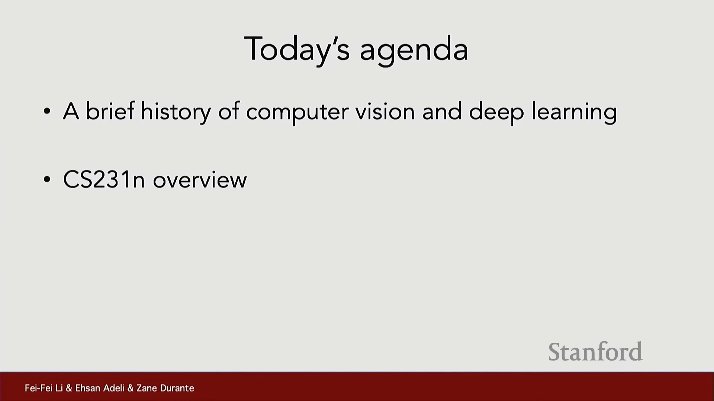

Professor Adeli will then provide an overview of the course structure, setting expectations for our studies. The history of visual intelligence is vast; it did not begin when humanity existed.

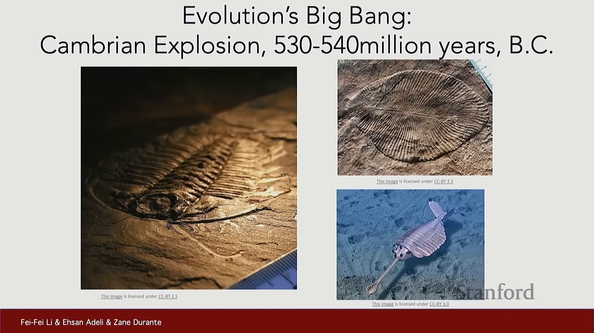

Instead, its origins trace back approximately 540 million years. This specific date helps pinpoint the mystery period known as the Cambrian Explosion, a period showing a massive burst in animal species evolution over a relatively short time span. Fossil studies suggest that life on Earth was initially simple and passive before this explosion. Before achieving sophisticated senses, early forms of life were confined to water and lacked terrestrial animals.

The cause of this speciation event remains subject to debate, involving theories related to ocean chemistry or climate shifts. The pivotal moment occurred when the earliest animal, a trilobite, gained photosensitive cells. These initial "eyes" were not sophisticated organs featuring lenses, retinas, and complex nerve cells; they were simply pinholes designed to collect light.

The ability to sense light fundamentally changed life's nature. Without sensors, metabolism was passive. With them, organisms became integrated parts of their environment, enabling active interaction with that world. The evolutionary forces driving intelligence are often linked to survival.

Because animals and plants can become dinner—and vice versa—natural selection spurred the development of sophisticated senses. The emergence of vision, alongside haptic or tactile sensing, marked some of the oldest sensors for animals. This entire 540-million-year course of evolving vision is essentially the evolution of intelligence itself. Vision, as one of primary sensory modes, was instrumental in developing the animal nervous system and advancing cognitive ability.

Almost every animal on Earth uses vision as one of its primary senses today.

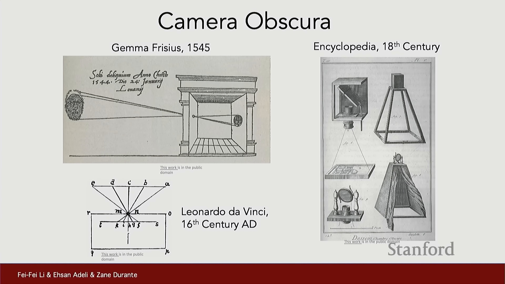

Humans are particularly visual animals; more than half of our cortical cells are dedicated solely to visual processing. Our resulting visual system is highly complex and deeply convoluted. Moving past these biological origins, humans have consistently sought methods for artificial sight. Pioneers like Leonardo da Vinci demonstrated early curiosity, studying the *camera obscura* while also investigating how to build steam machines.

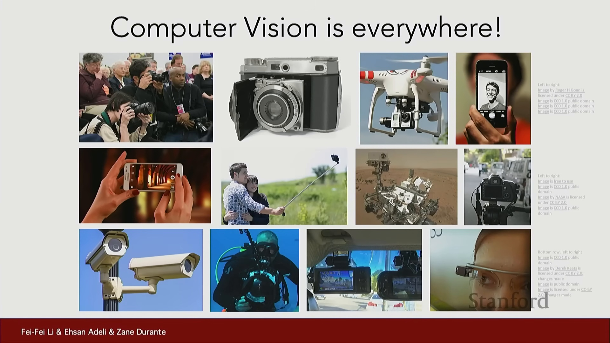

Even before modern times, records from ancient Greece and China show thinkers contemplating projecting images through pinholes. Today, cameras have exploded in use, but technology alone is not sufficient; just as eyes are necessary for sight, we must understand the underlying principles of visual intelligence.

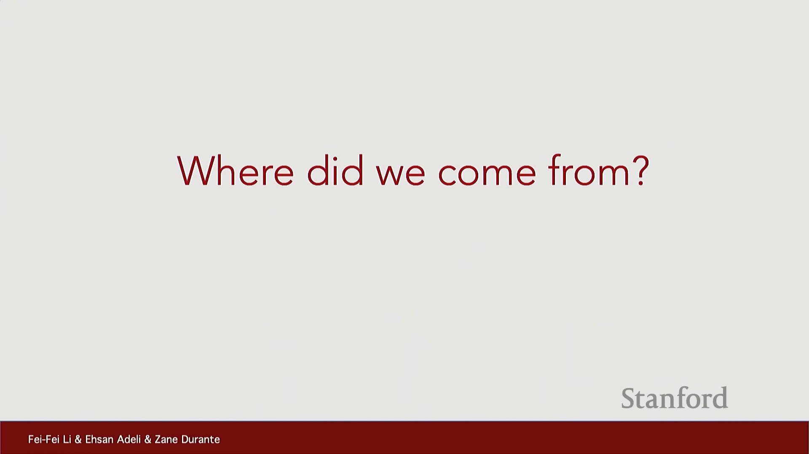

This necessity forms the core focus of our study: understanding how visual intelligence arises.

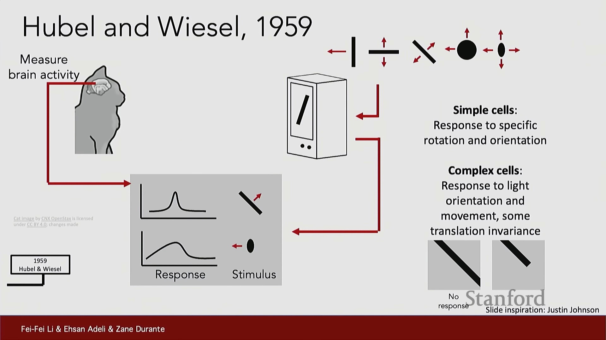

To trace this history, let us return to the 1950s, a period marked by critically important experiments in neuroscience. These studies focused specifically on the visual pathways of mammals, notably through the seminal work of Hubel and Wiesel. They used electrodes placed into anesthetized cats to study the receptive fields of neurons within the primary visual cortex.

Their findings revealed two crucial insights. First, they discovered that individual neurons in the primary visual cortex possess unique receptive fields. A receptive field defines a specific, confined region of space that a given neuron can actually detect; it is not sensitive to all surrounding space. Within this limited area, these neurons are specialized: early stages observe simple patterns, while receptors within the primary visual cortex often detect oriented edges or moving oriented edges.

This pattern detection forms the foundation of computation in the brain. Second, they established that the visual pathway operates hierarchically. As signals move deeper into the system, neurons feed their output into subsequent layers. Neurons in these higher or deeper layers possess increasingly complex receptive fields.

For example, the initial detection of oriented edges can feed into a corner receptor, which might then contribute to an object receptor—a simplification, but indicative of this escalating complexity. The core concept underlying artificial neurons is that they feed into each other, establishing a complex network of computation. While many current students may assume this description will profoundly impact modern neural network modeling for visual algorithms, it’s crucial to understand its historical context.

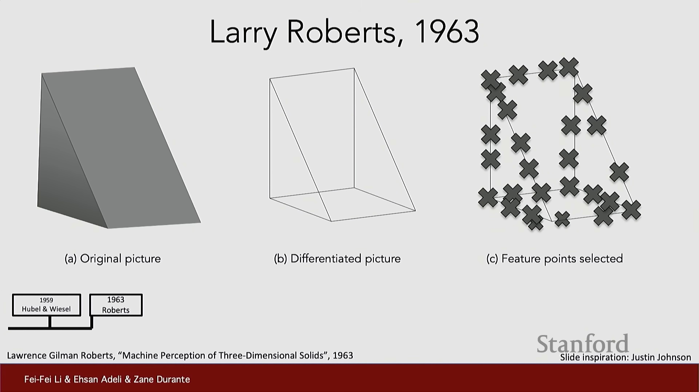

The early history of vision research dates back to 1959 with initial studies of sight. A major milestone occurred roughly twenty years later when Hubel and Wiesel won the Nobel Prize in medicine for their foundational work uncovering the principles of visual processing. The field also saw a critical advance with the first PhD thesis devoted entirely to computer vision, written by Larry Roberts in 1963.

Roberts's research focused on understanding shape, proposing that we could take an abstract form and analyze its fundamental features—such as surfaces, corners, and edges—in a quantifiable way. This seminal work established early methodologies for recognizing the world structurally. Further solidifying the field’s start was a 1966 summer project at MIT, which aimed to solve computer vision entirely during one term.

Although this ambition reflected historical over-optimism, eventually, the goals were achieved.

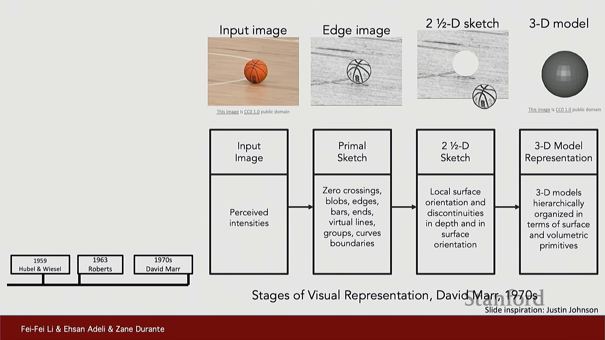

The 1960s, through Roberts's thesis and similar academic projects, are recognized as the official beginning of modern computer vision. A major systematic effort followed in the 1970s from David Marr, who sought to study visual processing scientifically. Marr developed a hierarchical model for understanding how input images are processed. He theorized that initial analysis begins with the *primal sketch*, which primarily detects edges.

This is followed by the development of a $2\frac{1}{2}\text{D}$ sketch, which helps separate objects based on different depths within the image. Finally, Marr argued that the ultimate goal of vision—the "grand holy grail"—is to determine the entire, full $3\text{D}$ representation of the scene. The fundamental challenge of computer vision is deeply rooted in physics and mathematics: recovering $3\text{D}$ information from $2\text{D}$ images.

This problem relates back to how life began seeing; ancient organisms collected light (photons) that projected onto a surface—at first just a patch, now the retina. Since the true world is $3\text{D}$, yet our sensory input is inherently $2\text{D}$, this task of inferring depth and volume from limited planar data is mathematically considered an ill-posed problem.

Nature has developed multiple eyes—most commonly two—which allows organisms to triangulate information for spatial understanding. However, mere triangulation is not sufficient; a system must also understand complex correspondences between points in space. Solving 3D vision is profoundly difficult, though nature and humans have successfully tackled the problem.

Despite human capability, we often lack geometric precision when judging three-dimensional shapes, which underscores the extreme difficulty of the task. A crucial philosophical difference exists between computer vision and natural language processing. Language is purely a generated construct; it does not exist in nature (you cannot point to "language").

It originates within our brains, making it inherently 1D and sequential. This generative quality has profound implications for modern Generative AI algorithms. Large Language Models (LLMs) are powerful because they model language this way. In contrast, vision deals with a physical world governed by the immutable laws of physics and materials.

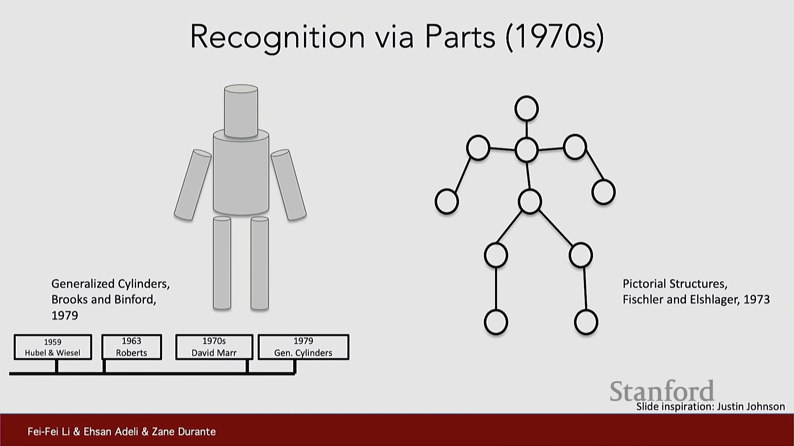

Because real-world visual data is not generated, computer vision requires fundamentally different tasks and approaches. It is important to appreciate both the difference between language generation and physical reality, and to recognize nature's extraordinary ability to solve these perception problems. The history of the field shows early pioneers in the 1970s making significant advancements despite lacking powerful computing resources, large datasets, or modern mathematical tools.

They began tackling difficult challenges like object recognition. For instance, Stanford conducted pioneering work on generalized cylinders through researchers like Rodney Brooks and Tom Binford. In another development area, compositional models—designed to represent the structure of objects and the human body—were developed in parallel within Palo Alto research groups.

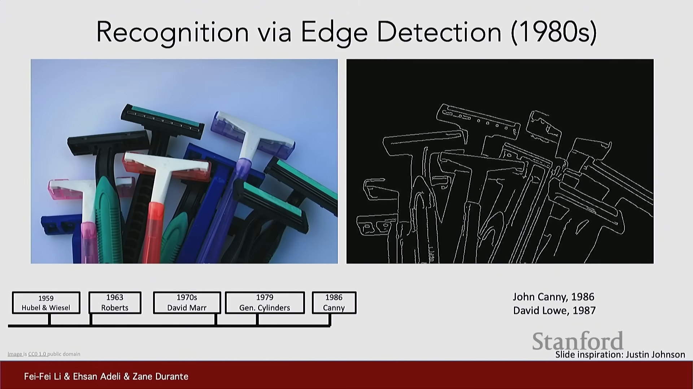

The 1980s marked the appearance of digitized photos, which allowed for early work in techniques such as edge detection. Although these early accomplishments might appear trivial today, they represented the state of the art during that era.

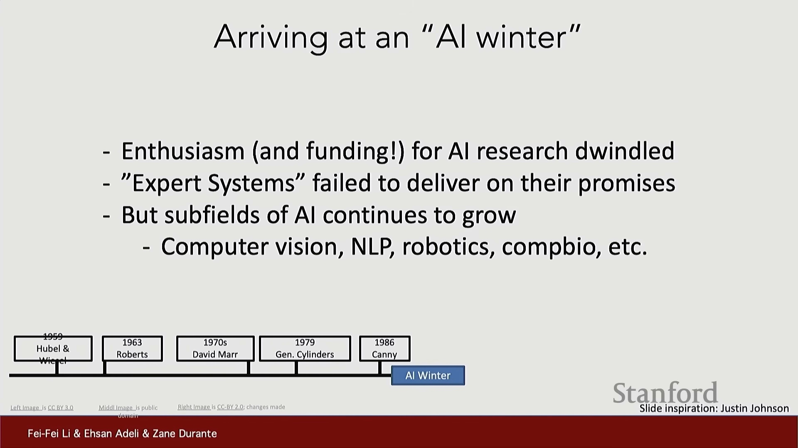

This progress was followed by a period known as "AI Winter." The field experienced declining enthusiasm and drastically reduced funding because many promising avenues—including computer vision, expert systems, and robotics—failed to deliver commercial solutions. However, beneath this winter, research continued to grow across diverse fields, including NLP, robotics, and computer vision itself.

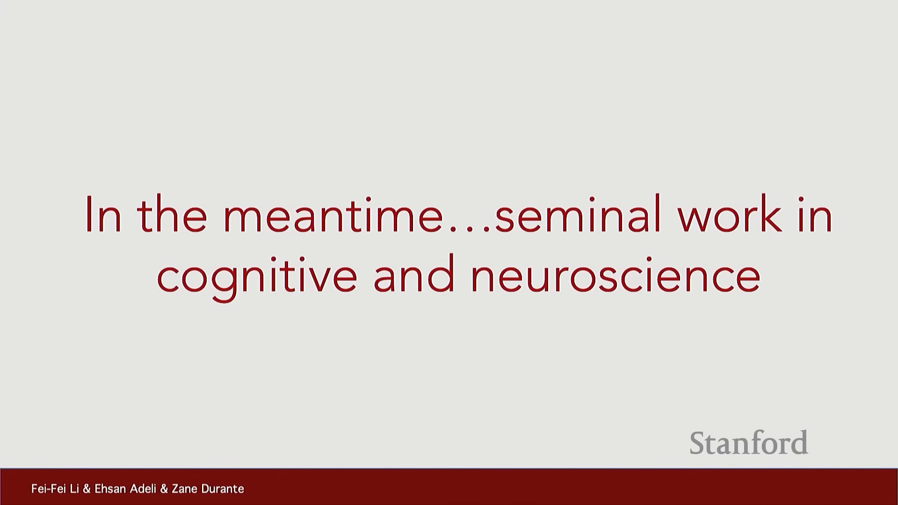

A profoundly important secondary stream of research that fueled modern CV was the continuous flourishing of cognitive science and neuroscience.

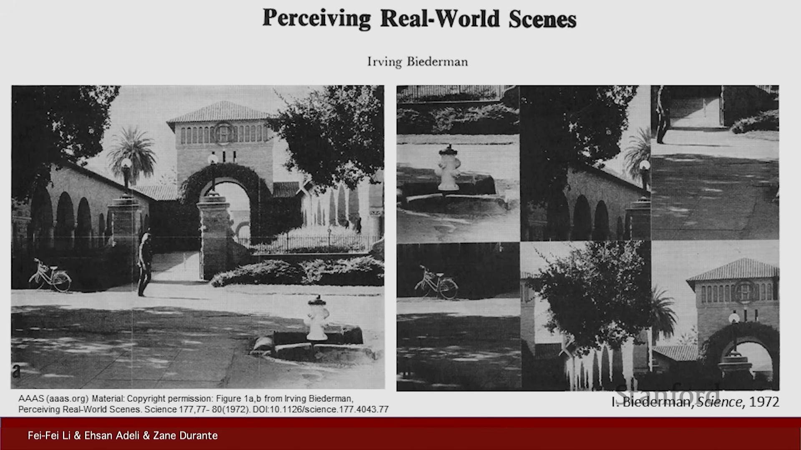

These fields began pointing toward "North Star" problems for artificial intelligence researchers. For example, psycholinguists have highlighted something unique about perceiving natural or real-world environments. A key study by Irvin Biederman demonstrated that an individual’s ability to detect objects (like bicycles) differs significantly depending on whether the presented images are scrambled or not, confirming a deep dependency on how nature presents information.

From a photonic point of view, two distinct bicycles might appear in the exact same location on your retina. Yet, the surrounding context—the rest of the image—significantly impacts how the viewer perceives the target objects.

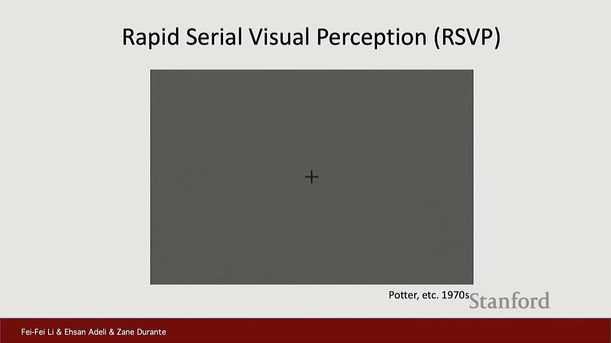

This suggests that viewing the entire environment influences object perception, pointing to critical aspects of visual processing and environmental context. Evidence shows that human visual processing is remarkably fast. An early 1970s experiment demonstrated this by showing subjects a video designed to test their ability to detect humans in specific frames.

The challenge was demanding: detecting a target without prior knowledge regarding the frame content, appearance, or gestures of the subject.

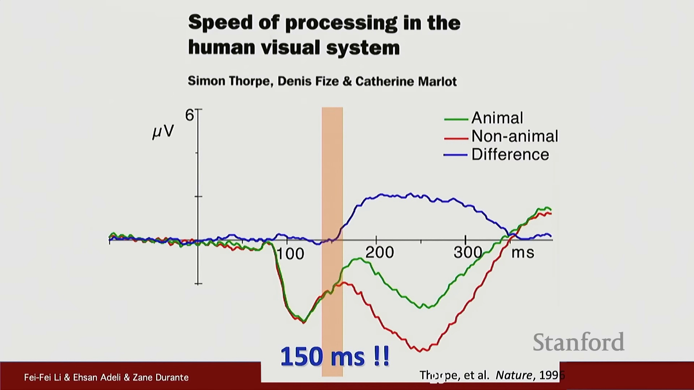

These tests highlight rapid processing rates; for example, the frames were played at $10\ \text{Hertz}$, meaning each image was visible for only $100\ \text{milliseconds}$. This demonstrates the remarkable speed and efficiency of our innate visual system.

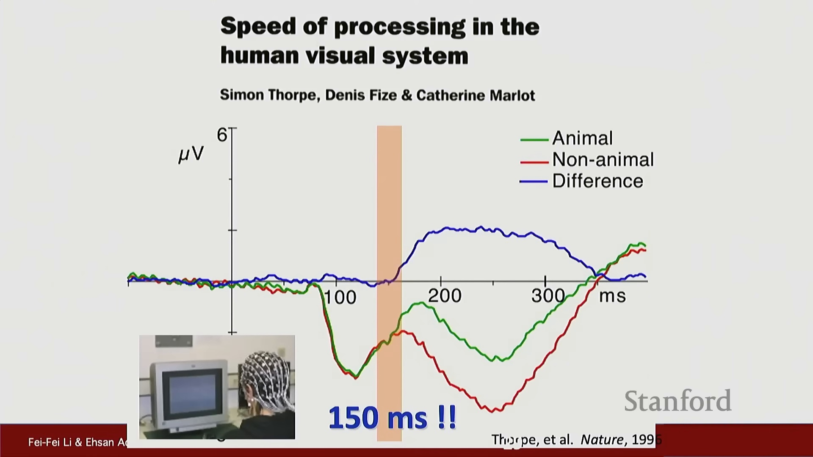

Cognitive neuroscientists like Simon Thorpe further measured this capability using $\text{EEG}$ caps, presenting complex natural scenes for categorization tasks (e.g., distinguishing animals from non-animals). It was found that after only $150\ \text{milliseconds}$ of exposure, the brain could already generate a differential signal sufficient for proper categorization.

While $150\ \text{milliseconds}$ is significantly slower compared to modern $\text{GPUs}$ and digital chips—representing orders of magnitude difference—it remains incredibly fast when considering biological processing.

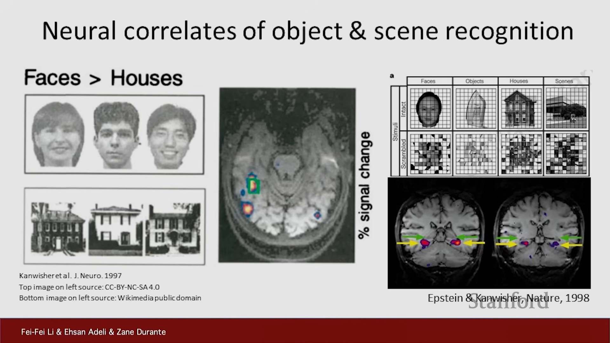

Our neurological "wetware" achieves this speed through only a few hops across neural networks, demonstrating sophisticated innate capability.

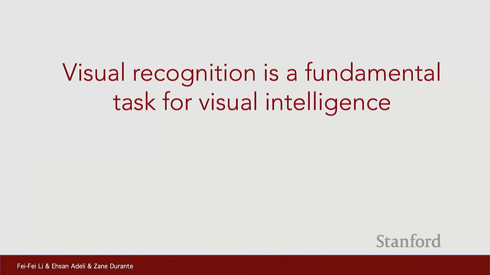

Humans are highly effective at object recognition and categorization, leading to the development of specialized brain areas dedicated to expert tasks, such as recognizing faces or mapping body parts. These discoveries, documented by neurophysiologists in the 1990s and early 21st century, steered research away from merely studying image sketches toward understanding fundamental drivers of visual intelligence.

These studies collectively emphasize that a core goal for artificial intelligence must be solving natural object recognition—identifying objects within complex, real-world settings.

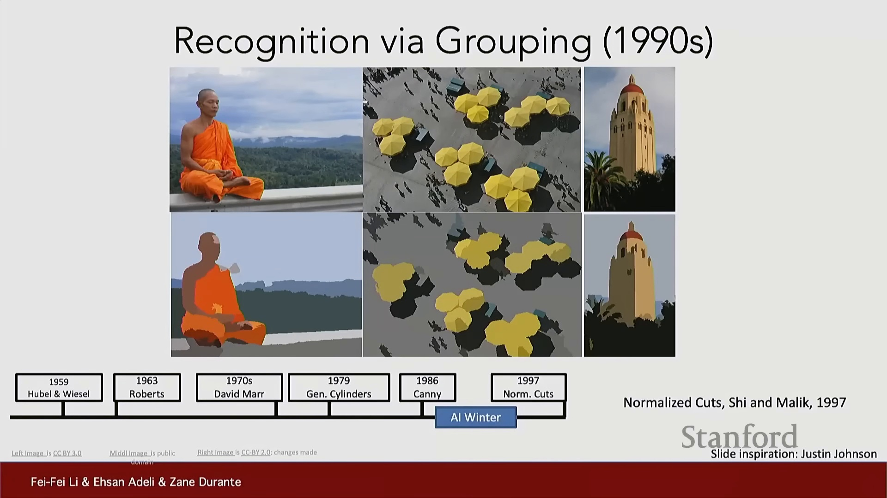

Initially, computational approaches focused on separating foreground objects from background clutter, a technique known as "recognition by grouping" in the 1990s.

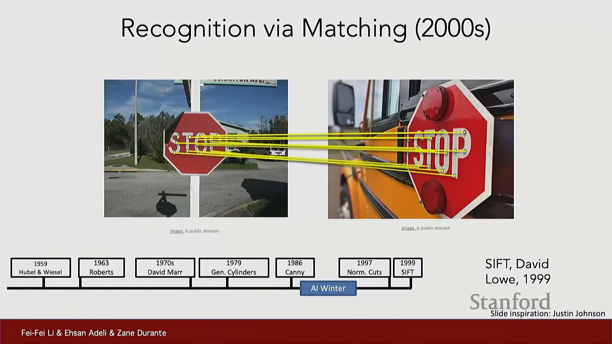

Research quickly advanced to feature extraction methods, such as $\text{SIFT}$ features and matching algorithms.

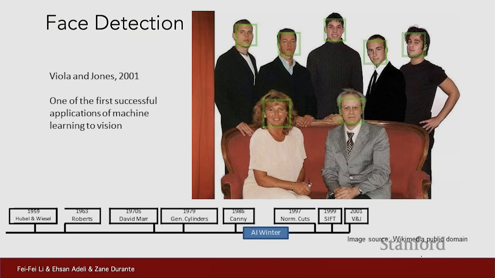

A pivotal development was face detection; shortly after a key paper was published during the author's graduate studies, its algorithm found application in the first digital cameras, enabling automatic face focus functionality. This progression started moving into industry application. Then, around the early 21st century, the internet became a profound catalyst for computer vision.

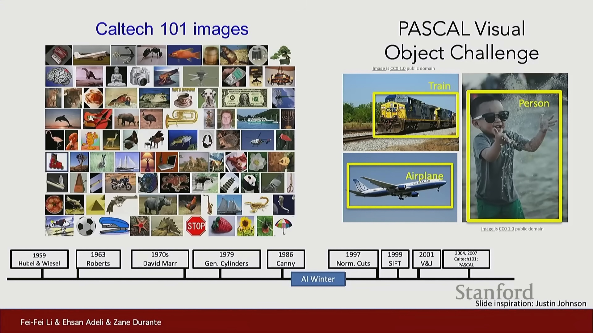

The proliferation of data, combined with improved digital camera technology and global connectivity, finally provided the field with the massive datasets required for modern advancements in computer vision. In the early days of research, engineers worked with massive datasets, ranging from thousands to tens of thousands of images, to solve the visual or object recognition problem.

These pioneering efforts utilized established datasets such as the Pascal Visual Object Challenge and Caltech 101.

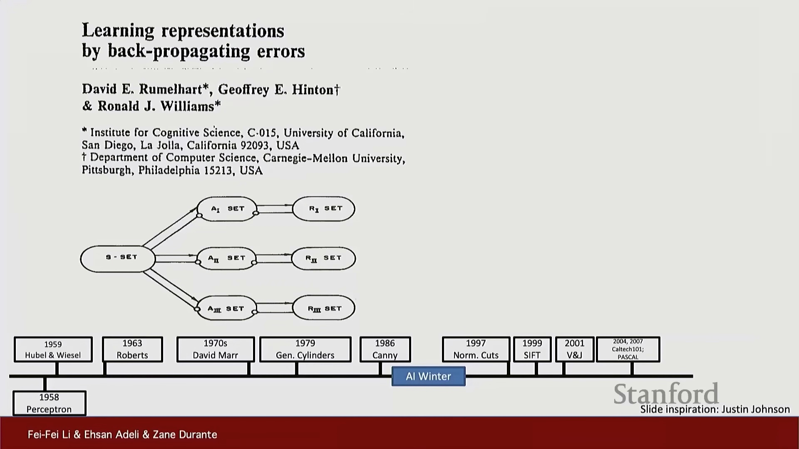

This period marked the initial significant progress in the field of computer vision. While the discipline of computer vision was advancing—drawing inspiration from neurophysiology and cognitive neuroscience—a separate effort developed concurrently, which eventually became known as deep learning. Deep learning stemmed from early studies on neural networks, initially involving foundational work by figures like Rumelhart and Jeff Hinton.

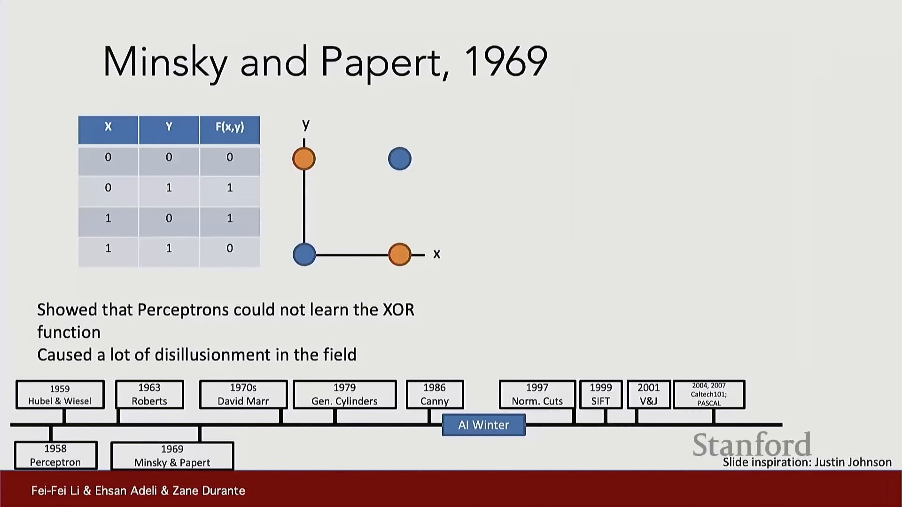

These researchers explored how small numbers of artificial neurons could effectively process information and learn. Early pioneering figures, such as Marvin Minsky, had worked extensively on the various aspects of perception using perceptrons.

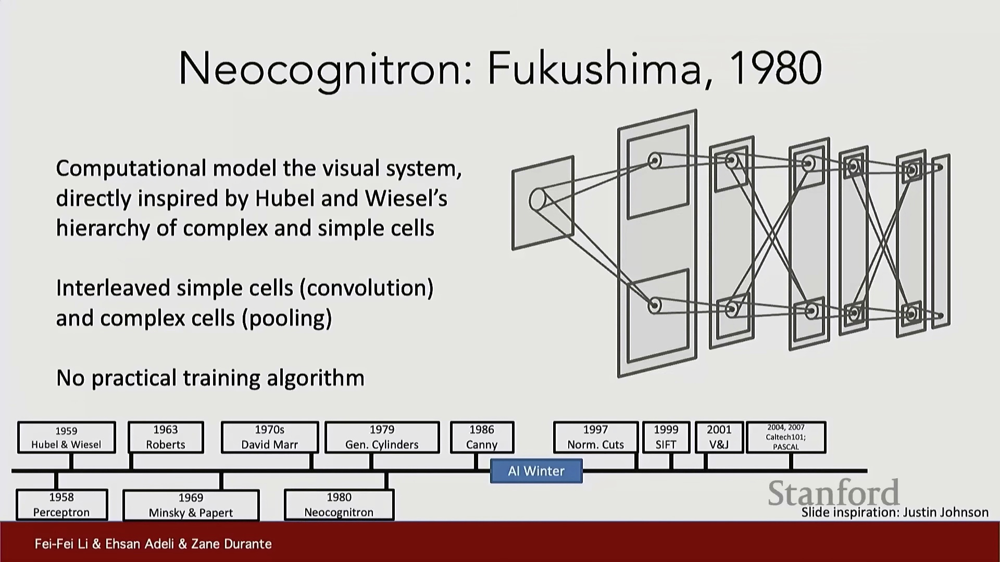

However, a major limitation was revealed when it was proven that basic perceptrons were incapable of solving non-linear functions like the XOR logic gate. This technical setback caused a significant pause in the progress of artificial neural networks. Despite this challenge, research continued to advance significantly, highlighted by Kunihiko Fukushima's groundbreaking work on Neocognitron in Japan.

Fukushima hand-designed a complex neural network featuring several layers (about five or six). His design was largely inspired by the natural visual pathway: early layers captured simple functions, while later layers processed increasingly complex features derived from these initial computations.

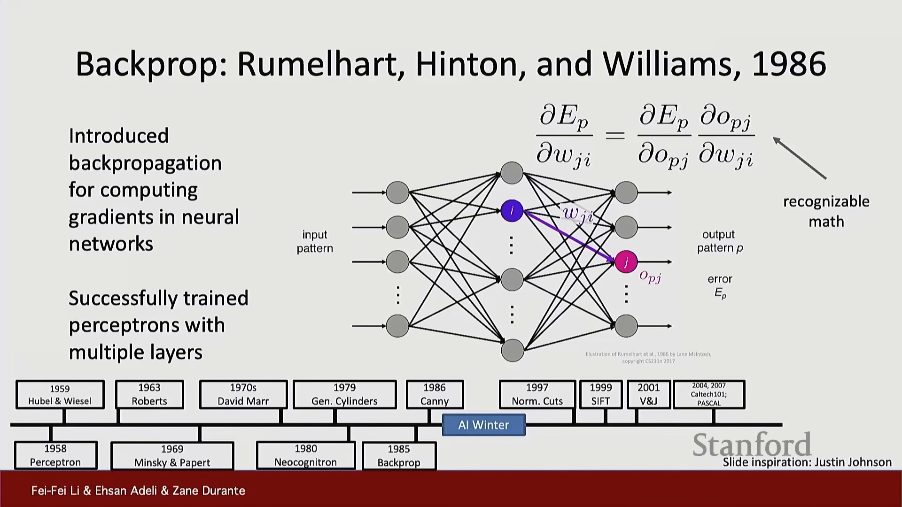

The true inflection point arrived with the introduction of backpropagation in 1986. This learning rule allowed researchers to take a pre-existing neural network architecture and incorporate an error-correcting objective function. The method involves determining the difference between the network's output ($\hat{y}$) and the actual correct answer ($y$), and then propagating that error backward through the entire network to improve its parameters.

Backpropagation is an algorithmic breakthrough because it relies on fundamental calculus chain rules to systematically adjust weights across all layers. Although much of this monumental work occurred quietly, outside of public view (a period often referred to as AI winter), these developments represented critical academic milestones for algorithms within neural networks.

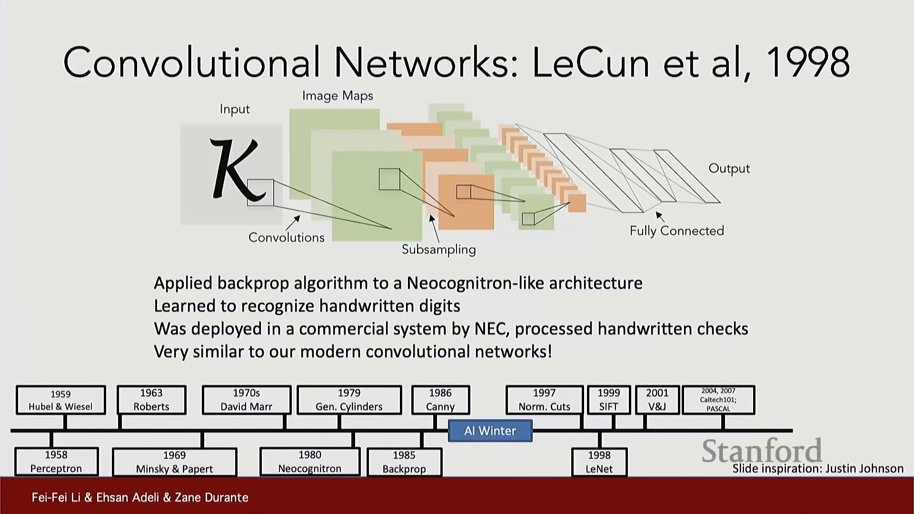

One of the most concrete early applications was Yann LeCun’s convolutional neural network (CNN) developed in the 1990s while working at Bell Labs. He engineered a slightly larger, seven-layered network that demonstrated sufficient capability to reliably recognize letters and was subsequently implemented in real-world systems like the U.S. Postal Service.

Early neural network applications were successfully used for tasks like reading digits and letters from offices and banks.

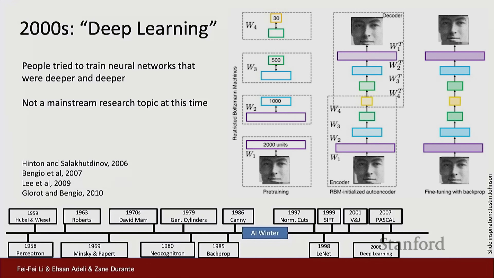

Despite subsequent work by pioneers such as Geoffrey Hinton and Yann LeCun on refining these networks, progress eventually stalled somewhat. While initial data collection focused on simple recognition tasks involving digits and letters, deploying the systems to recognize complex digital photos—such as images of cats, dogs, microwaves, chairs, or flowers—proved exceedingly difficult.

A significant underlying cause of this challenge was insufficient data.

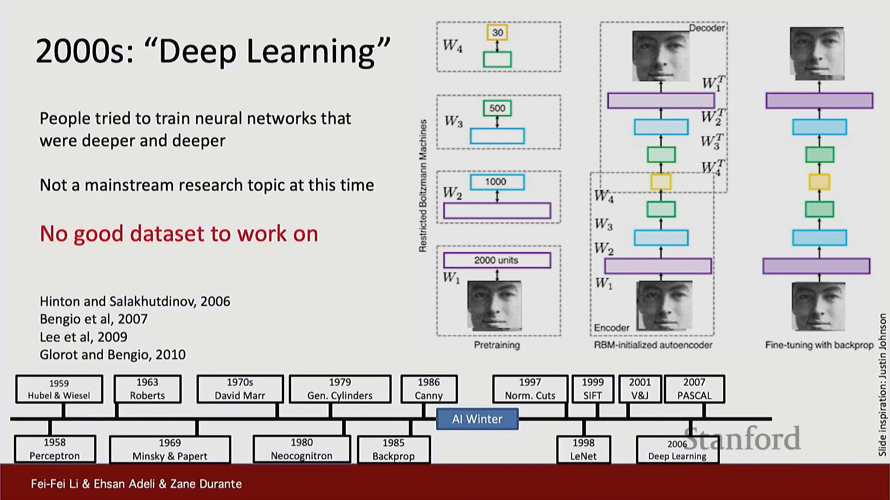

This limitation wasn't merely an inconvenience; it represented a deep mathematical problem. Because these algorithms are high-capacity models, they require massive amounts of data to effectively learn and generalize their understanding. The principles governing generalization and model overfitting are mathematically complex, yet data itself was often underappreciated in the field.

Most researchers tended to focus solely on the network architectures, overlooking that data must be considered a first-class citizen alongside computation in machine learning and deep learning.

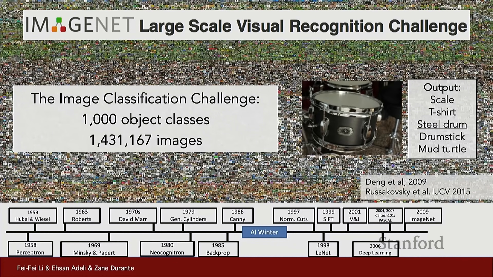

Recognizing this crucial oversight, my students and I began work in the early 2000s. We hypothesized that the entire field was underappreciating the critical importance of the dataset itself. To validate this idea, we embarked on collecting an enormous dataset known as ImageNet, which contained a billion images initially. After intensive cleaning, a subset of 15 million images were retained and categorized across 22,000 distinct object classes.

We studied cognitive and psychological literature to realize that having 22,000 categories roughly matched the number of categories human beings naturally learn in their early years of life. We subsequently open-sourced this data and established the ImageNet challenge, formally named the Large Scale Visual Recognition Challenge. We curated a specialized subset of one million images spread across 1,000 distinct object classes to run an international object recognition competition for many years.

The goal was to invite researchers to participate and develop algorithms, regardless of the specific technique used.

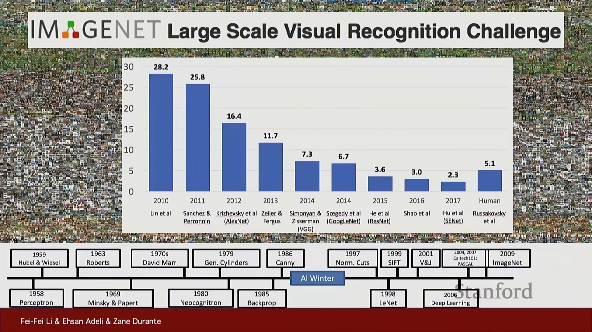

During these tests, participants were graded on their algorithm's ability to recognize photos and correctly identify the 1,000 object classes. In the first year we ran the competition, the best-performing algorithms achieved an error rate near $30\%$, which was considered abysmal when compared to human performance, which typically operates below a $3\%$ error rate.

While 2011 showed some improvements, the year 2012 proved to be revolutionary.

In that year, Geoffrey Hinton and his students participated using Convolutional Neural Networks (CNNs) and dramatically reduced the error rate by almost half.

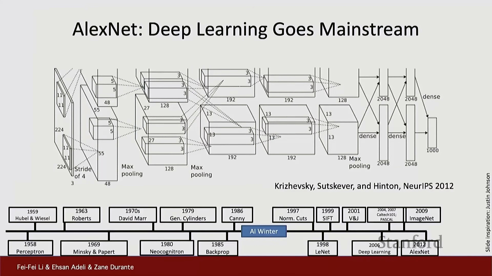

This spectacular performance definitively demonstrated the profound power of deep learning algorithms.

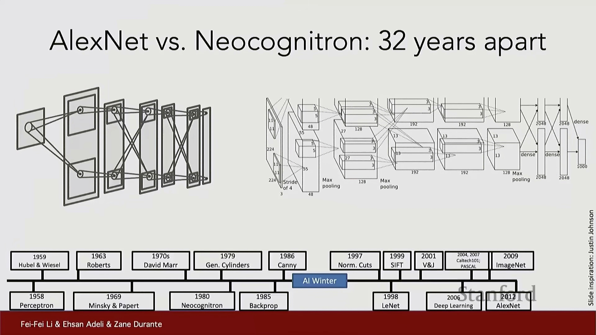

The participating algorithm in the 2012 ImageNet challenge was named AlexNet. Interestingly, AlexNet shares conceptual similarities with Fukushima's neocognitron designed 32 years earlier. However, two major theoretical and practical breakthroughs occurred between those times. First was the development of backpropagation; this provided a principled, mathematically rigorous learning rule that eliminated the need for manual tuning of parameters.

The second breakthrough was the proper recognition and understanding of data itself—understanding how data drives these high-capacity models (which eventually scale to trillions of parameters)—was essential for deep learning to succeed. Many people consider the year 2012 and the AlexNet algorithm that won the ImageNet Challenge as the historical milestone marking the rebirth of modern AI or the beginning of the deep learning revolution.

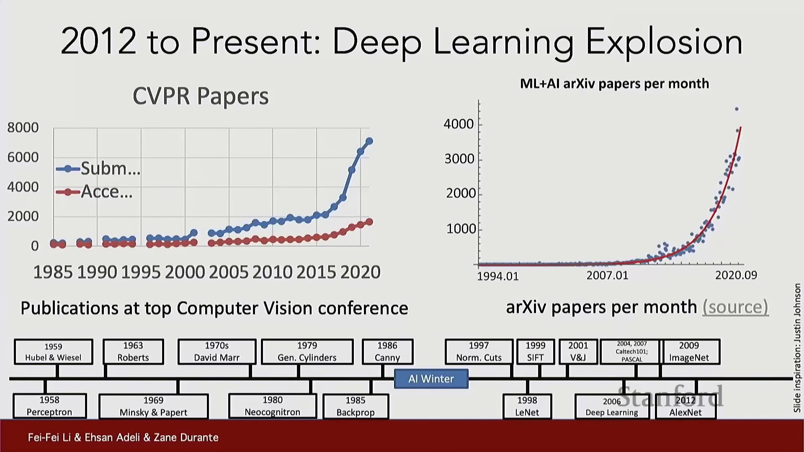

We currently reside within this era of deep learning explosion, particularly evident in computer vision research.

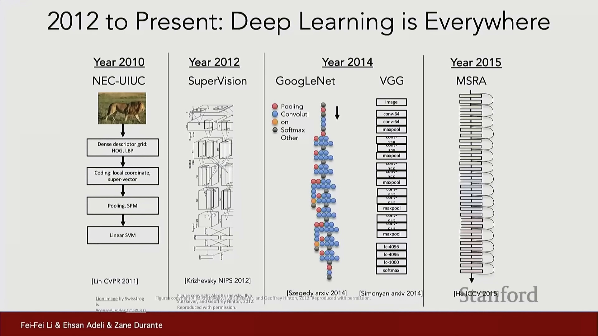

The field has experienced an explosive growth in academic output; conferences like CVPR have seen a dramatic increase in submitted papers, and arXiv submissions are equally prolific.

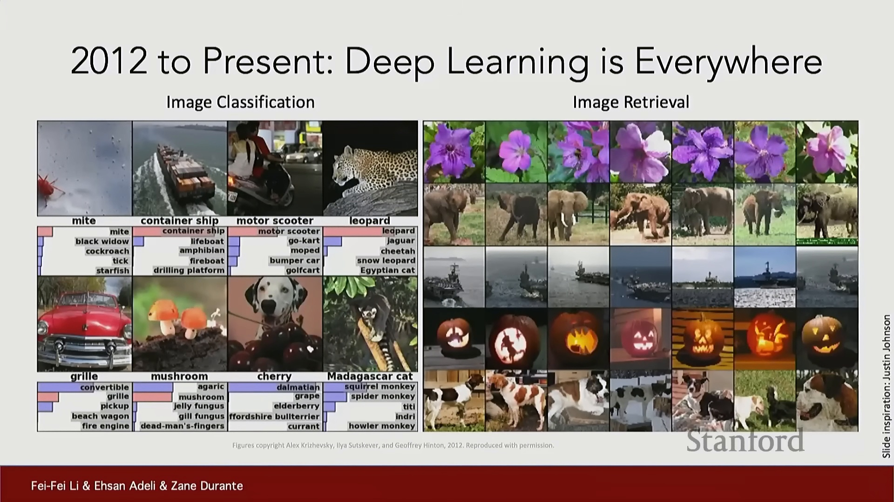

Since that time, numerous algorithms have been invented to participate in the ImageNet challenge, and we will dedicate time to studying some of these impactful methods moving forward. These advanced algorithms have profoundly impacted computer vision, extending far beyond merely recognizing everyday objects like cats, dogs, or chairs.

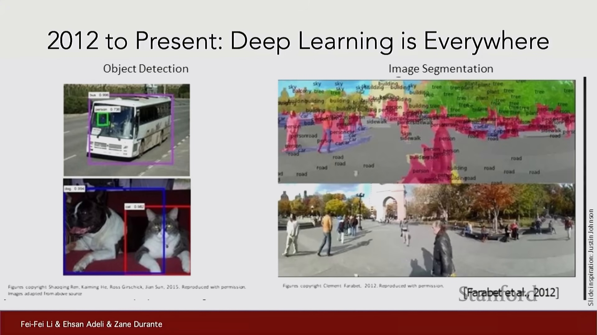

Following the 2012 breakthrough, researchers quickly developed systems capable of much more complex tasks.

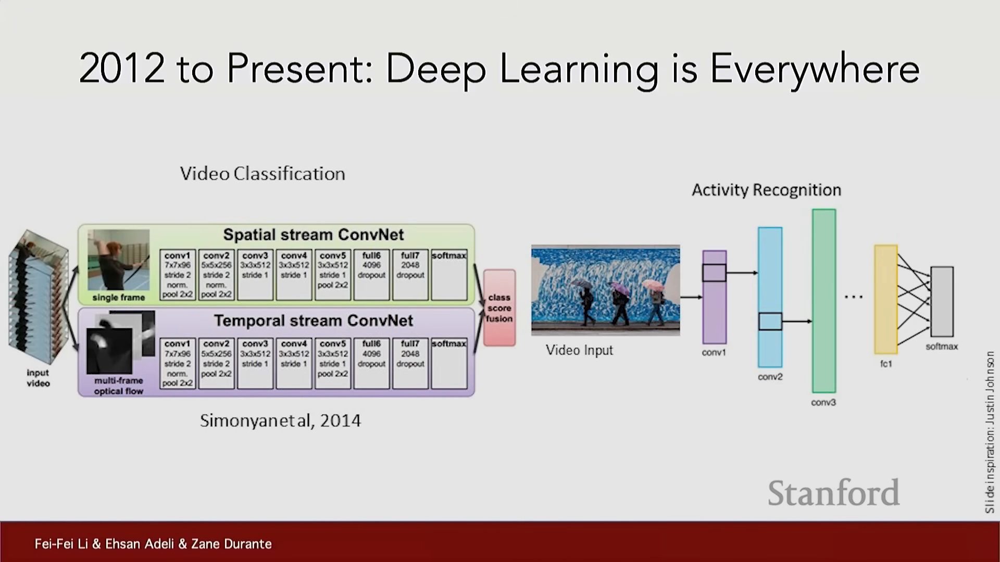

These include image retrieval, multi-object detection, and sophisticated image segmentation.

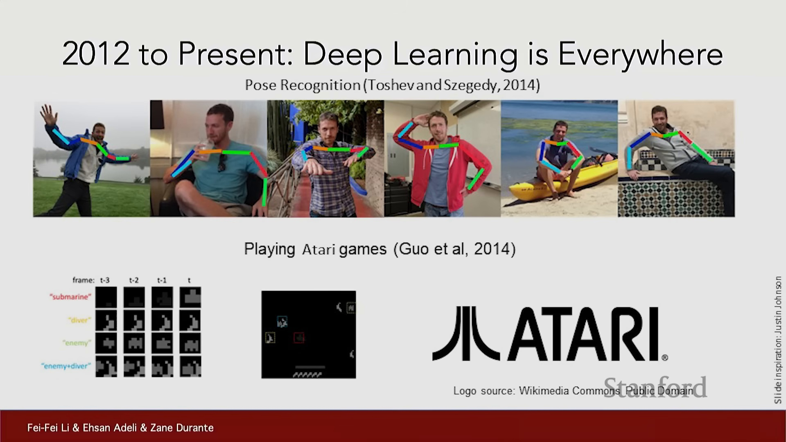

Visual recognition is a deeply nuanced field with vast applications.

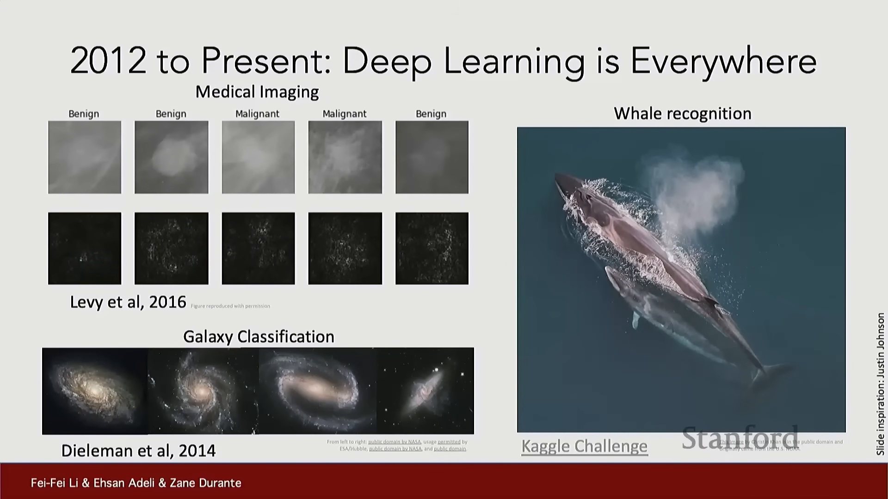

It is not limited to static images; work continues in video classification and human activity recognition. The utility of visual processing spans diverse sectors, such as medical imaging—relevant for radiology and pathology—and even scientific discovery (e.g., computational photography used for analyzing black hole images).

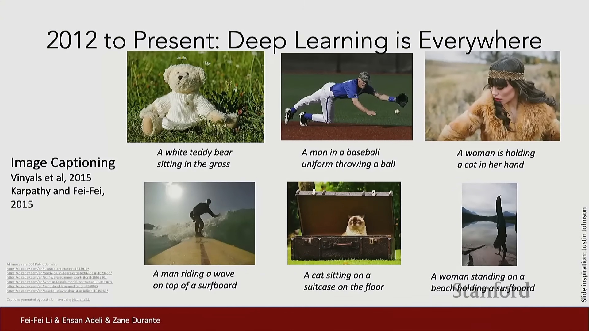

Furthermore, advanced vision tasks include image captioning, a field pioneered by researchers like Andrej Karpathy.

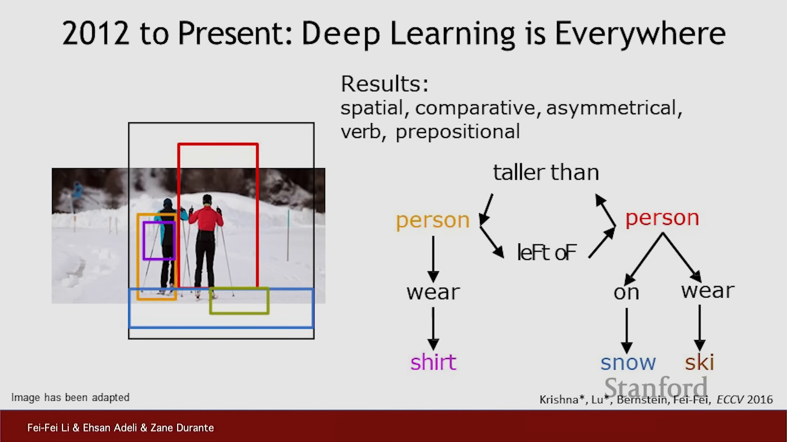

Beyond simple pixel-level understanding, the field has expanded to encompass relationship understanding among objects and style transfer techniques.

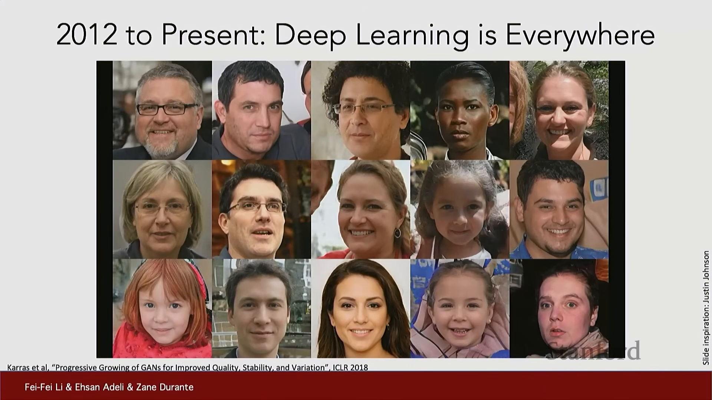

We also see tremendous progress in generative AI, evidenced by early work on face generation or foundational models like Dall-E.

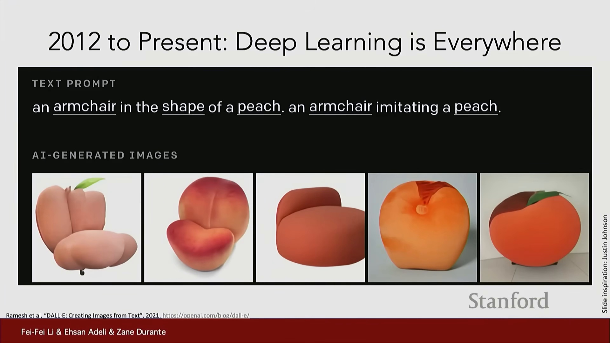

In summary, modern AI is characterized by the convergence of three major forces: computation, algorithms, and data.


These converging powers have elevated the field to an exciting new level, moving us squarely out of "AI winter." The current period represents a global warming era for artificial intelligence, which shows no signs of slowing down.


...for both good and bad reasons. Given that we are in Silicon Valley, specifically within the NVIDIA lecture hall, we cannot ignore the critical progress of hardware and what it has enabled. Here is a graph showing the FLOPs per dollar for NVIDIA's GPUs.


Before 2020, the computational progress was steady; however, as soon as deep learning began to drive these chips, the GFLOPS immediately took off dramatically. By any measure, we are currently experiencing an accelerated curve of compute power and artificial intelligence capabilities. Furthermore, advancements have driven massive growth across conference attendance, startups, and enterprise applications in AI, covering areas far beyond just computer vision.


These explosive developments have been incredibly exciting, leading to many successes. Nevertheless, there is still much ground to cover within the field of computer vision.


We must also recognize that great tools often bring with them significant consequences. While computer vision can achieve remarkable good, it can also generate profound harm.


For instance, every major AI algorithm relies heavily on data, and this data is merely an artifact reflecting human activities throughout Earth's history. Consequently, a substantial amount of the training data carries inherent human bias, which then gets embedded within the resulting AI systems. We have seen numerous instances where face recognition algorithms exhibited biases mirroring those found in human society, making it essential that we acknowledge this deeply.


We can use AI to impact human lives for immense good, such as in medical imaging. However, questions remain concerning its application when deciding critical matters like job eligibility or financial loan approvals. These are extremely complex issues; neither "totally bad" nor "totally good" characterizes the reality. This is precisely why I am always so excited when students from non-engineering backgrounds—like those studying medicine (HMS), law, education, or business—attend this class, because many AI challenges are not purely technical problems.

We must solve many human factors and deep societal issues alongside the engineering ones.


I am particularly enthusiastic about the use of AI in medicine and healthcare, a field very close to my heart. My co-instructors, Professor Adeli and Zane, and I work together on AI for aging populations and patients, specifically attempting to utilize computer vision to deliver essential care. The technology itself is remarkable, but we must also appreciate the inherent nuance, subtlety, richness, complexity, and emotional depth found within human vision.


When you look at images of children driven by curiosity or captured moments of humor, there remains a vast amount that current computer vision systems cannot fully interpret. I hope this observation continues to motivate you toward studying computer vision. With that, I will hand the podium over to Professor Adeli to cover the remainder of the class.

***

...Awesome. Thank you, Fei-Fei. Great to start the quarter, and I hope my microphone is working properly. Good.


I am seeing some nodding heads, which tells me how excited I am to be here with all of you. I hope that you will have both a fun and challenging course, guided by an amazing roster of core instructors and great TAs.


In this class, we are going to cover a wide variety of topics concerning computer vision and the application of deep learning in this domain. We structure these topics into four distinct areas of study.


We will begin with deep learning basics, starting with a fundamental question: what exactly *is* computer vision? At its core, machine vision aims to enable machines to see and understand images. The most fundamental task in this space is image classification, where a model accepts an input image (for example, of a cat) and outputs a single corresponding label ("cat").


This deceptively simple task forms the foundation for numerous complex applications, including self-driving vehicles, medical diagnosis, and more. Initially, one might approach this problem using linear classification. If we imagine each data point (image) plotted in a feature space, the goal of a linear classifier is to find a hyperplane or a linear function that successfully separates distinct classes, such as cats from dogs.

However, linear models quickly reveal limitations when the data is not cleanly separable by a simple straight line.


To address these difficulties and model more complex patterns, we encounter crucial challenges like overfitting and underfitting. Balancing model complexity requires techniques such as regularization to control parameter magnitudes and optimization methods to find optimal fitting parameters. These concepts are central to deep learning, ensuring that models generalize effectively to unseen data rather than simply memorizing the training set.

This leads us to neural networks (NNs).


Unlike linear classifiers, NNs operate by stacking multiple layers of operations to model non-linear functions. This ability allows them to tackle complex problems like image classification and power modern technologies, from Google Photos to advanced vision models (like those associated with ChatGPT). In this course, we will delve deeply into the mechanics of how these networks function and how they are trained.


Furthermore, we will cover debugging techniques and methods for improving performance.


After establishing deep learning fundamentals, we transition to topics covering the perception and understanding of the visual world—a complex process involving interpreting vast amounts of visual information.


To structure this study, specific tasks or problems are defined. Examples include object detection, scene understanding, and motion tracking. To solve these specialized tasks, we utilize various models, which are computational and theoretical frameworks designed to mimic or explain how our biological visual system operates.


Neural networks serve as a primary example of such a model, allowing us to build systems that can interpret the physical world around us.


In real-world computer vision, tasks extend far beyond simple image classification. We begin with **semantic segmentation**, where the goal is not merely to label an object or the entire image.


Instead, every single pixel must be assigned a specific label, such as identifying whether it represents grass, cat, tree, or sky.


Next is **object detection**, which requires both identification and precise localization of objects within an image.


This process involves drawing bounding boxes around detected objects and associating each box with its corresponding class label.


The most granular task is **instance segmentation**, which combines the principles of object detection and semantic segmentation.


For instance, every distinct object instance will be assigned its own unique mask. The scope expands beyond static images into the temporal domain. Tasks include **video classification**, aiming to understand the overall action occurring in a video (e.g., running or dancing). Another crucial area is **multimodal video understanding**, which requires integrating different sources of information, such as combining visual features with audio features to gain comprehensive context.

We also delve into model interpretability through **visualization and understanding**.


This topic focuses on interpreting what the models are actually learning.


Techniques like attention maps can reveal precisely which parts of the input signal the model is attending to when making a classification decision. In terms of architecture, we first introduce Convolutional Neural Networks (CNNs), detailing core operations such as convolutions, pooling, and fully connected layers.


Beyond CNNs, the curriculum will cover **recurrent neural networks** for processing sequential data.


We will also study advanced architectures like Transformers and attention-based frameworks. A significant portion of the course addresses large-scale distributed training. As both datasets and models grow exponentially in size, specialized strategies are required for training these massive systems. Techniques such as data parallelization or model parallelization must be employed to efficiently distribute the workload across multiple workers.

Furthermore, training large language models (LLMs) and vision models introduces complex challenges, including synchronization between different computational units.


We will explore various trends and best practices designed to train models that are increasingly massive in scale.


Following this, we transition into **generative and interactive visual intelligence**. The foundational concept here is **self-supervised learning**, a branch of machine learning where models learn powerful data representations by deriving training signals directly from the inherent structure of the data itself. The initial topics covered address approaches that enable training large-scale models using vast amounts of data that do not require explicit labels—a field known as working with unlabeled data.


Such methods have played a key role in recent breakthroughs across general computer vision research.


We will focus on generative models, which fundamentally go beyond mere recognition; they actively generate novel content. For instance, style transfer is a classic application, allowing an image of a Stanford campus to be reimagined entirely in the dramatic style of Van Gogh's *Starry Night*.


These models are advancing so rapidly that they can now translate natural language into images given a simple prompt, exemplified by tools like Dall-E 2, which showcase how generative vision systems blend deep understanding with creative control.


Another critical area is diffusion models, which learn to generate high-fidelity images by reversing a gradual noising process.


In fact, you will implement an example of this concept in Assignment 3: generating emojis from text prompts—such as asking for "a face with a cowboy hat"—by denoising pure random noise.


The next major topic is vision-language models (VLMs), which connect the modalities of text and images within a shared representation space. Given either an image or its corresponding caption, the model can retrieve or generate the paired counterpart. This capability is essential for tasks like cross-modal retrieval, visual question answering, and generally enhancing deep understanding between different data types.


Moving beyond standard two-dimensional (2D) input, models are now capable of reconstructing and generating 3D representations from single images.


Techniques include voxel-based reconstructions, shape completion, and 3D object detection. This advancement towards 3D vision is crucial because it enables a more grounded understanding of the physical world, which is vital for applications in robotics and AI virtual reality (VR) systems.


Finally, vision empowers embodied agents—AI that physically act within the real world.


These sophisticated models must integrate perception, planning, and execution; they might be tasked with cleaning a messy room or generalizing complex actions based on human demonstrations. Together, these areas encompass generative and interactive visual intelligence.


We will conclude by examining human-centered applications and ethical implications, which are vital for understanding AI’s broad impact. The importance of this field was recognized by prestigious awards like the Turing Award in 2018, given to researchers such as Geoffrey Hinton, Yoshua Bengio, and Yann LeCun for their breakthroughs that established deep neural networks as a critical computing component.


This emphasis underscores the necessity of understanding the human aspects when dealing with modern AI technologies.


This work is notable alongside foundational contributions from researchers like John Hopfield in the field of neural networks. More importantly, I want to briefly outline the core learning objectives for this class. As detailed here, our goal is to develop and train advanced vision models that operate on various forms of visual data, such as images and videos.

The primary aim is for students to gain a thorough understanding of the current state and future trajectory of the computer vision field. This comprehensive objective guides the inclusion of several specialized topics covered specifically this year.


Regarding the four major topics mentioned earlier, we will begin by reviewing fundamental basics over the first few weeks. Understanding these core details is paramount, as mastering how to build models from scratch is necessary groundwork. Following this foundational material, we will then proceed to the exciting centerpiece: computer vision. The course culminates with a large lecture dedicated to human-centered AI and its relationship with computer vision.


To start our journey, the next session will focus on image classification and linear classifiers.

These topics will provide an excellent introduction as we begin working through the material of CS231n.
