# Stanford CS231N | Spring 2025 | Lecture 3: Regularization and Optimization

We're going to start with a recap from last week and discuss some of the topics that we discussed last time.

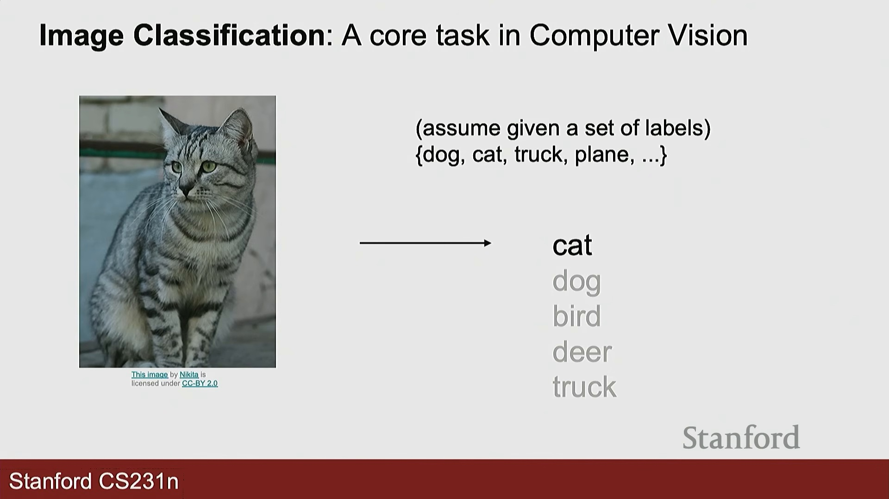

Specifically, we honed in on this idea of image classification as a core task in computer vision. This task is given an image as input, and you try to map this image to a label inside of a set of labels. Here we have five different labels: cat, dog, bird, deer, and truck. The goal is to assign the correct label to the input image by creating some model or some function that takes an image as input and outputs the specific label.

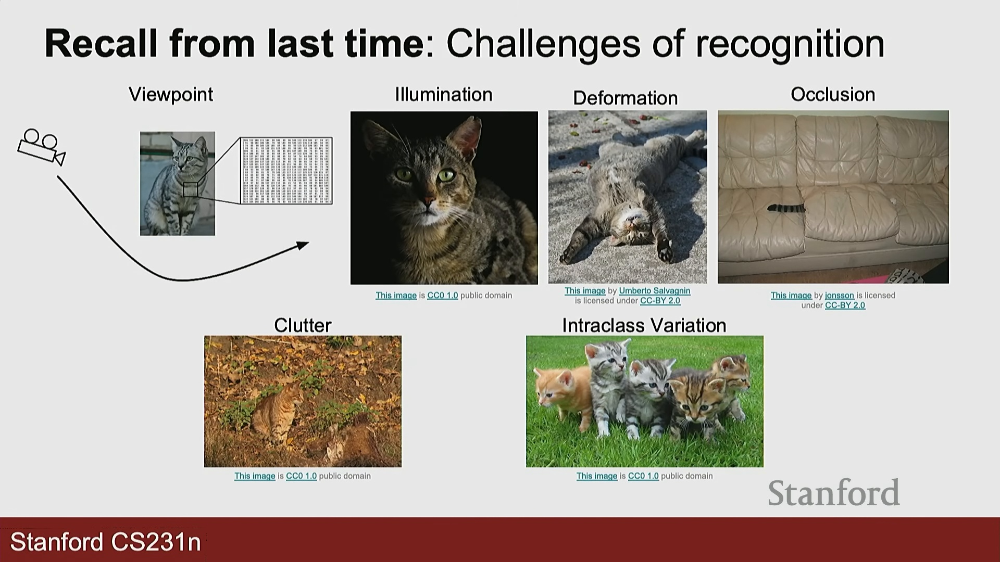

We also talked about a lot of the challenges for classification. This representation is a grid of pixel values where you have a multidimensional array or tensor, with discrete values for each of the pixels. This is very different from how we are perceiving the image and just deciding that this is a cat. Being able to map from this complex numeric representation into one that we humans understand is the core challenge here.

There are also challenges surrounding the images themselves. If you look at something like illumination in the scene, you'll have different pixel intensities based on where the lighting is in the scene. Also, certain parts of your object might be in the shade and harder to see. Cats by nature are very deformable; they talk about deformable objects that can move around and twist and bend in different ways, so they won't always have the same shape.

This can prove challenging if you are trying to design an algorithm to detect objects. There is also the challenge of occlusion. You could have a cat that is hiding underneath the cushions here, but we as humans can clearly tell it's a cat because of the tail sticking up at the end. The way that cats behave allows us to infer that this is a cat.

You will also encounter things like background clutter, where the object could blend into the background. We need to account for this somehow as well.

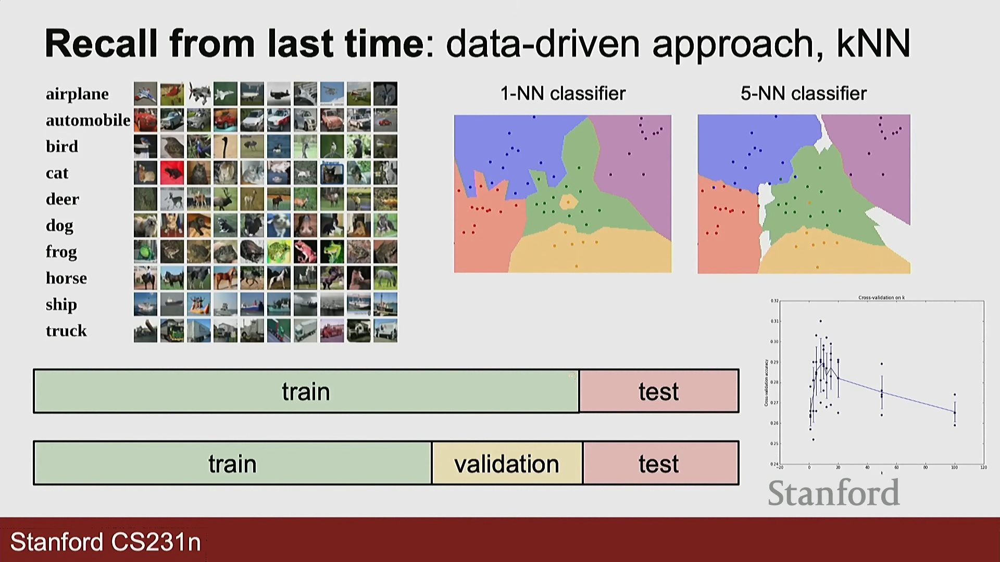

If logic is thrown out the window, you can't just create these logic rules; how do you actually create a classifier? This is where we talked about data-driven approaches. We discussed the simplest machine learning model, which is this k-nearest neighbors model. The idea is that you look for a given data point: what are the existing data points in your training set that are very close in distance to your new data point coming in?

For the 1-nearest neighbor case, this just results in finding the closest data point and assigning it that class label. You can also look at multiple nearest neighbors where you're assigning the most common class label among those nearest neighbors. We talked about these two different approaches. The main hyperparameter for k-nearest neighbors is $k$, like 1 or 5 in these examples.

We showed an example where you are plotting what is your accuracy on this validation set over different $k$ values. You would choose the one that has the highest accuracy. This is all just recap.

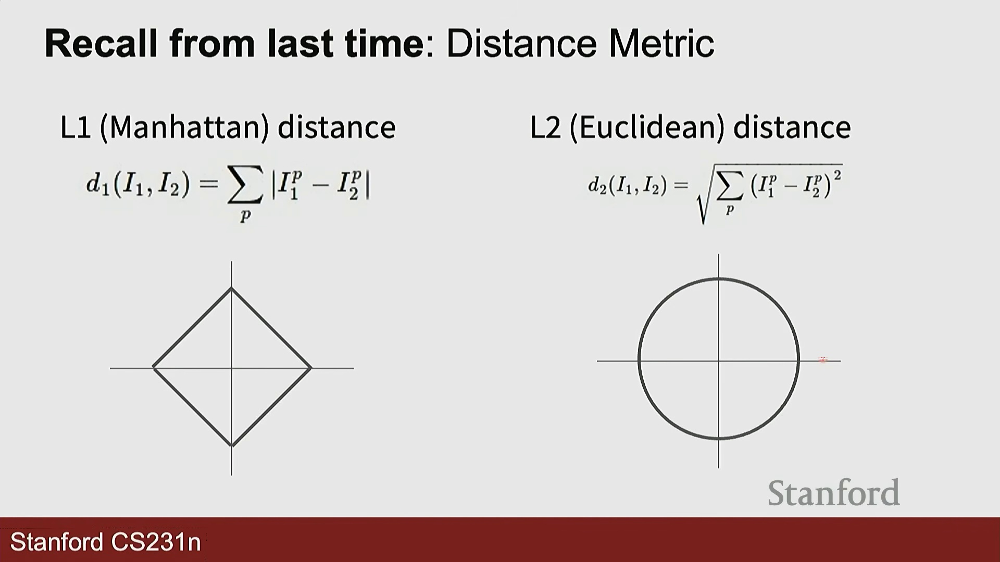

There was a bit of confusion about distance metrics, which we posted on Ed that explains this in more detail. We talked about two different distance metrics: the two commonly used ones in machine learning, which are the Manhattan distance or $L_1$ distance and $L_2$ distance or Euclidean distance. The $L_2$ distance is like if you imagine just the straight-line distance—how we think of distance in everyday usage geometrically.

The Manhattan distance is this idea where you can only traverse left and right and up and down in this diagram, and you can't move diagonally.

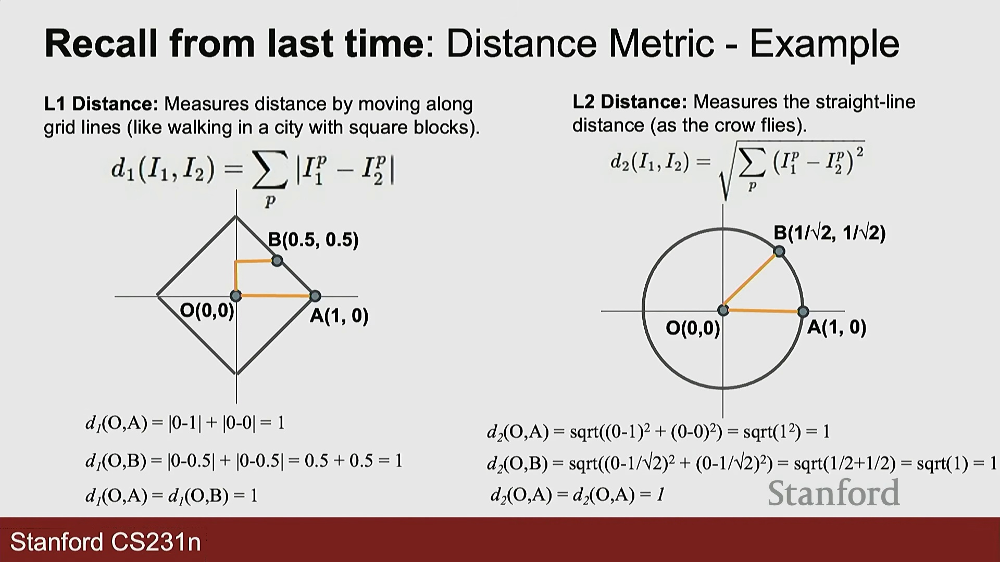

just going a straight line but it's also 1. The same distance here. Whereas in the $L_2$ distance, all the points equidistant from the origin here form a circle because you can just go in a direct line here.

So this is maybe a brief explanation. The final thing we honed in on last time was this idea of a linear classifier. The idea is that we take this array of numbers for our image, and we flatten it out into an array of just 3,072 different numbers. Then we are multiplying this vector by our weight matrix $W$.

The basic idea is if we have a weight matrix $W$ that has a height here of 10 and then the width is 3,072, we're multiplying each of these rows by our input sample $x$. This will give us 10 resulting class scores. Oftentimes we'll add a bias term as well, which would just be one bias term for each class. So this would be a size 10 vector here.

We also talked about three different ways you can view or think about these linear models. One is the algebraic viewpoint, which I described here, where each row independently represents the class. You multiply it by the input vector $x$ to get your score and then add the bias to get your final score. You do each row independently in the sense.

Specifically, the line is where we set this equation to 0, which is the decision boundary. This forms the point where above the line you could have a positive score, and below the line you would have a negative score for the class. These are the different viewpoints or ways that you can view these linear models; they're all doing the same thing. It's a nice way you can gain intuition about what is possible for linear model to do.

I think that's the high-level recap of what we discussed last time.

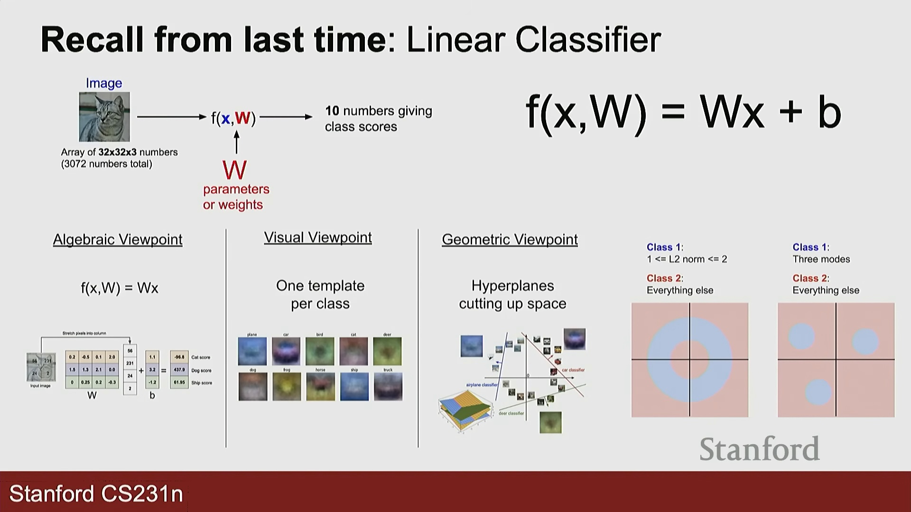

So the question for those online is: For this visual viewpoint, is this the same as running $k$-nearest neighbors? This would be maybe one of the neighbors that you're comparing against? Are they mathematically equivalent? No, they're not the same because these templates are formed from a line, so it's not one specific data point.

So the question is, how did we get this 3,072 number?

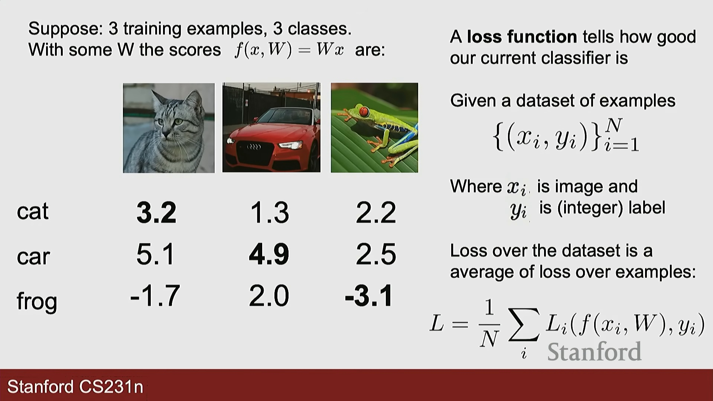

And that's how we get this 3,072 number. Here's a very specific example of a linear model here. When we multiply our input $x$ by our weight matrix $W$, we get the resulting scores for these different classes. You can see that for cat it's not doing so well because car has a higher score, and we want the highest score for the correct class.

Also, here on this second example does pretty well because it's doing it correctly. But then in the frog example, it completely wrong. where it's by far the lowest score of the three. So intuitively, we can tell that these scores are not very good.

But how do we mathematically formalize this intuition? And how do we determine how good a given model is? This brings us to the idea of a loss function, which tells you how good, or specifically tells you how bad, a classifier is. Given a data set of examples where we're indexing with this letter $i$, we have $x_i$ as each of the training examples, and $y_i$ as each of the training labels.

We can compute the loss over our entire data set by calculating this loss for each training example by sending it through our model here, which is $f(x_i, W)$. We get our label, and then we compute it compared to the ground truth label $y_i$. Finally, we just take the average over our whole data set. We talked about in the last lecture the Softmax loss or the cross-entropy loss, which is the most commonly used loss for classification.

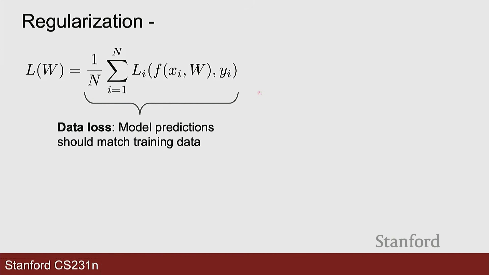

What I just explained is all contained within what we call the data loss. This is a loss that tells you how well the model predictions match our training data.

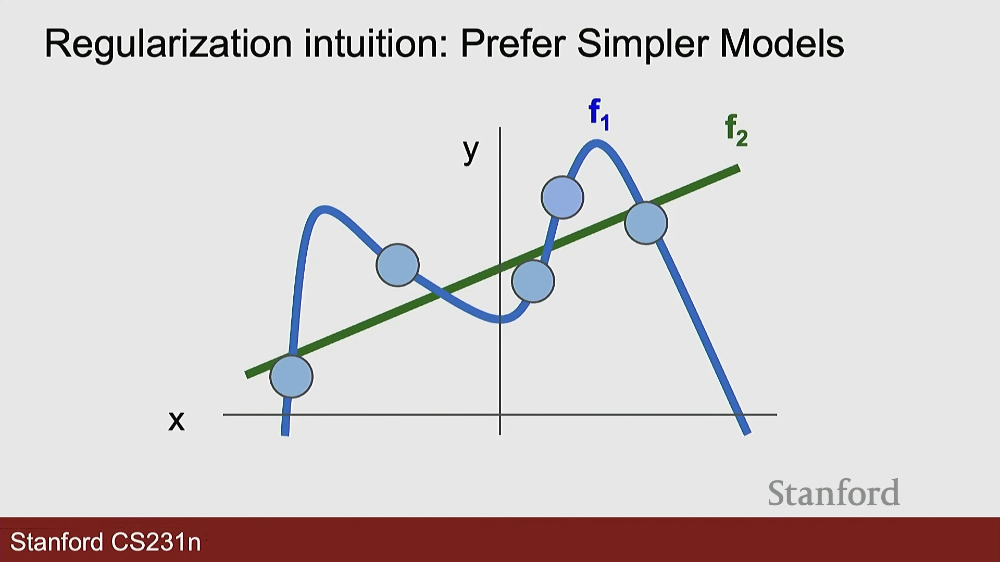

Obviously, we want this to be very low, because if it's very low, it means our model is fitting our training data well. But there's a second component, which I'll discuss today: the regularization term of the loss function. This term is intended to prevent the model from doing too well on the training data. It actually does worse on the training data, but the goal is to make it do better on new test data or unseen data—worse on training, but better on the test set.

That's the point of regularization. The high-level goal is to perform poorly on the training data, but then perform better on the test data or just unseen data. We are computing the loss on each of the $i$ training examples. The loss for the $i$-th example uses the $x_i$ and the $y_i$.

For regularization, people usually have this intuition when thinking about it, where this is a toy example. The idea is we want to fit some function to these points where our input is $x$ and our output is $y$. Suppose you have two different types of models, $f_1$ and $f_2$, and you're trying to decide which one is better. Model $f_1$ goes through all of our data points, so the training or the data loss will be very low because it's basically doing it perfectly.

Conversely, $f_2$ doesn't go through every point perfectly. But intuitively, it feels like $f_2$ is a better model when we are now testing on new data we've never seen before.

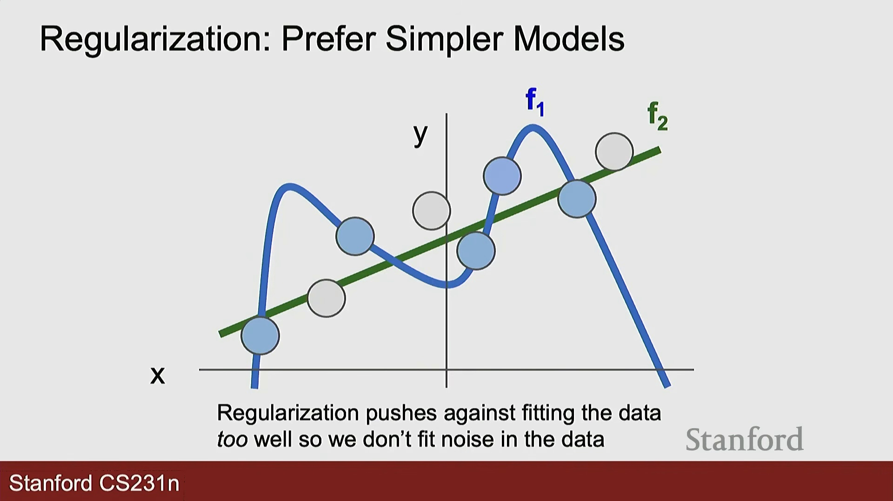

If we ask how these models are going to do on new data that's within our same distribution, you'll find that $f_2$ does a much better job at modeling.

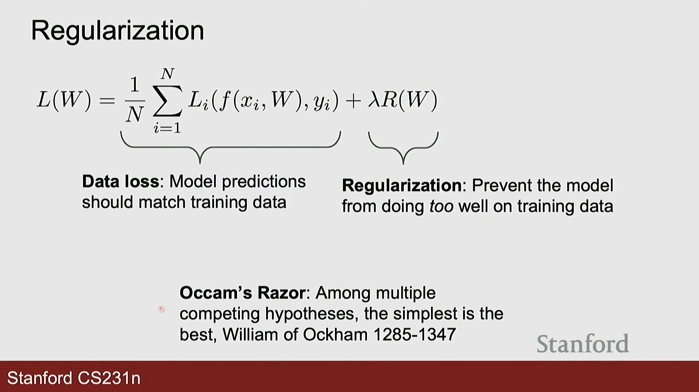

There's also an intuition in this previous example demonstrated very well where we are preferring simpler models—it's like Occam's razor. This may also be some intuition you can have for why regularization can be useful.

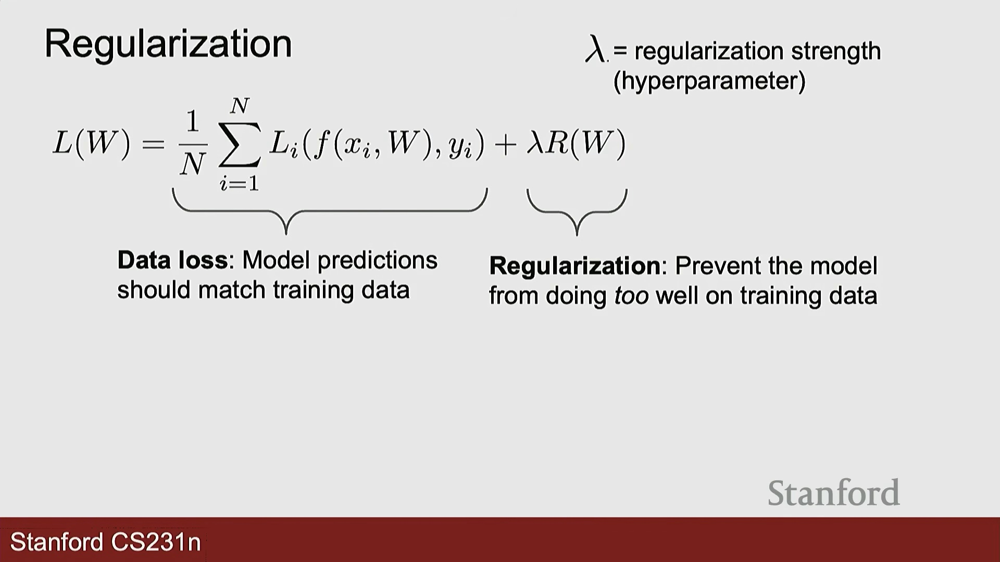

Finally, there is this $\lambda$ parameter here. This is the regularization strength, which is another hyperparameter. We might use training and validation sets to set what is the optimal $\lambda$. You have a really progressively stronger regularization.

It's a very much tunable knob you have for determining how much you want to prevent the model from fitting to your training data.

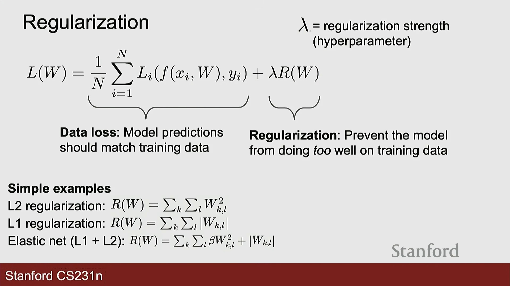

I'll go through some simple examples now of regularization. That gives you a score here that you then multiply by $\lambda$ and add to your total loss. That's $L_2$ regularization. $L_1$ regularization is very similar, but instead of squaring, you're taking the absolute value.

In practice, there are some differences in how these two regularizations perform when you're training models. Thus, $L_2$ regularization allows for these really small values close to 0 because you then square them, making them even smaller. Your penalty here is very low if you have these very small values with $L_2$. Whereas $L_1$, you're not squaring it; it's just whatever the baseline value is.

It isn't getting smaller before you compute this regularization term. In practice, what this leads to is that with $L_1$ regularization, you get a lot more values that are 0 in your weight matrix or very close to 0. With $L_2$, you can generally have it more spread out where you have values that are small but non-zero because the penalty becomes so small.

It seems pretty clear why $L_2$ prefers spread-out weights that are all small, but why does $L_1$ prefer sparse vectors? The way to think of it is that if a value can be 0 and your performance is roughly the same, then this would push you towards zeroing that value. For $L_2$, what you might have is the value just becoming very small but non-zero because of the squaring.

So, the question is, what does 'pushing towards a 0 value' mean? We are going to talk about how we use this loss term. But the basic idea is that we're trying to minimize it; we're trying to minimize the $\text{Loss}$ or minimize the error of our model. It's a trade-off.

You are trying to optimize the joint regularization term and the data loss term. If your data loss isn't changing much, but you're able to go lower on the regularization term, you'll get a more optimized model. This will be preferred based on trying to minimize the overall term.

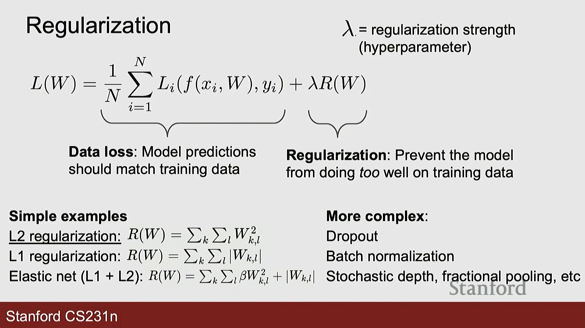

Some of them will even change the layers of your model, so they actually get pretty complicated. This is an ongoing research area of how to regularize models; there are new papers each year, so lots of stuff here.

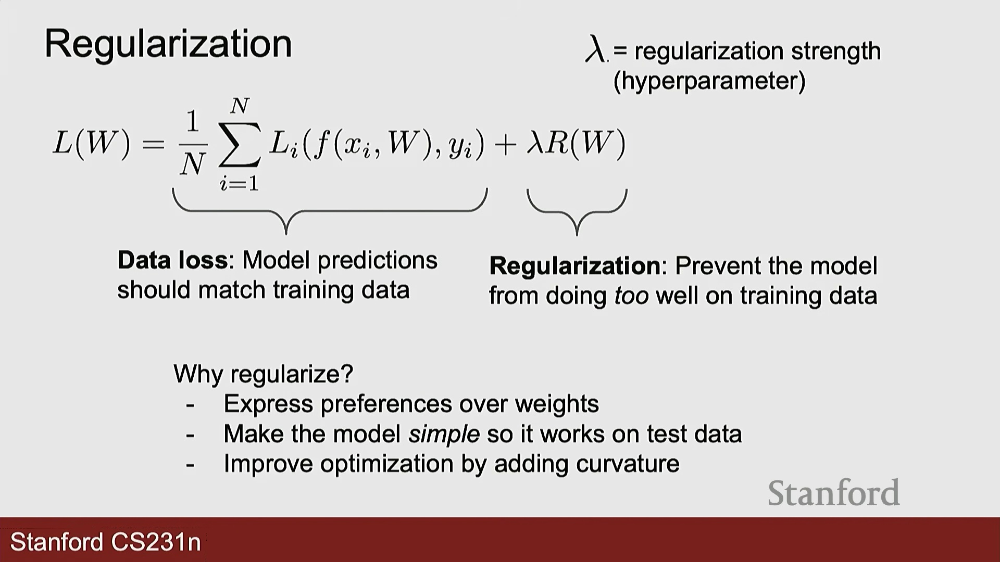

We'll only cover a small subset in this course. To summarize, why do we regularize models? The first reason is that it allows us to express some sort of preference over weights. It also can, depending on how we're regularizing, make the model simpler so that it works better on test data.

It could simplify the model if we were, say, heavily regularizing really high polynomial terms in our model, for example. If you're plotting $y = x^2$, it's a parabola, and these are convex, so you get a lot of nice optimization properties where there's a global minimum. For certain types of optimization, regularization actually helps train the model faster too.

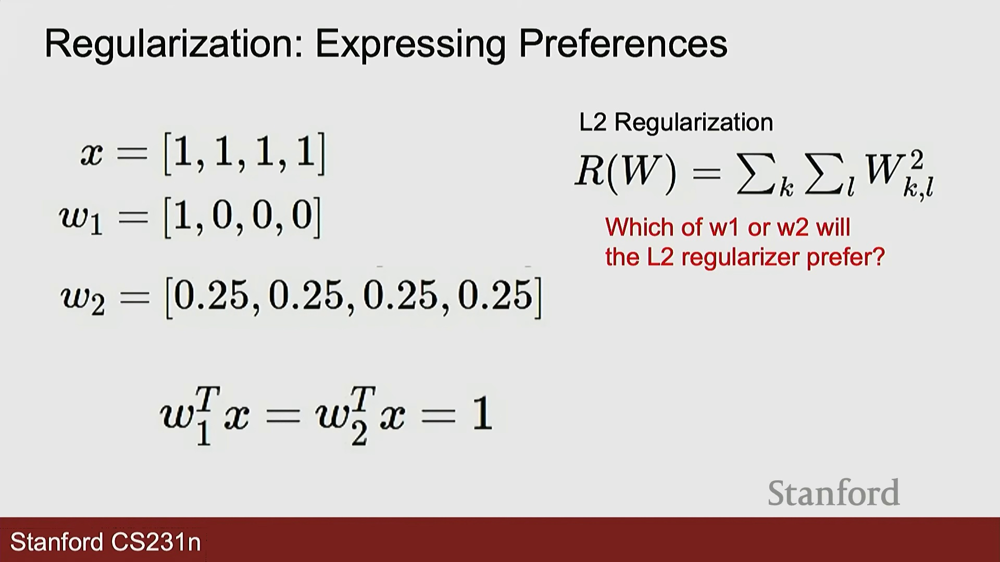

We have a question for you all. You'll do a 1 with your hand if it's $W_1$ and a 2 if it's $W_2$. Which of these two weights, $W_1$, $W_2$, would the $L_2$ regularizer prefer? We have our input $x$.

When you multiply it, you do the dot product with the weights; you get the same score, so you get a score of 1 either way. Here's where the data loss would be the same, and we're trying to determine which of the weights our regularizer prefers. It's $W_2$ because, as you said, it's more spread out. You're going to be squaring each of these terms; so for $1/4$, you square it, and it becomes $1/16$.

You sum it all together, it's $\frac{1}{4}$ as the total regularization term here, and then here you square it, so it's 1. So it's four times lower in terms of the regularization loss.

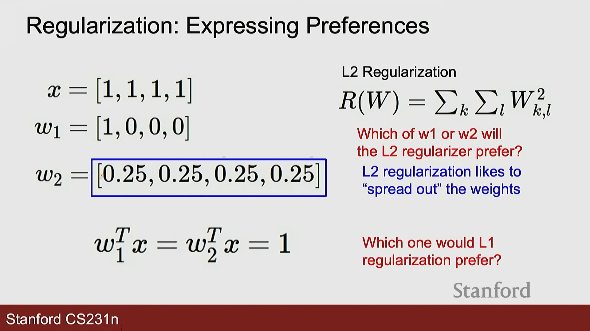

As we said, the intuition is for more spread out weights. There's another question: which one would $L_1$ prefer now? You do 1 if it's weight 1 and 2 if it's weight 2. We got a lot of 1's, so this one's actually a bit of a trick question.

What $L_1$ regularization is: you sum each of the terms, so they'll both be summed to 1. In practice, you probably would see this one because, as we said, sparsity. But in terms of a loss standpoint these two weights would actually be equivalent in terms of $L_1$ because 1 is just the sum of these $0.25$ four times, and the other one is just 1. So they're both summed to 1, and so the actual regularization term is the same for these.

What's an example where $L_1$ would be preferred if this is like $0.9$, for example?

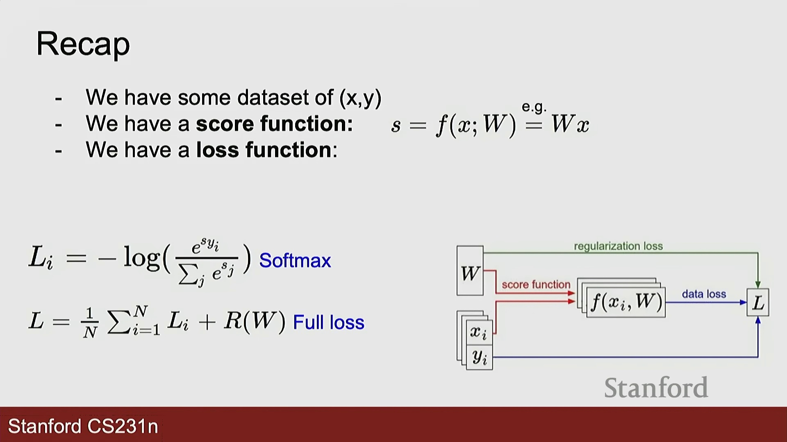

Just to recap, we have a data set of $\text{x}, \text{y}$ pairs. You exponentiate to make them all positive, and then you sum to get a probability distribution. The final values in this all sum to 1. You have a score for each class and take the minus log of the correct label.

This is the probability of the correct label, which is given here. Why do we use Softmax in general? Softmax is great because what it does as a function is it converts any set of floating point numbers into a probability distribution where they will sum to 1. Depending on the value of the score, that will translate to the relative probability of that value.

If you have a really high positive number and everything else is very low negative, you'll have nearly 1 for Softmax and 0s almost for the other values. It converts any list of floating point numbers into a list of probabilities based on the values of the list; that's the main utility of Softmax. You can view the regularization we talked about, which is $L_1$, $L_2$, as a way of regularizing based on the magnitude of the weights, which is true.

How does that translate to simpler models?

In $L_1$'s explanation, it's actually pretty simple because if we prefer, say, terms that have a lot of zeros in it, it's basically a linear model with fewer coefficients. That one is relatively straightforward. However, generally, regularization is not always going to give you a simpler model; it depends on how it's used. In that sense, it's pretty clear how you could design regularization to prefer a simpler model.

But it doesn't always need to be that way. The idea of doing worse on the training data to do better on the test data is not always going to give you a simpler model.

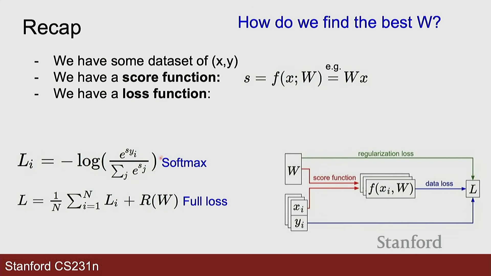

Now that we've talked about how we can calculate how good a given $W$ is based on the training data and this regularization term, the question now is: how do we actually find the best $W$?

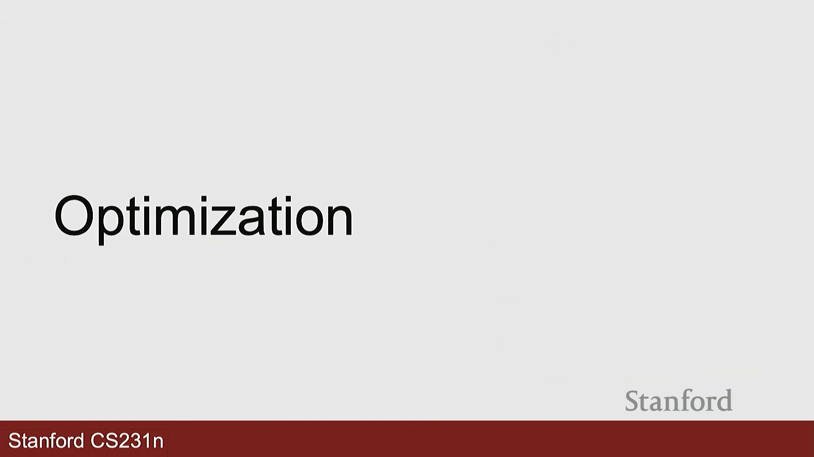

And this is what optimization is, which is the second half of today's lecture.

This is the value you're trying to minimize.

The idea is that you're walking around this landscape and you're trying to find what is the smallest or lowest point in the landscape. If you think of the person as being blindfolded, they don't have access to any visual information. They can only feel the earth where they are right now and understand what is the slope of the ground on the current point in which they're standing.

If you view it in that lens, this analogy actually becomes extremely accurate for how we're trying to find the best model. We have a complex landscape of different loss values depending on the parameters of our model, which translate to the location of the person in this landscape.

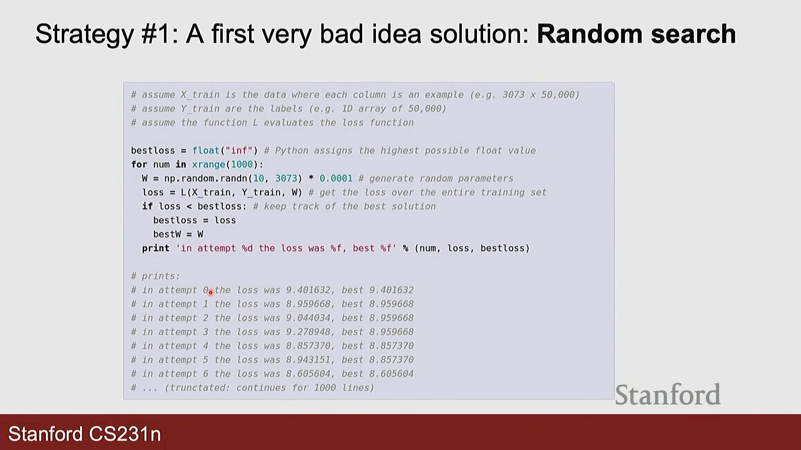

So, how can you find the best point? We could go with a really simple idea, which is maybe a really bad idea, but it could work. It's just basically a for loop where we're trying 1,000 different values of $\mathbf{W}$ randomly, and we're just choosing the best one. Obviously, this isn't very mathematically rigorous, but you will do better than a random baseline.

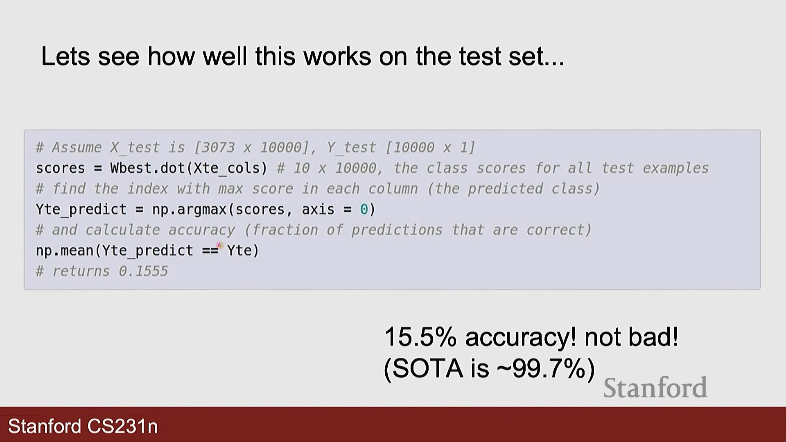

If you had nothing else to go for, maybe this isn't so bad. You would get 15.5\% accuracy on the CIFAR-10 data set—the one I showed earlier with the frog and the car and things like that, with the 10 different categories. But it doesn't perform very good. The state of the art on this data set is basically solved through modern deep learning, where you get 99.7\% accuracy.

So clearly, it's not bad, but it's also, I wouldn't say, particularly good.

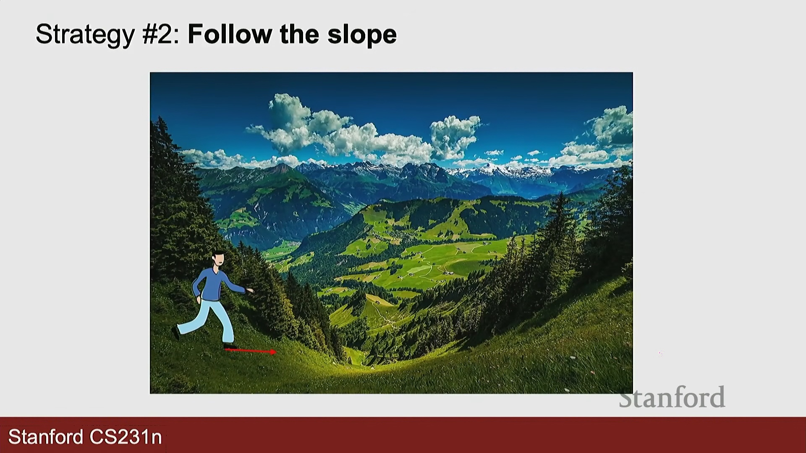

Strategy number 2, which is what I maybe explained a bit earlier, is this idea of following the slope. You can imagine you're blindfolded on the loss landscape and feeling the ground underneath you. You are thinking, "OK, which way is the slope of the Earth pointing?" And you should walk in that direction at all times.

This basic idea is the fundamental way in which we train all the models in this course, and in which basically all deep learning models are trained. You're feeling the location of the current place in the loss landscape and you're going down the hill.

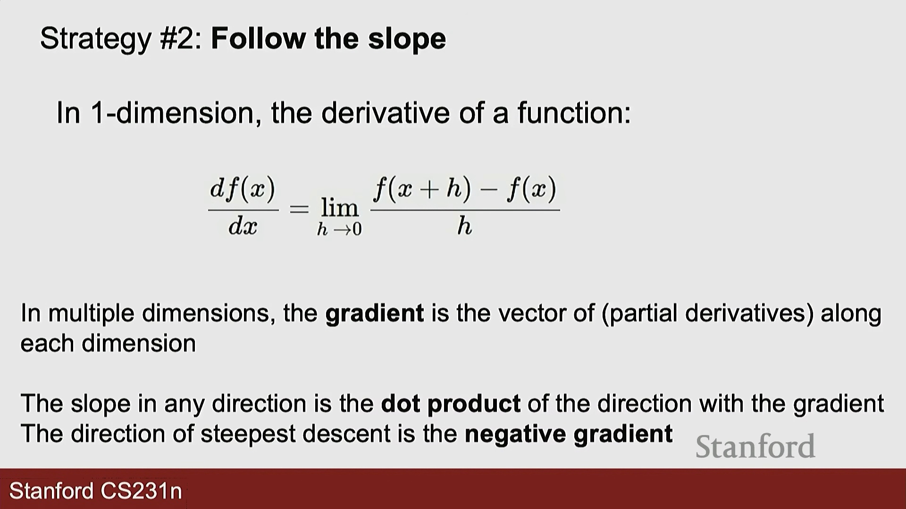

This is a very intuitive way to explain it; we'll now go over more of the math behind it, but this is what you should be visualizing in your head. So how do you actually follow the slope? In one dimension, I'm sure you all are familiar with the idea of a derivative, which in calculus we can think of as the limit definition where we add a very small number to our current location.

We calculate the value of the function at that new location, subtract the current location, and then divide by the step size. As we take the limit for $h$ to approaching $0$, this gives us the derivative of the function at that point. Now, this is for 1D, but in multiple dimensions you use the gradient, which is where you're calculating essentially this limit definition for each of the values separately.

You have a different derivative for each of your values, and you get a vector instead. This gives you the direction along each dimension. You can actually calculate the slope in the dimension by taking the dot product of the gradient with the direction. Specifically, the direction of the steepest descent—or down the hill—is the negative gradient.

The gradient points up the hill; the negative gradient points down the hill.

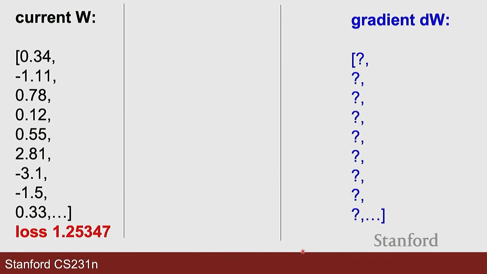

This is the direction we should be traveling if we're trying to get to the bottom of this loss landscape.

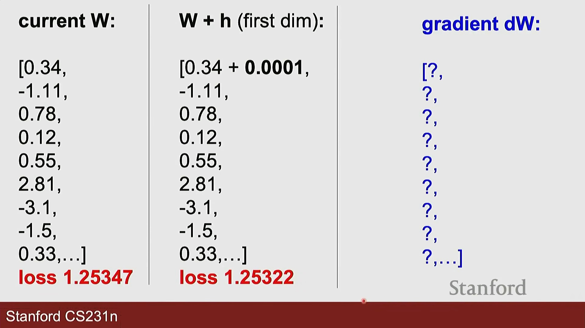

One way you can calculate the derivative is by using the limit definition with a very small $h$.

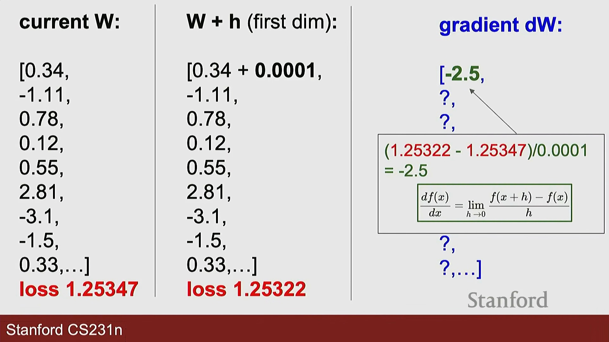

So you add 0.0001. You actually can compute how the loss changed slightly. You can compute the difference, divide by the step size, and you can get an approximation of your derivative here.

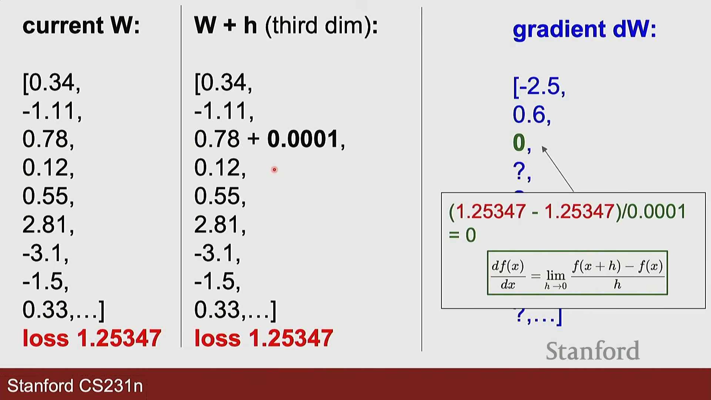

You could actually do this for each of your values in $\mathbf{W}$; you just do this procedure over and over again.

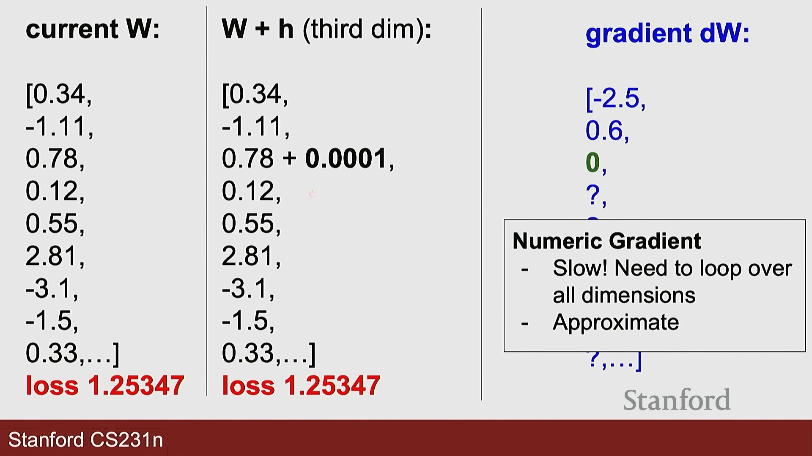

But it has a few problems: It's very slow because you just need to loop through each of the values. It's also approximate, so you're not even calculating the actual derivative. Especially with floating-point arithmetic, you can get pretty significant errors here, so this is not really preferred. But this basic idea or intuition of what we could be doing is to calculate the derivative this way.

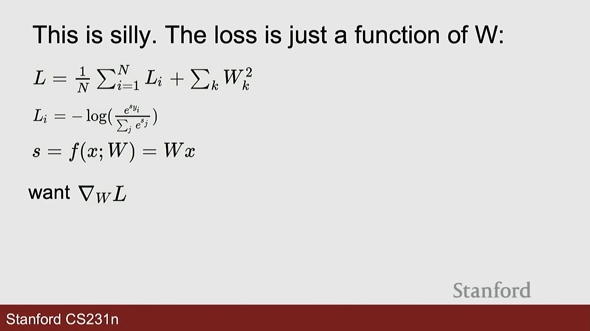

But really, we have the loss as a function of $\mathbf{W}$. This entire loss is a function of basically $\mathbf{W}$'s—the $\mathbf{W}$'s, the $\mathbf{X}$'s, and the $\mathbf{y}$'s. So you have your $\mathbf{W}$ matrix, you have your $\mathbf{X}$'s and $\mathbf{y}$'s, and then you have this formula with maybe some logs and exponents. But fundamentally, this is a function of $\mathbf{W}$, $\mathbf{X}$, and $\mathbf{y}$.

And we specifically want to calculate the gradient, which is given by this Greek letter $\nabla$ of our loss with respect to the weights. We can imagine our $\mathbf{X}$ and $\mathbf{y}$'s are held constant, and we're trying to calculate the derivative just

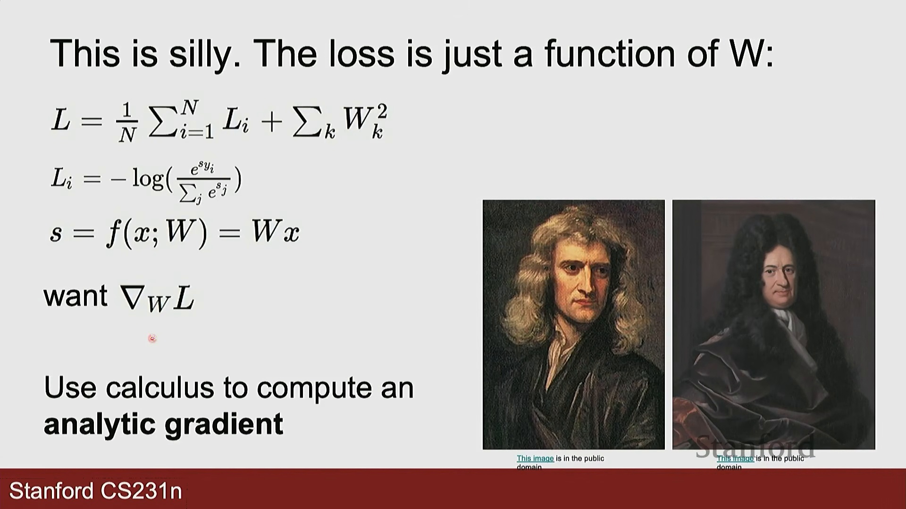

With respect to the weights. To do this, we can just use calculus: using the chain rule or the different methods we've learned for calculating derivatives based on complex equations, or not so complex ones. But you need to have some logs and exponents and chain rules here to solve it. This will be an exercise in the homework.

I won't go through step by step how to do it now, but it is relatively straightforward. Conceptually, it should make sense to all of you how to do this. You assume that $X$ and the $y$'s are constant. Then you solve for what is the derivative as you change $W$.

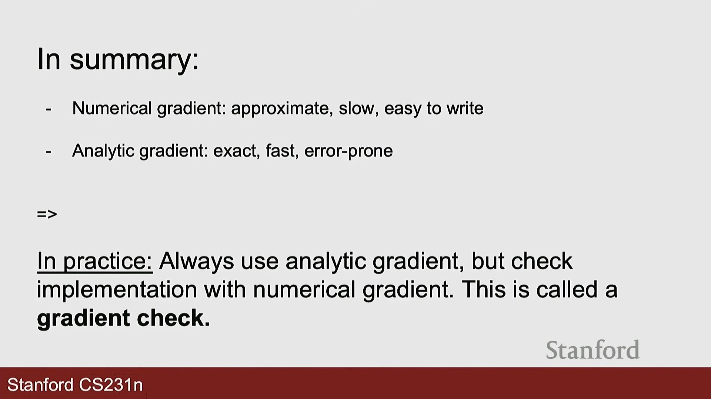

This is, I guess, a summary. You could do a numerical gradient, but it's approximate and slow. The nice thing about the analytic gradient is that it's exact and fast. However, if you are creating a new gradient from scratch, like new code to calculate it from scratch, you could have an error in it.

That's a good way to make sure you don't have any bugs in your code. There will be gradient checks in your homework assignments to make sure your implementations are correct also. The question is, we often say we want a loss function that's differentiable because then we can calculate the gradients. In general, it's hard to construct a better loss function that would be non-differentiable.

Then moving in the steepest descent wouldn't really get you necessarily to your best solution if they are not well connected and forming this geography. The take-home message is that if your function is convex, then it works very well with this gradient descent or steepest descent type of approach. It's not necessarily error prone if your code is perfectly good, but maybe you have a mistake in your code and it's hard to tell right away.

But the $h$, the limit $h$ definition is very easy to code up. You just set $h$ to be a very small value, run it through your function, and add a very small amount. So that's less error-prone for implementation.

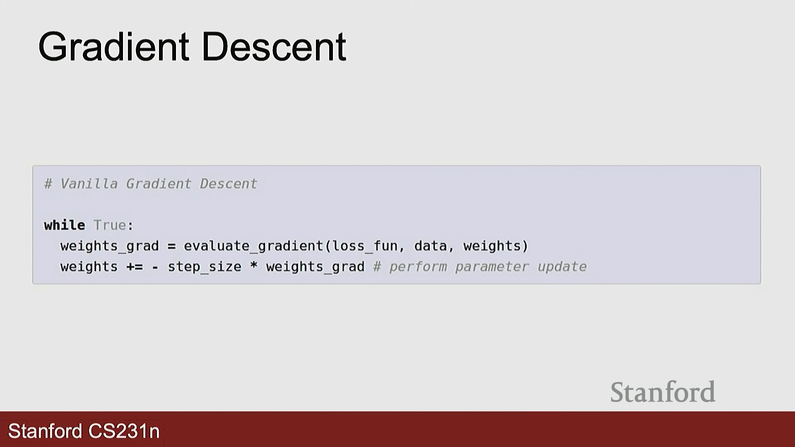

Now I'll talk about this fundamental algorithm for optimization called gradient descent. What we do is calculate the gradients of our weights given the loss function, the data, and our current weight values. This tells us how much we should change each of the weights to go down the slope, and then we have to have a step size—how far down the hill are we taking a step in that direction?

So you go down the hill, which is why there's the minus sign here: [step size] times the gradient. This is basically what gradient descent is. You're calculating the gradient at each step and moving in the direction of the negative gradient—down the hill.

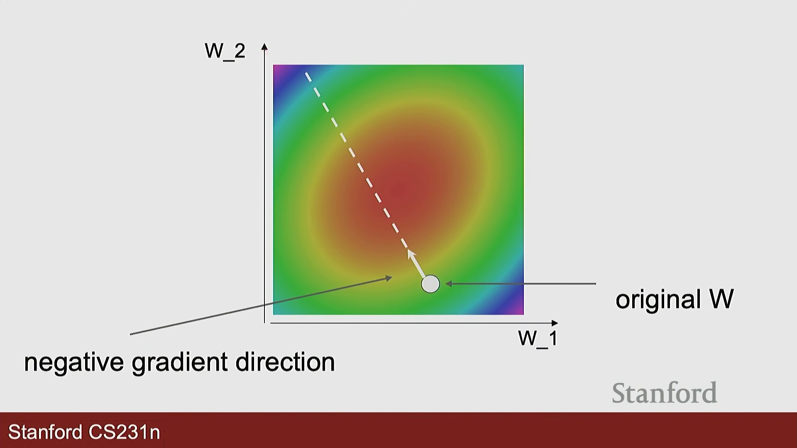

Given a concrete example here. Instead of this being a 3D loss landscape, often people will visualize it like this where we're looking down at the landscape. Purple would represent the highest points and red would represent the bottom or the valley here. We could imagine we have our original $W$.

We can calculate the loss. We know the direction of the slope: the negative gradient direction. This arrow might represent the fixed step size that we talked about before. We're taking a fixed step size in that direction.

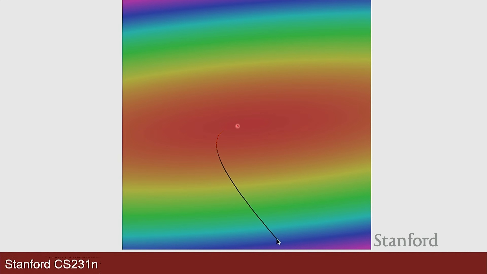

You can see it's a fixed step size, but as the gradient becomes smaller, we're still multiplying it by this fixed step size. So the effective step size actually... ... becomes smaller because the gradient is smaller near the end where it's flat, or near the end where it's more flat. So this is what it looks like when we're always heading in the direction of the steepest descent.

The question is, when we step down, how do we know when we're going to stop? In this formula, you just keep looping forever so you never stop. This was probably not the best approach. Normally, you have a predetermined number of iterations that you run for.

Alternatively, you can look at if the loss is not significantly changing by a fixed amount. You can set a tolerance for how much you're expecting the loss to keep decreasing by. If it's no longer decreasing—if it's only decreasing by $1\mathrm{e}^{-5}$ or $1\mathrm{e}^{-9}$, maybe you stop there because it's good enough. Those are the two ways you can determine when to stop: a fixed number of iterations, or stopping criteria based on how much we're not really improving anymore.

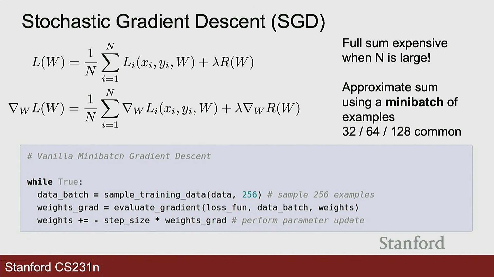

I'll now talk about the most popular variant of gradient descent, which is called stochastic gradient descent. When we talked about gradient descent before, we calculated the loss of our weights by summing over our entire training set: $\sum_{i=1}^{n} L_i$. This is potentially a lot of computation if we have a very large data set. Stochastic gradient descent (SGD) involves looking at a subset each time, which we call a mini-batch or a batch of data, instead of the entire dataset.

If we look at the code, it's like sampling 256 data points from our dataset, meaning the batch size is $256$. We evaluate the gradients of this $256$ subset and then do the same thing as before. The reason it's called stochastic gradient descent is because we're sampling a random subset of our dataset each time we run the algorithm—each step of the algorithm.

You are basically running it on a random subset each time. In practice, people won't just sample completely randomly; they'll make sure to get through all the examples in their dataset and then loop around again. This is called one epoch of training, where you loop through all your data samples once in a random order.

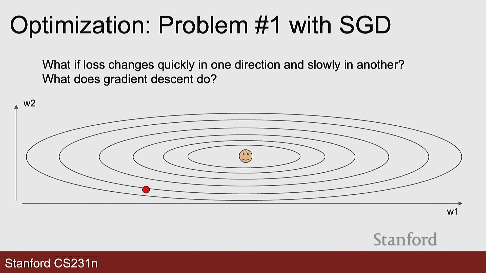

There are some problems with gradient descent or stochastic gradient descent. This visualization is the same type as the colored one I showed before, where we're looking down the loss landscape. These curves are called level sets, which are sets of points where the loss is the same on all of them. This is another popular way to visualize looking top-down at the loss, but without the colors.

You can imagine a phenomenon where it's a really narrow valley, where it's very steep along the sides, and you're trying to traverse the center. Gradient descent actually does run into issues here. One thing that could go wrong is overshoot, where you are moving up and down along this direction. If it's steep enough and your step size is large enough, you might oscillate out of the valley.

If it's steep enough, you could just bounce out of the valley. That does happen if your learning rate is too large—that's one thing that can happen.

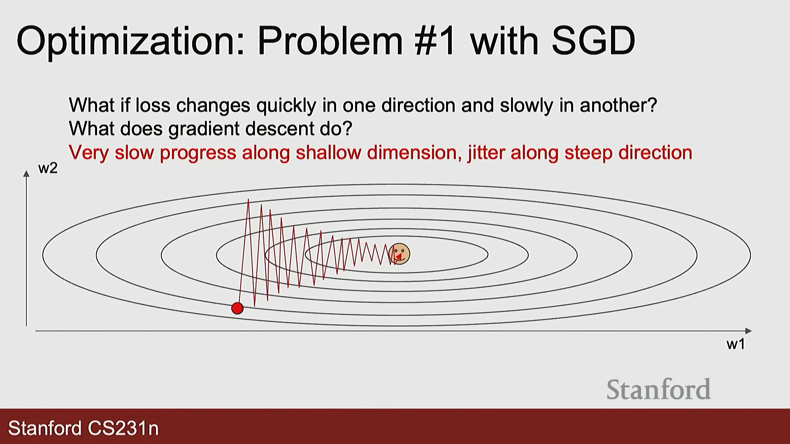

This is a pretty big issue with just default SGD.

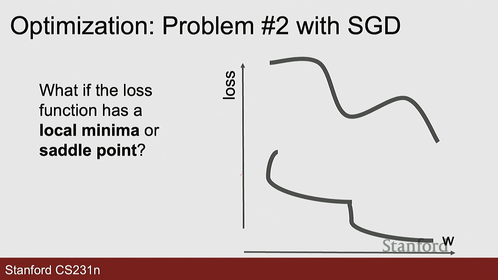

One of the things we might have an issue with SGD is what happens if the loss function has a local minimum or a saddle point. For example, at the very end of this curve, it's completely flat.

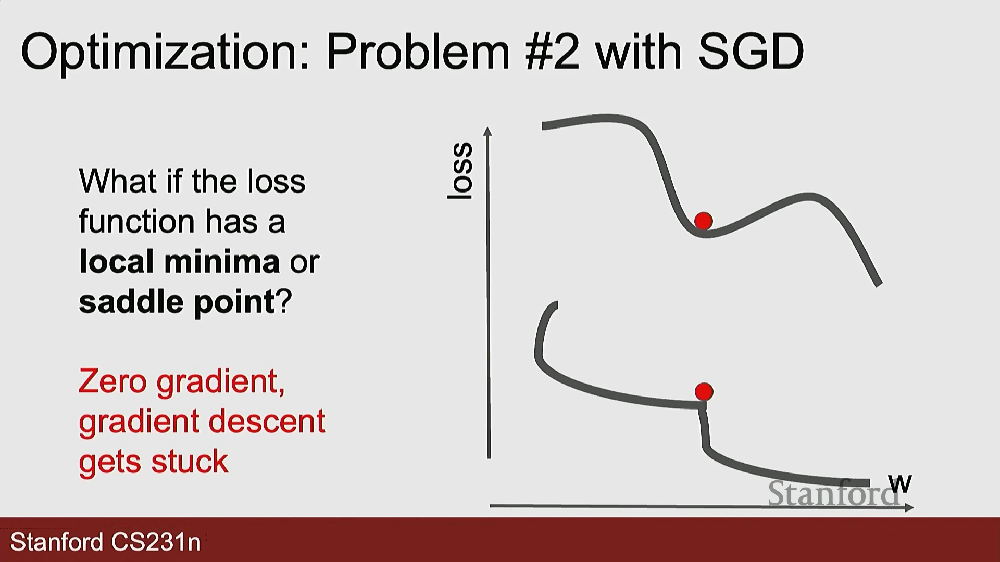

This is a pretty big issue where it can get stuck either in a local minimum. because once we reach here, we don't really have any direction to go. The gradient is $0$. Or it's very small, and we'll just oscillate back and forth here.

And then here it could actually get stuck on this bottom example because the gradient is $0$ here, even though if it went a little bit further it could go down significantly more. The question is maybe we can change the way we're doing the steps. Maybe we could use the Hessian to determine the direction we go. We actually do have a brief slide talking about the Hessian style approach at the very end.

That's not very commonly used in deep learning, but the short answer is yes. There are going to be several ways in which you can account for this that we're going to go into in five minutes.

One of the other things that you might not know is that empirically, saddle points are actually much more common as you move to higher dimensional models. As your weight matrix gets larger and larger, you're more likely to find these saddle points.

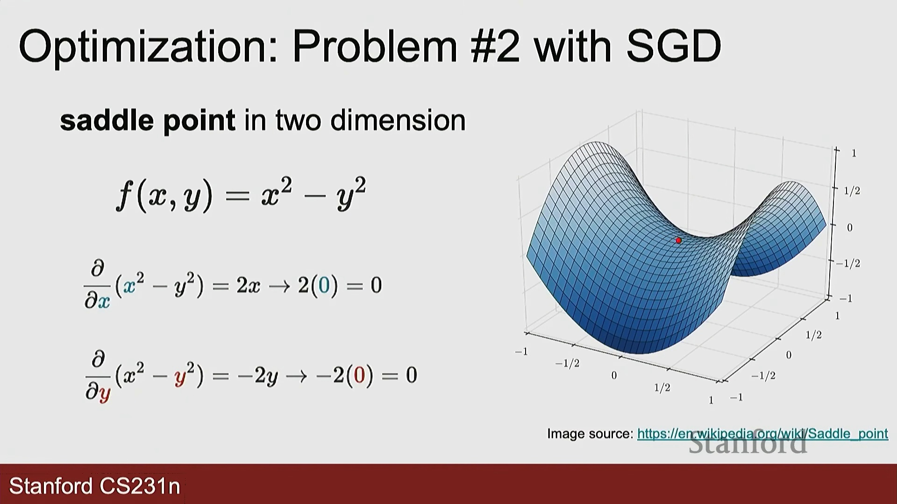

There's a paper describing the frequency of them. A saddle point is called this because it's shaped like a saddle on a horse. At the center of this saddle, the gradient is actually $0$ in all directions. So it's like the bottom of this and at the top of this curvature.

In both the $x$ and the $y$ directions, the gradient is $0$, so you could get stuck here despite being very close to going significantly down the loss landscape on either side. This is also a pretty common issue with SGD. As we move to higher dimensional spaces—or this is equivalent to models with more parameters—this is more and more common.

This is a big issue.

A final issue with SGD is that we are sampling a subset of our data each time.

We're not looking at the whole—this represents the entire loss across all the data, but we're looking at just a subset each time.

We'll actually have somewhat noisy update steps because we're not looking at the entire data set.

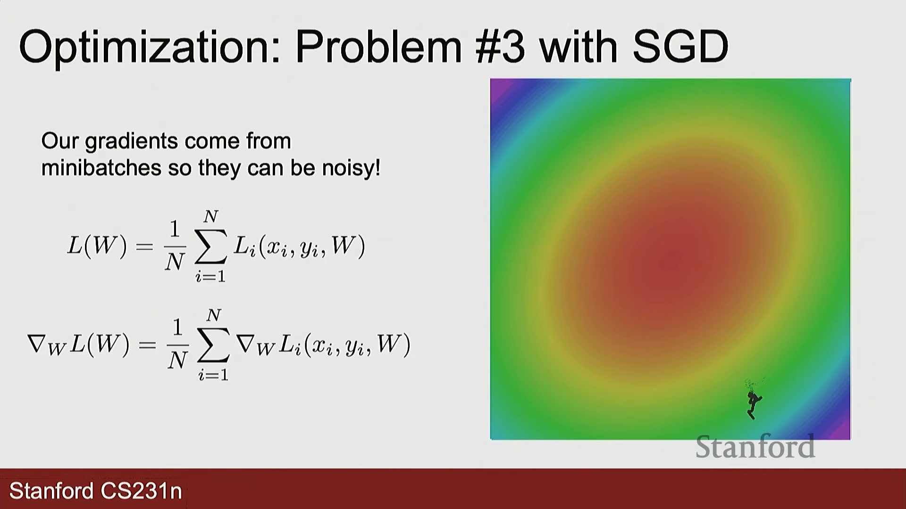

We'll be stepping towards the center toward this local minimum that we're trying to reach here, but each step doesn't go directly in that direction.

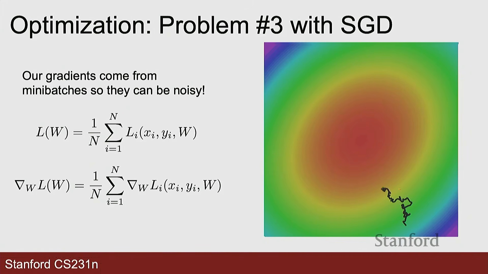

There's some noise in how we're progressing because we're subsampling the data set.

To summarize, these are the main issues.

There's a pretty neat trick you can do where you just basically add momentum.

You can think of this as the same way as if you have a ball that's rolling down the hill where it gains momentum.

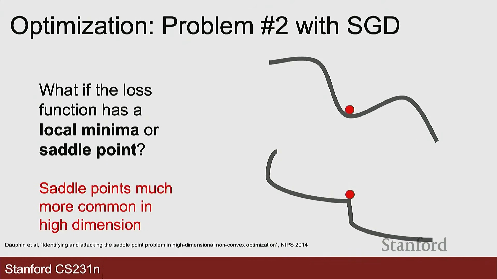

If you have the saddle points or the just flat point here, the model has been rolling down the entire hill, so it won't get stuck here anymore; it will continue.

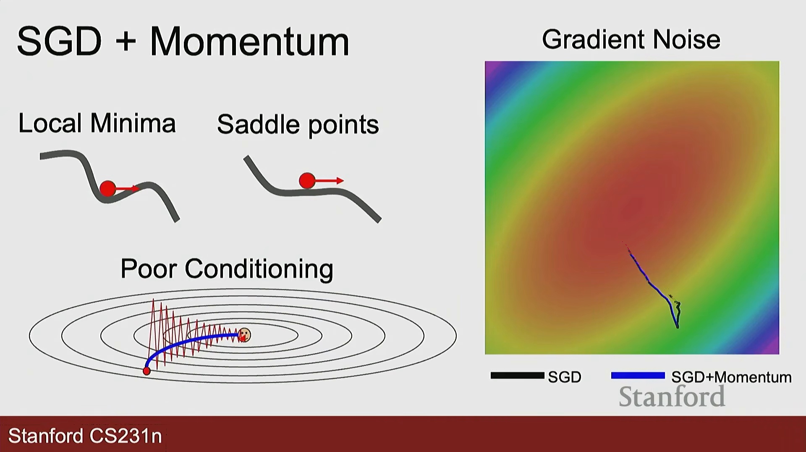

Also, if you have this poor conditioning value, you will still have maybe some oscillation.

The nice thing is that it will accumulate speed in this direction because it will have multiple steps that keep going that way. It will gain faster and faster towards the center here. So it also helps with this problem.

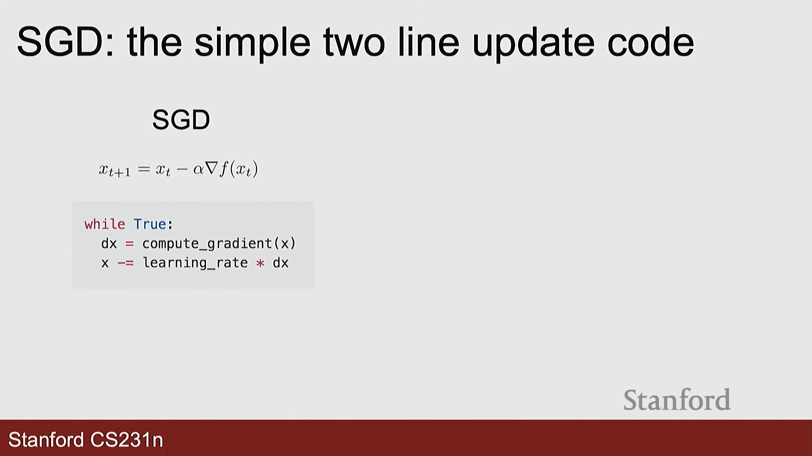

We have SGD here. We have our mini batch $x$. We're computing the gradient, which is $\nabla_{x} L$. We have the learning rate or the step size, which we multiply, and then we do the negative because we need to go down the hill.

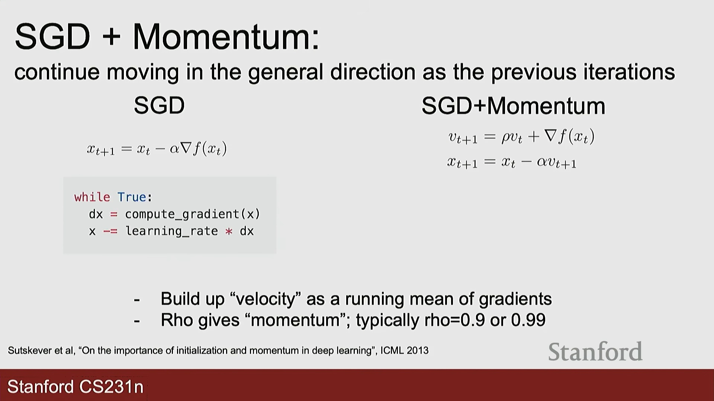

This gives us our new $x$, so this is SGD. With momentum, we're now updating by this velocity term. Instead of updating by the gradient at the specific point, we're updating by the velocity. The velocity at a given time step is given by the previous velocity plus the current slope.

This is how you calculate it. You have this $\rho$ value, which is the momentum—the actual how much momentum you want to have. If you have it very high, then your new velocity is more dependent on the previous time step's velocity. This is a running average of the last gradients in the momentum term here, gives you how much to weight the past versus the present.

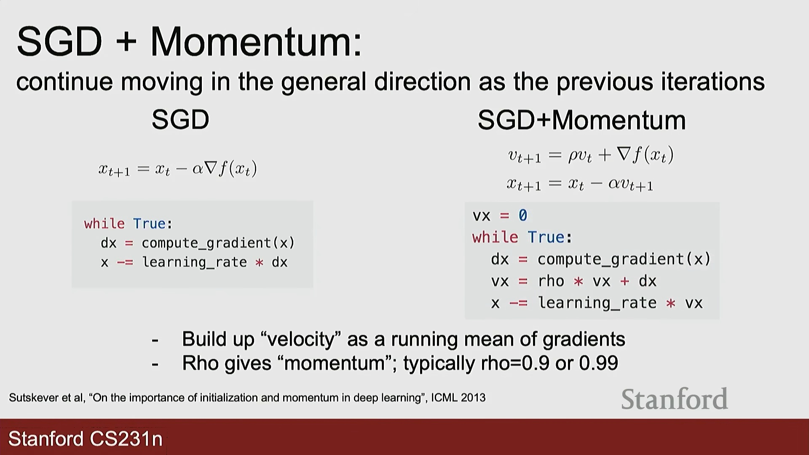

Now we're updating by this. And we still have this $\alpha$, which is the step size. So it's actually a very simple change. You just are now computing the velocity, which is a function of the current velocity plus our gradient.

This is the explanation of momentum.

I could also recap briefly how it resolves all these issues we saw.

If now that you're adding momentum over the past gradient steps, you could see how it would keep continuing along this direction.

Depending on your $\rho$, if your momentum is very high, it would keep going and be able to account for a very large hump here with the local minimum.

Also, it's very good at these saddle points because it will just continue along the direction in which it was going previously for a significant amount of time and poor conditioning.

If we're having cumulatively going to the right upon each step, the momentum will also be consistent there and build up.

So the question is, what happens if you're rolling right along the saddle? I mean, I think in practice it's very unlikely. But in that case, yeah, you would just get stuck in the saddle. I think that's your initial conditions; wherever you start is very unfortunate.

Sometimes that could happen, but it's very unlikely. It's also why, in practice, people won't run a single model training run. Often they'll run multiple ones with different random seeds, just in case something like that could happen. But hypothetically, I think that could occur.

So the question is why is the saddle just an issue with SGD and not optimization in general? It would also be an issue with the entire data set; it might even be more common with the entire data set.

So the question is, does adding the momentum make it more difficult to converge because we'll overshoot and then you'll have to come back? So it will converge maybe more slowly because you won't get stuck in a local minimum. You would just converge here if there was no momentum versus overshooting. I think a lot of this stuff is empirically shown where it happens to be with the specific class of neural networks.

Momentum does help training. But this is the intuition for why we prefer it.

Here's the intuition about why it could perform better. In practice, people will just try a bunch of different ones and see what works best, and I'm going over the most common ones that people try now. You're right, it could hurt convergence potentially. I'll continue then.

So, I think we went through this.

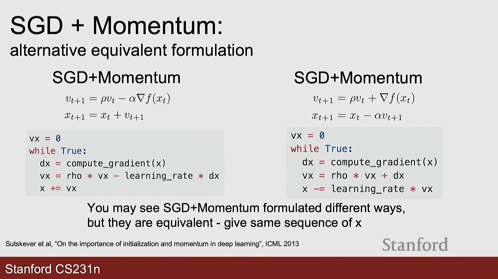

And one other thing I wanted to point out is that there are different ways you can formulate this. These equations are identical, but you'll sometimes, depending on the implementation, see it written in different ways, but they're doing the same thing. Maybe, in interest of time, I'll skip over why they're identical.

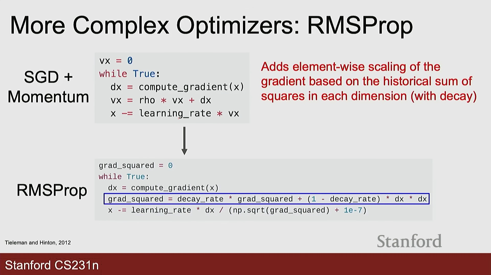

I think the next thing I'll talk about is a different optimizer. We talked about momentum, and now we'll talk about something called RMSProp. So RMSProp is a bit of an older method now, 2012, but it came out by Geoffrey Hinton's group. So how do we do this?

We have this gradient squared term. And the decay rate here is very much like the momentum term we explained before, but now it's on the squared gradient. So we have this running average where we take the previous term here, the gradient squared. And then we do $1 - \text{times}$.

And then here it is the—literally, the gradient squared. And so this is a running average of our squared gradients. Bigger values will get much bigger, smaller values will get much smaller. If there are consistently large gradients in certain values, those will get very large as we continue our running average here.


And we're actually going to divide here in the update step; we divide by the square root of it. So the basic idea here is we're actually now stepping—someone asked earlier; I think there was a question—what if we changed the direction in which we're stepping? This is exactly the type of thing you can do. This is what this is doing where we're dividing by the squared gradient term.

For values in which we have very large squared gradients, for the values of $W$ in which the derivative is very large, we'll divide by a larger value. So we'll step not as far in that direction. In flatter regions, we'll step farther because we're dividing by a smaller term here. This is the basic intuition behind it.


What happens in this specific line here of the code? What happens with our gradient step direction? How does it change? We're dividing by a value that is dependent on the current gradient and also the past gradients.

When the denominator is very large, the step becomes effectively less in that direction because we're dividing by a large value. Conversely, when it's a very small value, the step becomes much larger, because the gradient squared term is small and located in the denominator, thus increasing the effective step size.

It's specifically for this type of example where you have maybe a very narrow valley where you want to be moving more in the flatter direction. The question is, what does a small gradient mean in this context? And how does this help us move less along the steep directions and more along the flat directions?

This is a great visual because it compares three different approaches. We have momentum, which you can see overshoots at times.

Then there is SGD, which is slower because it's just always moving in a fixed direction. And then we have RMSProp, which we just mentioned.


You can see it quickly starts turning towards the center where it's a flatter landscape at this point, but it's traversing more in that direction.


We're changing the direction we're going based on going less in the steep direction and more in the flat direction.


These are three approaches, and then there's one more we'll discuss, which is by far the most popular optimizer used in modern deep learning. It's just a combination of SGD momentum and RMSProp. This is almost what the Adam optimizer is, which is the most popular optimizer in deep learning, and you also have all the prerequisite knowledge now to understand it.


The second moment here is the gradient squared term for RMSProp. We're doing the same thing here, multiplying the learning rate instead of by the step size by the velocity. But now we're still taking the square root, and it's based on the second moment here. As it's written now, this will run into issues at the very first time step.

One thing to note is that these betas, $\beta_1$ and $\beta_2$, are usually initialized very close to $1$, like $0.9$ or $0.999$. These two values are also initialized to $0$. During your first time step, if you just use this formulation of Adam, you would run into potentially unwanted behavior. Another thing is that it has to do with the second moment calculation.

This is the main issue here. When you calculate the second moment and then use it on the next line, you run into an issue because the denominator is $0$. It starts at $0$, so this term is $0$. You have a very large $\beta$, so this value is very small.

And if your gradient is not very large in your first step, you can have this whole term basically be very close to $0$. Now, we're dividing by something very close to $0$, and it just creates a very large initial step, even though our gradient was small. So that's probably not something we really want.


I think this is also something you'll go into in the homework. I just want to give the basic intuition behind Adam—why the naive implementation wouldn't work, which is this really large initial step. And you'll go over in the homework implementing this, and you'll see how the time step is used. But the basic idea is to account for that very large initial step, and as your time step increases, these bias terms are not needed as much.


These are some good defaults that people normally use. If you're training a model with Adam, you go with these, and maybe it'll work, maybe it won't. But it's a good starting point. From the remaining slides, we'll talk about how do you know if your learning rates [are] right?

How do you know if these other values are right?


The basic idea is that you can see all these different optimizers converging.


They all have different properties. You can see how Adam is this combination of RMSProp and SGD with momentum, where it has characteristics of both, which is very neat to see visually.


It aligns with our intuition. One final topic related to Adam is that we could look at how regularization interacts with the optimizer. For example, if we have $L_2$ regularization, how does this affect how the optimizer works?


I think the answer is it's actually not immediately obvious, and you can do it in different ways.


In default Adam, they compute $L_2$ when they're computing their gradient. So we looked at the gradient, and there was the data loss portion—the data loss portion—and then the regularization loss. For Adam, it's using both of those when it computes the gradient.


Basically, all I'm trying to describe to you all is there is flexibility for how you incorporate regularization into your optimizers.


So this is the main difference. Under a lot of settings, AdamW works slightly better. I think the Llama series from Meta they all use AdamW, I assume because it does slightly better for them. We have one function optimizer; why are you splitting it into two?

If you mix it into one function, that's what Adam does. AdamW is specifically separating it into two. The reason you might want to do that is because if you don't want your velocities and momentums to actually be a function of the weights, you want it to be a function of the loss. So if you're trying to traverse your loss landscape more independent of your actual weight values, that's why you might want to separate it.

But you still might want a regularization term, but you don't want it to interfere with the moment calculation. This is the specific reason why they do it. Ultimately, it's empirical; you try both and you see which one works better, but this is why you would do it that way.


So we'll talk about learning rates. There are different ways in which learning rates can be chosen. If you have a very low learning rate, your issue is you just converge very slowly.


You don't need to always have a fixed learning rate or step size.


One really simple way you could do it is after a fixed number of iterations, you just take $\frac{1}{10}$ of the learning rate and continue training. This is really commonly used when training ResNets. That's a very popular type of convolutional neural network.


which we'll discuss later in the course. Another thing you could do is cosine learning rate decay. This one is also extremely popular. Here, basically, this is like half of a cosine wave where you're starting at your maximum learning rate here, and then you go down to 0 at the end.

It follows this $\cos$ shape, and here's the formula for calculating it.


I won't go into too many details, but the basic idea is there are a ton of different ways to do it. But the basic idea is that the actual shape of your loss during training will highly depend on what scheduler you use.

It looks very different, for example, than this one, where you can literally see where we're taking $\frac{1}{10}$ of the learning rate during training.


Another thing you do is just a linear learning rate decay; it just follows a straight line. You could do an inverse square root, et cetera. There's basically an unlimited number of ways you could mess with your learning rate during training. Depending on the type of model you're training and depending on what works best, you just choose the one that works best.


Also, a really popular strategy is to have a linear warm-up. For example, linear warm-up, and then this would be like the inverse square root. Or linear warm-up and then cosine is a very popular setup for training models. One final thing is that there is this empirical rule of thumb called the linear scaling hypothesis or linear scaling law, or something like that—I forget the name.

So as you increase your batch size, you should increase the learning rate directly proportionally. I think the math behind this is a bit involved, and also it's more of an empirical rule of thumb. If you have a winning recipe but you want to increase the batch size, then also increase your learning rate by the same amount.


We won't talk about this in depth, but just to let you know this exists; it's not something we cover in the course very much.


We just look at the direction and take a general step in that direction.


You then try to find the minimum this way, and in certain optimization problems this actually works extremely well.


But generally, we don't use it in deep learning because it requires two things.


In practice, we don't use it because these matrices become way too large, and so you run out of memory on your computer if you try to run it, specifically on a GPU memory. But if you're training a smaller model or if you're okay with spending much more time to get better steps towards your minimum, then maybe you want to look into this. For smaller models, this actually works quite well.


Adam or AdamW is a really good default choice for training your first model if you're working on a new problem. In a domain, I would recommend it. It could even work OK, even if you do constant learning rate. Usually people will try Adam or AdamW with constant learning rate or with a linear warm-up, and then a cosine decay; those are like really popular combinations.

Also, I think SGD and momentum can sometimes outperform Adam. Also you might have to try different scheduling values, whereas in practice, Adam tends to be best by test. People have tried it a bunch of different domains and it works very well. It's very adaptive to the loss landscape.


I think we are essentially done with the lecture. I'll give some slides about looking forward: how do we optimize more complex functions than linear models, which is what we covered in this lecture?


Next lecture specifically, we'll be looking at neural networks, which is a very exciting topic. A neural network, which we'll discuss in class, is basically that you have two $\mathbf{W}$ weight matrices now, one for each layer. And you have something called a non-linearity sort of stuck between. In this case, the most simple one is just this $ReLU$ function, which you'll learn about more.

But the basic idea is that we have two weight matrices and an additional function done in between the weight matrix calculations.


This is nice because, as I said, it's nonlinear.

If we're trying to build a linear classifier to classify data like this, you'll run into an issue where the blue points and the red points are not linearly separable.
