# Stanford CS231N | Spring 2025 | Lecture 4: Neural Networks and Backpropagation

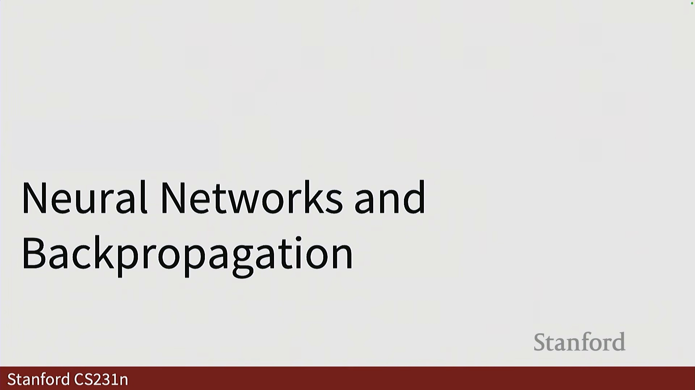

As you can see on this slide, today we are going to talk about neural networks and backpropagation. So let's dive into the topic. This is going to be exciting, and it is laying the foundation for the rest of the quarter. Every single algorithm that we will be discussing in the future without even mentioning is using a form of backpropagation.

And so that's why understanding this lecture and the topics is very important.

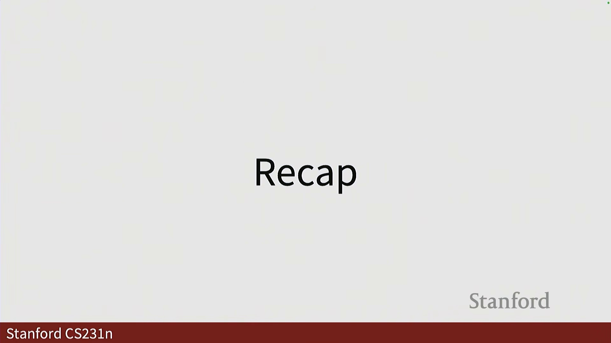

In keeping with tradition, let's cover what we've talked about so far.

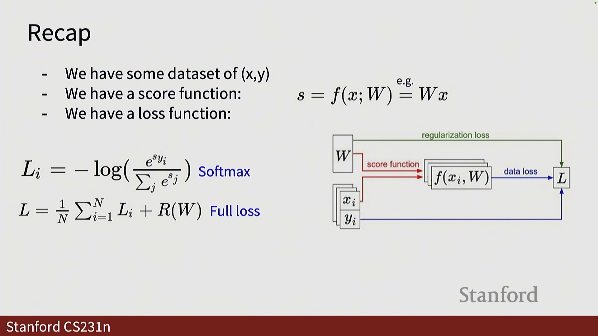

I'm sure you now remember what we talked about last time. We discussed how we can form the objective functions, or loss functions, which we call here. And then we talked about regularization. To do that, we formulated everything through the $(x, y)$, defining the pairs and a scoring function.

In this case, we are using a linear scoring function, as you can see, and also defining, ultimately, this loss function. The graph that you see on the right shows all the process, the entire process of learning. There have been some questions in the last lecture and also even before that regarding why we are only using the softmax function. I wanted to reiterate that it is not the only loss function that we have and use.

It is one of the most widely used in deep learning and building, especially for the task of classification. But there are so many other options that we use for other tasks, for different tasks.

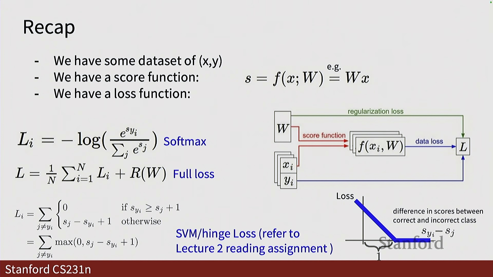

In the slides, we had examples and everything around the topic of hinge loss. It is also one of those widely used loss functions, especially in the early years of neural networks. To give you a high level understanding of what it is: this is a loss function that unlike softmax, does not turn the scores into probabilities. Turning them into probabilities is not the only option, so we can use other forms.

This function encourages the score of the correct item, which is defined by $S_y$, to be higher than the scores of all other items $S_j$. You can see the condition here, creating a value of 0 if the condition is true. Otherwise, what it does is—as I said—it encourages the score of the correct item to be higher than the scores of all other items by at least a margin.

The number one that you see there is the margin that it creates. If the condition is violated, the loss increases proportionally from the margin.

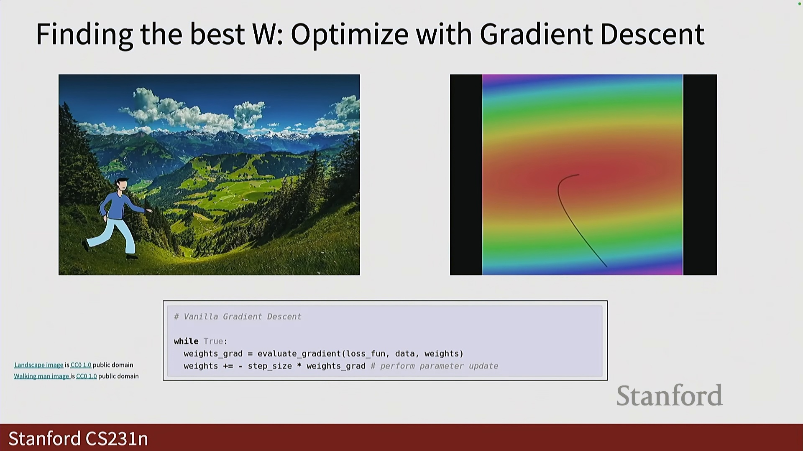

Next, we have talked about general optimization—how to find the best parameters $\mathbf{W}$ for the neural network. In doing so, we talked a little bit about this loss landscape being a large valley, as shown in this image. Every point on that valley is a different set of weight parameters. We wanted to find the set of parameters, $\mathbf{W}$, that minimizes that loss landscape.

This gave us the gradient descent algorithm.

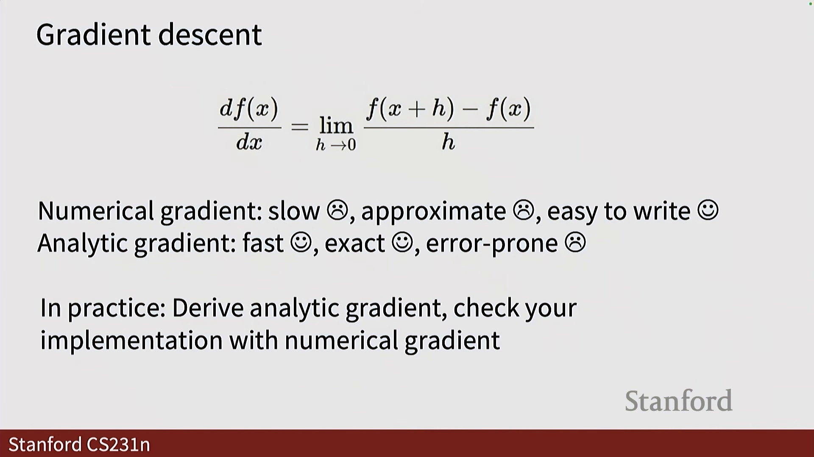

This was the gradient descent algorithm. In order to optimize, we talked about two different approaches: numerical gradient and analytical gradient, both of which have pros and cons. We discussed, in practice, deriving analytical gradients—we derive analytical gradients. Often, if it's hard to do the implementation and the math and everything, we check our implementations with numerical gradients.

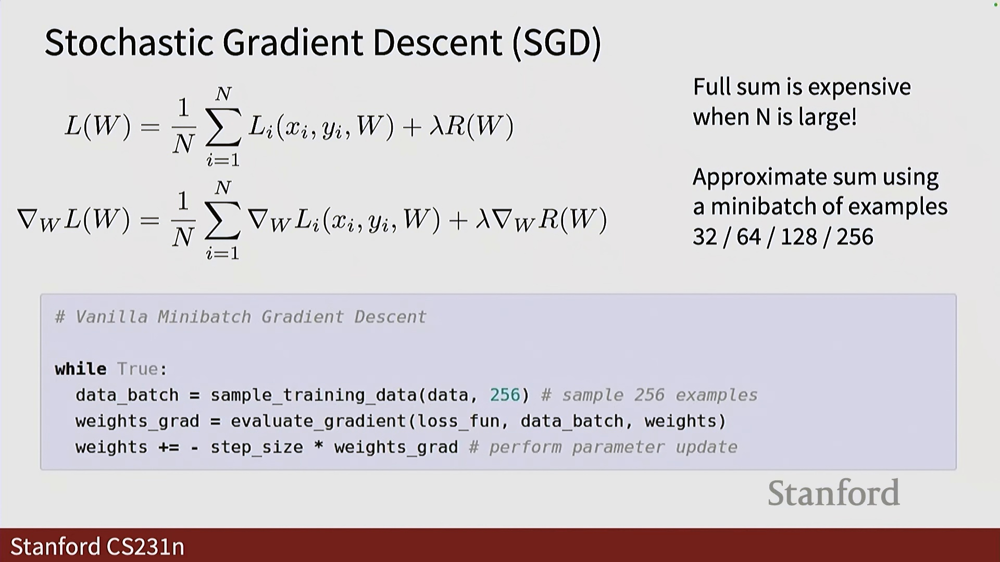

One of the other challenges we talked about was incorporating the loss function and its gradients on the entire data set. If you have a large data set, it's very expensive to run the loss function and the derivative on the entire data set. That's why we talked about the idea of mini batches, using a number of examples sampled from the data set—often maybe 32, 64, or 128, or 256.

This subsampled data is used for identifying the gradients and then taking steps towards the minimum.

Beyond SGD (stochastic gradient descent), we talked about some optimizations: SGD with Momentum, RMSProp, and Adam optimizer.

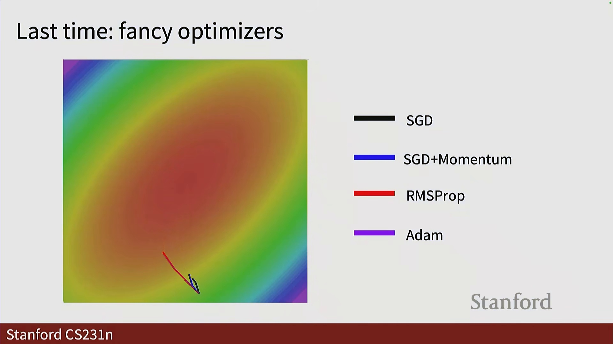

There were a lot of details that I would refer you to in the third lecture if you have any specific questions about this.

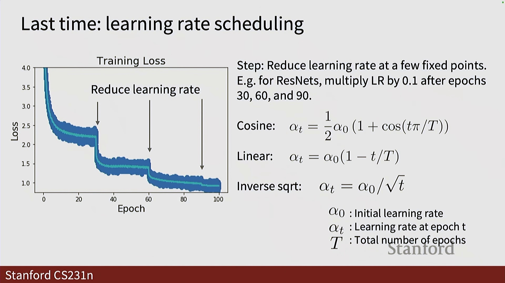

One of the other things that we talked about was the importance of the learning rate and scheduling the learning rate. In some optimizers, we often try to start with a larger value of the learning rate and then use different types of decaying the learning rate, or reducing its value by a factor. This is normally needed in many optimizers. But in some of the more recent ones, Adam and its variants, we often do not need to manually or explicitly decrease that because that is encoded into the optimizer itself.

So with that, I want us to get to the topic of neural networks and see how we can actually build neural networks and solve more exciting and harder problems.

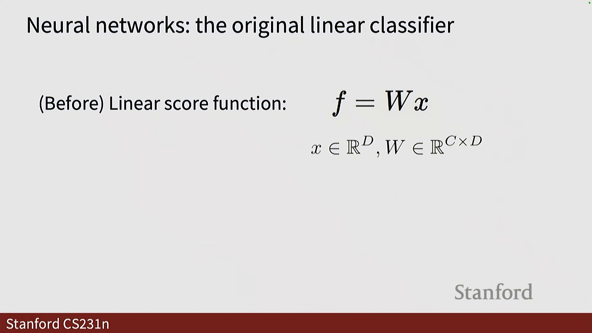

We've so far talked about this function: linear function. of $W$ multiplied by $x$. That is the most basic neural network that could be defined as just one layer. We will be talking about the layers.

$C$ is the number of classes—the number of outputs, nodes, or neurons, whatever number of outputs we need.

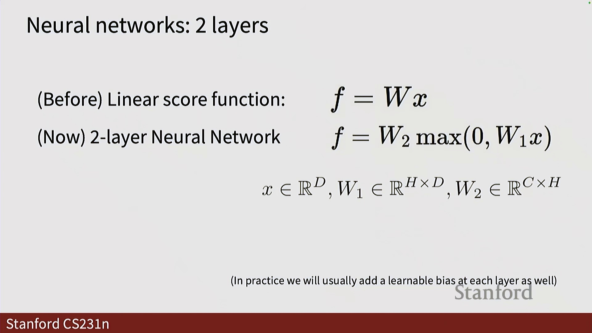

In order to create a neural network at a second layer, we can define a new set of weights referred to as $W_2$. We apply those to the previous layer of $W_1$ multiplied by $x$. Again, pay attention to the dimensionalities here: we have $C$ number of outputs and $D$ as the number of input features. But then you also define $H$, which defines the number of neurons, the number of hidden layer nodes, or neurons.

That's one point. The second point is this $\text{max}$ function that we will be coming back to. We'll explain what it is and what it means. What the $\text{max}$ operation is doing here is to create a non-linearity between the linear transformations done by $W_1$ and $W_2$.

This is actually a very important part of the process. I will talk a little bit about the non-linearity, but also look at this last part before I forget. In practice, we are only including $W$ and $x$, as we talked about this in the first and second lecture. We also incorporate a bias just to have a complete framework.

So in practice, we also have bias, but we don't write it here for the sake of simplicity.

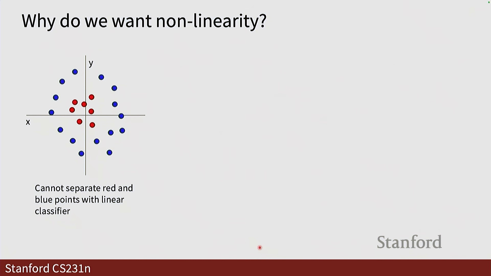

The $\text{max}$ operation is creating the nonlinearity.

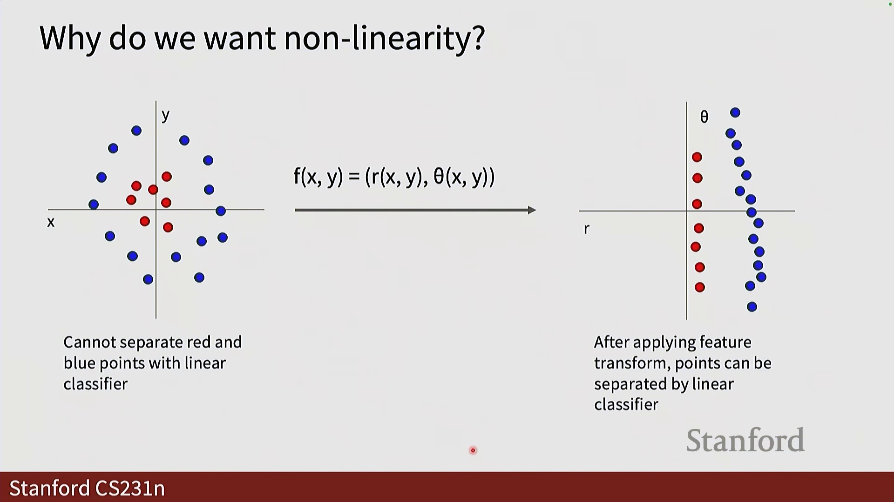

In the new space, you see that they are separable using a line. In this case, it is a nonlinear transformation between the input and then the second space, which is mapping $x$ and $y$ to their polar coordinates, $r$ and $\theta$. But again, this is just one example. There are so many other examples, too.

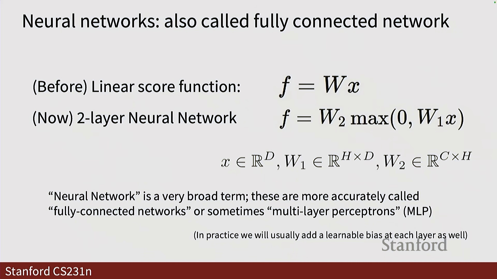

So with this example, let's go back to our definition of the two-layer neural network.

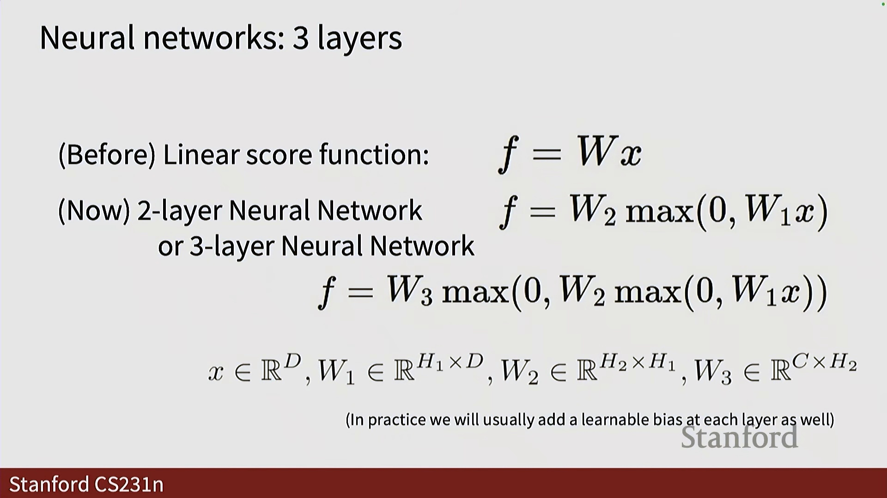

We can actually stack more and more layers to create larger networks. In this case, again, pay attention to the dimensionalities; we have hidden layers in the middle, and the dimensionalities that do match one after the other.

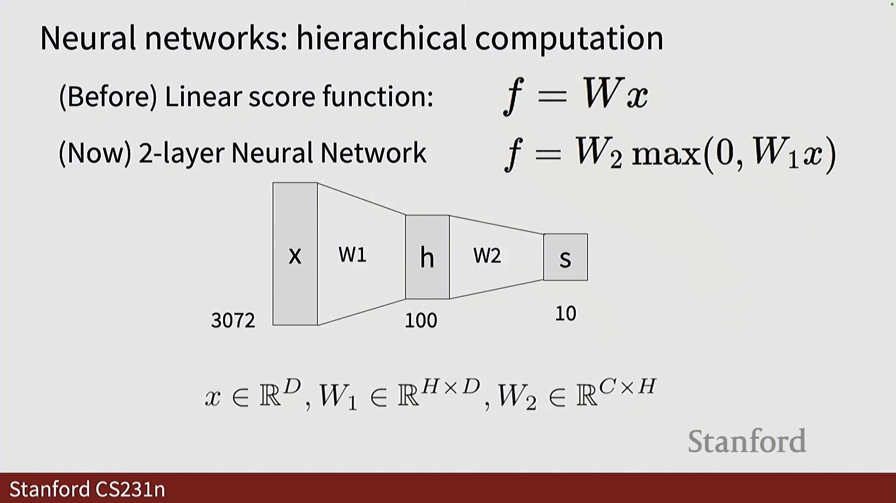

Back to this visual representation of what the neural network is doing. We talked about this when we had the linear representations: often what happens is the network, through the weights, is learning some sort of templates.

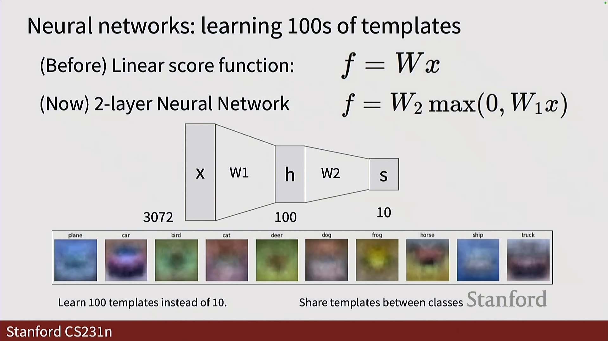

If you remember last week, we were talking about these templates that are being learned. I'm saying that templates are representatives of the images but from the data, depending on what data it was trained on. These templates, as we discussed last week, were generated by these 10 outputs by applying the $W$ matrices on top of the input neurons. Now that we have multiple layers, more layers, now we can actually create some more templates.

We have a layer in the middle that can actually create 100 templates, as opposed to just 10 for a linear classifier. Although we still have those 10 as well. This is again, from a very high level understanding point of view, what I'm telling you means. For example, the classes that you see here—we had bird, cat, deer, dog, frog, horse—they all have eyes.

One of those 100 templates could probably be a part of the object that could be shared between all of the classes. From a high level point of view and understanding these can form templates.

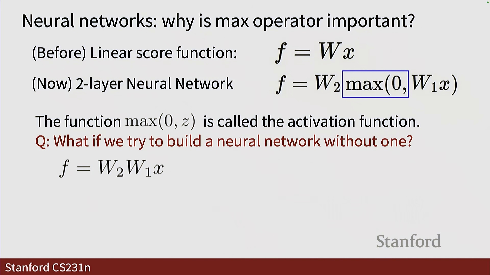

So, back to the $\text{max}$ function. We talked about the $\text{max}$ function, the nonlinearity that is created here. In neural network terminology, we call that an activation function. It plays a very important role, a pivotal role, in building the model, building a neural network.

Let's answer this question that we have on the slide: What happens if we try to build a neural network without one of these activation functions, let's say, the $\text{max}$ function? This is our function if I remove the $\text{max}$. It would be $W_2$ multiplied by $W_1 x$. As you can guess and correctly, you mentioned, the multiplication of $W_2$ by $W_1$ could actually be replaced easily with another matrix, $W_3$.

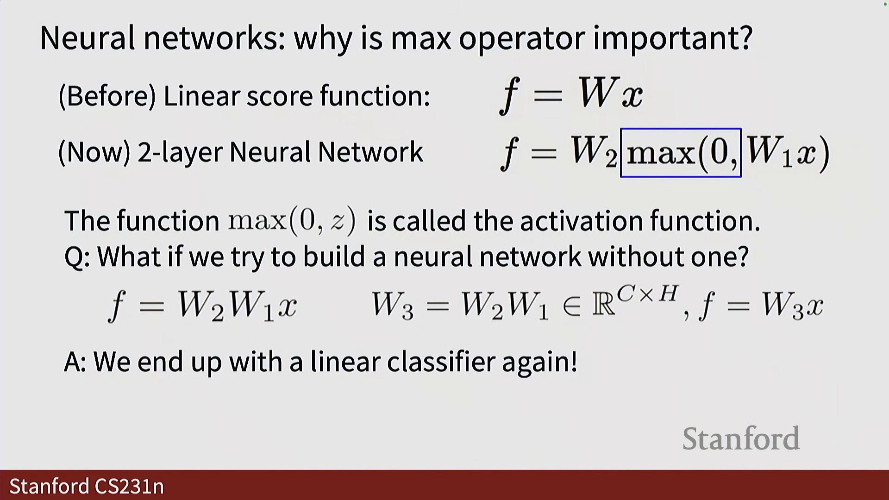

Then your function becomes just a linear function. Everything could be lumped together. So we need some sort of nonlinearity in the middle to be able to give us the power to solve non-linear problems.

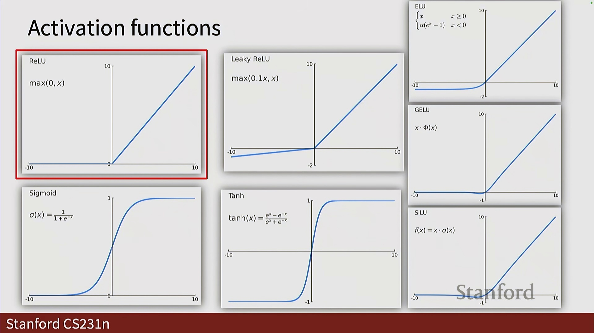

The function that we just talked about is $\text{ReLU}$. It's the rectified linear unit, and it's a very popular activation function used in neural networks. In order to avoid the dead neurons, leaky $\text{ReLU}$, with this type of modeling, or $\text{ELU}$, that is the exponential linear unit, are other options. $\text{ELU}$ is a little bit better because it has a better zero-centered function.

There are also newer variations: $\text{GeLU}$ (Gaussian or linear unit). I've heard both variations, $\text{ELU}$ and $\text{GeLU}$, so could be used; they are often used more often in neural architecture in transformers. We also have $\text{SiLU}$, or switch. It's the sigmoid linear unit that is also used in some of the modern CNN architectures.

Google was using this for some variations of their models and also in EfficientNet. Other than these, there are functions like $\text{sigmoid}$ and $\text{Tanh}$. $\text{Tanh}$ that are often also used as activation functions. Although they do have a few problems because they do squash values in a narrow range, and that sometimes results in vanishing gradients.

So we often do not use $\text{sigmoid}$ or $\text{Tanh}$ in the middle of the neural networks. They are often used in the later layers, where we want to, for example, binarize the outputs and things like that.

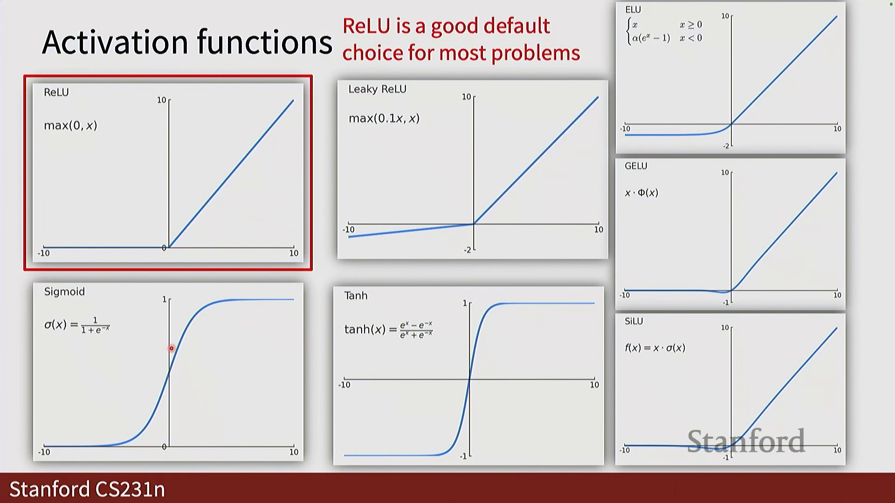

As I said, $\text{ReLU}$ is often a good default choice. It's very much used in many architectures. And there are so many variations of the same function that we talked about.

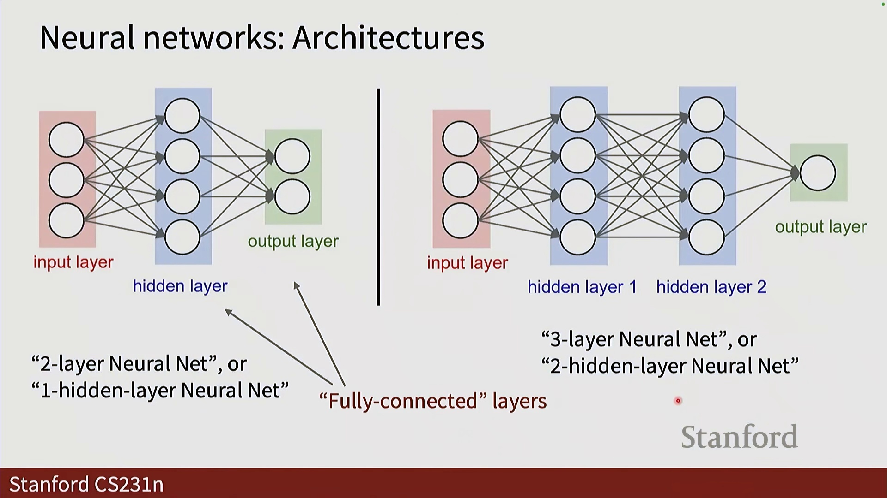

I want to summarize what we've talked about and then answer some questions. We did talk about different adding layers and so on, but I want to highlight that activation functions are often functions that are operating within the layers. We also have $W$'s, which define the weights mapping between the previous layer and the next layer.

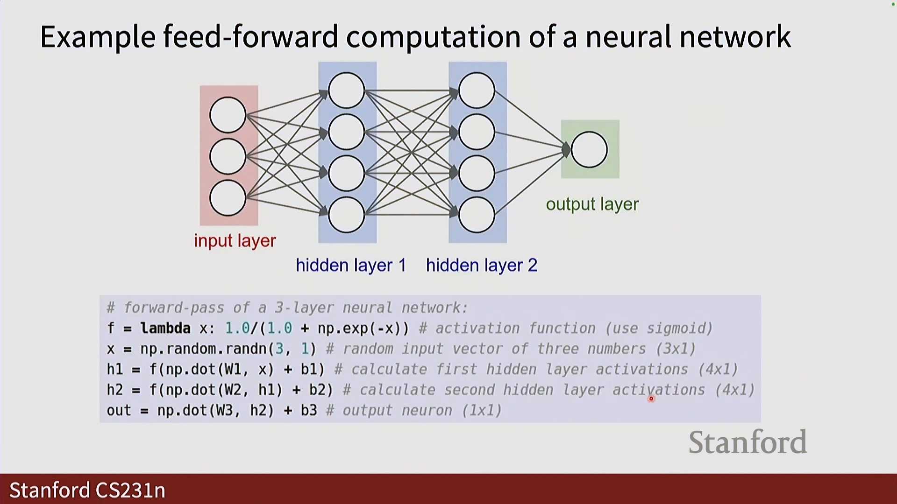

Again, these are fully connected neural networks with very simple implementations. What we only need is to be able to define an activation function. In this example, if you look at the example, we have the $\text{sigmoid}$ function defined as the activation function. Then same for $H_2$, and the output will be very simply the dot product between $W_3$ and the last layer of hidden values, creating the output layer.

I'll stop here to answer some questions if there are any. And then we can continue it. That is a great question.

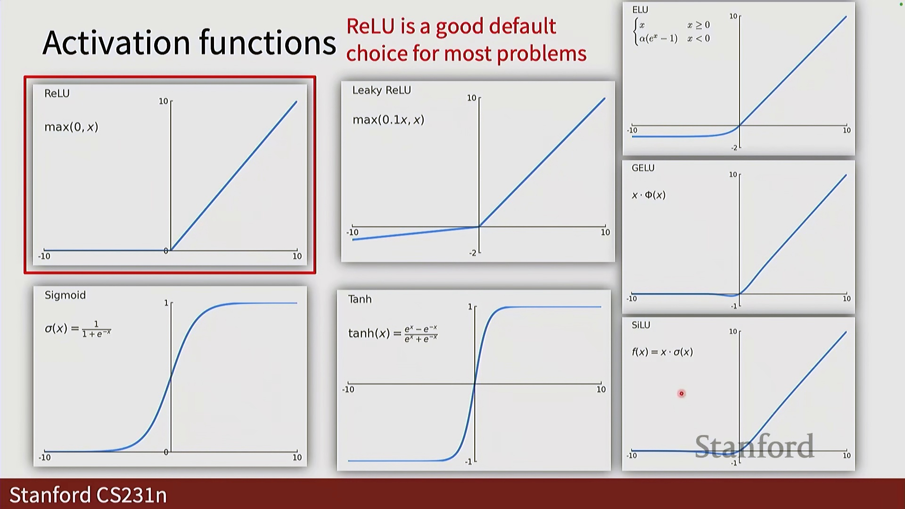

The question is, how would we choose for a new problem which of these activation functions to use? The short answer to your question is yes, it's empirical in most cases. But we often start with $\text{ReLU}$, or we go with standard activation functions being used for those specific architectures. As I mentioned, there are activation functions that are often commonly used in CNNs or in transformers and different architectures.

So we often go with the ones that are tested before. But yes, it's mostly empirical. If you're designing a new network for a new problem, then that's one of your choices that you have to make, very much similar to other hyperparameters. So the question here is, what is the attribute that is basically common between all of these activation functions and what it really does?

I will give you some examples. And I'll go into some of the details of what these activation functions are doing. Basically, the main and the most important common characteristic here is to create nonlinearity. We're not using a linear function as the activation.

So creating some sort of nonlinearity is something that makes it very important. And why do we have so many variations? I told you a little bit about the problems with vanishing gradients. I told you a little bit about differentiability of the functions.

They should be differentiable because we are using them in neural networks. And sometimes, having a proper zero-centered value and a smooth function makes it much faster to get converging networks. There are so many different factors. These are the main ones that I told you and talked about, which play an important role for defining or designing these functions.

I'll talk a little bit more about it when I go into details of the functions. In all of the layers, we often use same activation functions. But as I said, sometimes, in the later layers, or the output We use an activation sigmoid function and/or tangent function, but commonly, yes.

The question was, if we use the same across the networks, the entire network, same function for all of the neurons?

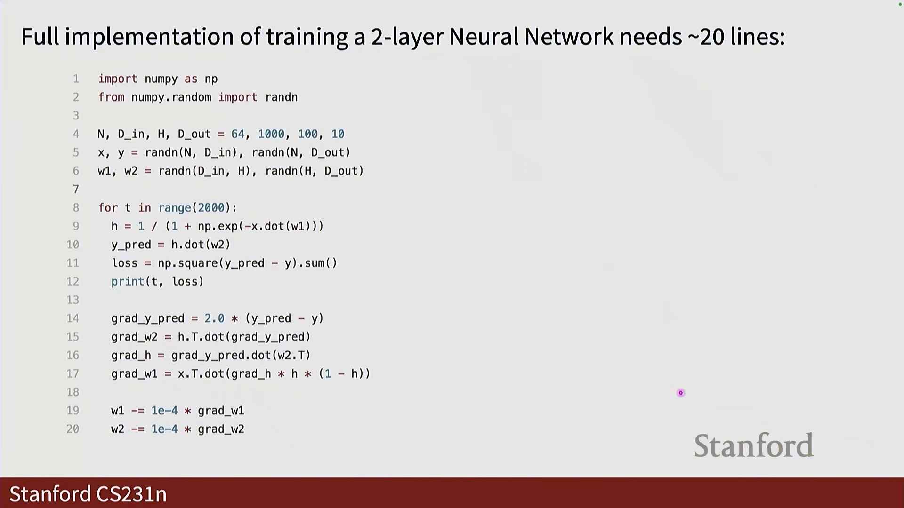

Continuing to what we were talking about, which is the implementation of these models, these neural networks. So there is a very simple way. I mean, building a neural network, a two-layer neural network, in Python is just less than 20 lines of code.

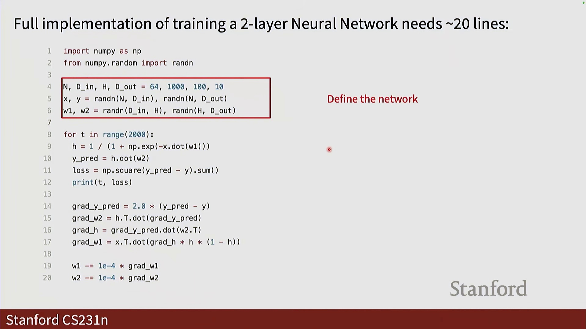

Very simple: define our network as—I talked about the dimensionalities. $N$ is the number of samples. $D_{in}$ is the dimensionality of the input. And $D_{out}$ is the dimensionality of the output.

Also, $h$, the number of neurons in the hidden layer. We created $X$ and $Y$ and randomly initialized $W$'s.

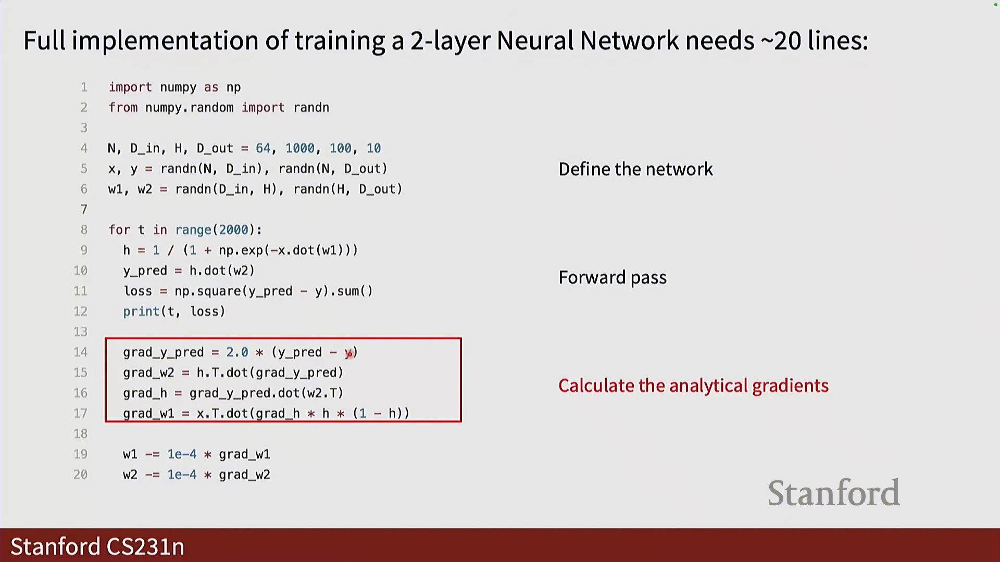

But this part, calculating the analytical gradient, is the most important part in here that we haven't very much gone into. Almost the rest of this lecture is about making this work and scale in different settings.

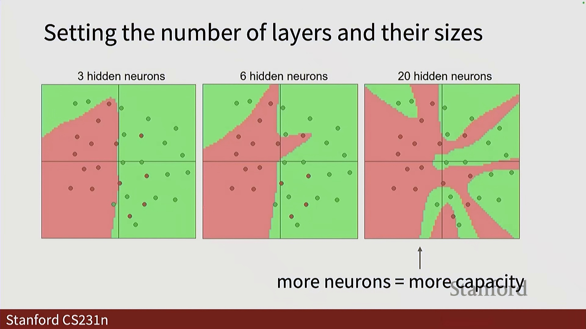

More neurons often means more capacity to learn more complex functions and better separation of the nodes, the points. If you take a look at this, this is very much similar to this. This pattern I'm showing here is similar to the one that I showed in the second lecture, where we are talking about $k$-nearest neighbor. When we had only $k$ equal to 1, the one nearest neighbor framework, it was very much similar to using more neurons.

So same type of arguments happen here that if we give a lot of capacity to the network, then we will have some overfitting problems. We won't be able to generalize to unseen data. But there are many different solutions for this as well.

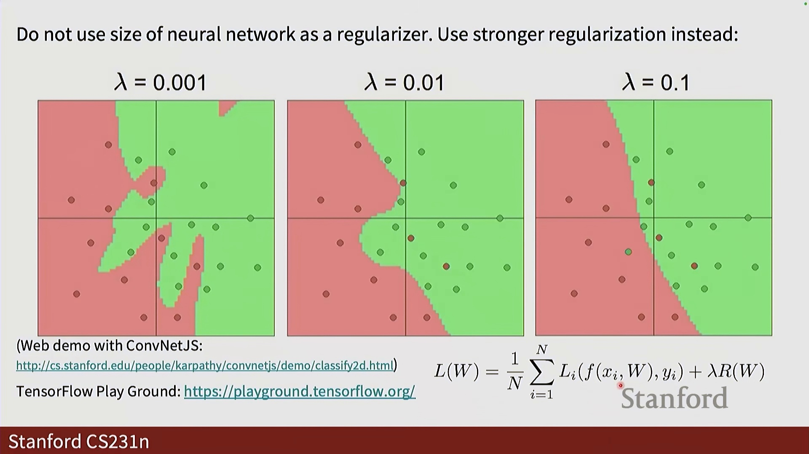

As a rule of thumb, what I want to highlight here for you is to not use the size of the neural network as a regularizer. We don't often use that as a hyperparameter to finetune this network size. Although we experiment with different values of the network size and related hyperparameters, what we often do is go with a little bit of a bigger network that we need.

Then we use the regularization, and this specific regularization hyperparameter, to check the different setups. So what we often tune is the regularization and regularization hyperparameter, and not necessarily the network size itself. OK, this is the concept of neural networks in a nutshell.

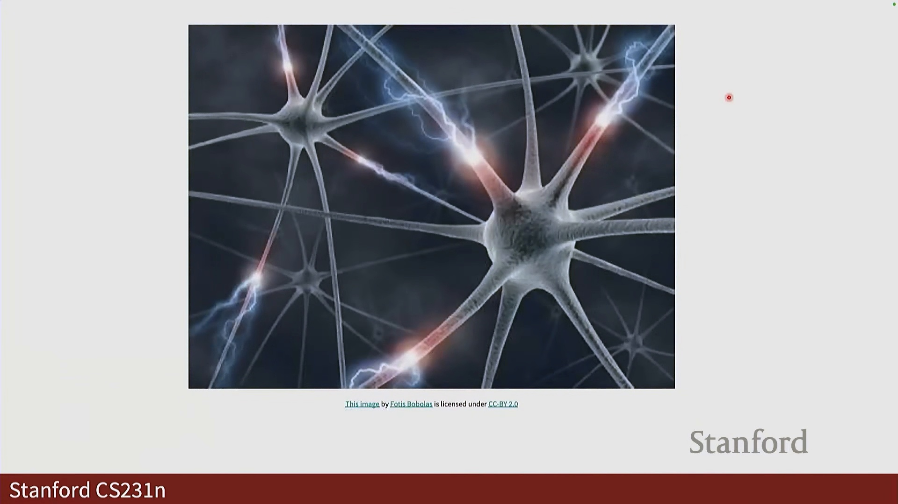

But we have heard about neural networks. And how they could be related to the biological—there are some biological inspirations.

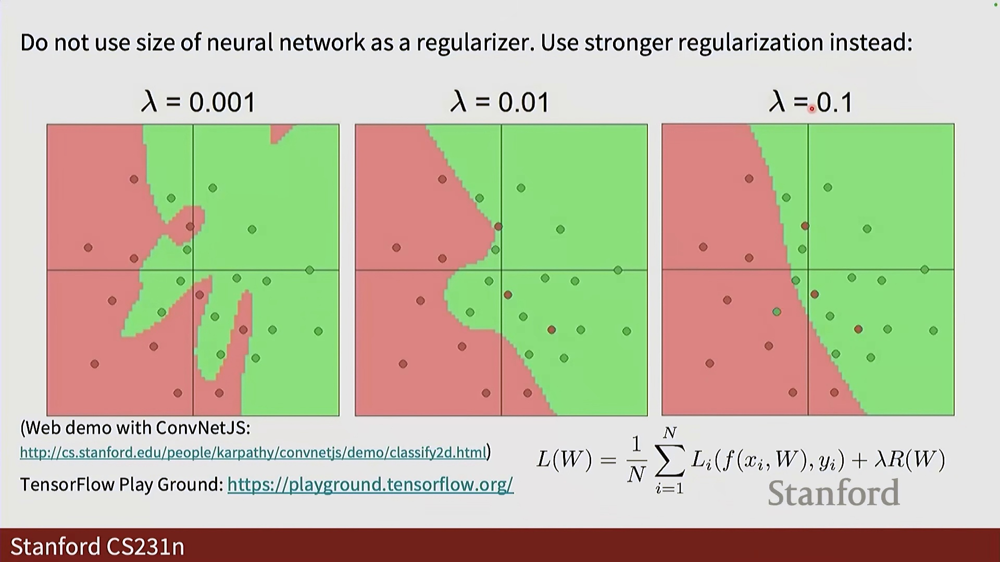

So I'll talk a little bit about it, but there is a question. Basically, your question is, why is the model more underfitting when we increase the value of $\lambda$ here? To quickly answer that question, the value of $\lambda$ is controlling how much contribution the regularizer should have in the overall loss. And the larger contribution that you have on the regularizer—and remember that regularizer was defined on $W$'s.

So it's constraining the $W$'s. It's giving you less freedom to the values on $W$'s. Less freedom equals a little bit more generic boundaries, not necessarily giving you those detailed values, or detailed parts of the boundaries. If you constrain the model too much, even with regularizer, you're also going to get decision boundaries like that.

The right regularizer always prevents overfitting. Again, you are creating a compromise, a balance between the loss, such as predicting the right output. So the first part of the loss is predicting the right output. The second part is playing with the values of the weights; it doesn't care about the outputs anymore.

If you overweight this, you're not going to get very good classifiers. Creating a balance means regularizer is always good, but nothing is good if you use too much of it. There are many different reasons why we would want to choose regularization over the size of the network. One of them is the size of the network itself.

When building networks, sometimes you have to run them for few days to get some results. What we often do is start increasing the number of parameters in networks until we see levels of overfitting. This means that the network is actually understanding the patterns in the data and is now able to memorize the data. At this point, we try to minimize the overfitting by regularizing the network.

So regularization plays an important factor there. If we go too high on the number of parameters or the complexity of the network, then that's going to be causing a problem. We often start with smaller networks for a new problem and increase that using the regularizer. For a given problem, how do we know how many neurons we need?

That's based on empirical research work and looking at other similar types. There is no one prescription for all. You have to look at other counterparts—other types of networks trained on similar data—and start from that range. Then, you often perform a number of experiments yourself to balance and increase or decrease the complexity of the network.

It's always bound to exploration. We are not going to get into them in detail because a big part of it is very much dependent on the data set and the problem you're solving. The best answer is yes, there are some works out there. But again, each of those makes assumptions that may not be necessarily true for your application or problem.

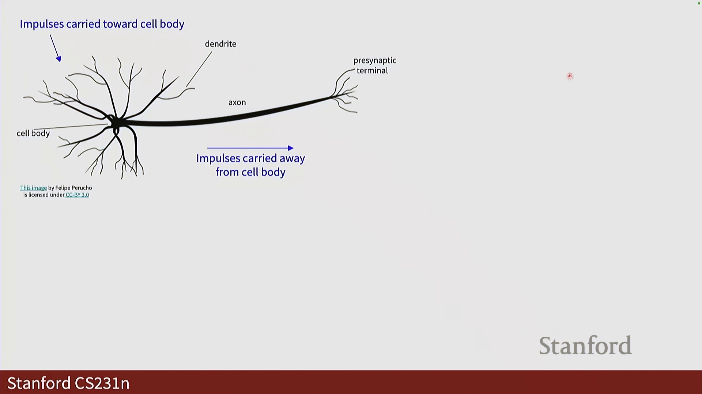

What happens is that there are some biological inspirations; again, these inspirations are very loose. If there is a neuroscientist sitting here, or is watching online, do not take all of the examples that I'm giving you, or talking about as the ground truth. And then using axons, those impulses are carried away to other neurons.

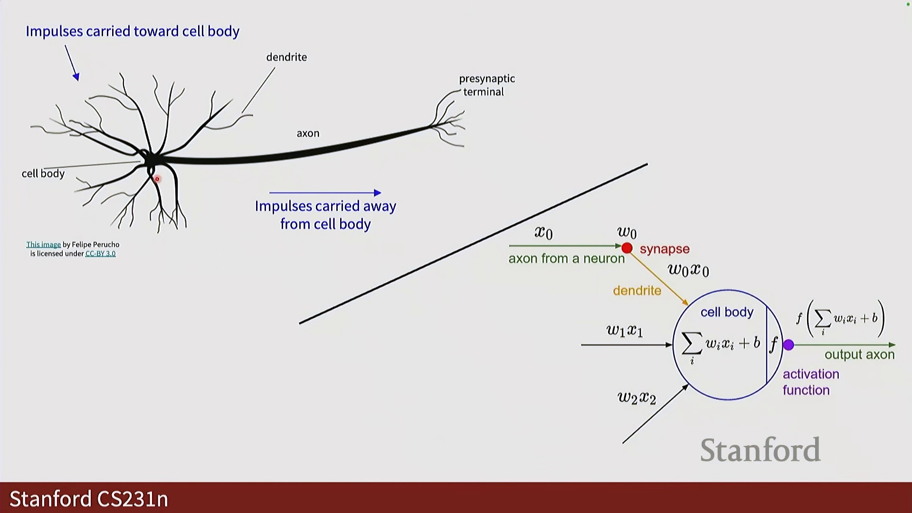

This is very much similar to what we are doing in our neural networks. We often have a function that captures the signals, all of the previous impulses, activations from the previous layers. In the cell body, that function is operated on the inputs and outputs the activations and passes them to the next layer, next neuron.

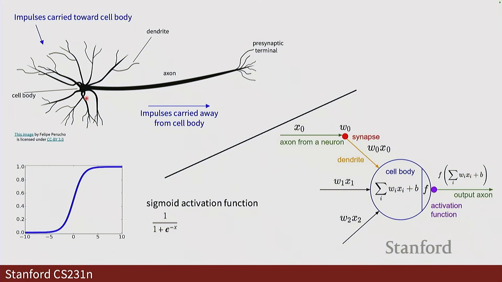

That's basically why we need some sort of activation function here to create the impulses to increase, or decrease the values.

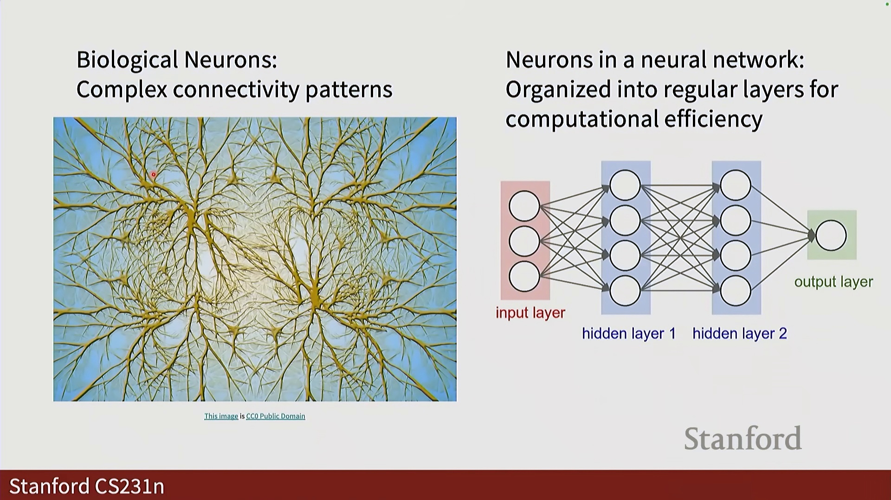

With that, there are many differences between biological neurons and how they could actually be very more complex than what neural networks we build look like. But generally, there are common concepts.

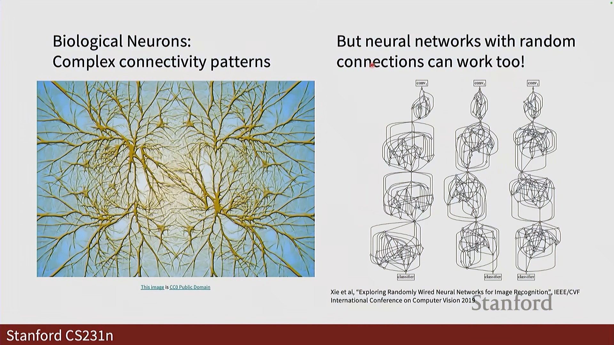

Often, the neural networks that we build are organized into regular patterns. These patterns exist because we want to have better computational efficiency when we implement the neural networks.

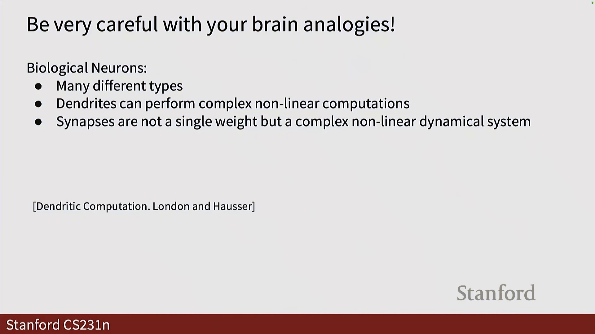

I can warn you enough on being careful with your brain analogies and how this could be interpreted, so there are so many differences.

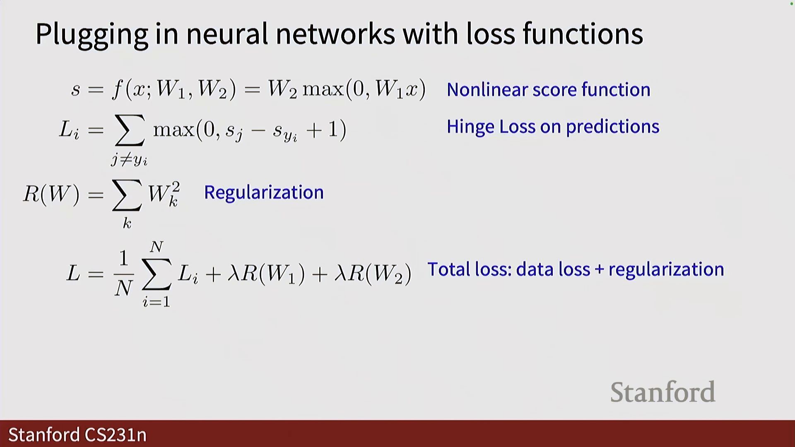

I'll just stop here, but I would be happy to discuss if anybody was interested in the neuroscience aspect of things as well. So plugging everything in, we did have a scoring function. This scoring function turns the inputs through some $\mathbf{W}$ weight vectors or weight matrices into scores. What we often use as the loss function for the network is using those scores either through hinge loss, or softmax, or other variations.

In addition to that, we defined regularizers, which ultimately give us the total loss of the data loss plus $\text{regularizer}$.

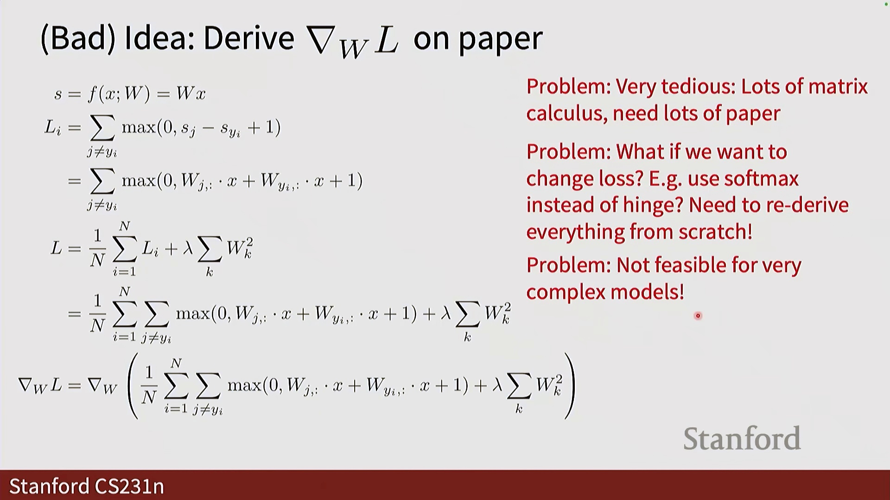

There are so many different details that we have to be aware of. First, building these functions and then taking the derivatives and writing them down is often tedious. There are lots of matrix calculations and need a lot of work on the paper before you can actually implement a neural network. The other challenge, the other problem is, what if you want to change the loss slightly different from what we have done in the paper?

All of the calculations over! In that case, again, we have to redo the entire thing. And finally, this becomes intractable and, sometimes, infeasible, if the loss function is complex.

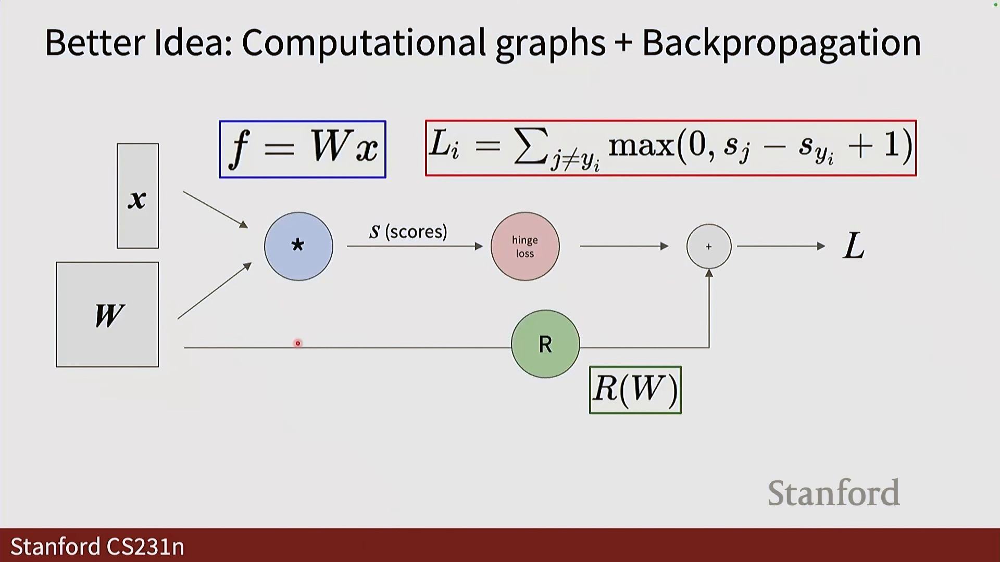

With complex functions, that's going to be even harder. But there is a better idea, something that is often used in our implementations. I'm going to go into a few examples today just to make sure everybody is on the same page and understands these topics: computational graphs and the idea of backpropagation. In this case, we had a loss function, which could be a $\text{Softmax}$ function or a hinge loss function.

Whatever it is, it's the loss function, which is added to the regularizer, the function $R(W)$. And $R$ has $W$ as its input. These two added together calculate, or create the overall loss. Before calculating the loss, we often also need to aggregate $x$ and $W$ and create the score.

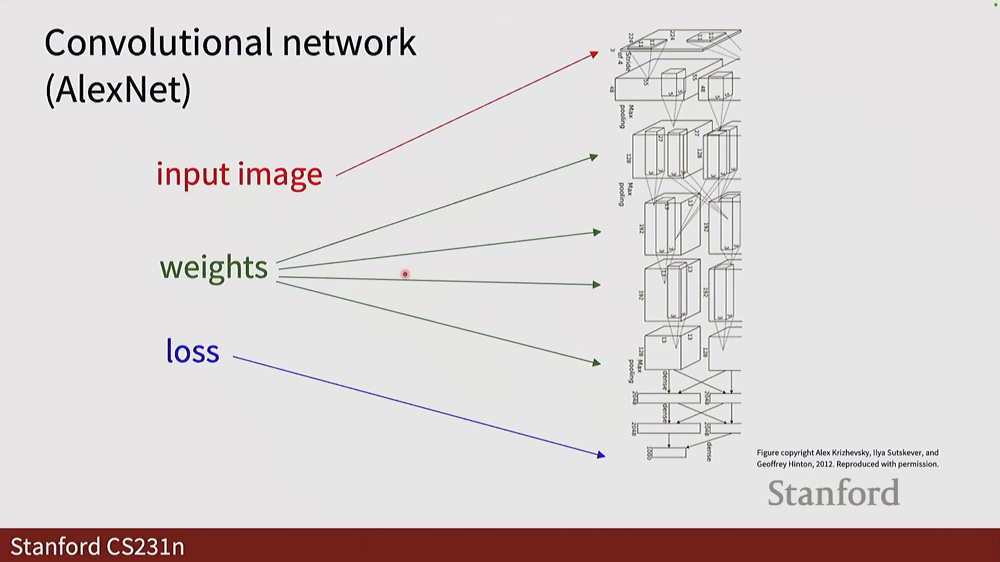

This is a multiplication function. We can use this framework to build their computation graph, starting from input image or input data. There are a bunch of weights throughout the network, and finally, there is the loss function.

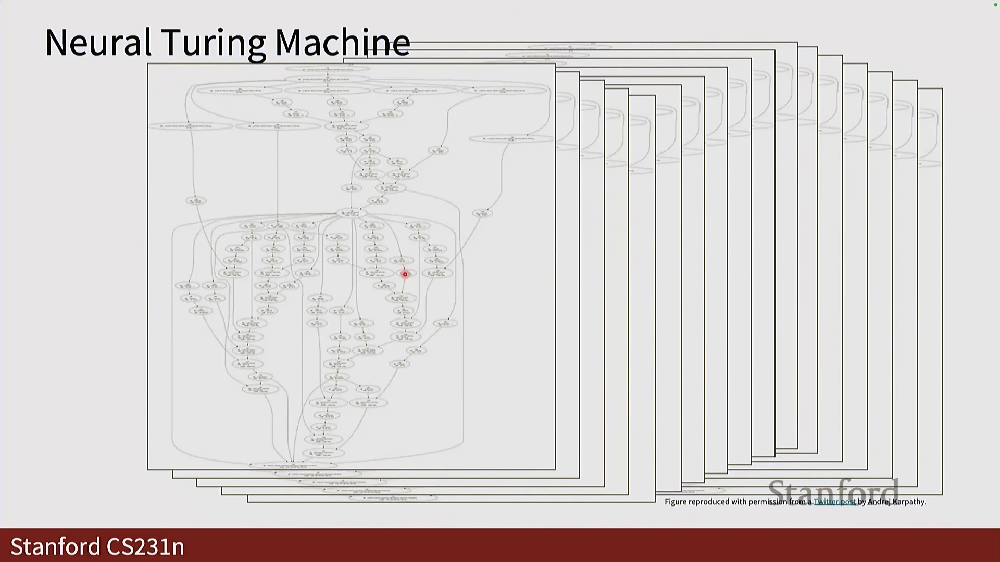

This is especially useful because there are some complex neural networks, like this Neural Turing Machine, which is actually used for temporal and sequential data. Because there is a lot of unrolling of this machine, if we have to do all of the work manually by hand, this is going to be intractable and not feasible.

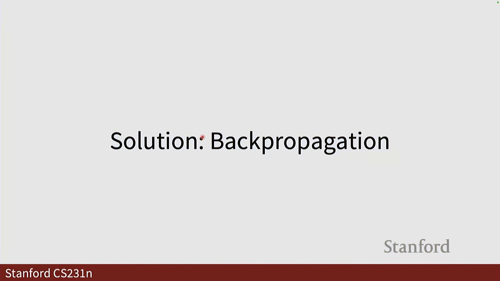

That's why when we build this computational graph, the solution is backpropagation.

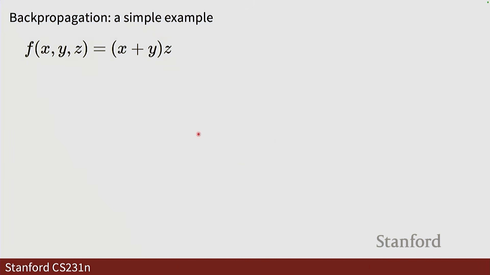

I want to start with a very simple example. We start with a function $f$ of $x$, $y$, and $z$, which is $x + y$ multiplied by $z$.

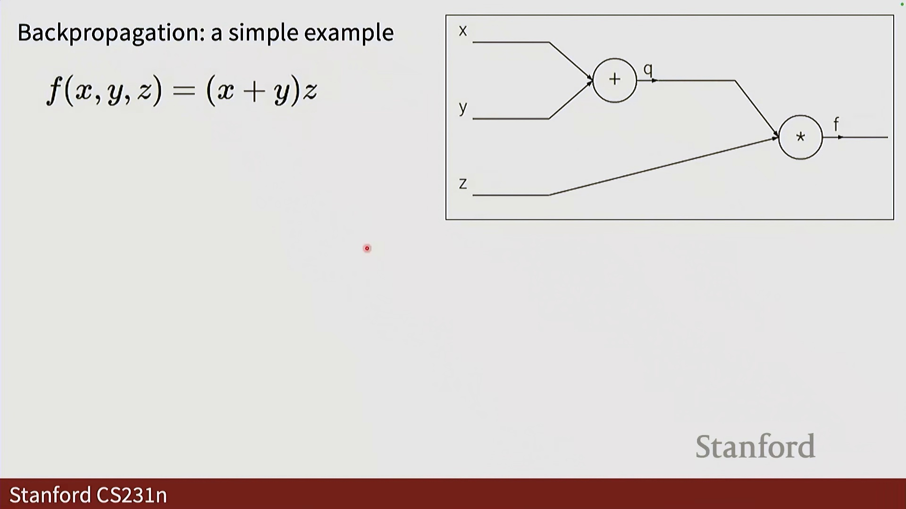

If I draw the computational graph for this function, you see we have an operation, which is the addition operation between $x$ and $y$. Then we have a multiplication between that addition of $x$ and $y$ and $z$.

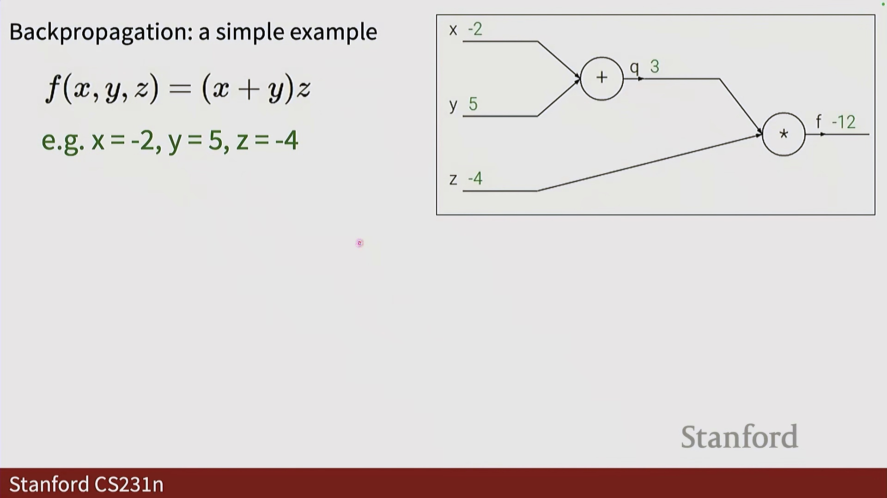

The first step is adding $x$ and $y$, which gives us $3$.

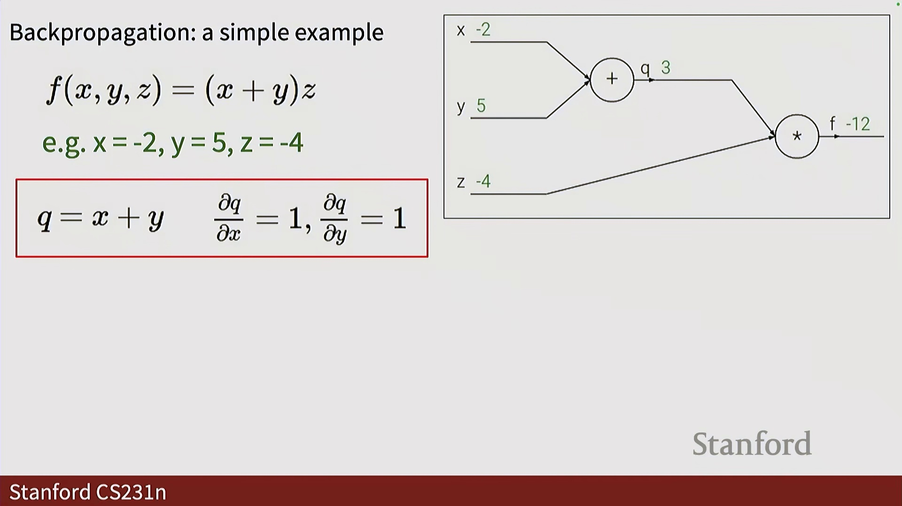

To understand the steps step-by-step, I'm giving a name to it: let $q = x + y$. If I want to calculate the partial derivatives of $q$ with respect to both $x$ and $y$, it is very simple because we have the formulation here between $q$, $x$, and $y$. The partial $\frac{\partial q}{\partial x}$ equals $1$ and $\frac{\partial q}{\partial y}$ equals $1$ as well.

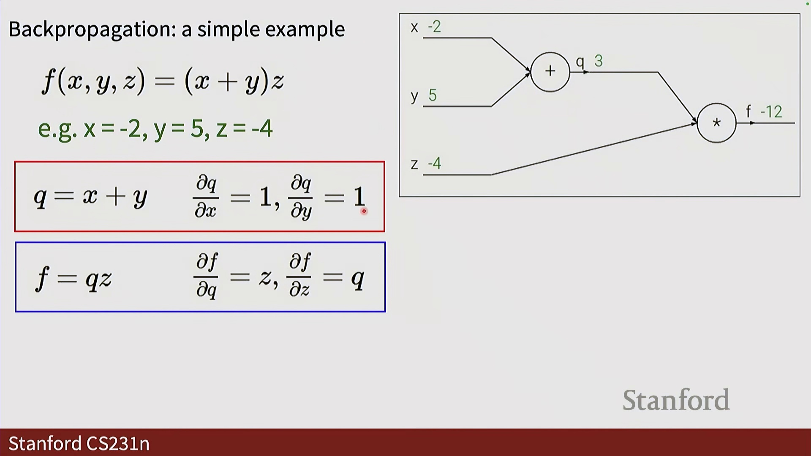

This is a simple setup; we know it exists, so just keep it in our minds. The second operation is $f = q \cdot z$. Again, since we have this function, it's very easy to write the partial derivatives. The partial $\frac{\partial f}{\partial q}$ equals $z$, and $\frac{\partial f}{\partial z}$ equals $q$.

It's a swap between $z$ and $q$. of these from linear algebra. So if you don't, you should definitely check it out and remind yourself because these are actually very important in general for the rest of the quarter.

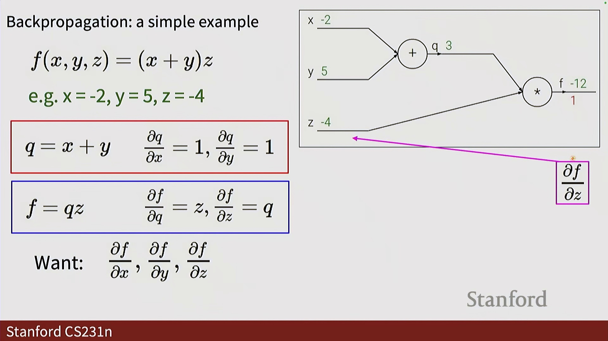

What we want and what we need in this setup, and to complete this example of backpropagation, we need the partial derivative of $f$ with respect to $x$, $y$, and $z$. How we start and how our backpropagation implements this is to start at the front of the net—at the end of the network. And we start going back, backpropagating all of the gradients. This is basically a recursive process that will be running.

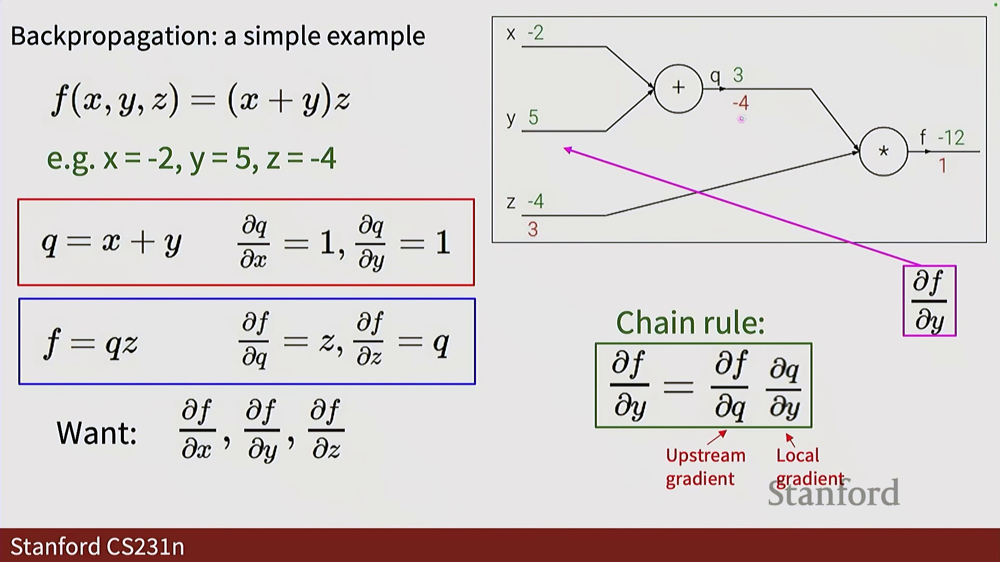

So $\frac{\partial f}{\partial f}$ is what? It's the thing with respect to itself. So it's always the last part: the derivative of loss function with respect to itself is always 1. If I want to backprop, the most immediate one is $z$.

You can see here that we have $z$. For this one, if I calculate the derivative of $f$ with respect to $z$, we already have it. $\frac{\partial f}{\partial z}$ is equal to $q$. So whatever the value of $q$ is goes to this as the gradient as well.

Next, we have $q$. $Q$ is the next one—our next one that is directly connected to $f$. So this is also easy to compute because we have $\frac{\partial f}{\partial q}$. We have also already calculated that it's equal to $z$.

Whatever $z$ is, that's the value of derivative here minus 4. Next, we have $y$, which is directly before $q$. And we know that $y$ and $f$, although we need $\frac{\partial f}{\partial y}$, $y$ and $f$ are not directly connected. That's where we use the chain rule, where we split the calculation of derivatives with respect to the variable in the middle.

So $\frac{\partial f}{\partial y}$ equals $\frac{\partial f}{\partial q} \cdot \frac{\partial q}{\partial y}$. This is how the chain rule could be written in this case. And now, I want to introduce you to two important new terms: local gradient and upstream gradient. Upstream gradient is often the gradient that comes from the end of the network to this current node that we are in.

The local gradient is the gradient of the nodes—what the input of the node is—with a gradient of its output with respect to its input. So defining these is actually not too hard because $\frac{\partial f}{\partial q}$, you already have the value; $\frac{\partial q}{\partial y}$, we also already have the value. So it's 1 multiplied by $z$, and the value will become minus 4.


Same story, and it's for the other variable, $x$. Here, the local gradient upstream could again be written down with this chain rule. And it also results in minus 4 and gives us—because in both cases, the gradient with respect to $x$ or $y$ was already 1. So both of them get the same value.


So with this computational setup and the computational graph, it becomes very easy to modularize what we want to do.


Which we can always—we have the function $f$. It's a function of $x$ and $y$. The gradient of output with respect to each of the inputs is easy to calculate for every single node.


What we need to be able to backpropagate is the upstream gradient, and the backpropagation process gives us the power to get this upstream gradient step-by-step.


We can multiply the upstream gradient with the local gradient to create what we call downstream gradients. The downstream gradients will then be the upstream gradients for the previous layers.


This is how we calculate it for $x$; the same story applies when it comes to $y$.


Again, this is one of the most fundamental operations in all neural networks and many optimization processes involving multiple layers of information. If I understand the question correctly, you are asking how we can understand intuitively what the gradients are doing. Let's take one step back and see why we are here to begin with. In order to do that, we need the gradient of $L$ loss with respect to everything.

If the network has 100 layers, we are not going to be writing the function for all of them separately. This is how we backpropagate step-by-step to get the values that we need for the optimization process of every single weight incorporated in the network.


Another example involves a more complex function: $f(x) = \frac{1}{1 + e^{\text{linear combination of } x \text{ and } w}}$.


This includes multiplications, additions, negations, and the $\exp$ function, and ultimately, $\frac{1}{\dots}$. With these components, let's look at this example with specific values for $W_0, x_0, W_1, x_1$, and $W_2$. With these given values, we can do the forward pass and calculate every single value in this process.


To remind you, for an $\exp$ function, $e^x$, its derivative with respect to $x$ is itself. Constant multiplication always has a derivative equal to the constant value.


For $\frac{1}{x}$, the derivative is $-\frac{1}{x^2}$. These are what we know from algebra. If it's a constant addition, the derivative is always equal to 1. As I said, at the very end of the network, the derivative of $L$ with respect to $L$ is always equal to 1.

This is where we start using this rule: $\frac{d}{dx} \left( \frac{1}{x} \right)$. We can calculate upstream; it's 1 always at the end. The local gradient could be $-\frac{1}{x^2}$, where $x$ is the input value whatever it is. This calculation results in $-0.53$, which is the downstream gradient.


which defines the upstream gradient for the next one.


And in the next, again, the function here is just the constant addition, where we know that the local gradient equals $1$. So $1$ multiplied by upstream gradient, same value, goes back.


And the next step is the $\exp$ function.


For that, again, the upstream, we already have the value. For the local gradient, it's $e$ to the power of $x$. What is $x$? The input of this step minus $1$.

Calculating this will give us $-0.2$, and this goes back to the next step.


And going back, now here, we have an addition function, where we are getting some data, some information—sorry, two inputs of different values here.


And again, if you want to calculate the upstream gradient, it's $0.2$, already we have it. The downstream, the local gradients will be equal to $1$ because it's just an addition between two values. An addition, the derivative of $x+y$ with respect to both $x$ and $y$ is always $1$.


So both inputs will be the same.


Then we have multiplication operations with multiplication upstream gradient. Again, we have the values and the local gradients with respect to a multiplication. If we always have, say, for example, $a$ multiplied by $x$, the derivative of this with respect to $x$ is always the other variable. So here, for the first one, it's $-1$, which is the value of $x$.

And for the second one, it's $2$, which is the value of $W$.


So the other variable, whatever the value it has.


With that, we can calculate everything and then also calculate the ones with respect to $W_1$ and $x_1$. Again, we made all of these calculations so we can identify how much $W$ should be changed in order to step towards the optimal point in the network.


So this was another example. There are so many different ways to draw a computational graph; this was not the only one that I explained. We can actually lump all of the functions together and define a sigmoid because this is basically a sigmoid of a linear function. The linear function could be here, and then all of these operations could be defined as sigmoid.

Actually, sigmoid is interesting and very useful to use because the local gradient using sigmoid is dependent on sigmoid itself.


The local gradient of sigmoid with respect to the variable $x$, if we do the calculations and simplify, it's $1 - \text{sigmoid} \times \text{sigmoid}$ of the same $x$.


It's actually a very useful framework, useful function, and easy. In order to calculate the downstream gradient, again what the upstream gradient was was value $1$.


I want to summarize and say that there are few patterns in the data, often very much in for the nodes that we can actually memorize.


For the multiplication gate, it's a swap function. Again, I told you, the gradient of $xy$ with respect to $x$ $\frac{\partial y}{\partial y}$ with respect to $x$.


So it's a swap. And then there is a copy gate. The operation that happens is just an addition of what is coming into the network to the node, or the gate.


And then ultimately, there is a max gate, which is actually something that we use quite often, very much similar to the ReLU function. That max gate has the gradient of—because it's taking a $\max$ between its inputs. So whichever the $\max$ value was, you just route the gradients towards that direction.


So with that, it's very simple to now implement a neural network: forward pass, compute all of the steps.


Then, in the backward pass, we start computing the gradients. In a step-by-step, I explained that the gradient of the loss function with respect to itself is always $1$. And then we start from the end of the network and go up. You can see here that we are going up.

So this is the sigmoid function calculating the gradients, then going up. That was the add gate. We had another add gate, and then we had two multiply gates, which basically gives us the implementations. So in this case, this is a multiplication gate—because for multiplication, we need to access the inputs for use in the backward pass.

We often save them, memorize them, but then calculate the forward pass values and then the backward pass, calculate the gradients. So this means we can write our functions and put the forward and backward passes all in.


And this is how PyTorch operators right now look. If you look at the sigmoid layer, for example, it's just the forward pass.


Although in this very function it's not implemented; it's somewhere else in the C++ code, in the C code, that it's actually implemented in PyTorch. But then the backward pass of sigmoid is also calculating the same function that we just talked about.


So far, what we've said—and I actually covered most of the examples that I wanted to cover using the scalar values. All of the examples were just scalar values.


But we know that all of these operations could actually be implemented in vector or matrix forms, just expanding on that piece here. We talked about this: with the scalar-to-scalar setting—so far, what we've talked about for any input $x$ and $y$ being scalars—the derivative will also be a scalar. Which means if we change $x$ by a small amount, how much the value of $y$ will change?


And then there are also vector-to-vector frameworks, where $x$ and $y$, both of them being vectors of arbitrary size. In those cases, the derivatives will form a matrix, or what we call Jacobians. For each of the elements in $x$, if it changes by a small amount, then this derivative tells us how much each element of $y$ will be changed. Again, look at the scripts here; they are not completely—

They're not the same; they could be different. For every single element in this Jacobian, there is a clear meaning.


Again, the loss derivative, $L$, or the loss itself, is always a scalar because that's always one value we want to minimize.


But then calculating the upstream gradient will result in also a vector $\mathbf{dz}$, same size as its variable $\mathbf{z}$.


The same story happens when it comes to downstream gradients.


In this case, that's the part that I said there will be Jacobians because now, the gradients will turn into matrices. We have two Jacobian matrices here defined by the size of their input multiplied by the size of the output. This results in downstream gradients that are a multiplication of upstream and the local gradient. We get the same size as the inputs $\mathbf{x}$ itself.

So we will have a vector again here because the input was a vector, same size in terms of the gradients. I just mentioned that gradients of variables with respect to loss always have the same dimensionality as the original variable itself, as also shown in this slide. So backprop with vectors was one example here. Let's say we have a function, which is $\max(0, x)$.

That's the ReLU function. This is an element-wise function that takes inputs, taking the max between 0. If it's non-negative, it passes through; otherwise, it replaces it with a 0. Assume you get some upstream gradients, and now we need to build a Jacobian matrix here.

Because this is an element-wise operation, this Jacobian matrix doesn't have any dependence on any of the other inputs; there are only dependencies on the value itself. This is a very sparse matrix, having values only on the main diagonal. Multiplying this by the upstream gradient gives us the downstream gradient. This is how the calculations are done.

The Jacobian here is sparse because in this case, the operation is element-wise. We don't really store that matrix and do not calculate it because we know how the function operates.


This could also be extended to matrices and even tensors. If the inputs are not vectors, they are high-dimensionality data.


In those cases, again, the gradients with respect to the variables would be of the same size as that specific variable. Calculating the upstream and downstream matrices and derivatives is going to be done the same way how we discussed and showed earlier for vectors.


The local gradients will be the same size as the multiplication of its input size and the output size, so it's going to be a huge matrix by itself.


Let me give you an example.


In order to simplify this, what we do is, we try to look at the values and how they impact each other. For example, what parts of $Y$ will be affected if one element of $X$ gets impacted? Specifically, $x_{n,d}$ often affects just one row in the output. You need to answer this question: How much does $x_{n,d}$ affect the value of $y_{n,m}$?


This means what should I place as its gradient with respect to the specific value $x_{n,d}$? Just to remind you, this is a multiplication operation. In multiply gates, it should be a swap. It's swapping the values, it's the same swap.

But here now, we have to look at the giant matrices and find which specific element it should be. Based on that, we can actually replace the entire thing with matrix multiplication and matrix operations. The gradient of $L$ with respect to $X$ will be defined as this simple matrix operation. The gradient of $L$ with respect to $W$ will be defined as this very simple multiplication.

Again, for $x$, we include the entire $W$. For $w$, we include the entire $x$ and do the multiplications. These formulas make it easy to implement larger and harder operations and get them implemented in the backward passes.


To summarize, we talked today about fully connected neural networks. We went through all the steps needed for backpropagation—the forward passes and backward passes.


In our next session, we will be getting into the topic of convolutional neural networks.

Thank you.
