# Stanford CS231N | Spring 2025 | Lecture 5: Image Classification with CNNs

Today we're going to be talking about image classification with CNNs. You might be wondering who I am; I'm a new face. You haven't seen me before in this class.

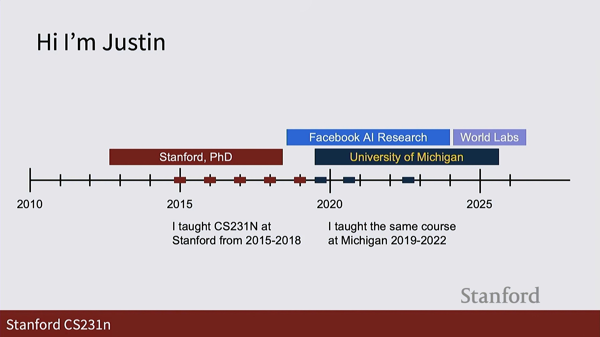

I'm Justin, I'm the fourth mystery instructor in this class. I think my picture's been on the website, but it's my first time here today. During my time here at Stanford, I was lucky enough to initiate CS231N with Andre and [INAUDIBLE] and others, and teach it quite a few times (2015, '16, '17, and '18 and '19). After that, I spent time at Facebook AI research doing all kinds of deep learning computer vision stuff there.

I was also a faculty member at the University of Michigan, where I taught basically the same class a couple more times. So I've taught this class a couple times, but it's been a while since I've been here. Most recently, I've been doing a startup called World Labs with [INAUDIBLE]. That's just a little bit about me.

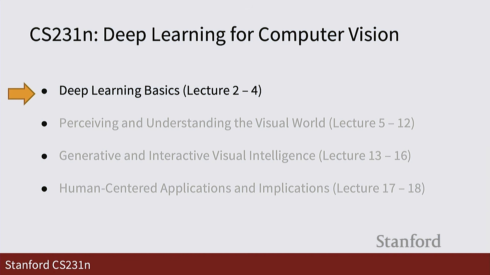

Now, about where we are on this class. We're at an interesting point in the class right now, where the class is divided up into these couple of different segments. We've basically finished the first segment. The first segment was basically around deep learning basics.

This is really cool because all the stuff that you've seen in four lectures are basically all the fundamentals of deep learning. You basically know this whole pipeline: what are the basic pieces that go into building a deep learning system? I thought it would be useful here, at the beginning of this inflection point, to just step back and recap some of the major themes that we've seen in the first bit of the course.

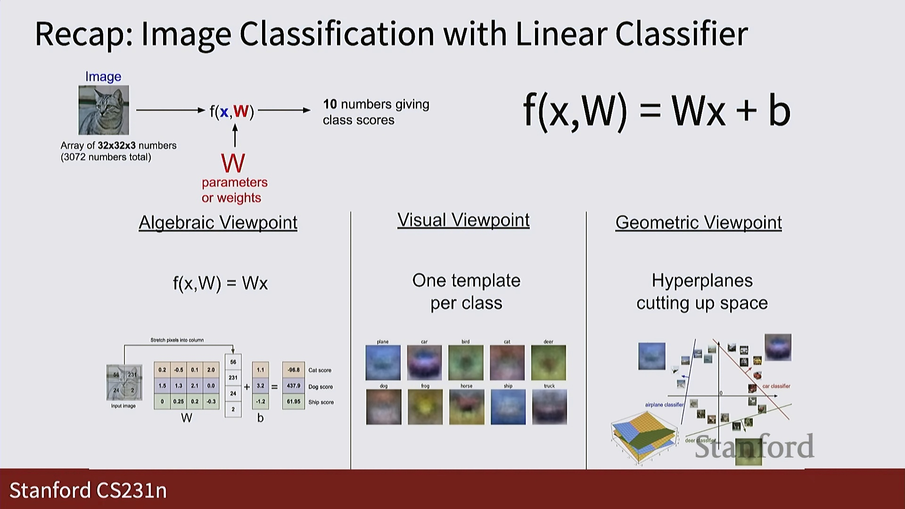

The first is this idea of image classification with linear classifiers. This was meant as a toy problem to give you a sense of a problem you might solve with deep learning. We do that in the image classification setting by saying that we want to classify images into a bunch of human understandable categories. The inputs are going to be these grids of pixel values, which are arranged in three-dimensional tensors.

We can set up a problem using a weight matrix $\mathbf{W}$, multiply that against the image pixels, and predict these scores. We saw that there are a couple of different viewpoints, a couple of different ways that we can interpret these linear classifiers. This basically sets up a functional form saying that we can predict scores for images if only we have a weight matrix $W$.

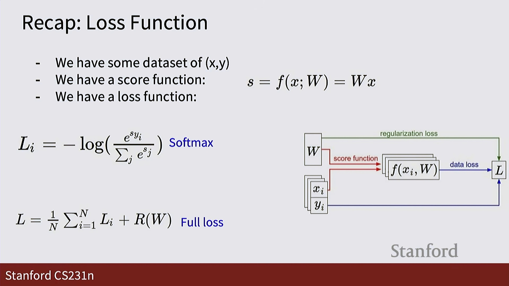

Then the question is, how do we select a good weight matrix $\mathbf{W}$? For that, we go to loss functions. In particular, we saw some examples of loss functions that are commonly used for classification problems, including the softmax loss and probably the SVM loss as well. Now, we've gotten a little bit farther along in our problem.

We've set up the problem of image classification. We have a model for solving that problem using linear classifiers. We have a way to tell if our solutions are good using a loss function, but now we actually need to search for a good solution in that space.

And that's where optimization comes in.

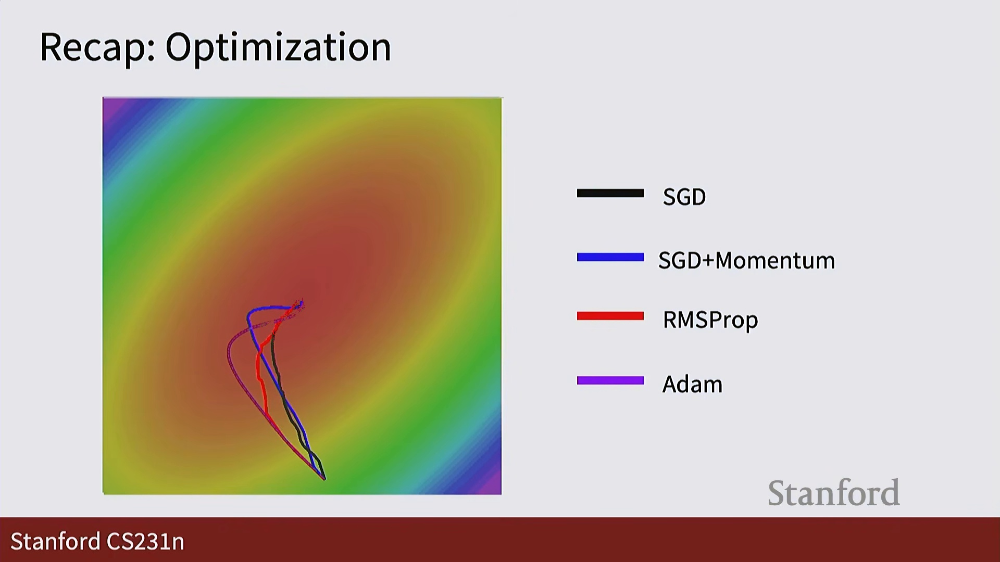

Think of defining this optimization landscape, where on the $x$-axis or on the horizontal plane are all the different possible settings of your weight matrix. The loss function is basically the height of this plane, where a high loss function is bad because losing things is bad; so you want low loss. The purpose of optimization is to somehow traverse this space, slide down this manifold, and find a point at the bottom of very low loss.

Each point in this space corresponds to a weight matrix. By sliding down that space, we're going to find a good weight matrix that solves our problem and gives us a good solution to our task.

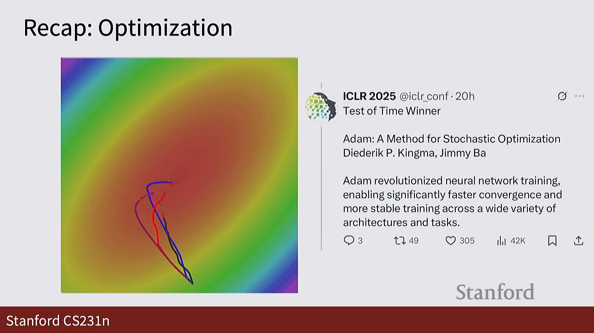

One interesting topical note is that right now, one of the biggest deep learning research conferences is ICLR, International Conference on Learning Representations.

So I thought that was pretty cool, a nice way to connect what you've been learning. Stuff that's happening right now in the machine learning community. So then now we basically—at this point we've got our linear classifiers. We've got our loss functions.

We can optimize them.

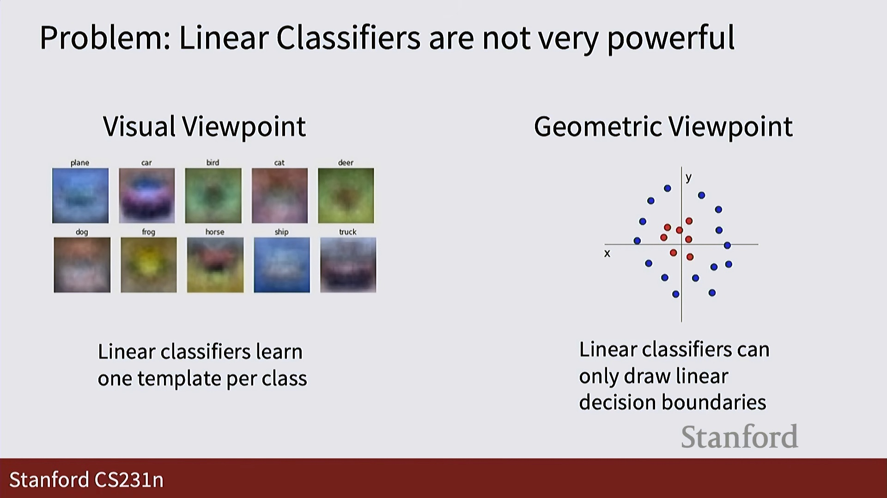

Now, we're almost good to go. But we ran into a problem: is that the linear classifiers that we started with are actually not very powerful. We saw two different ways of attacking this deficiency in linear classifiers. And if you think about it that way, we realize that the weights of your linear classifier, each row of that weight matrix is one template.

So the linear classifier basically needs to summarize all of its knowledge about each category into just one template. That's a difficult—that's just not a very powerful classifier. But cars don't have to be red, right? What if your car was blue or purple or green or something else?

There's just no good way for a linear classifier to capture this notion of there might be different appearances for an object for each category. That's really good if all your categories actually do lie in linearly separable regions of your space, but there's no reason to expect that to be true in general. These are both two big deficiencies that we ran into when looking at these linear classifiers as applied to image classification problems.

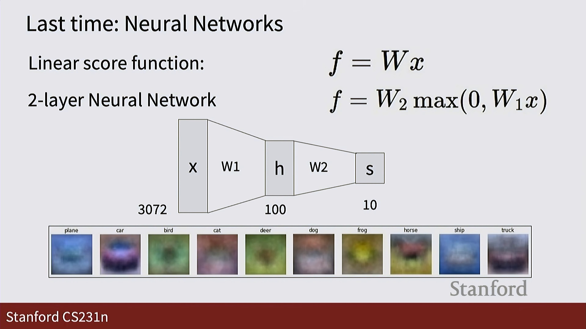

This gives us a much more powerful mechanism for predicting scores from our inputs. Now, basically the problem is still the same: we have our input pixels going through this computation, spitting out scores. But now, rather than computing what we just, basically selected a different functional form for this score function. And this gave us—and now the algebra is pretty simple.

You just need to go from $f = Wx$. You add an extra $W_2$, add a little non-linearity in between. So the algebra doesn't change very much, but in doing so, your classifiers get much, much more powerful than they were before. But now things get a little bit complicated again because how does this play into optimization?

We know that if we have a loss function and we have a model, then we want to find values of those weight matrix that cause the loss to go down. To do that, we need to compute gradients.

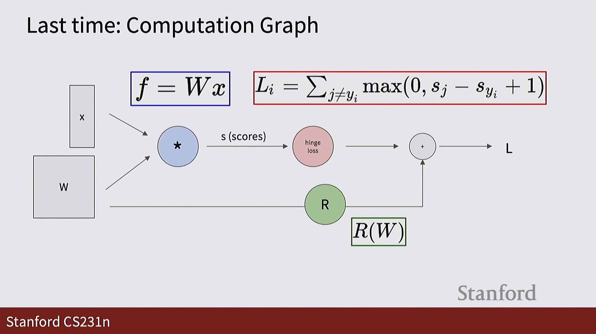

We need to be able to compute gradients of the loss with respect to all the parameters of our model. That's this notion of a computational graph. But we now have an almost automated algorithm for computing whatever gradients we want through arbitrarily complex neural networks.

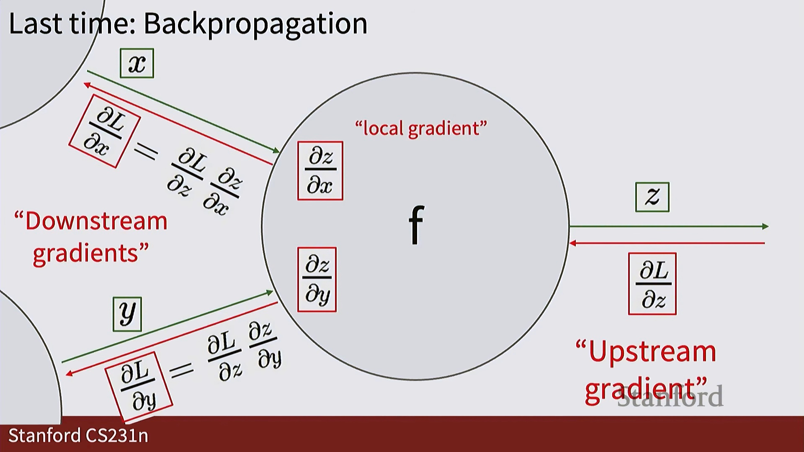

The way that we do that is this magic of backpropagation. Now each of these nodes doesn't need to know anything about the larger context of what is the graph I'm living in, or what is the problem I'm trying to solve. It doesn't have to care where those gradients come from or what was causing those gradients to happen. I just need to compute gradients—downstream gradients with respect to my inputs given my upstream gradients.

And the gradients just come for free when we turn the crank on the backpropagation algorithm.

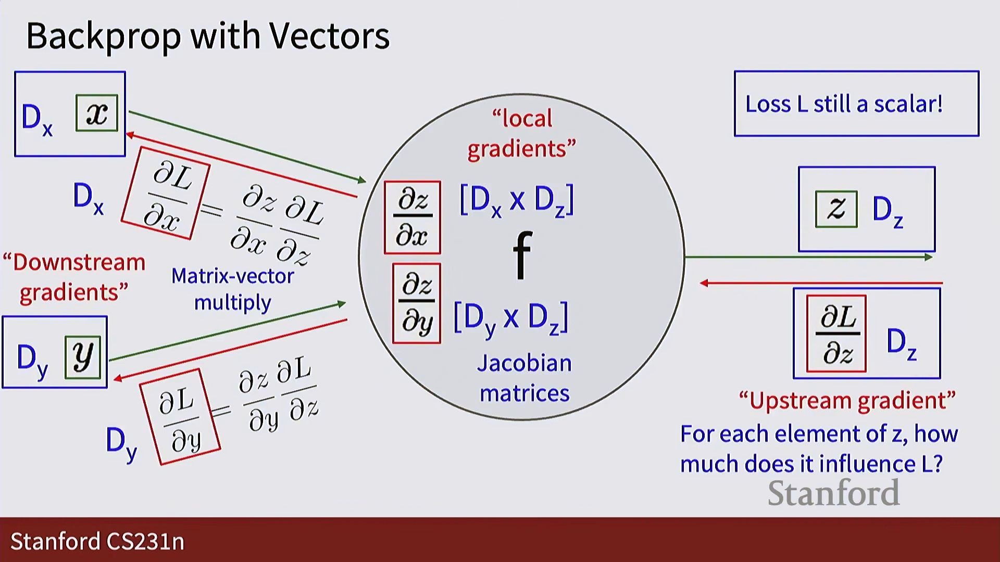

The slide that you guys saw last time is basically backpropagation on scalar values.

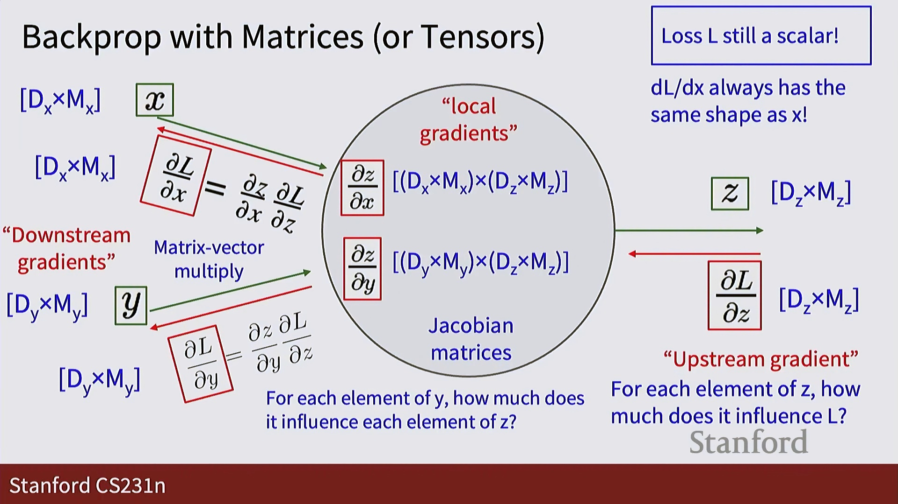

But we can generalize this to work on vector-valued—on vector-valued or matrix or tensor-valued values as well. The basic thing to remember is that your inputs are some tensors, and your outputs are some tensors. Now, your upstream gradient that you get is the gradient of the loss with respect to your outputs. And that always has the same shape as your outputs.

And because the loss is a scalar, we just need to wiggle each of those—we just need to imagine wiggling each element in our tensor independently. That is the definition of our gradient. So then that's very easy to remember: your upstream gradients always have the exact same shape as your outputs. Your downstream gradients, those are the gradients with respect to my inputs.

Those also have the same shape as my inputs. You'll get some practice on later assignments computing writing down the gradient expressions for different kinds of operators in your neural networks.

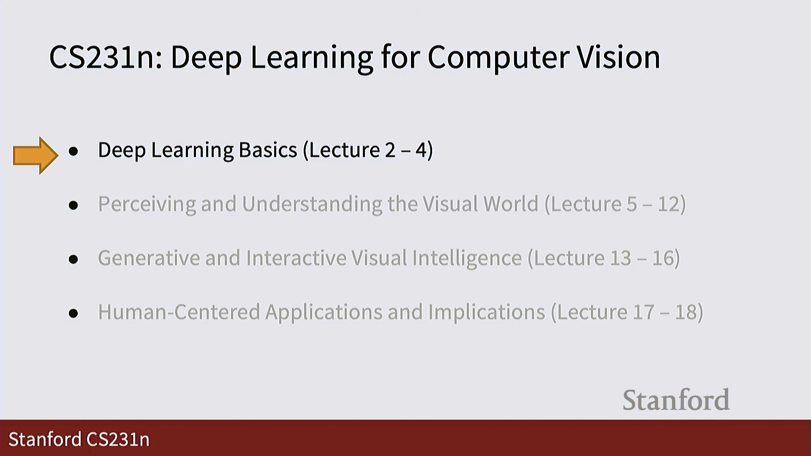

So basically, this gives us our recipe for solving pretty much any problem in deep learning. This was intended to be quite a bit more general than just image classification or just linear classifiers or just fully connected networks. And then optimize that loss function using gradient descent using backpropagation.

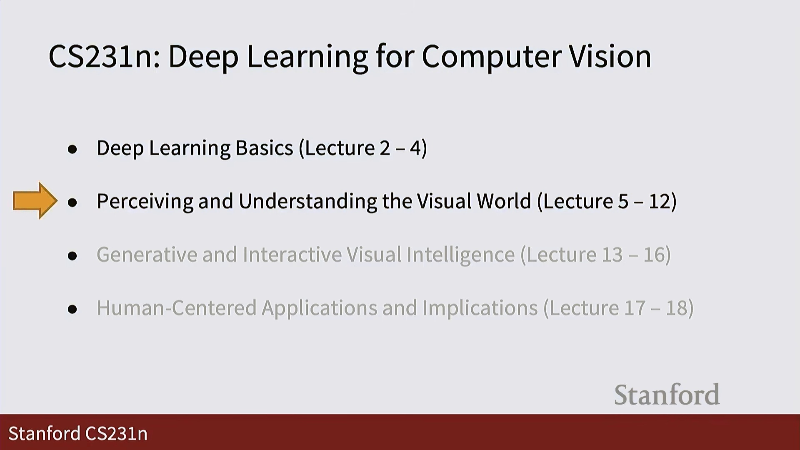

So that leads us to the second part of the class, which is perceiving and understanding the visual world. Processing images, doing interesting stuff with images.

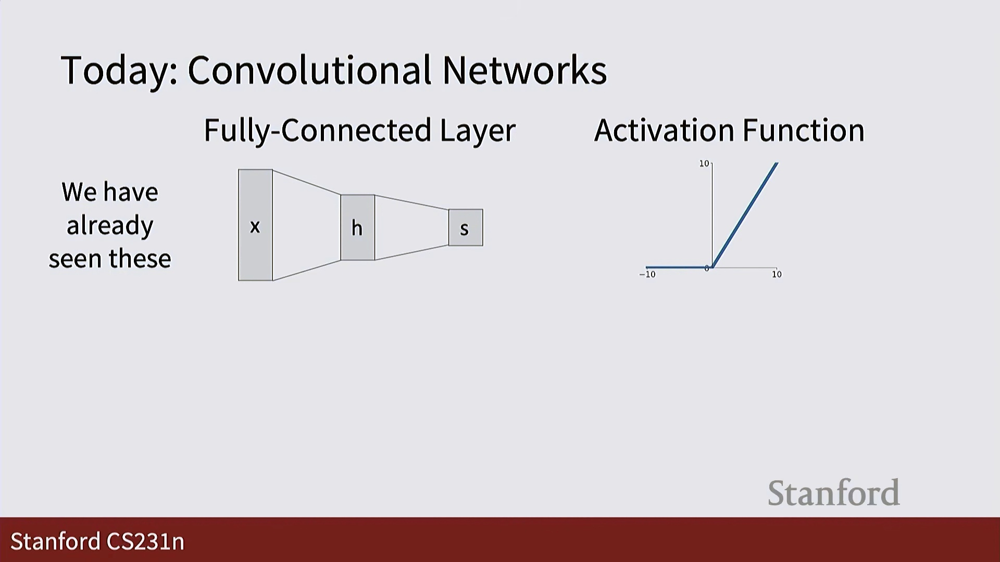

And today, we'll take a step towards that by talking about a bit more about convolutional networks. Convolutional networks actually are a pretty small lift on top of this framework that we've already defined. We've already talked about two. You have this general paradigm of computational graphs of little operators that can live inside of our computational graphs.

So we have this beautiful framework, but we actually haven't filled in a lot of the specifics of that framework. We've actually only seen two or three different kinds of nodes that can live inside of our computational graphs. We've seen fully connected layers, which is basically a matrix multiply. We've seen activation functions like our $\text{ReLU}$, and we've seen our loss functions themselves.

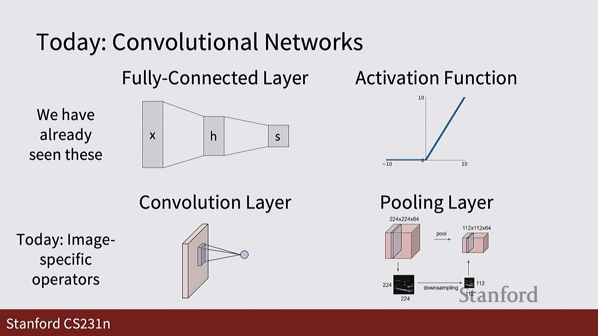

That's the roadmap for today. I want to talk a little bit about convolutional networks in general. Then we'll talk about these two particular computational primitives that we can use to build convolutional networks in our computational graphs.

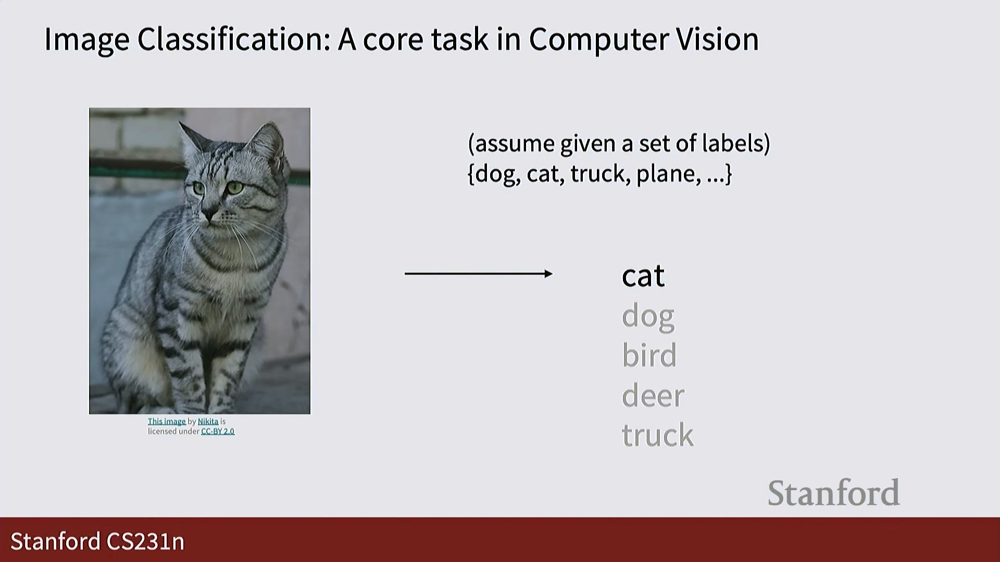

We want to step back a little bit and think about this problem of image classification again.

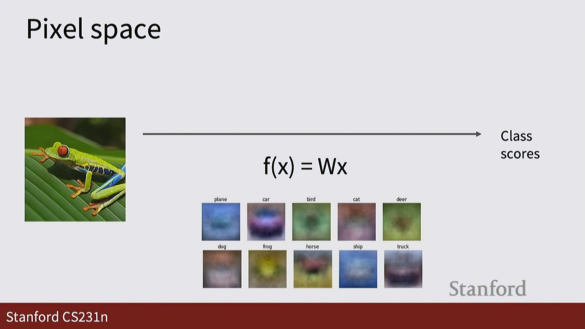

This image obviously is a cat. We want to predict the cat classifier. And most of—and we basically solved this problem in some sense already by building linear classifiers and by building fully connected multi-layer perceptron neural networks. But these networks are basically operating in pixel space.

Their inputs, remember we said the first way to—the first step to solving a deep learning problem is to formulate it in terms of input-output tensors. In this case, our input tensors were the raw pixel values of our images. When we write $f(\mathbf{x}) = \mathbf{W}\mathbf{x} + \mathbf{b}$, $\mathbf{x}$ input—that's just the literal values of all of our pixels.

And then we go from those raw pixel values to our class scores.

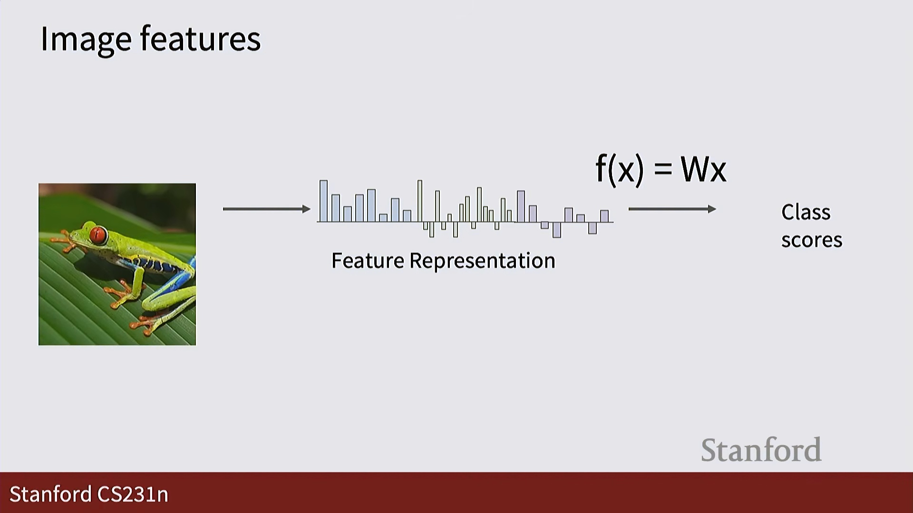

But there's another way to do it, which was common back in the dark ages before neural networks came about and saved us from all this $\text{TDM}$. Maybe back in the early 2000, up until maybe 2010, 2011-ish, was this idea of feature representations. So here, the idea is you can actually choose what is going to be your input to your neural network.

You could have said that rather than feeding the raw pixel values of the image into our neural network, Now that feature representation will now be the $\mathbf{x}$ that feeds into your linear classifier. There was a ton of work in computer vision, really in the 2000s to the late 2010s or early 2010-ish, that used this idea of feature representations for all kinds of tasks.

One example of a feature representation that people sometimes used is this notion of a color histogram.

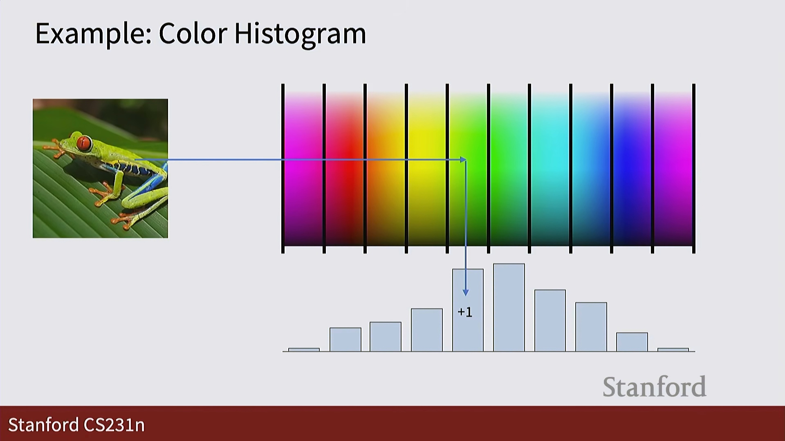

To build such a feature representation, what we might do is take the space of all possible colors and discretize that space into some set of buckets. For every pixel in our image, we map that pixel to one of the discrete buckets in our color space. Our feature representation then becomes something like a count of how many pixels in the image fall into this specific color bucket.

This is an interesting representation because it destroys all the spatial structure of the image and only talks about the color distributions. Another category of feature representations that people used to look at is the dual to that: these are histograms of oriented gradients.

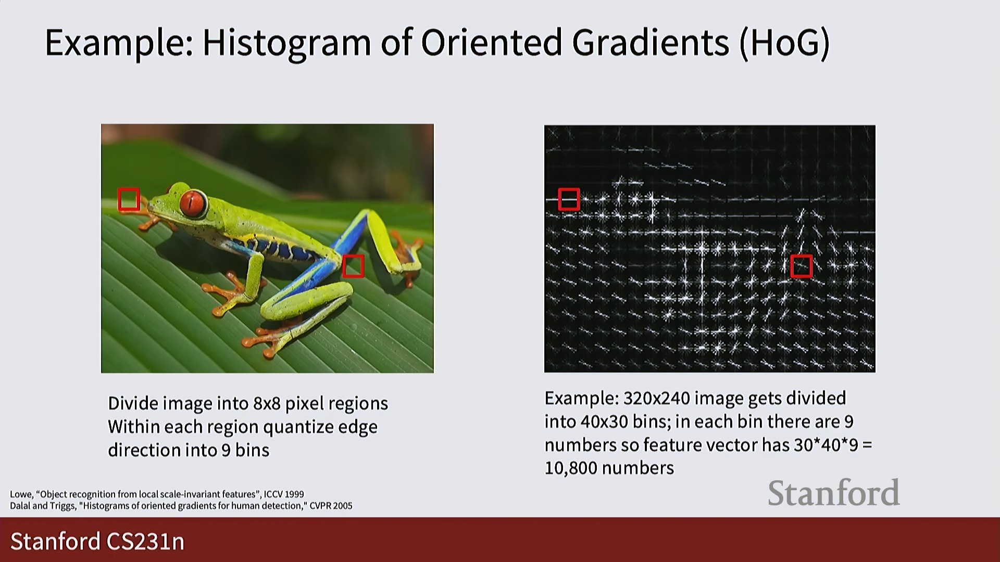

They basically want to look for every point in the image what direction—what is the local direction of the edges in the image around that local region.

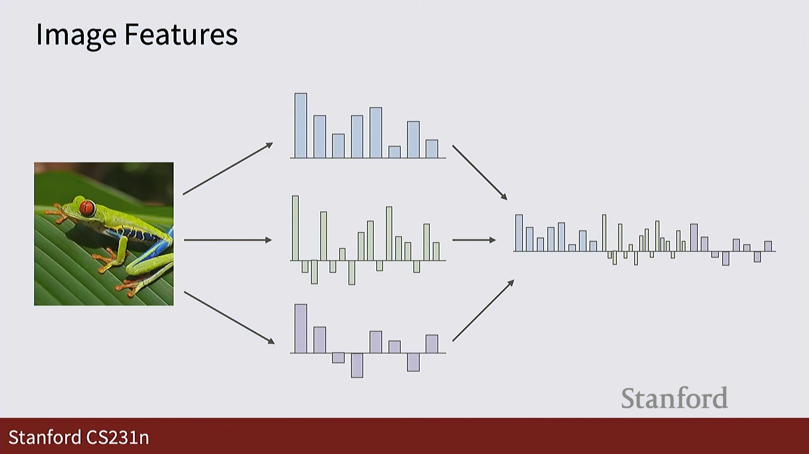

People would often wonder what the best feature representation was, and the usual answer was just stack them all together. This becomes your feature representation for your image.

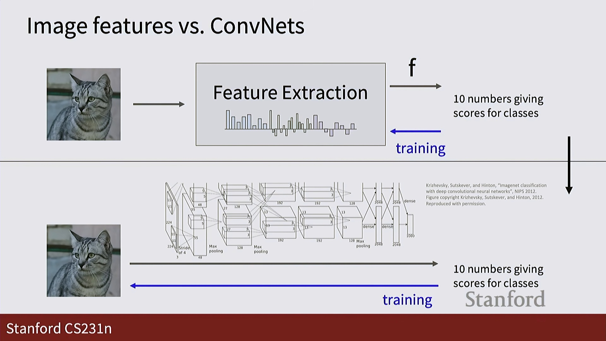

Once we have this feature representation, we can basically stick whatever classifier we want on top of it. It is interesting to take a step back and contrast that picture—that viewpoint of the whole system. System A thinks about "feature extractor plus learned network," or a learned linear classifier on top of your features. System B is end-to-end neural networks, and they actually don't look that different.

The difference is which part of the system is designed by humans versus which part is learned via gradient descent. The intuition of these neural network classifiers is they're still ultimately going to be a system that inputs the raw pixel values and spits out your classification. scores at the end. So the intuition is that there might be some bottlenecks in this feature extraction paradigm.

You as a human might get something wrong. This paradigm has basically won over the past decade and a half for lots and lots of problems repeatedly. So that gives an intuition of what we should ask: For the particular problem of images, how should we design these end-to-end systems? It's not going to be a fully connected network all the way; that would be a little bit silly.

We do need to still put a little bit of design into the system. There's some flexibility in that system because you are leaving the weights of the system free to be learned from data. But the role of the human designer still matters. So there still is a lot of role for the human to design parts of the problem in this deep learning era, but what you are designing is a little bit different.

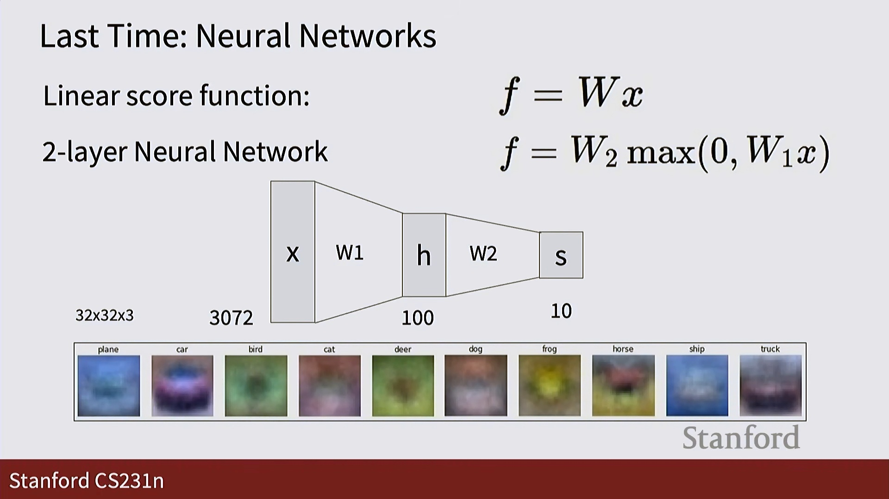

This is basically where we start to see the deficiencies in the tools that we have so far for solving this problem. Because we've seen linear layers; we've seen fully connected networks.

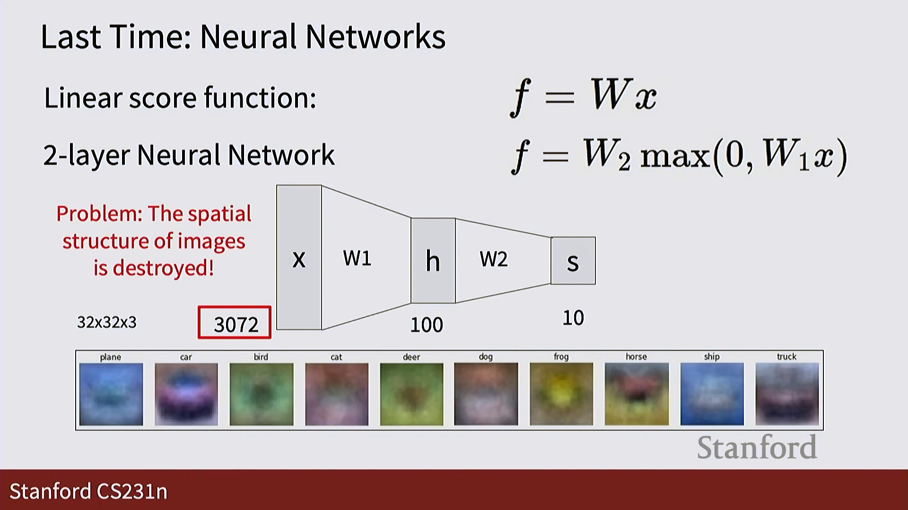

One big problem with that is that it destroys the spatial structure of the images. Images are actually not one-dimensional objects; images are two-dimensional. They have two-dimensional structure, and that two-dimensional structure matters for the content of those images.

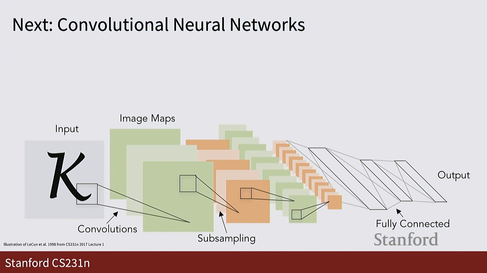

And that leads us to convolutional networks. They input raw pixel values and then output some prediction or scores for our images.

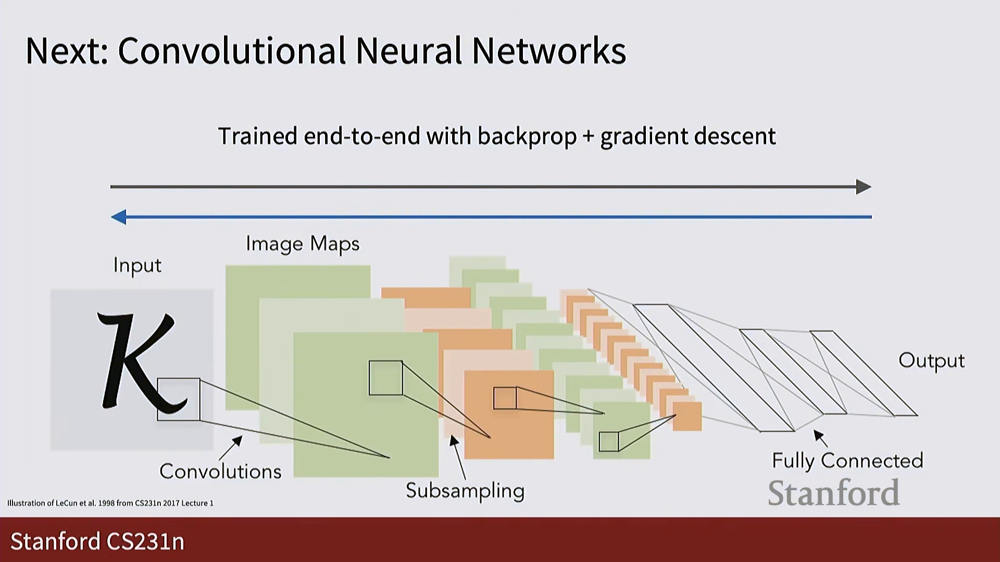

But crucially, this whole system is tuned end to end via gradient descent by minimizing the loss on your training data set.

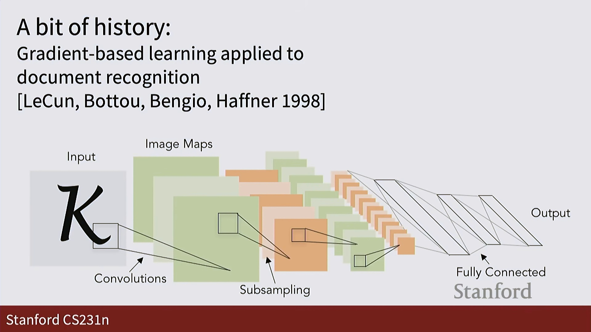

And these networks actually have quite a bit of long history. It worked pretty well, but it was really expensive. They didn't have GPUs; they didn't have TPUs; they didn't have the compute resources that we do today. But the underlying algorithm and the underlying network architecture basically looks pretty similar in 1998 to what things were—to the architectures that people were using well into the 2010s.

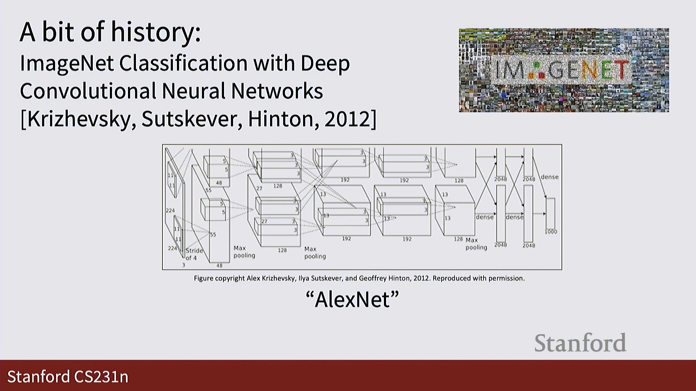

Zooming forward from 1998 up until 2012, that's when the AlexNet architecture came out. This was a big boom—a giant explosion of deep learning, especially in computer vision. It's bigger, there are more layers. The layers have more units in them, but it's still trained end-to-end with backpropagation to minimize some fairly simple loss functions.

But here, like AlexNet, was when really things started to take off. And at this time, they were able to train on GPUs because GPUs were available. There was also more data available due to the internet and ImageNet. So AlexNet is when things really started to take off.

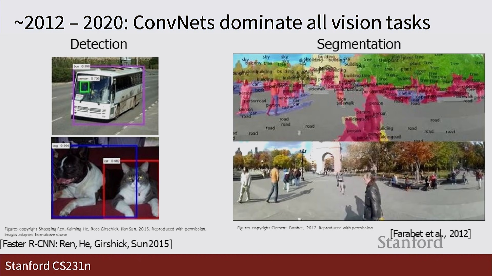

Then the era from, I think, about 2012 to around 2020-ish was an era where convolutional networks were basically dominating almost every problem in computer vision. They solved practically anything—any problem that you wanted to do with an image. In that era, it was almost certainly going to be a ConvNet that had the best performance on that problem.

Segmentation is the task of assigning labels not at the box level or the image level, but instead assigning labels at the pixel level. So now we want to assign a category label to every pixel independently in our image.

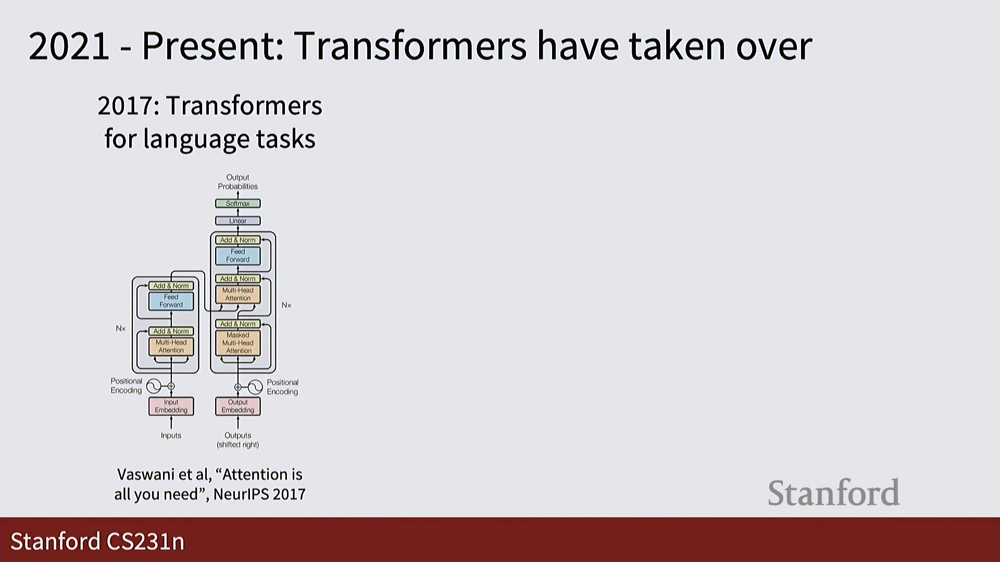

We'll talk more about architectures for these problems in future lectures, but they can be solved very effectively using convolutional networks. People used ConvNets for other problems involving language as well. For example, the task of image captioning, where we want to predict a natural language caption from an image. Some of the first widely successful approaches to this problem were also built on convolutional networks.

This even extends to more recent tasks of generative modeling. Captioning is basically the problem of image to text, where we input an image and then want to output a natural language sentence describing the image. Some of the first widely successful versions of this problem were also built on convolutional networks. This particular figure is from the Stable Diffusion paper that came out back in 2021, and this technology has gotten a lot better in the last couple of years.

Computer vision was basically the biggest field benefiting from deep learning at that time. Setting out to teach a class about deep learning, it made a lot of sense to focus entirely on the problem of convolutional networks for image problems. That's basically the inception of this class 10 years ago. But the field has actually evolved a lot since then; convolutional networks have actually been replaced.

Visual recognition—there are a lot of other interesting problems that we can solve now. You'll notice that the name of the class changed at some point along the way and no longer focuses so specifically on "neural" or "convolutional networks." The reason for that is that I said this was the era from 2012 to 2020. You might be wondering what happened in 2020 other than COVID that could have displaced convolutional networks.

It wasn't COVID, it was transformers. Transformers are an alternate neural network architecture that we'll talk about in a couple more lectures. Basically, they started off in natural language processing for processing documents, for processing text strings. The transformer architecture got first published in 2017.

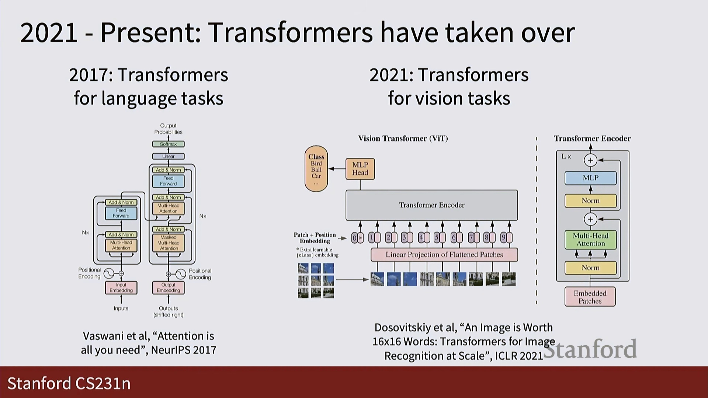

They scale up to more data; they scale up to more compute. We can get more data, we can get more compute. So, these are much more commonly used for more and more computer vision problems these days.

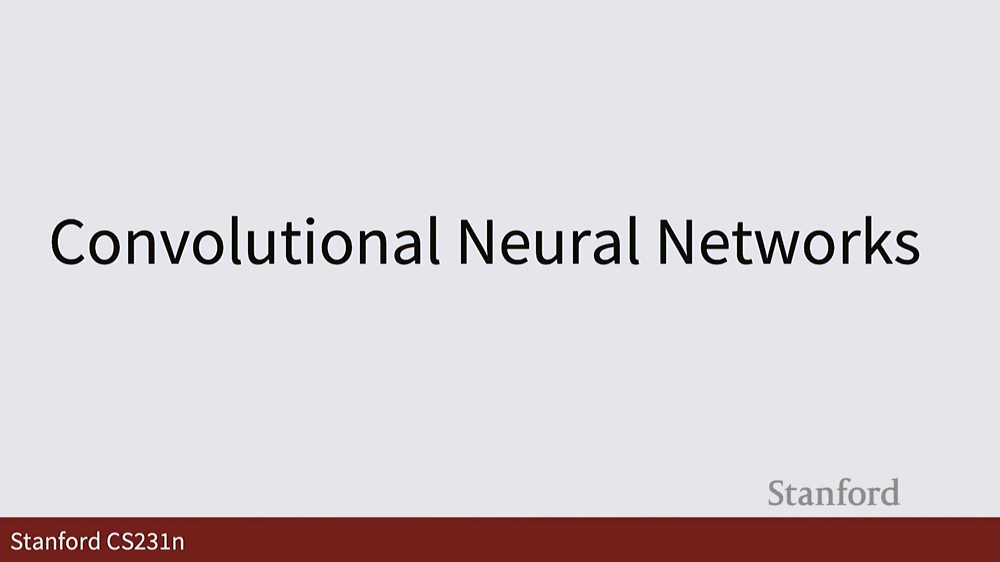

A lot of times we are building hybrid systems. Sometimes we use convolution, sometimes we use transformers, sometimes we mix them together in various ways. It's actually super useful to still know about this stuff.

Basically, the rest of today we're going to talk more about convolutional networks. We said that a convolutional network is just a computational graph for processing images. That's built from a couple of different primitives.

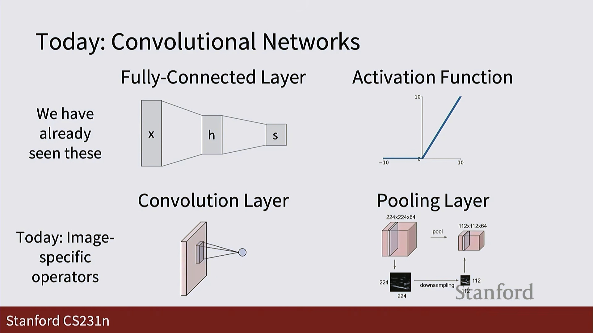

We've already met the fully connected layer and the activation function. So we basically need to walk through these two more layers: the convolution layer and the pooling layer.

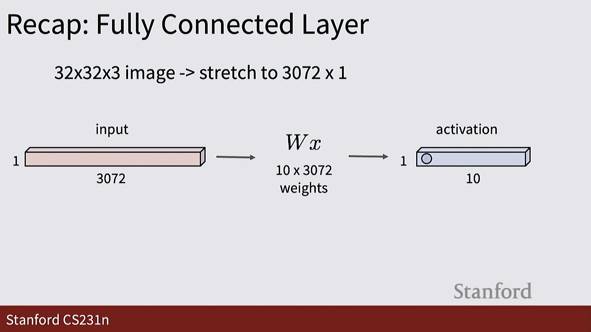

Quick recap of the fully connected layer. This is what we've already talked about in the context of linear classifiers.

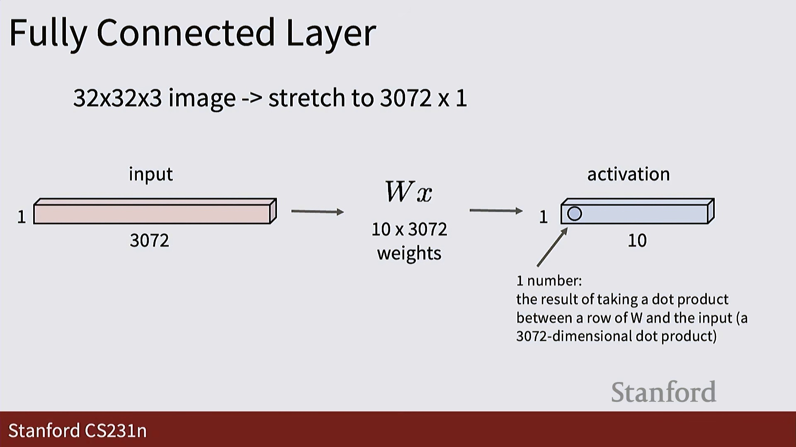

With our fully connected layer, basically what we do is we take our pixels of our image. Our image is a three-dimensional tensor: $32 \times 32 \times 3$. The $32$ by $32$ are these two spatial dimensions. The $3$ are the channel dimensions for your RGB colors.

So we take that $32 \times 32 \times 3$ vector. You stretch it out into a long vector of $3072$, because that's if you multiply those in your head; that's the number you get. And then you have this vector of $3072$ numbers. We have a weight matrix that's $3072 \times 10$, in this case, because $10$ is the number of output classes that we want.

You do a matrix-vector multiply between those two. You end up with a vector of $10$ numbers giving us our class score. That fully connected layer output vector contains $10$ elements, each one of those elements is a single number. Each one of those numbers is predicted by computing an inner product between one of the rows of your weight matrix and the entire input vector.

But each entry you should basically think of as a dot product, and a dot product you should basically think about it as a template match. Because the dot product between two vectors is high when the two vectors point the same way, and it's $0$ when the two vectors are orthogonal. So anything built on dot products is basically a template matching. The way that you should think about these fully connected layers is that we have a set of templates, each of the templates has the same size as our input.

And then the output is the template matching score between each one of our templates and the entire input. Once we think about it that way, there's actually a nice way we can generalize this from fully connected layers into convolutional layers. That's by saying we're still going to have this notion of template matching. We're still going to have this notion of learning a bank of filters.

But what we're going to change is that those templates are no longer going to have the same shape as the input.

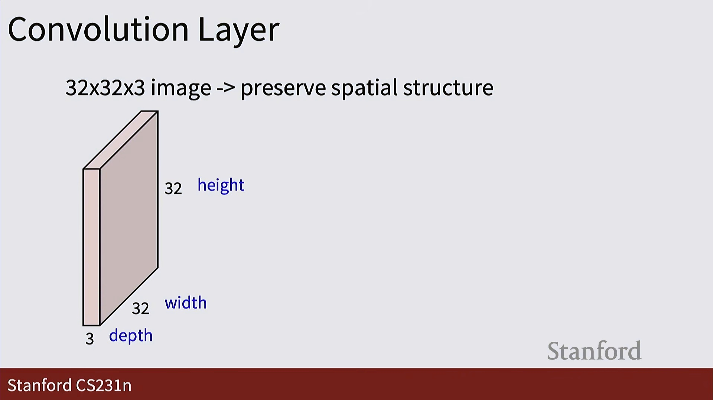

Instead, our filters will only look at a small subset of the input.

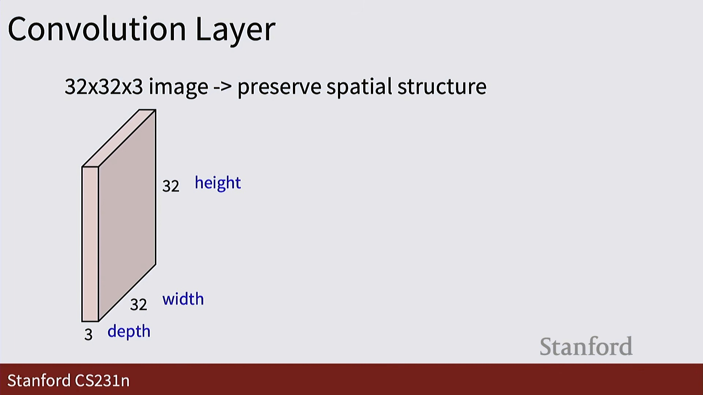

More concretely, rather than stretching out our image into a big vector of $3072$ numbers, instead, we're going to maintain the 3D spatial structure of our image. It's going to be a three-dimensional tensor of $3$ channels—sometimes called depth or channels dimension—$32$ width $\times$ $32$ height.

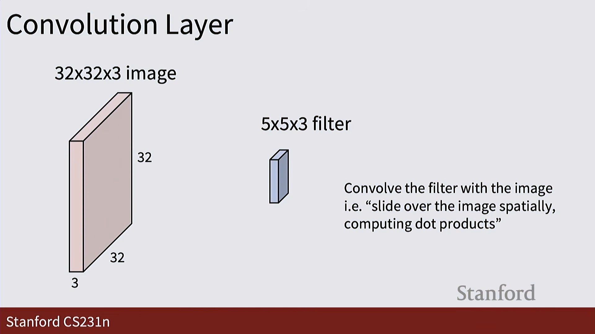

One of our filters is going to be a tiny little sub-image, a low resolution image, in this case a $5 \times 5$ pixel image.

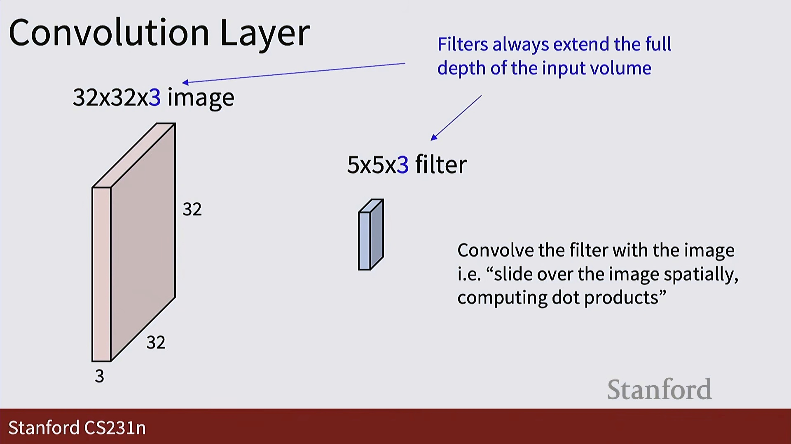

Importantly, that small filter needs to have three channels. The channels are always going to span the same as the number of channels in the input, but the spatial size will be smaller.

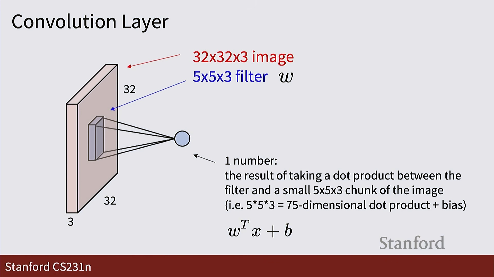

Now what we're going to do is we're going to compute dot products. We think about that small filter as a little chunk of image template. We'll plop that convolutional filter down at some chunk of the image. That $5 \times 5 \times 3$ filter will line up with some $5 \times 5 \times 3$ chunk of the image at that spatial location, and we'll compute an inner product between those two.

That will give us one single scalar number, telling us how much does that chunk of the image align with our template.

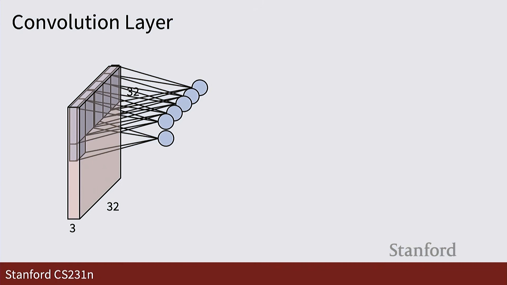

We'll repeat that process and slide that template everywhere in our image. As we slide that filter everywhere on the input image, we're going to collect all of those scores, all of those template matching scores into a plane.

That plane will now be a two-dimensional plane that says basically for every point in the plane corresponds to how much did that corresponding piece of the input image align with our filter. But of course, this is deep learning.

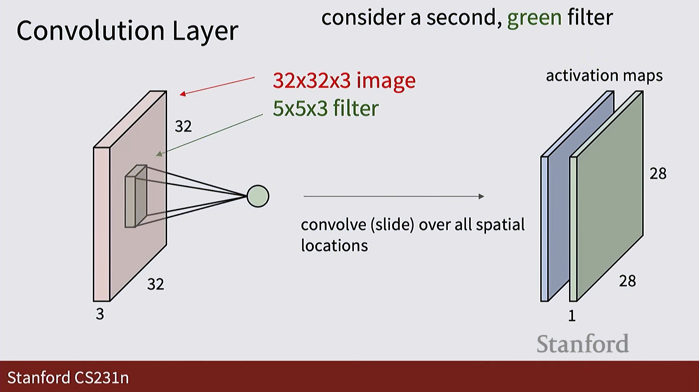

We want a lot of compute, and how do we get more compute?

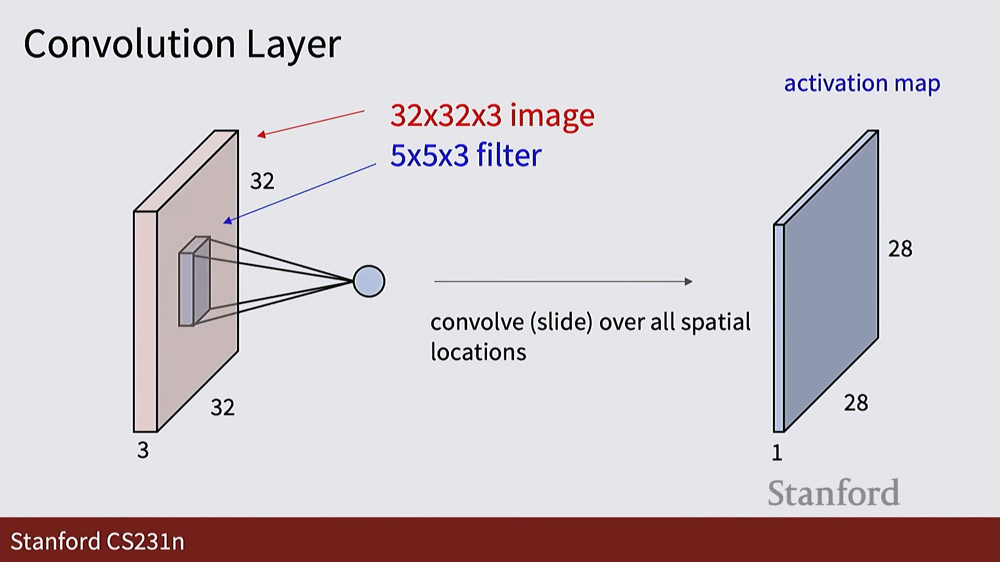

We have more filters. So now we'll add a second filter and repeat the whole process again with another filter.

We have a $5 \times 5 \times 3$ filter that we colored in blue. Let's imagine a second filter that's now colored in green. Our second filter will still be $5 \times 5 \times 3$.

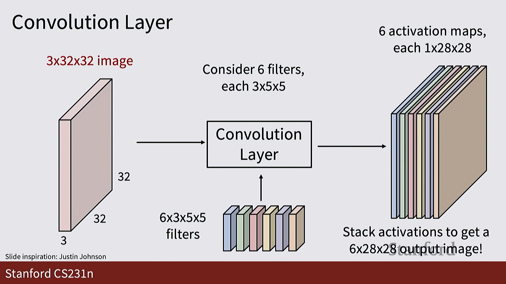

And now we can basically iterate this and add as many filters as we want. So in this case, we are drawing six filters, each of them is going to be $3 \times 5 \times 5$. So then we can actually collect all of those filters into a single four-dimensional tensor. That four-dimensional tensor now has $6$ as a leading dimension because we have six filters.

And then that $3 \times 5 \times 5$ is that image template, that chunk, is that template that we're learning.

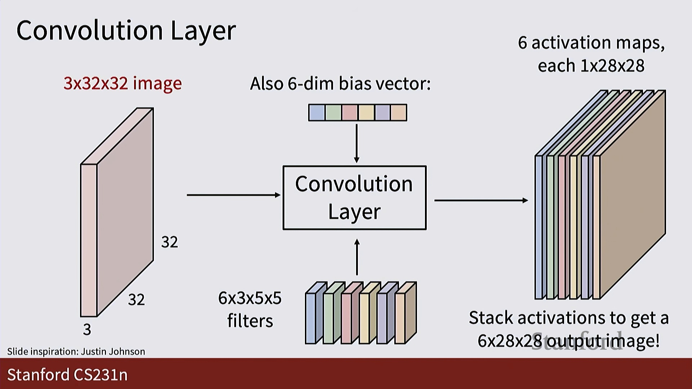

Of course, we'll also, just as we do with linear layers, we'll often add a learnable bias vector as well to our convolutional layers. In a linear layer, a bias is one scalar per row in the linear layer. Correspondingly, in a convolutional layer, we'll have typically one scalar bias value for every filter in our convolutional filters. So that means that we'll have a $6$-dimensional bias vector in this setting.

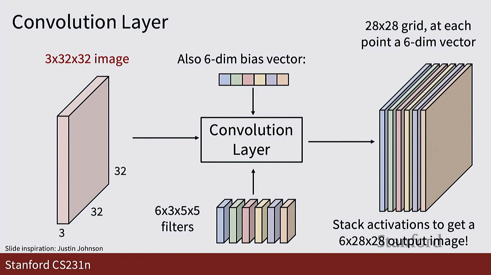

***
*Speaker clarification:* "The question was clarifying 3 is the RGB channels. Yeah, that's correct." **Question:** How do you get the filters? That's the miracle of gradient descent and backpropagation.

The idea is that we're defining this operator. Instead, we're going to initialize those filters randomly, and then they will be learned via gradient descent on whatever problem you're trying to solve. That's actually a really important thing to keep in mind. ***
*Speaker clarification:* "Question is, how do you set the five?

That's a hyperparameter." We talked about hyperparameters and cross-validation a couple of lectures ago. These would be architectural hyperparameters that you would typically set via cross-validation in some way. **Question:** Does it make sense to have different sizes of filters?

As we'll see in the CNN architectures lecture next lecture, I think you're going to talk about Inception. In this case, we usually define a single convolutional layer as having a fixed filter size because that makes it easier to compute and write efficient GPU kernels. So it's yes and no is the answer to your question. **Question:** What are we learning?

(This distinction is very important.) It is very important to distinguish between a parameter versus a hyperparameter. A hyperparameter is something that we set before we start training the network. In this case, one of the hyperparameters would be the number of filters and the size of those filters, because those set the shapes of our $\text{tensor}$.

A parameter is a value that we're going to set and optimize over the course of gradient descent. So in this case, the number of filters, the number of output channels, the size of those filters—those will be hyperparameters. We set those once before we start training. At the beginning of training, we'll randomly initialize the filters and then the values, and that will give us a fixed shape, fixed size $\text{tensor}$.

The values inside of that tensor will float around and change over the course of optimization. So those are parameters because they get set via gradient—via gradient descent. **Question:** What gradient are we computing? Whenever you do backpropagation, you're always computing the gradient of the loss with respect to things inside the network.

In this case, we'll be computing the gradient of the loss with respect to the individual scalar, with respect to our convolutional filter weights. We're always computing the gradient of the loss with respect to our convolutional filters. **Question:** What do we do with the bias? Basically, the bias would be added to each of our inner products.

We'll always compute like the inner product of one of our filters against a chunk of the image and then add the corresponding scalar from the bias. The bias is a vector, but the number of entries in the vector is equal to the number of filters. Each entry in the bias gets basically broadcast across the entire spatial dimension in the output. But each bias only gets used for one filter.

Conceptually, you basically one filter you slide everywhere; that gives us a two-dimensional plane of activations. If you have a second filter, you get a second plane of activations. Those are independent operators. Like step one slide first filter everywhere.

Step two slide the second filter everywhere. Every filter gives rise to a plane, a plane that we call an activation map. And then we stack all of those up. That's the operation of the convolution layer.

The question is, basically after every gradient descent—every time we do gradient descent—it's going to change the filters. It's always going to be data, forward, loss, backward step. Every time you do a step, it’s going to make a change to the filters.

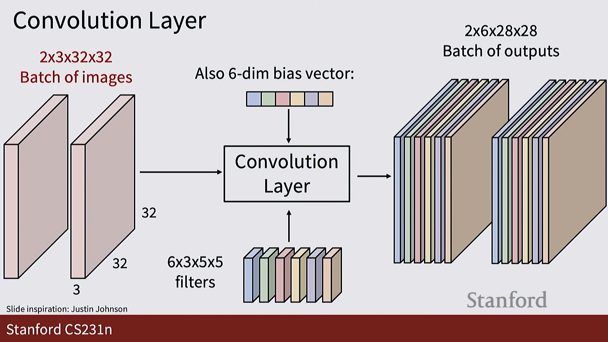

We talked about the convolution layer. It's actually pretty common in the convolution layer to work on it in a batch mode. Rather than working on one input image, we actually work on a batch of input images. This is nice because it makes everything four dimensional.

We have a four-dimensional tensor of inputs, which is a set of input images. We have a four-dimensional tensor of filters, which is a set of filters, each of which is a three-dimensional chunk of an image. The output is a four-dimensional tensor, which is a set of outputs. Each output—one output per image—is a three-dimensional tensor, giving a stack of feature planes.

You have to start to think in lots of dimensions when you start to build neural networks, and that's actually fun.

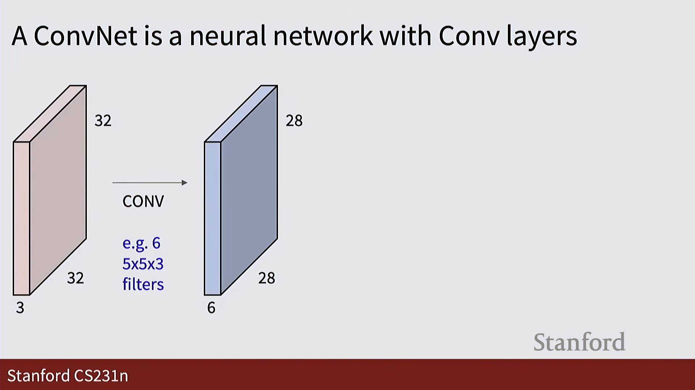

Here is the general formulation of a convolution layer. Generally, you take as input a four-dimensional tensor of shape $n \times c_n \times h \times w$, which is a set of $n$ images. Each of those $n$ images has $c_n$ channels. For the case of an RGB image, that will be 3, but we might in general have more than three channels; this could be arbitrary.

$h$ and $w$ are the spatial size of our input images. Our convolutional filters will be a four-dimensional tensor of shape $c_{out} \times c_n \times k_w \times k_h$. $c_{out}$ is the number of filters, the number of output channels; $c_n$ is given by the input, and then the rest are three-dimensional filters. It's a set of three-dimensional filters.

Each three-dimensional filter has shape $c_n \times k_w \times k_h$. This defines the kernel width and kernel height. We have $c_{out}$ such filters collected into a four-dimensional tensor. Each of those planes will be $h' \times w'$.

This is the general formulation of a Conv layer. A convolutional network is just a computational graph that includes a bunch of Conv layers.

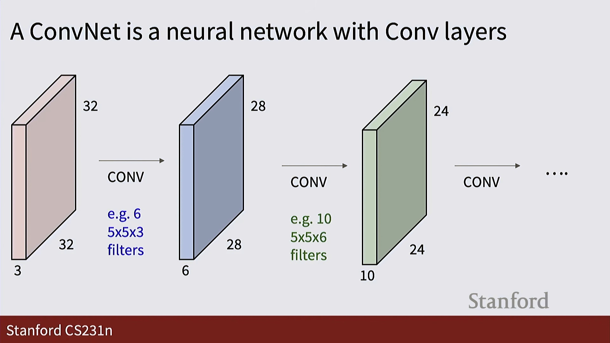

In practice, we tend to stack up a bunch of convolutional operators one after another; this results in a convolutional network. This is a simple ConvNet. You start with an image that's $3 \times 32 \times 32$. Then we have a conv layer that has six filters, each filter being $5 \times 5 \times 3$.

After the first convolution, that gives us a new three-dimensional set of activations for that one image, where we have six channels matching the six filters. The size is $28 \times 28$, because the spatial size changed a little bit through the convolution. Then we have another convolution that now has 10 filters, each of which is $5 \times 5 \times 6$.

The 10 gives us the output dimensions and the next layer of convolution. This 6 is going to be the number of channels that needs to match up the channel dimension here of the input to the convolution. You can see you can just stack a bunch of these convolution layers and perform a lot of computation. There's actually a problem in exactly this network architecture design.

Is it sizing? That's a problem, not the one I had in mind. Are evolutions local? That's another good problem, not the one I had in mind.

Actually, those two will be able to fix pretty easily in a couple slides, but I had a different problem in mind. A lot of memory is a problem, but not one we can fix; you just got to buy a bigger GPU. Number of filters increases? I don't think that's a problem necessarily.

That's OK. Everything's linear? Yes, that is a problem. We said that convolution was dot products. The dot product is a linear operator.

Composition of two linear operators is still a linear operator.

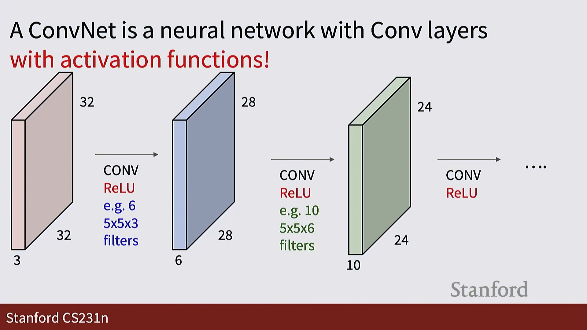

There's actually a very simple fix to that: add an activation function. It’s the same bug that we saw in multi-layer neural networks and the same fix. We need to add a nonlinear activation function in between our convolutional layers if we want this. This introduces non-linearity to the problem, non-linearity to the network architecture, and increases the representational power of the network that we're learning.

In general, ConvNets are going to be some stack of convolution layers and nonlinearities. ...and other kinds of layers in our computational graph. There was a question earlier about what do the convolutional filters learn.

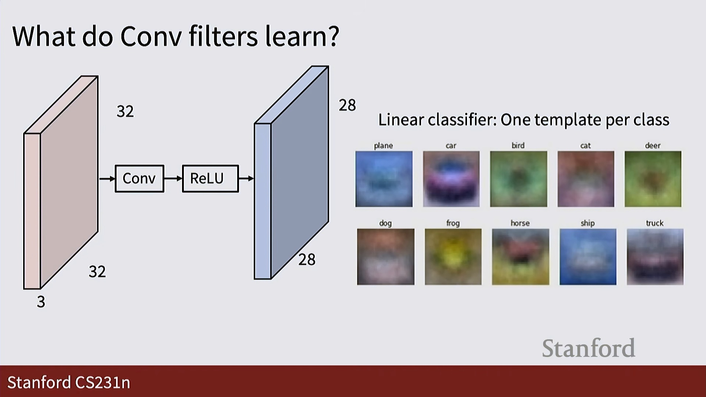

This is basically—we can view this by analogy with what we already did in linear classifiers.

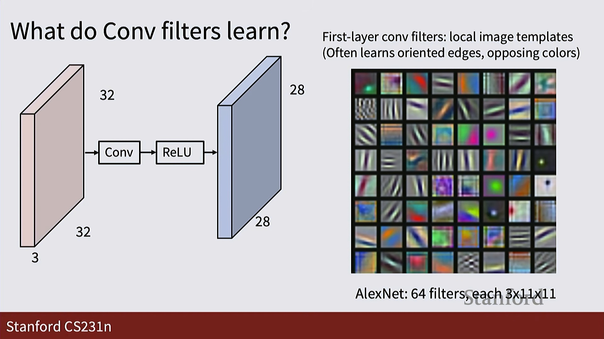

So we can actually visualize the first—we can actually visualize the first layer convolution filters of a trained neural network. These are the first layer convolution filters that are learned by an AlexNet architecture that was trained for image classification on ImageNet.

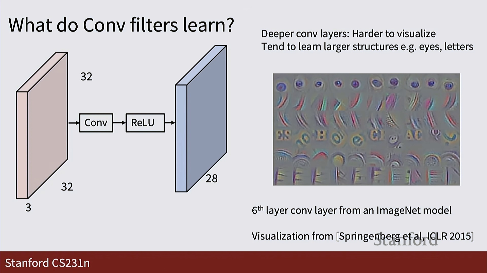

Here each of these are basically little chunks of RGB images. These are the little templates that get slid around the input image in the first layer of the AlexNet architecture. And the thing we see is that we often learn two kinds of filters in here. One tends to be looking for colors, especially opposing colors.

So you'll see this one is looking for a contrast between green and red. We also see colored blobs like pink and green blobs. The other category of filter we tend to see are looking for somehow the spatial structure of the images. So like this one is looking for a vertical edge, a horizontal edge.

This one is looking for a vertical edge; some of these are looking for diagonal edges. So they tend to look for colors and edges in these little local neighborhoods of our input images. We can play this trick on the first layer of the convolutional filter and just visualize them directly as images. It gets a little bit trickier to visualize the higher layers in the network.

I'm not going to explain this figure. I'm just going to present it without too much explanation, but higher layers of the network tend to learn larger spatial structures of our input image. The visualization here is a bit different than the previous slide. So these are all basically chunks of input images that a filter was responding to.

Here you can see that this six layer convolution one of these filters feels like it's responding maybe to eyes. This one looks like maybe it's responding to pieces of text. This one looks like maybe it's responding to wheels or circles or top halves of circles, something like that. And again, this all gets driven via gradient descent via training on your large scale data sets via gradient descent.

Nobody's sitting down and designing these filters by hand. And like I said, visualizing these higher layer filters is a bit tricky and more involved. Question was if you look at all the responses to the filters, can you reconstruct the original image? Actually, it turns out you can do that.

The trick and the way that you do that is also gradient descent. Gradient descent is really powerful, and that's something that we'll talk about in a couple more lectures on some mechanisms that do that. Oh, that's a good question: how do the filters get differentiated? That actually comes down to the random initialization.

So then it's really important that the way you initialize your filters is random. Because if all the filters are exactly the same, the loss is the same, then that gradient is going to broadcast back and be the same on all the filters. So if you initialize them the same, they will stay the same. But if you initialize them to be different, then you'll break the symmetry, and they can learn different features.

Basically, the human designer of the network needs to write down what is the sequence of operators and the sequence of channels. And that's the question of neural network architecture design that we'll talk a little bit more about in the next lecture. Third question is, why is it the deeper layers visualize larger structures? That actually has a bit to do with the receptive fields that we have a slide on in a little bit, so maybe we'll get there.

And I think a couple of these questions will get answered.

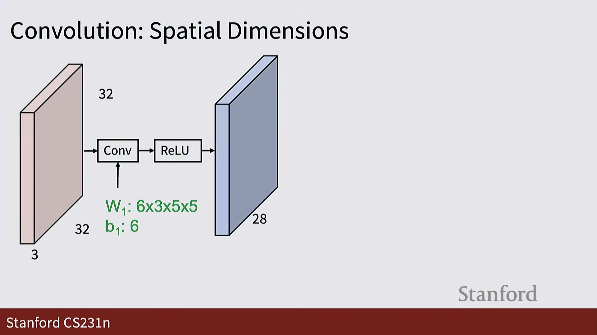

So one thing that already came up is how do we look at the spatial dimensions of these convolutions?

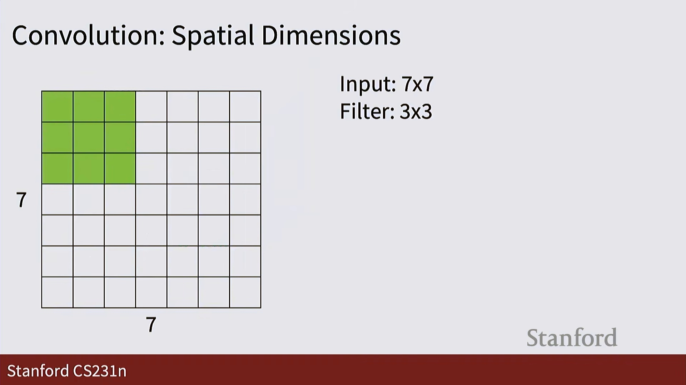

So I wanted to take a look—a closer look at exactly how we compute the spatial dimensions of convolutions.

In this case here, we've taken this picture of—this picture of a convolution. We're rotating it $90$ degrees and dropping the channel dimension. So now the channel dimension is going into the board, and then we have our $7 \times 7$ spatial dimensions. Here we're looking at an input that's $7$ by $7$ in spatial size.

And we have a $3 \times 3$ conv kernel. And then the question is, how big is our output going to be here?

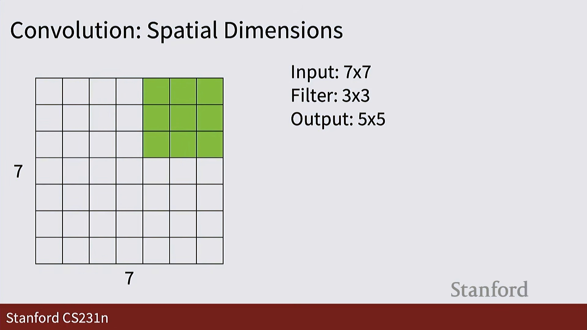

Well, $1, 2, 3, 4, 5$.

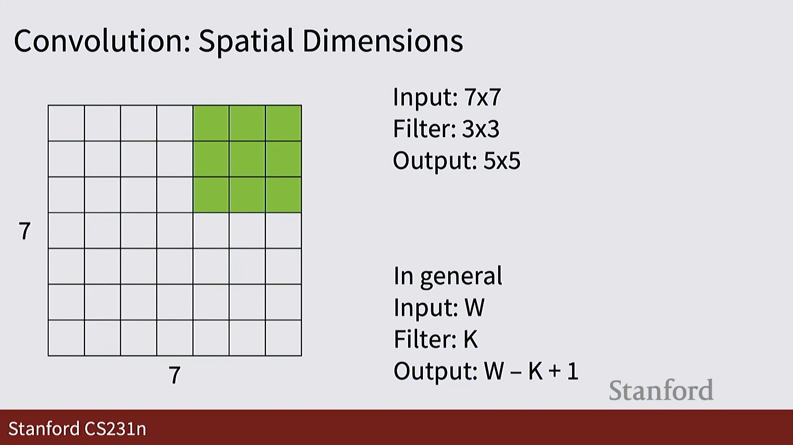

So our output is going to be $5 \times 5$ because we can slide that filter and plop it down in $5$ different spaces. And then we can generalize it. If our input has length $w$, our conv filter has length $k$, then our output is going to be $w - k + 1$.

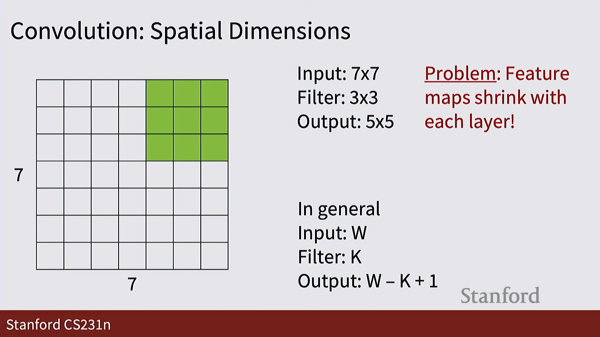

And you can sit down and convince yourself That's the right formula. It's actually—like you could actually work with that. And there are some neural network architectures that deal with that.

But sometimes we're lazy and we just want to keep the same size for everything because that's just basically simpler for human designers to think about.

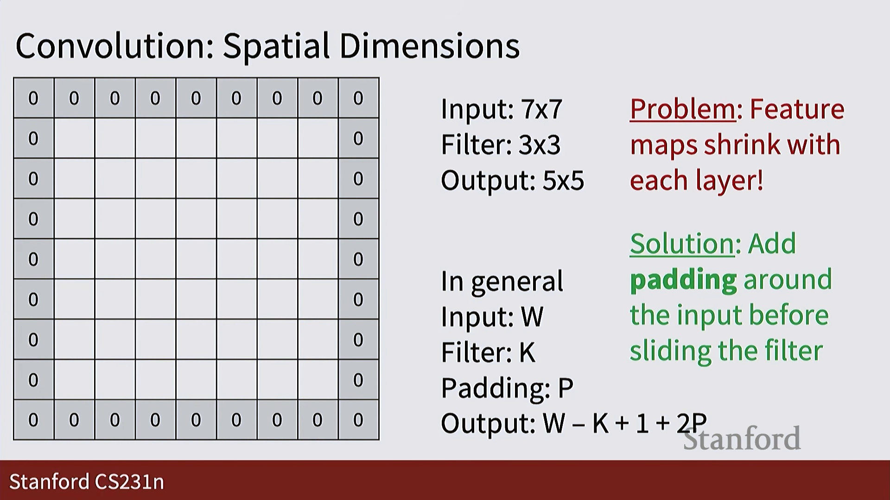

One trick that we do there is something called padding. This lets us solve this shrinking feature map problem. Because now if we have add padding of $p$, in this case, we have padding $p$ equals 1. So we're adding one pixel of zeros all around everywhere.

Then we basically add $2p$ to our output size. In particular, if you have a 3x3 conv and you add padding of 1, then your feature map is going to stay the same size, which is convenient. But be aware why we are putting zeros—is that going to cause problems? Yes, it is going to cause problems on the borders, but it seems to be in a lot of cases.

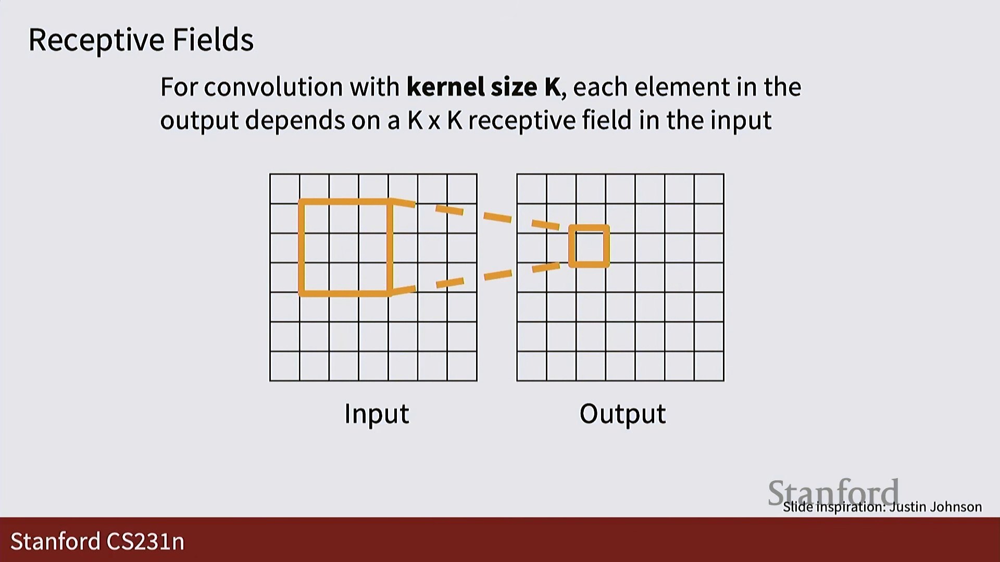

The next interesting thing to think about is this notion of receptive fields. Someone was asking a little bit over here why do the deeper layers learn larger structures? That's actually inherent in the way that convolutions are built. Thinking about a single convolution, each output is looking at this local region of an input.

By design, the output of one convolution at the first layer can only be looking at a piece of the image, which is the same size as the convolutional kernel that you're learning.

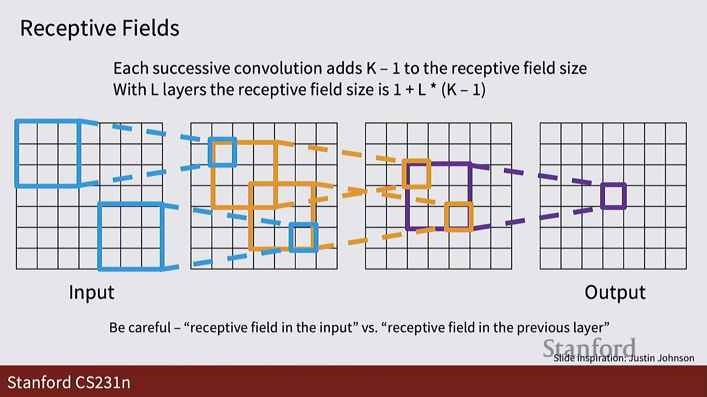

But if we build a ConvNet that's stacking multiple convolutions on top of each other, then these receptive fields get magnified through the network. We are looking at a network with three convolution layers, and we see that in the final layer of activations, each entry here depends on a local region in the layer before it. But each one of those entries depends in turn on a local region in the layer before it, which depends in turn on a local region in the layer before it.

We call this the effective receptive field. The effective receptive field of a convolution is basically how many pixels in the original image had the opportunity to influence one activation of the network later on downstream.

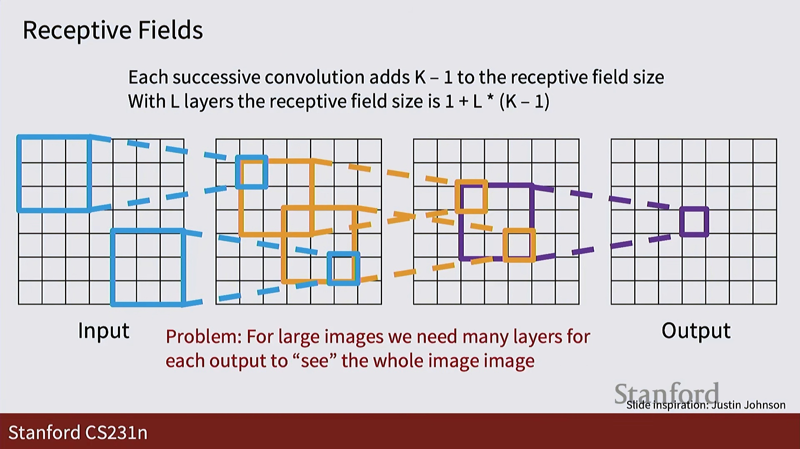

You'll notice that the convolution, this effective receptive field basically grows linearly with the number of convolution layers.

A trick there is to basically add some way to increase effective receptive fields more quickly. One way that we can do this in convolution is by introducing something called a stride. What we're saying is rather than placing the filter everywhere in the image, we're going to skip some. We're going to instead of moving the field—moving the receptive field with 1, we're going to stride it by 2 instead.

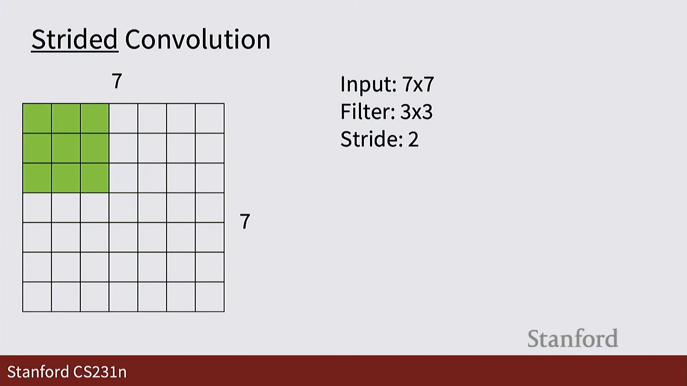

In this case, we go back to our $7 \times 7$ input, 3x3 conv do a stride 2. The output size is $1, 2, 3$, which is $3 \times 3$.

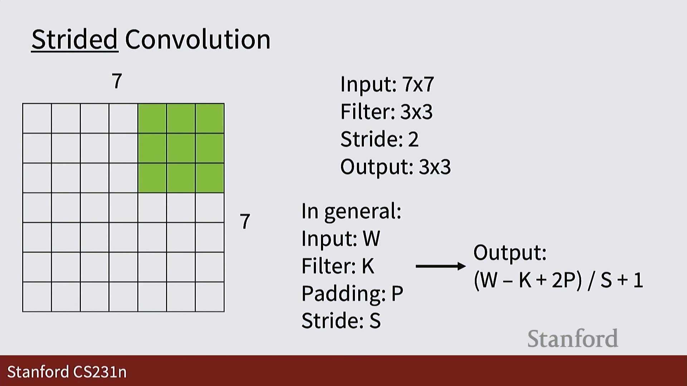

In general, if we have our input $W$, filter size $k$, padding of $p$, stride $s$, then we get this ugly formula for the size of the output: $\lfloor\frac{W - k + 2P}{S}\rfloor + 1$. The bigger kernels shrink the input; plus $2P$ padding adds back some of the missing size divided by the stride. The stride divides the input shape, and then plus 1 because of some fence post math.

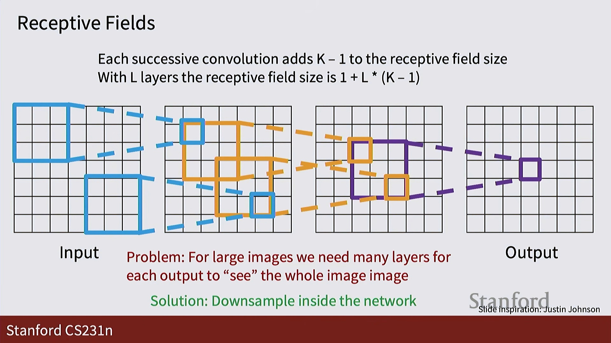

When we have strided convolution, then each conv layer is effectively like dividing the shape of the feature map, usually by 2. When we stack these, that means that now you can get exponential growth in the effective receptive field. If you stack a bunch of conv layers and each of those conv layers is actually downsampling by a factor of 2, then if you run through a similar exercise,

You'll see that the effective receptive field is now growing exponentially in the depth of the network. So that means that with relatively few layers, we can build up a very large, effective receptive field that looks at the entire input image.

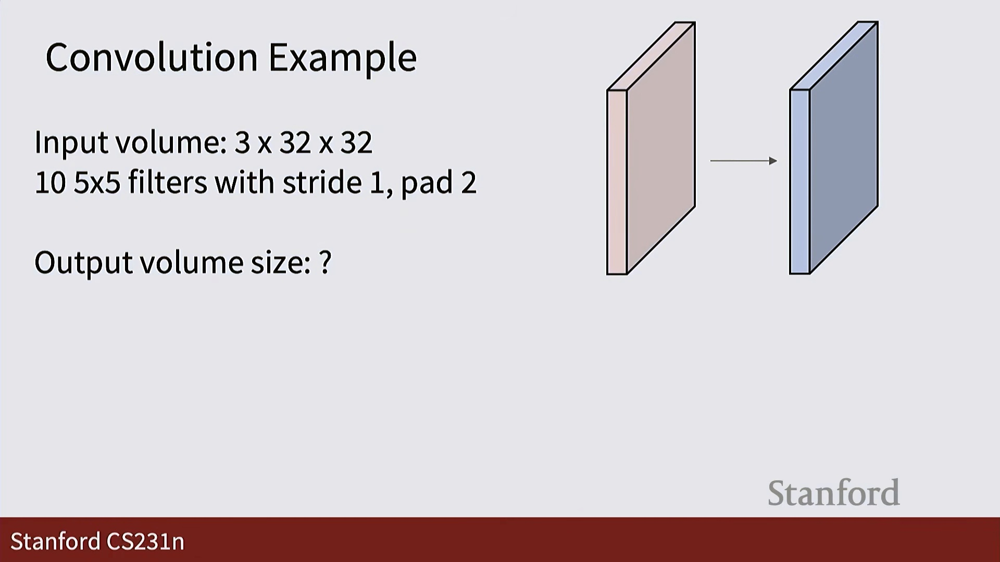

So here, let's work through just one example to make sure that we all are on the same page about convolution. Let's think about an input volume $3$ by $32$ by $32$. We'll consider a convolution layer with $10$ filters; each of those filters is $5$ by $5$ with stride $1$ and padding $2$.

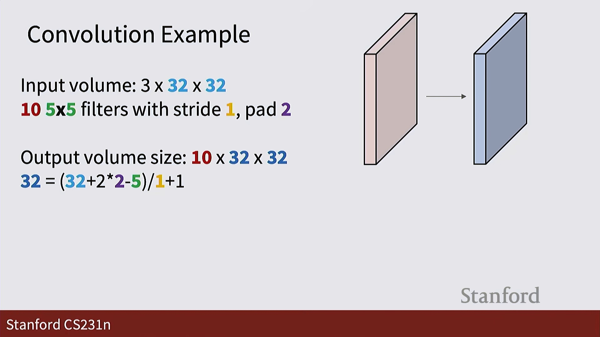

What is the size of the output? I color-coded it because there are a lot of numbers here to keep track of. Here, it's $10$ by $32$ by $32$. This $32$ is actually a different $32$ than this other $32$, so that's why they are different colors of blue.

But this $10$ is the number of output channels; output channels has to match the number of filters. The spatial size is computed using that formula that we just saw. The input spatial size comes down here plus $2$—plus the padding comes down here. Padding adds to the spatial size, and $5$ is the convolutional kernel that divides the spatial size, with a stride of $1$.

This calculation then adds one, and this just so happens to come out to $32$. In this case, it follows the same pattern that we talked about a couple slides ago where it's an odd-shaped convolutional kernel. In this case, five, and the padding is two.

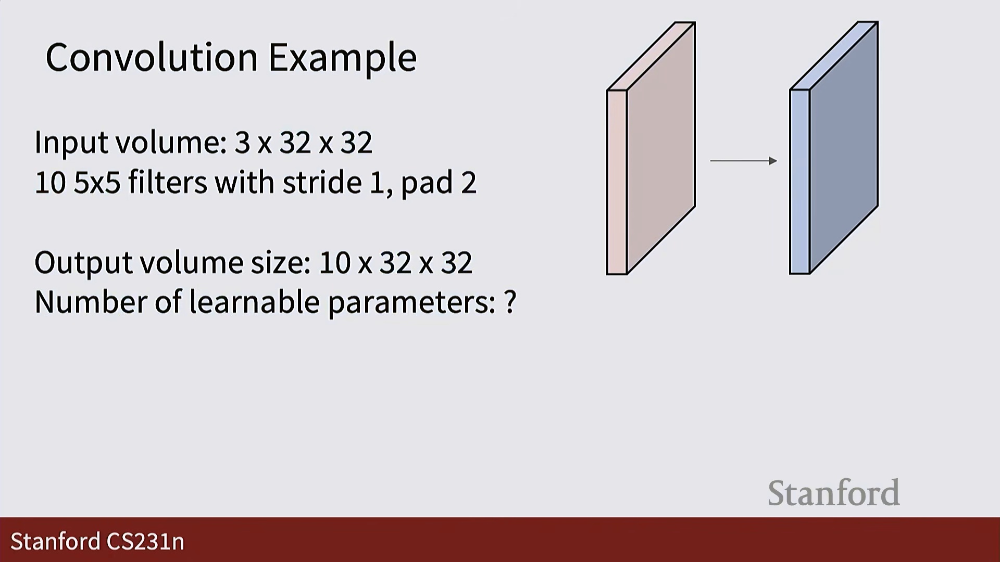

If the kernel size is $2k+1$, then padding of $k$ means we maintain the same spatial size. Now for the number of learnable parameters here.

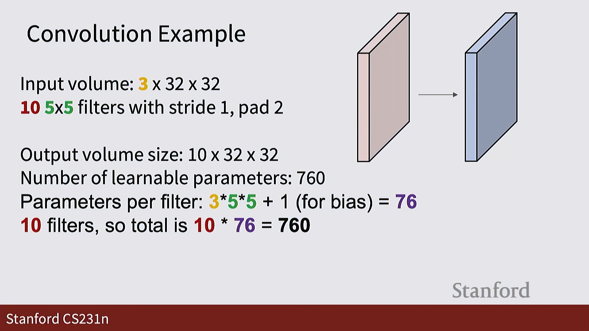

Maybe I'll just go through these because we have a couple more slides to get through. In this case, the number of learnable parameters is $760$ because each filter is basically a $3 \times 5 \times 5$, and we also have one for the bias. So we have $76$ learnable parameters per filter. Since we have $10$ filters, it's $760$ learnable parameters here.

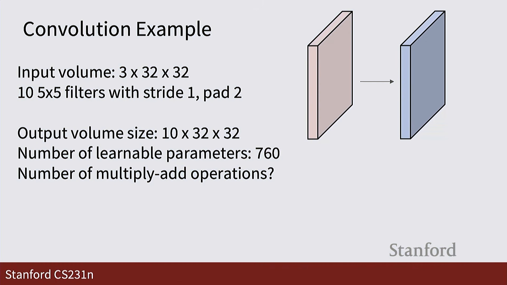

We can also compute the number of multiply-add operations. How much compute does this convolution kernel take?

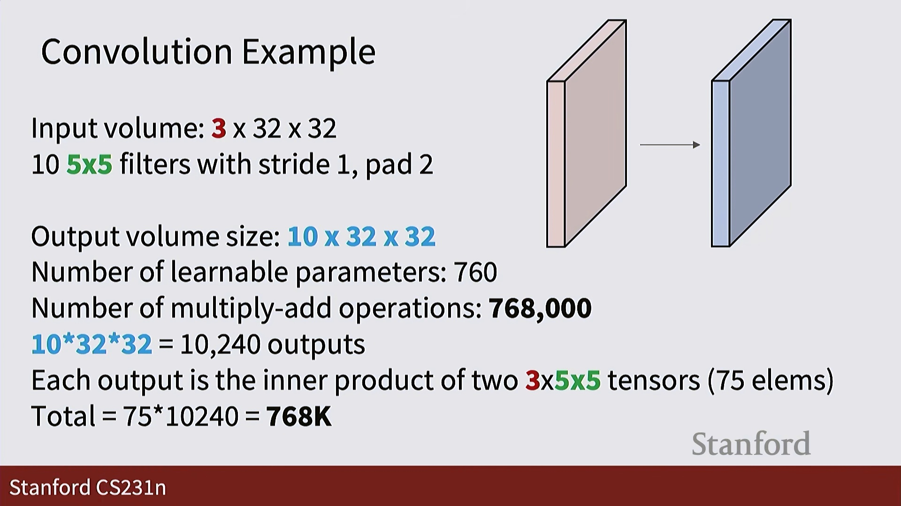

It takes a lot. In this case, we think about what the output volume size is: $10$ by $32$ by $32$. We know that each entry in that output volume was computed via dot product, a dot product in particular between one of our filters and a chunk of our input.

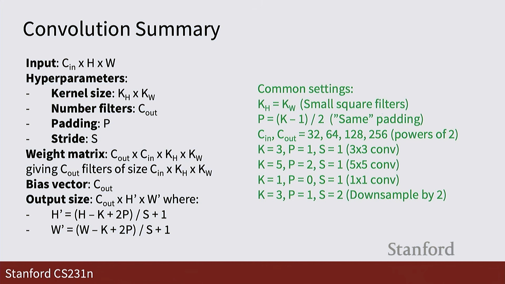

Here is one line summary of convolution; I'm not going to walk through this.

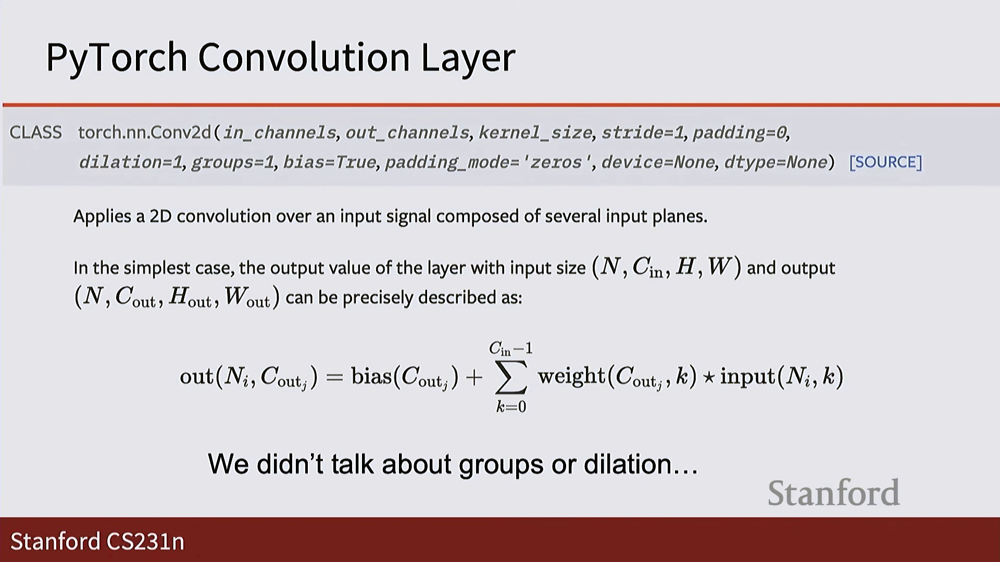

This is more for you to look at later, but it just summarizes all the hyperparameters and the formulas associated with convolutional layers. There are a couple other interesting hyperparameters that we didn't talk about called groups and dilation. Dilation isn't really used so much anymore, but groups still get used sometimes.

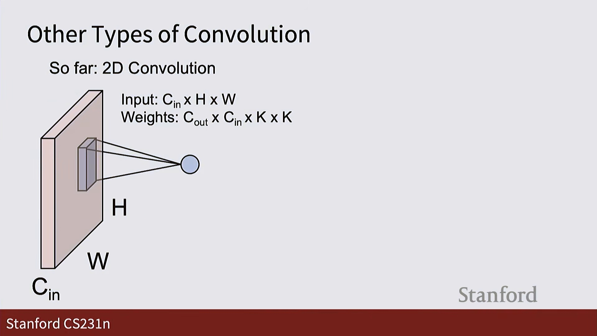

Maybe we'll talk about those in a later lecture.

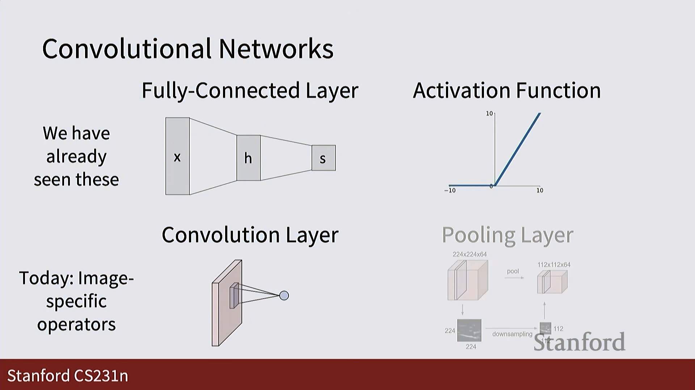

This idea of a convolution really extends beyond just two-dimensional images.

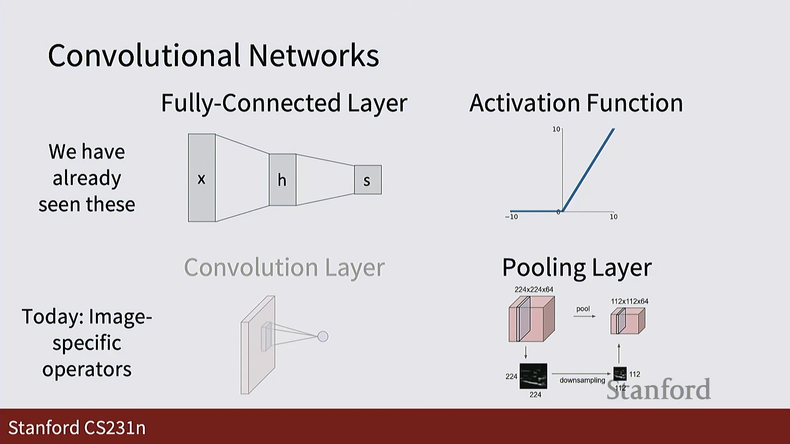

That's basically all about convolution.

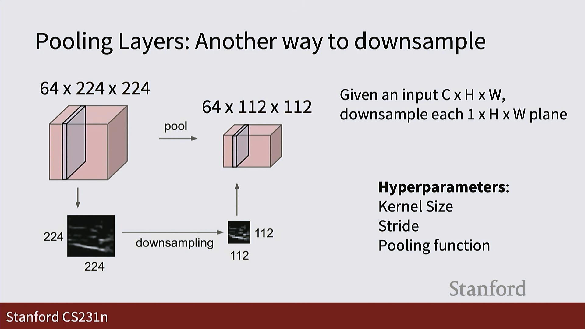

The last one is pooling. Thankfully, pooling is pretty simple. Pooling layers are basically another way to downsample inside of your neural network. However, convolution actually still costs quite a lot of computation.

Convolution is where most of the FLOPs, most of the compute happens in a convolutional network. Pooling layers are basically a way to downsample that's very, very cheap; it doesn't cost a lot of compute. The idea in a pooling layer is given our three-dimensional tensor, which in this case is $64$ by $112$ by $112$. So given this input $64$ by $224$ by $224$, we're going to pull out each of those $224$ by $224$ planes, independently downsample it, and then

restack them to give a same number of channels, but change in the spatial size.

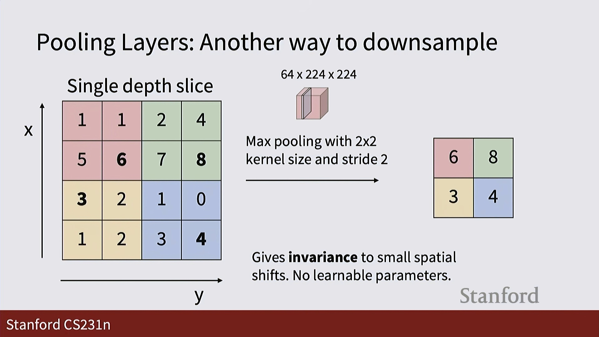

What is the method we use for downsampling? Great question. So the way that's actually hyperparameter there are a couple different mechanisms of downsampling that we use. One of the most common ones to use is called max pooling.

In max pooling what we're going to do is take our single depth slice, divide it up into non-overlapping regions. These are two and we often use and we use the same terminology to talk about these as we do with convolution. Within each of those non-overlapping $2 \times 2$ tiles, we'll take the max entry. In this case, it's a 6, 8, 3, 4.

You take the max entry inside each of those and that gives us our spatial compression. There are a whole set of hyperparameters here: you could say what is the kernel size. You could change the kernel size; you can change the stride. You can also change the function that we use for downsampling.

Max pooling is pretty common. You'll also see average, and you'll also see anti-aliased down pooling sometimes. These are all just ways that you can downsample these feature maps one at a time. Good question.

Do we make use of padding? Typically, you do not use padding inside of pooling layers. There's nothing mathematically preventing you from doing so, but in the case of max pooling, it would be silly. It's basically equivalent to a ReLU, and so whenever you're using max pooling, if you're also using a ReLU that would be redundant.

So typically, we don't use padding in pooling layers. The stride would be another one of these architectural hyperparameters. But usually, don't tune these things too much. So then the most common thing to do would be $2 \times 2$ stride 2.

That's a very good question. Do images all have to be the same input size in all the language that we're talking about so far? Yes. You're going to run into big problems if your input images are not the same size.

Things that you'll typically do to fix that would be one: you either resize all your images to the exact same size before you batch them to feed to the network. Sometimes you'll also pad your images out with zeros or some other value to make them all the same size, but now padded rather than warped. Or you need to basically run these layers independently for images of different aspect ratios.

Another thing that you'll do sometimes in more sophisticated training setups is what's known as aspect ratio bucketing. So the question is, where do you put these? These are usually interspersed with the convolution layers. A pretty common architecture—a pretty common pattern for ConvNets is to intersperse the convolution and pooling.

For example, you'll see conv pool, conv pool, conv pool fully connected. Fully connected is a prototypical convolutional network. Does this introduce non-linearity? It depends on the type of pooling operation that you're using.

If you're doing max pooling, that's a non-linearity. In some networks, if you have a max pooling, you may not use a ReLU around that convolution because a max pooling is a non-linearity itself. If it's an average pooling, that's also linear operator. So then if you do average pooling, it's linear.

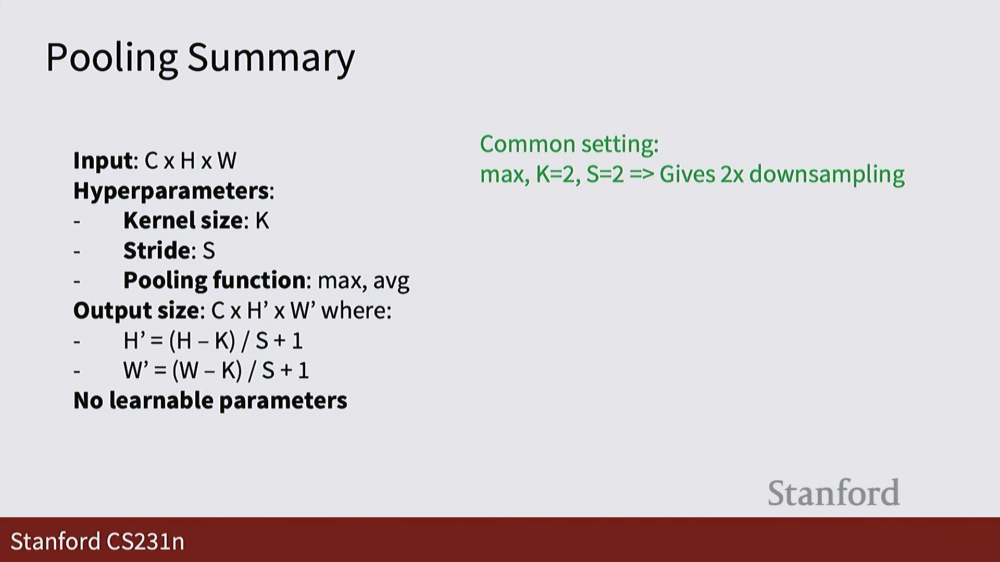

You probably still would want a ReLU there.

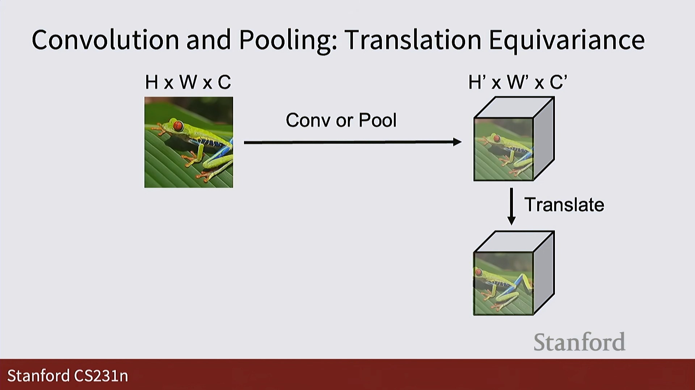

The last thing I wanted to mention is this notion of translation equivariance. There's a really interesting property that is shared by both convolution and pooling, which is one way to formalize this notion of them respecting the 2D spatial structure of the images. That's this notion of translation equivariance. It sounds pretty crazy, but the idea is we can imagine two different operators, two different branches.

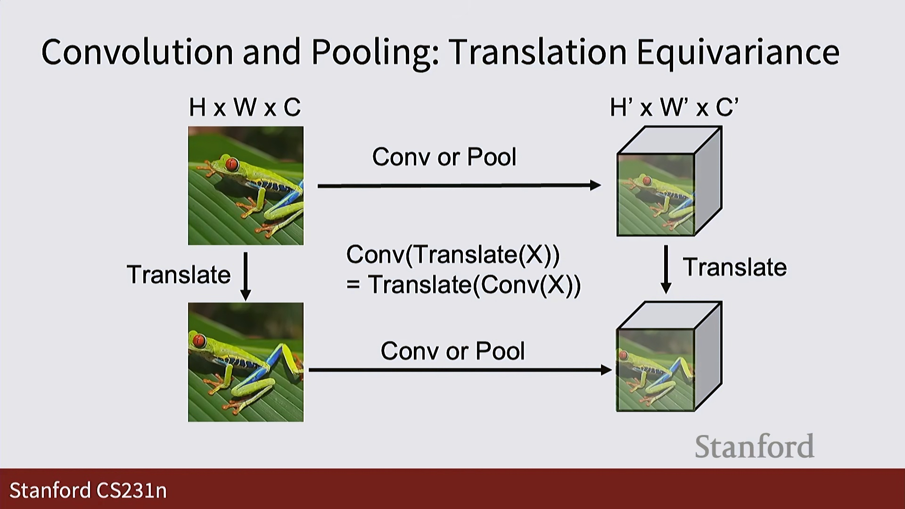

Then you could imagine changing the order of these two things instead. What we could have done instead is first translate the image and then do our convolution or pool operator. on top of the translated image.

So that means that if I'm looking this way, it looks like people and benches. If I'm looking this way, it looks like people in benches. The fact that it's over here on my right and the fact that it's over here on my left, I want to process that data in the exact same way. That's an important intuition, an important structure that we want for images and of the 2D data that we are processing.

This notion of translation equivariance basically is a way to mathematically describe how that structure is baked into these operators. The question is, why do you do your translation? You don't. This is not something you are actually going to do.

It is basically a mathematical curiosity; to be clear that you should not generally do this inside of your neural networks. This is interesting to note that this happens to be true, but you would not do this inside of your neural networks. If you are a mathematician, you call this a commutative diagram, and mathematicians love those things.

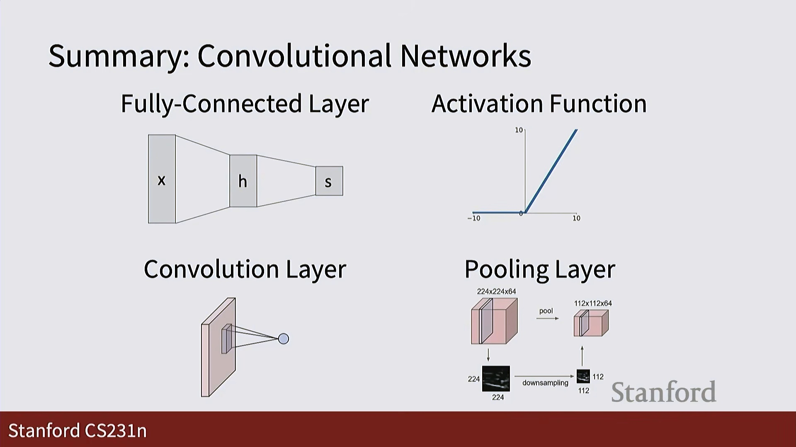

So, that is basically the summary of today. We talked about convolutional networks. We talked about why they are interesting.

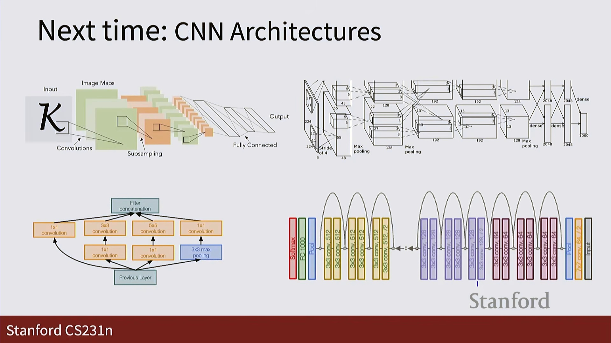

We talked about these two new operators of convolution and pooling. In the next lecture, we will see how to stitch those together into CNN architectures.

And I'll see you next time for that.
