# Stanford CS231N Deep Learning for Computer Vision | Spring 2025 | Lecture 6: CNN Architectures

Hi, everyone. My name is Zain. I realized I actually didn't introduce myself on the first lecture I gave, which was Lecture 3, but I'm one of the co-instructors for the course. My name is Zain Durante.

I'm co-advised by Ehsan and Fei-Fei. I'm a fourth-year PhD student at Stanford, and in this lecture today, Lecture 6, we'll be talking about training convolutional neural networks and also CNN architectures.

So, I would say this lecture is really broken up into two different components.

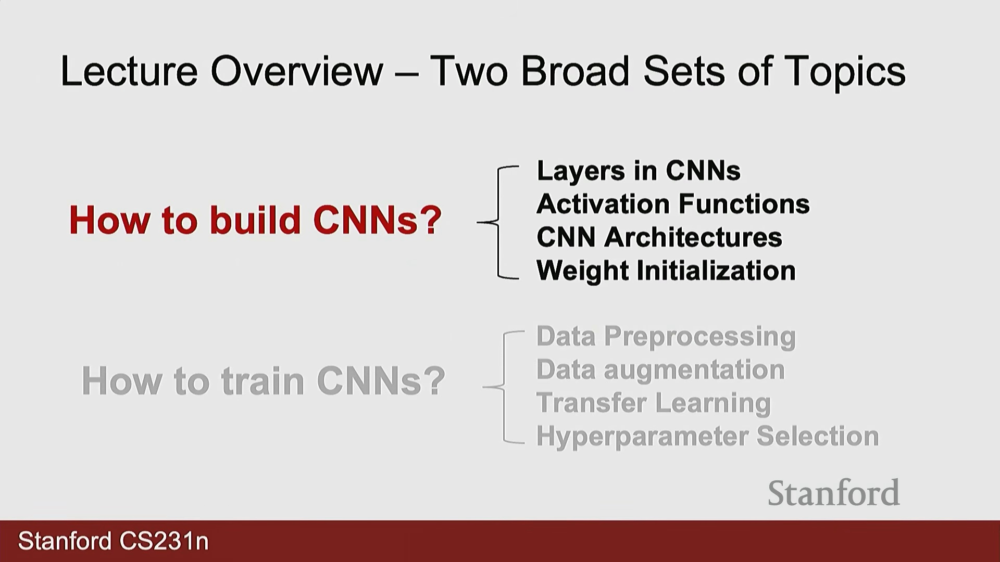

We'll go through some examples and then also we'll talk about how you actually train these and all the steps involved there. As I mentioned before, we'll have basically two different topics.

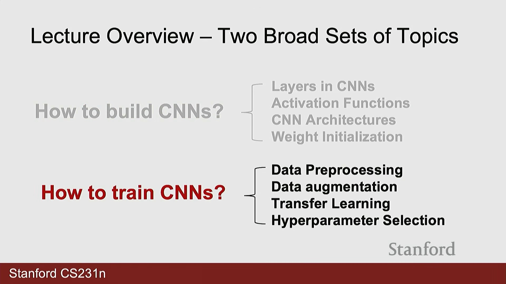

The first one is how to build CNNs, and by this I mean how do you actually define your CNN architecture to set it up to be trained?

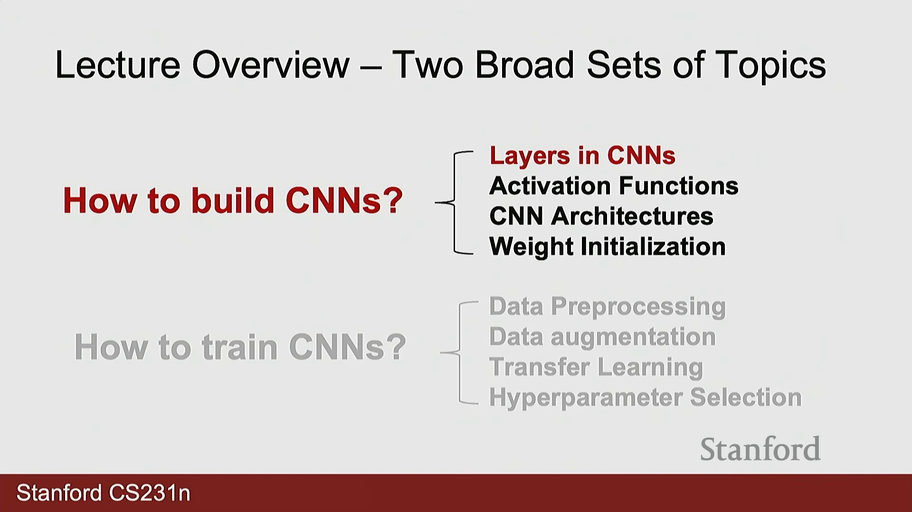

And then the second set of topics today is how do you train CNNs?

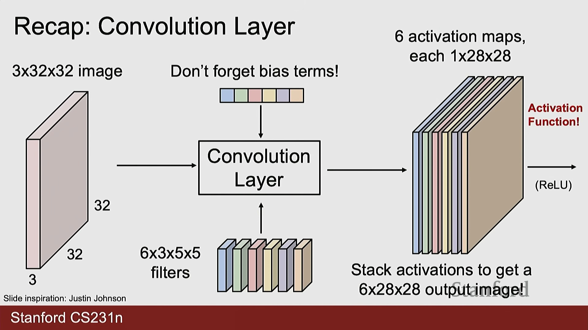

Starting with the first set of topics here, we'll go through the layers in convolutional neural networks. If you recall from last lecture, we learned about the key layer in these models, which is the convolution layer. The way that these layers work is they have these filters. You have a predefined number of filters per one of these convolution layers, in this case six.

They match the depth of your input data here. So in this case, we have a $32$ by $32$ RGB image, so we have three depth channels. Each of these filters slides across the image and calculates a score at each point. At that location in the image, you take the dot product of the values in the filter with the values in the image.

So you multiply all these values together, you sum them together, and then you add a bias term. And this is how you calculate each value in your output activation map on the right. You have one per each filter. Normally, we'll do a sort of ReLU or a non-linearity activation function at the end here.

This is from last lecture, so I won't spend too much time on it. The question is, for images, the depth is equal to the number of channels RGB, but here the depth is $6$ for the output here.

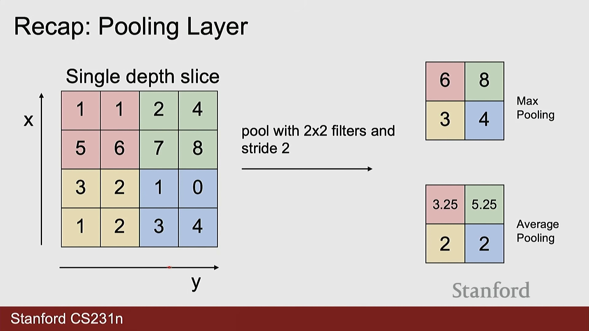

Then, the second layer we talked about, which is much simpler than the convolution layer, is this idea of a pooling layer. Here it's still this filter that we're sliding across the image: $2$ by $2$ filter with stride $2$. We're skipping over; we're not doing every single location. Here is a max pooling.

So we're just taking the $\text{max}$ of each of these areas, and that's the value we get here. Or you could do an average pooling. These are both commonly used, I would say. Depending on the architecture, you would probably just if you're creating new architecture, you would try both of them and see what performs better here.

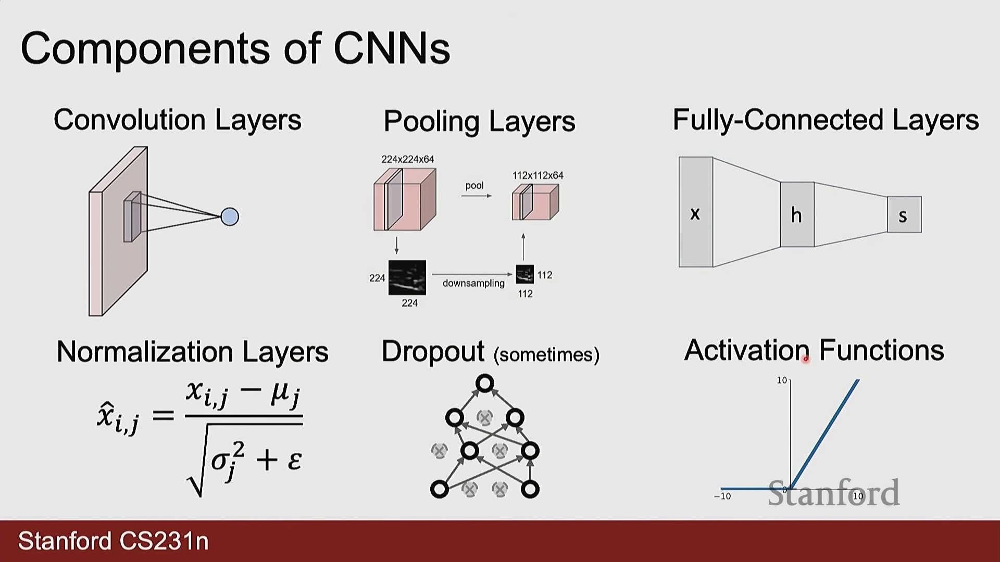

But the basic idea is to consolidate among the height and width dimensions for your image. And finally, we'll revisit the activation functions, and I'll tell you about here are the most commonly used ones both historically and in the modern era of deep learning.

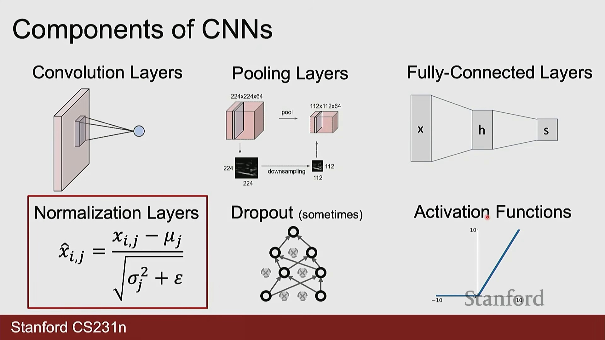

And then we'll basically learn what is the optimal distribution for the model to learn at that point.

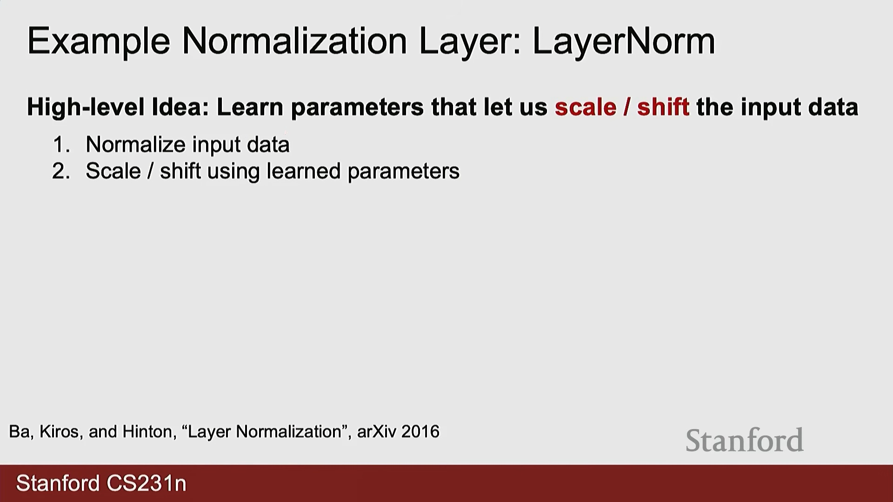

Very concretely, we learn parameters that will scale and shift our input data by a learned mean and a learned standard deviation. How all of these normalization layers work is there are two steps. The first is to normalize the data coming in to be a unit Gaussian, so $\text{mean } 0$, our standard deviation $1$. And then we will scale and shift it.

So multiply by some value to increase or decrease the standard deviation and then shift it to change where the mean is. All normalization layers do this technique, but the way that they differ is how they calculate the statistics. So how are you calculating the mean and standard deviation, and which values are you applying these calculated statistics to?

But all normalization layers are doing this high-level process.

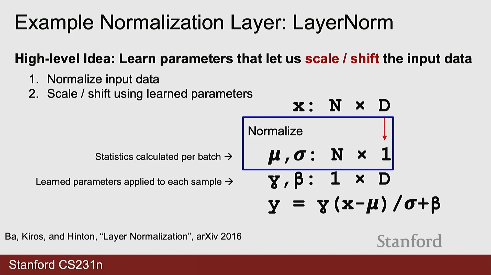

I'll talk about layer norm, which is the most commonly used normalization layer I would say today in deep learning. It's really commonly used in transformers specifically. You can imagine you have some data coming in, $X$, which is a batch size of $N$. We have $N$ samples coming into our model, and each of these are vectors of dimension $D$.

What LayerNorm does is we calculate a mean and standard deviation for each of our samples separately.

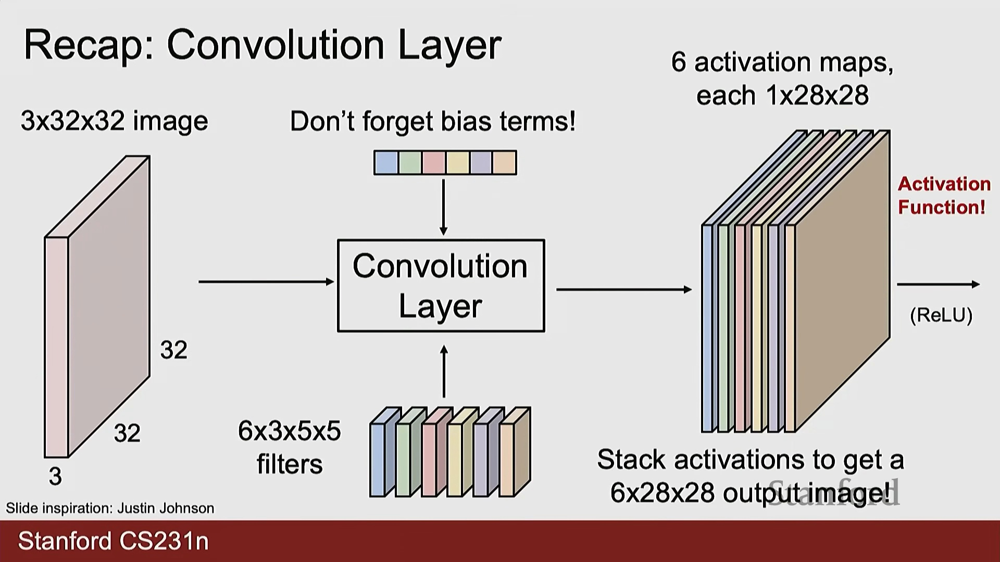

We're calculating what is the mean along the depth or the dimension $D$ here and what is the standard deviation. Then we learn parameters; these are learnable parameters learned via gradient descent in our model to then apply to each sample. We subtract the mean and divide by the standard deviation within our input data to normalize it, and then we apply the scale here with multiplication and the shift.

This is the idea behind LayerNorm. At a high level, all of these different normalization layers are computing very similar things, but the main difference is how they are computing the mean and standard deviation. This visualization comes from a paper called Group Normalization that introduces a new way to normalize. It would say not so commonly used these days, but this is actually a great way to gain intuition about how these different normalization layers are different.

For LayerNorm, I described the really simple case where we just have vectors that were normalizing. But in the case for convolutional neural networks, we have a channel dimension or the depth, and the height and the width—or the spatial dimensions of the image. If we look back into this diagram here, you would basically be calculating one mean and one standard deviation over all of these values.

For each of our input data points, we're calculating one mean and one standard deviation across all of the channels, all of the height, and width dimensions.

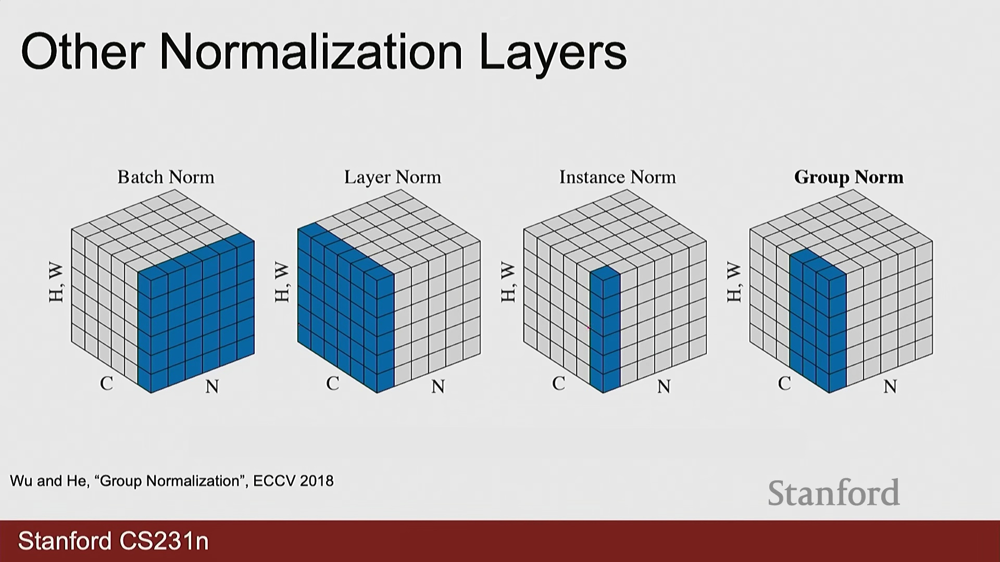

This is what LayerNorm is doing. But you could imagine feasibly that you could calculate these statistics differently. InstanceNorm is even more granular, and then GroupNorm. So the question is for LayerNorm, are we calculating one mean and one standard deviation for each image or input data?

Yes, they're all calculated separately. But for BatchNorm, it would not be the case in this example here. For BatchNorm, it's actually within the mini-batch; when you're doing gradient descent, you have a small batch of data you're looking at. You feed it into your model, and you're calculating the per-channel mean and standard deviation based on all of the data in your batch.

One final question: For channel, same has the layers?

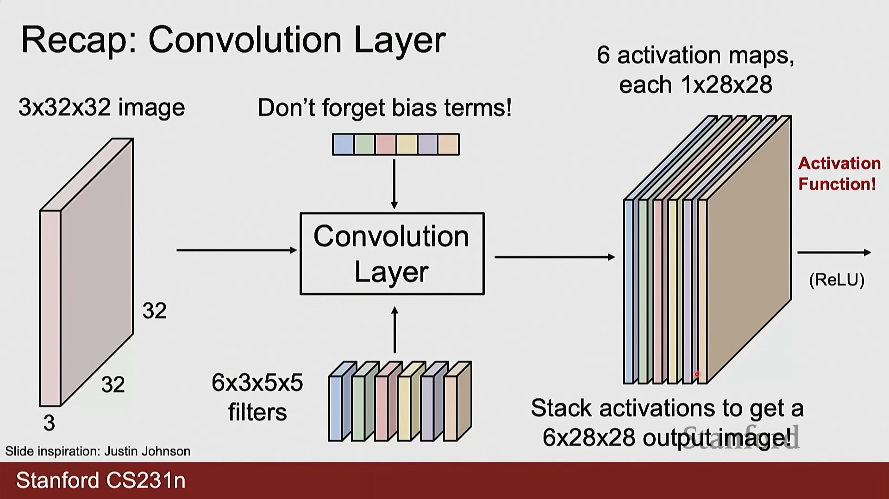

So "channel" here is the depth here—so the number of values you have at each spatial location. Okay, cool. So we talked about normalization layers.

The key idea is you're calculating the statistics, applying them to your input data, and then learning a scale and shift parameter that you then apply.

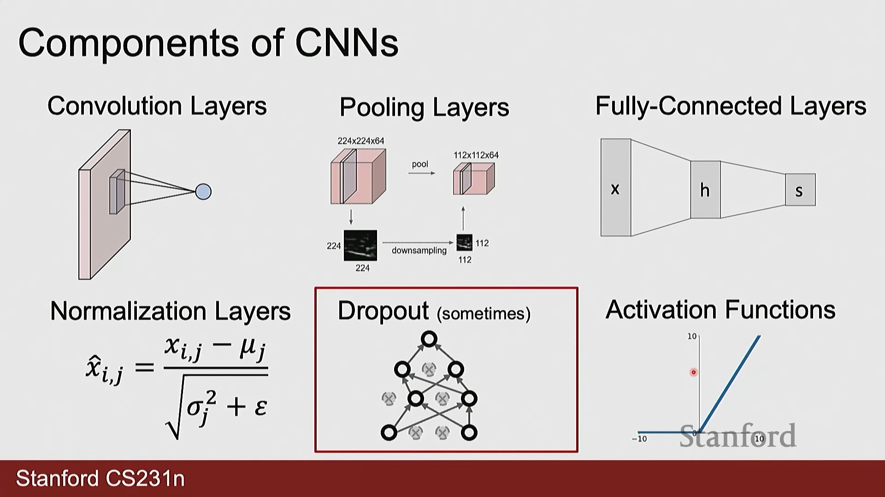

The next type of layer we'll talk about is called dropout, and this is a regularization layer in CNNs.

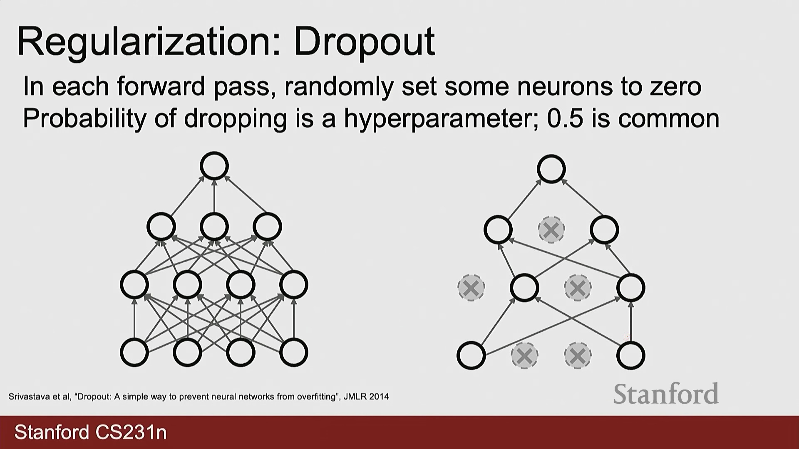

With dropout, the basic idea is to add randomization during the training process that we then take away at test time. The goal is to make it harder for the model to learn the training data, but then it will generalize better. This is a form of regularization. The way we do it concretely is that in each forward pass...

of our layer, we'll actually randomly zero out some of the outputs or activations from that layer. And the main parameter you have for this dropout layer, which is just a fixed hyperparameter, is the probability of dropping out the values. $0.5$ is probably the most common, or $0.25$ is also commonly used here. You're just dropping out a fixed percentage of the values here.

Going forward to the next layer, these would be $0$. So you don't really need to calculate the values here. In general, you might ask why does this work?

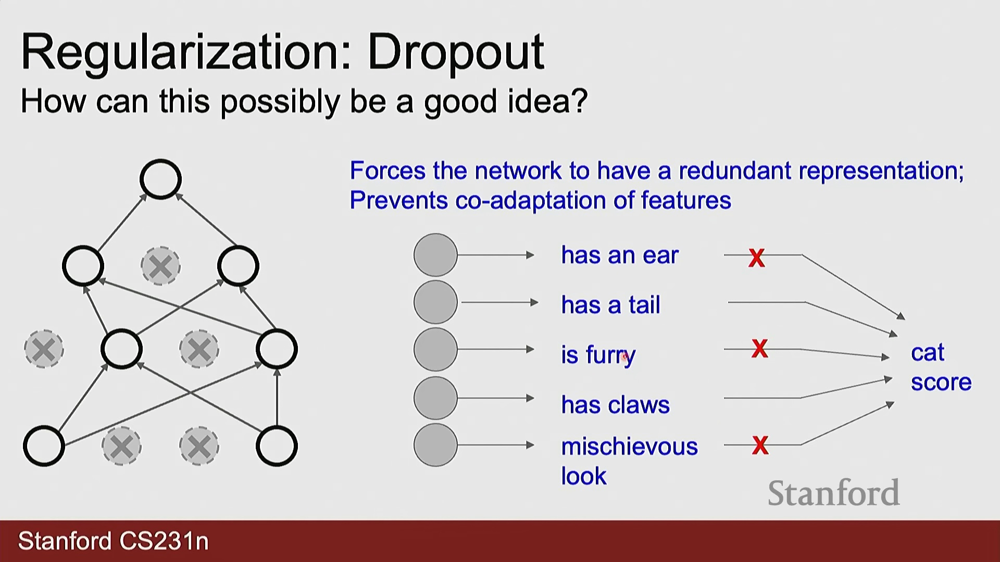

It basically forces your network to—you can imagine it forces it to have redundant representations. One of the useful things about this is because some of these values might randomly be dropped out during training. By having dropout, you're essentially making it so the model can't rely on these during the training phase because it won't always see the pairs of features together.

This is an example for cat. If we had something like tree instead, how would you determine which features to drop out?

The dropping out part is actually completely random, so we're not making any choices about this. It's just that in this case, $50\%$ of your features at any given step will be dropped out and set to $0$.

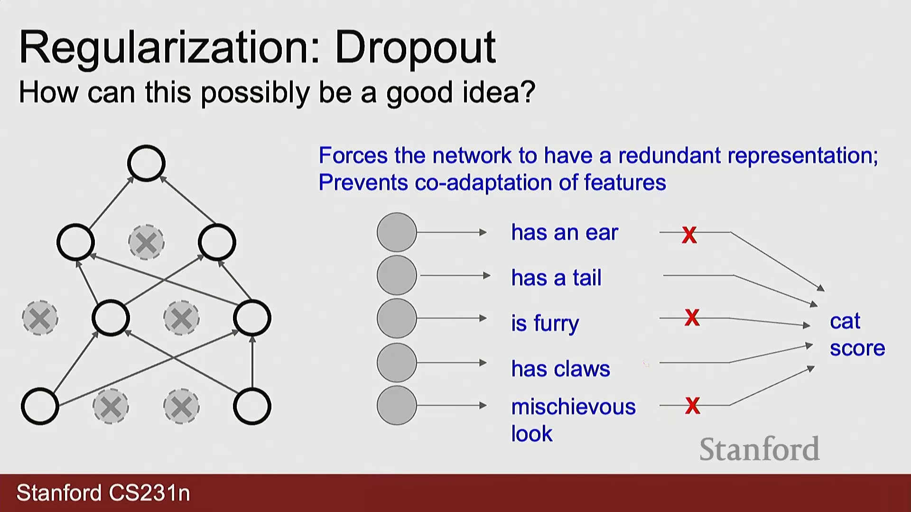

How would the model know if you're only seeing a subset of the features like tail and claw here? The point is you will actually do worse on the training data because you're only seeing a subset of the features. It makes the model worse by not having all the information, but then it does better at test time.

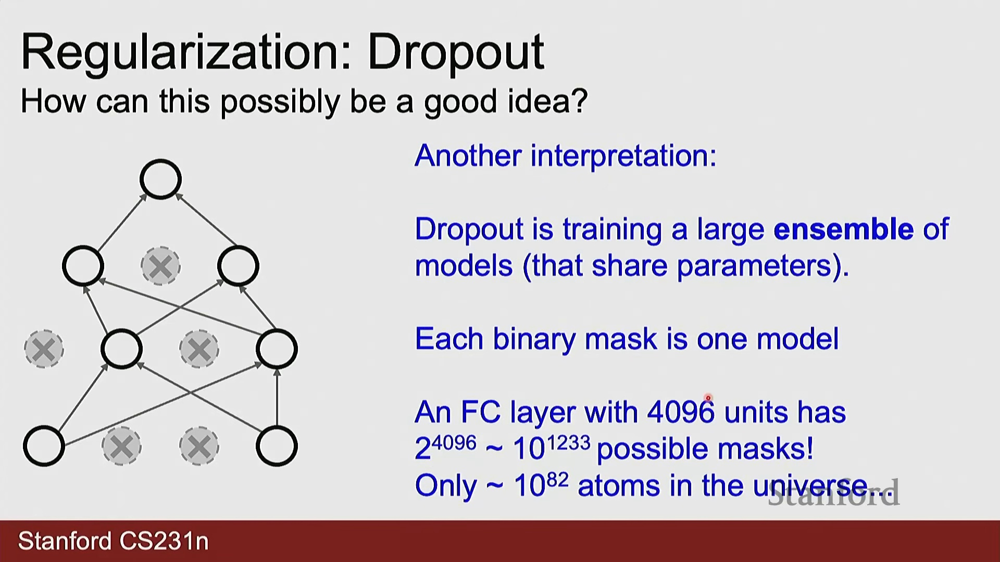

This means worst training time and better test time because at test time, you are basically no longer having this dropout.

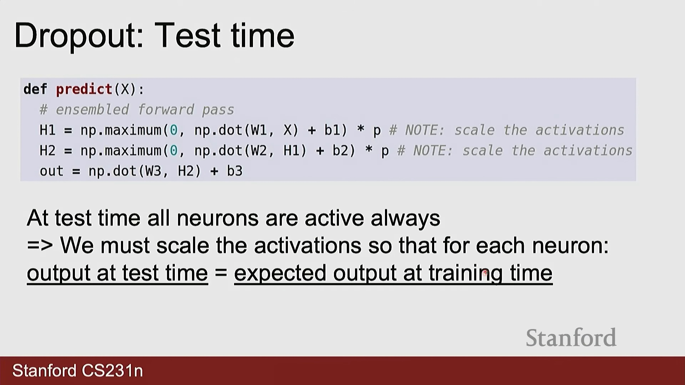

The final component here is the idea that at test time, you're no longer dropping out any of the values. This randomness we add only occurs during the training phase. At test time, we never mask any of the output activations and we remove the dropout idea altogether. This can cause issues if you don't scale it.

What you need to do is multiply by the probability of dropout so that the magnitude of the values coming into each layer is preserved during both training and test time. What about for backprop? For backprop, when you have these zeroed values, it's like you don't need to traverse that path of your directed graph anymore. It's very similar to ReLU.

If you have a zeroed value at that point, the gradient becomes $0$. Anything further back in your computational graph has no gradients calculated at that point. What are we doing at test time? At test time, we are using all of the output activations.

We're not dropping them out anymore, but we need to scale by the probability of drop out. So we multiply each of our output activations by this $p$ value because now we're using all of them. Otherwise, you can imagine you have each node seeing a significantly higher number of inputs than it did during training at test time. You need to multiply by this $p$ value to maintain the same magnitude of your inputs coming in, and the variance stays the same in all these different properties.

It works very nicely if you do it like this. So the question is, can you just add noise to the image instead? The answer is yes, and we'll go over how to do that in future slides.

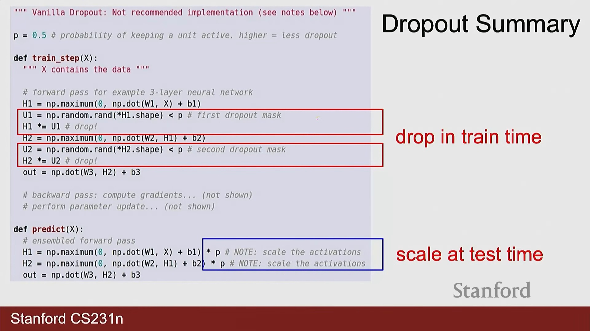

Yes, that's a great idea to add noise to your image. OK, some specific code here. I won't go over this because we already mentioned this, but you are dropping a $p$ percentage of your activations here, and then you multiply here at test time.

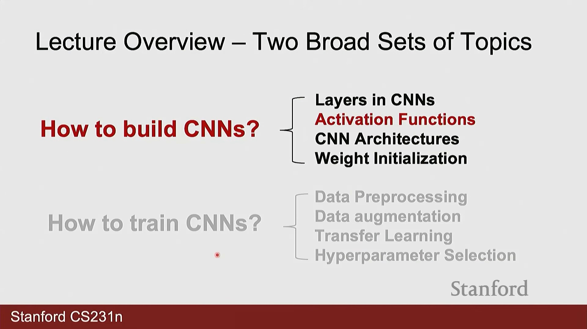

The next topic I'll talk about is activation functions.

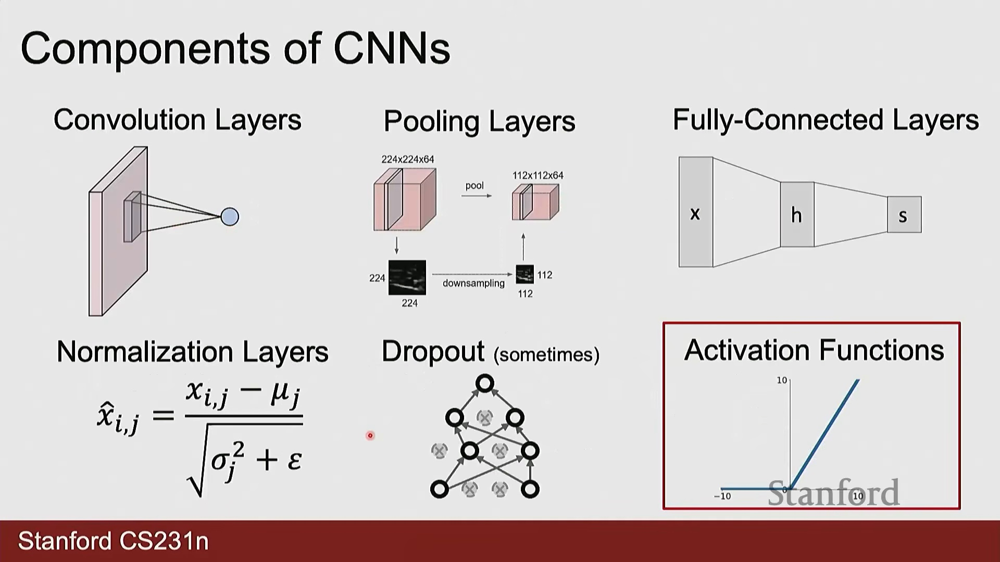

You all have basically learned all of the key layers now in CNNs, and now we're going to be talking about these activation functions.

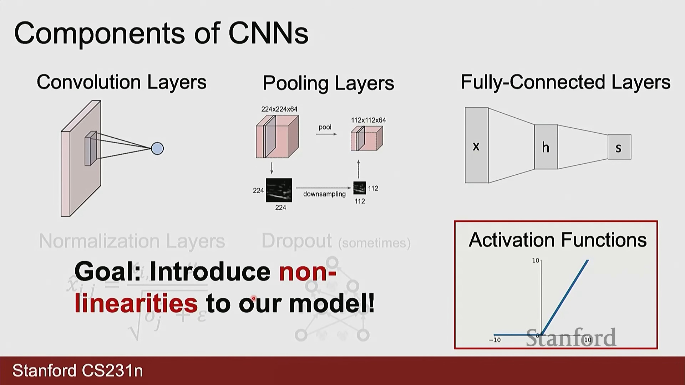

If you remember, the whole point of these activation functions is to introduce nonlinearities to our model.

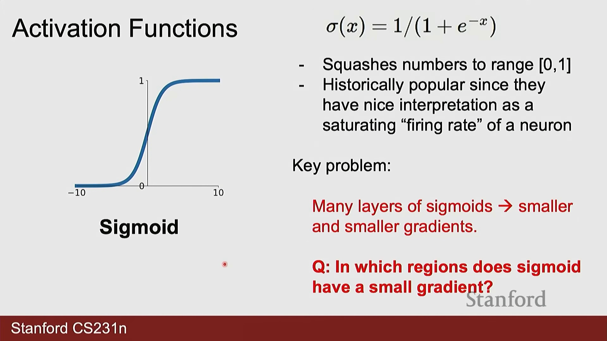

And the whole point of the activation function is to add non-linearity. Historically, $\text{sigmoid}$ was a really commonly used activation function, but there's actually a key problem with $\text{sigmoid}$ that is the reason why it's no longer used today. If you graph it, looks like this. You can see the equation in the top right of the slide here.

The main issue is that empirically what happened was after many layers of sigmoids, you would get smaller and smaller gradients as you're computing backprop. I'll actually open this question up to the class. This isn't a phenomenon we see that occurs with $\text{sigmoid}$. In what regions on our graph does $\text{sigmoid}$ have a really small gradient?

Very negative and very positive values is correct.

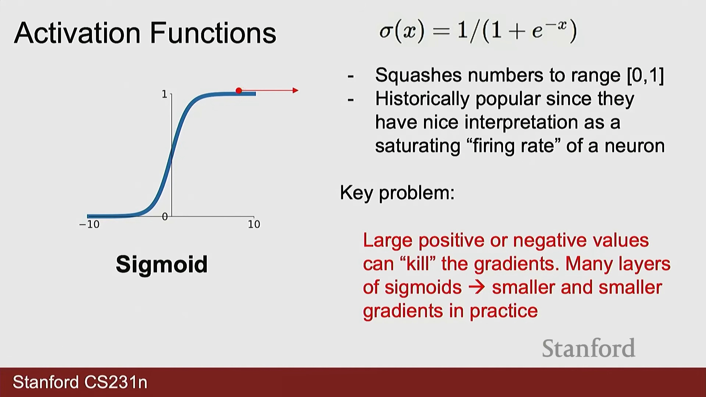

And this is actually a huge issue; you can visually see here in the graph the gradient is very flat. When taking the derivative, it's very small. Basically, for almost all of our input space from $-\infty$ to $+\infty$, you have very small gradients. This means that if the values coming into $\text{sigmoid}$ are very large or very small, then your gradient will be very small.

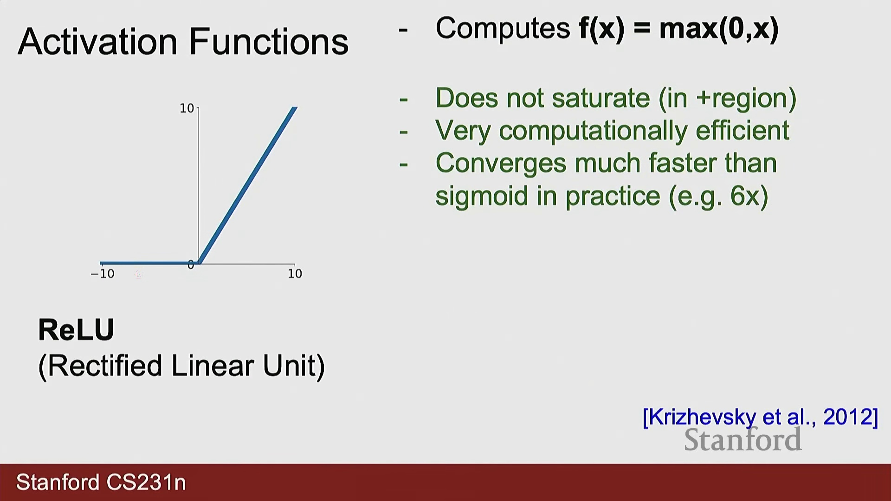

This is one of the main reasons why $\text{ReLU}$ became super popular because now in the positive region we don't have any of this behavior; it's just derivative of $1$ here.

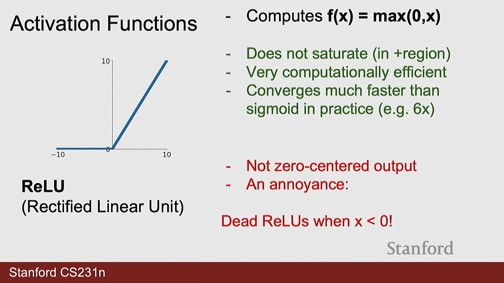

But in practice, you still have this flat portion here on the left where your gradient is $0$. In practice, these work better. Also, it's much cheaper to just compute a $\max$ operation between $0$ and your input value than the $\text{sigmoid}$ function. So for those two reasons, $\text{ReLU}$ became super popular.

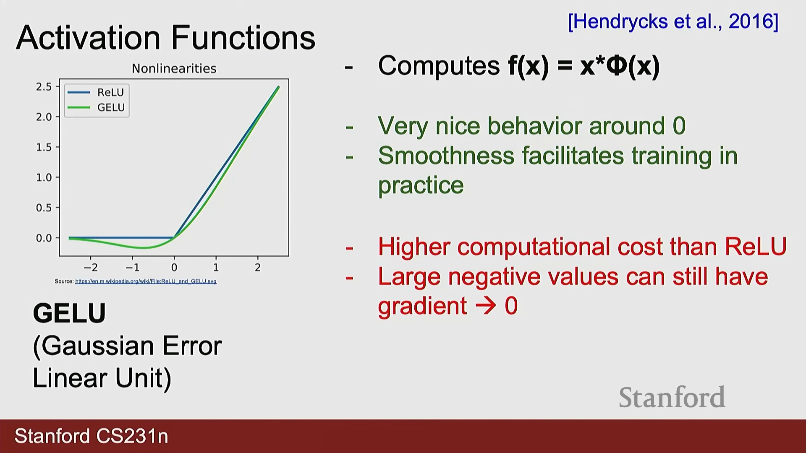

This is $\text{GELU}$, and there's also $\text{SELU}$, which I'll show in a slide but won't go over the formula. They look very similar. The basic idea is to smoothen out this non-smooth jump here in the derivative from $0$ to $1$ at $0.0$ for $\text{ReLU}$. This is a very sharp and non-smooth function with $\text{ReLU}$, but the nice part about $\text{GELU}$ is we actually have non-zero gradients here.

In the limit as $x \to \infty$ or $x \to -\infty$, it does converge to $\text{ReLU}$ as well, but you get more smooth behavior in the middle here. Specifically what $\text{GELU}$ calculates is this Gaussian error linear unit. This is the cumulative distribution function of a Gaussian normal. If you imagine the area under the curve of a Gaussian, that's what this $\phi(x)$ is at any point $x$.

So if you have a really negative value here, you'll have a value close to $0$, which is why it converges to $\text{ReLU } 0$ here. And at a very high positive value... It gets very close to $1$, the area under the curve so it converges to $x$ here. So this is GELU.

It has these nice properties and it converges to ReLU at the extremes too. This is the main activation function used in transformers today.

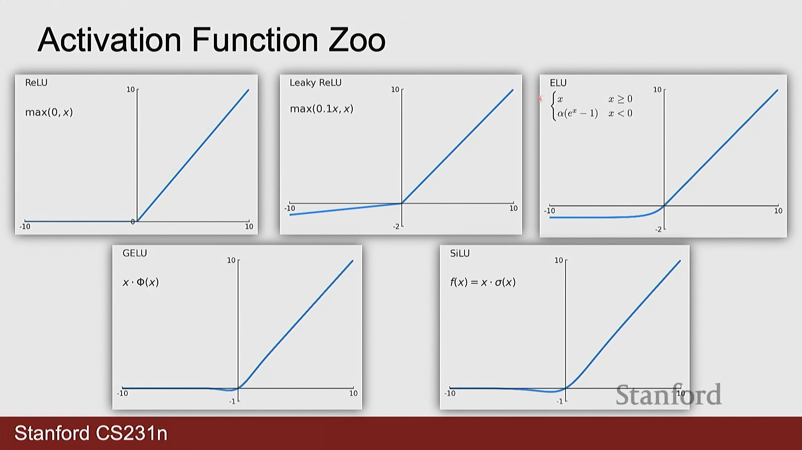

If you look at all of them, and you squint, a lot of these look the same. The basic idea is something relatively flat. And then in the limit, it approaches $f(x) = x$, and it becomes a linear line. SELU is actually $x$ times $\sigma(x)$, which also has this property that for very negative values, you have something close to $0$, and for very positive values, it's close to $1$.

It's actually similar to the cumulative distribution function for the unit Gaussian, that is $\Phi$ here. That's why the shapes are actually really similar looking too.

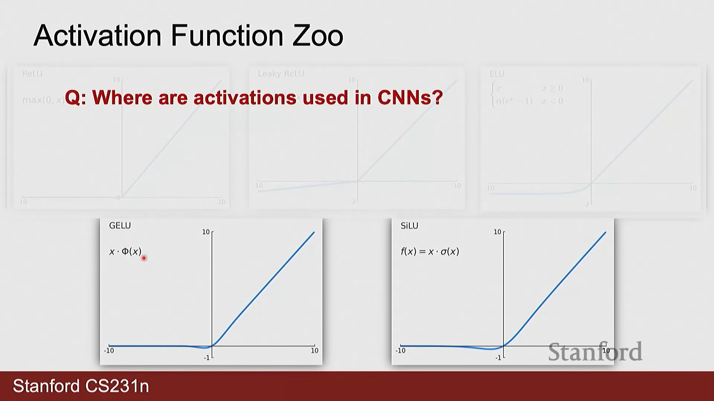

You might ask where these activations are used in CNNs, and the general answer is that they're placed after linear operators.

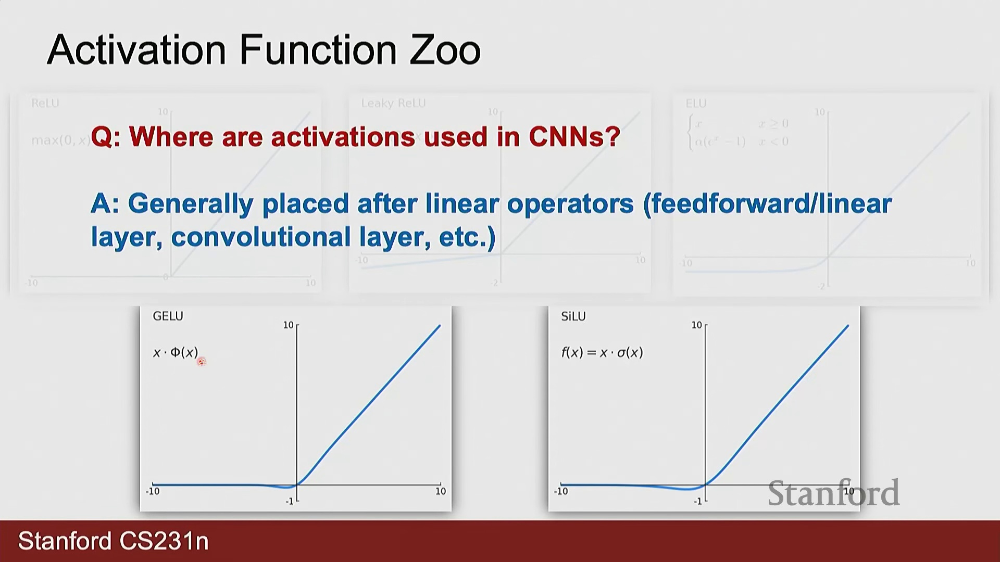

Or if we have a convolutional layer, pretty much after this is where we place it.

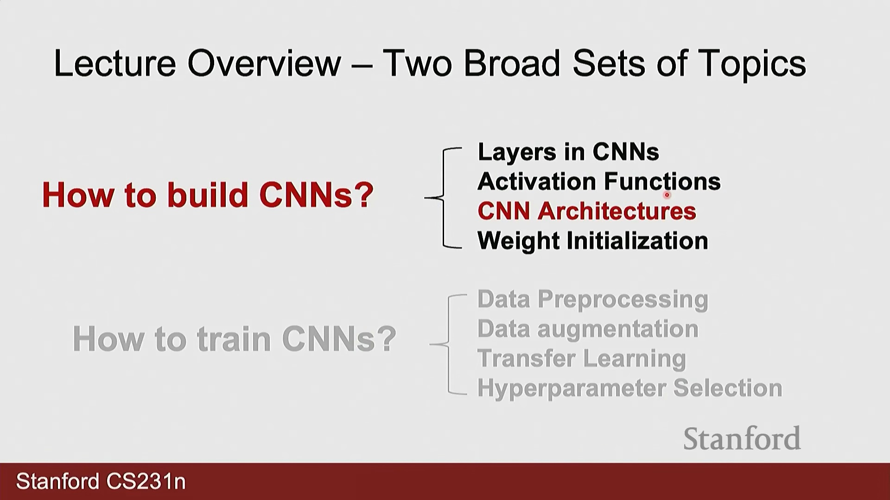

So after the convolutional layer, after these linear layers, we put the activation function. You've learned everything now about all the components of CNNs. I'll now go through some examples of how we put them together and how people have created state-of-the-art convolutional neural network architectures.

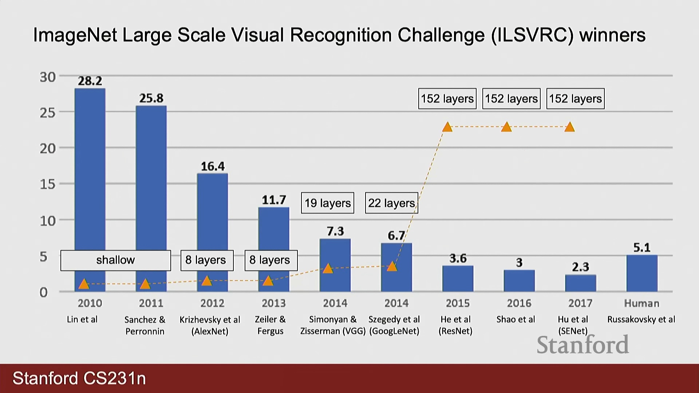

This is a really neat slide because it plots two different values. On one hand, we have the error rate, which are these blue bars. This is over time; these are different models people have trained on ImageNet. Then you have these orange triangles, which represent the number of layers that models have.

We'll go over in class today how they were able to achieve this, and what were the design challenges and goals for how they did this. Historically, AlexNet was the first CNN-based paper that worked really well on ImageNet. They were able to train it by using GPUs.

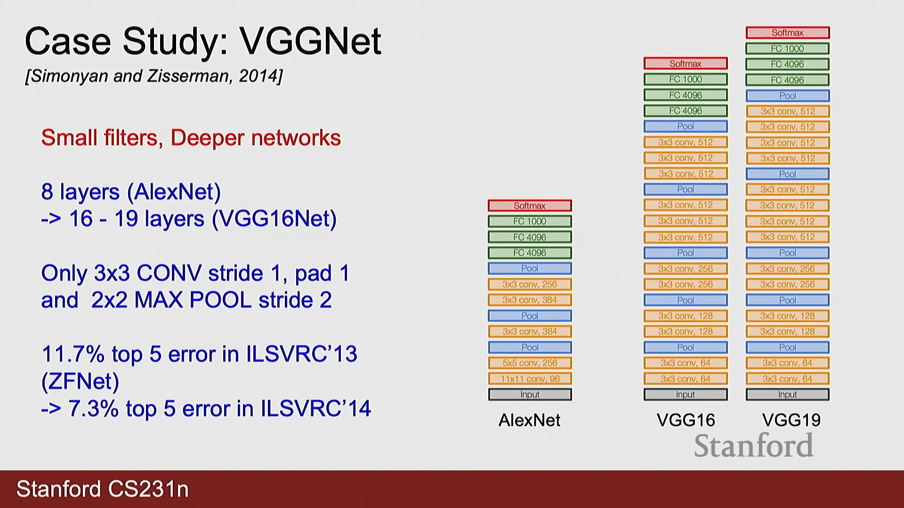

I can plot the two CNN architectures together side by side here. In general in AI, we like to plot our model architectures using block diagrams, where each block represents a different layer or a group of layers that are stacked together. It also helps you gain intuition about what are the general differences at an initial glance. These orange blocks, which are the common ones here, are $3 \times 3$ convolution layers.

These are convolution layers that have filters that are sliding across that are size $3 \times 3$. Their stride is $1$, so they're visiting every location in the image, not skipping over anything. They also add padding of $1$ around the outside so that we're not shrinking as we do these convolutional layers. They also add these max pooling layers throughout here too.

You'll notice that for all of these after a pooling layer, they'll start doing two sets of fully connected layers of dimension $4,096$ followed by a dimension of $1,000$. The reason we have $1,000$ at the end is because ImageNet was $1,000$ different image categories. So we need to have scores for each of these categories. The final layer is always equal to the number of classes you have for an image classification problem.

You can see it actually looks extremely similar. It's just like a scaled up version of AlexNet with more layers here. They are also doing some three groups of convolutions at a time, followed by pooling rather than two layers in a pooling or even one. These are, I would say, the simplest models we're going to discuss today.

You might ask why are they doing $3 \times 3$ convolutions?

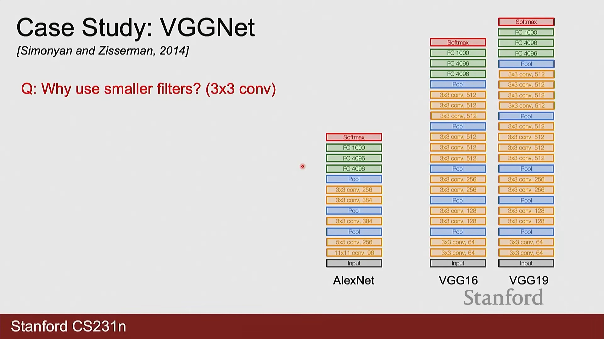

How do they pick this value?

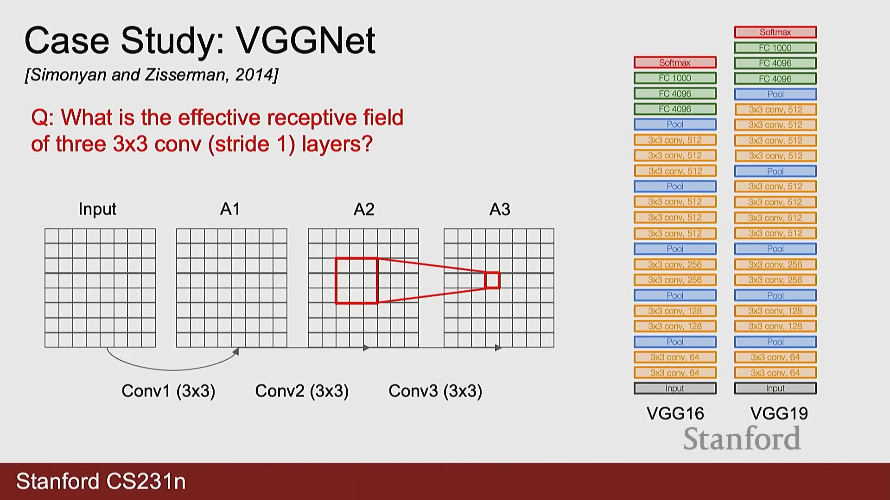

There is actually some intuition behind how they chose $3 \times 3$, and specifically they have groups of three or even four of these. I'll ask you all a question: What is the effective receptive field? We looked at receptive field last time, but it's basically the idea of the parts of your input image that a particular value in your activation map has seen before.

What values have been used to compute the final activation map after many layers of your model?

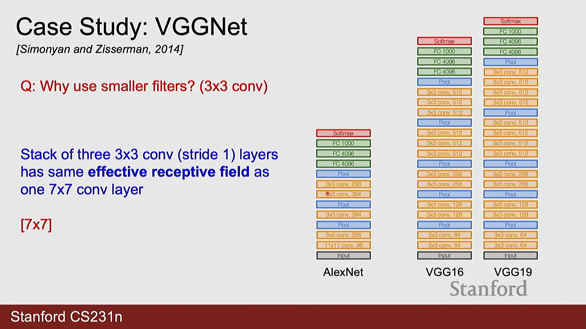

You have three of these layers that are all $3 \times 3$ convolutions with the sliding filter with a stride of 1. What is the effective receptive field of each value in our activation map $A_3$ here? This is after the third layer, and I'm showing one of the layers here. You can see that for each value in $A_3$, it is computed by looking at a $3 \times 3$ grid of values in $A_2$.

Conceptually, for each one in $A_2$, it is a $3 \times 3$ grid in $A_1$, and for each of those, it is a $3 \times 3$ grid in our input. I'll let you all think about this for a little bit; maybe it will help to see the next layer here. It is actually really helpful to visualize this. At $A_1$, each of the corners here is calculated from a new $3 \times 3$ grid from our input.

How large is this overall square? $7 \times 7$.

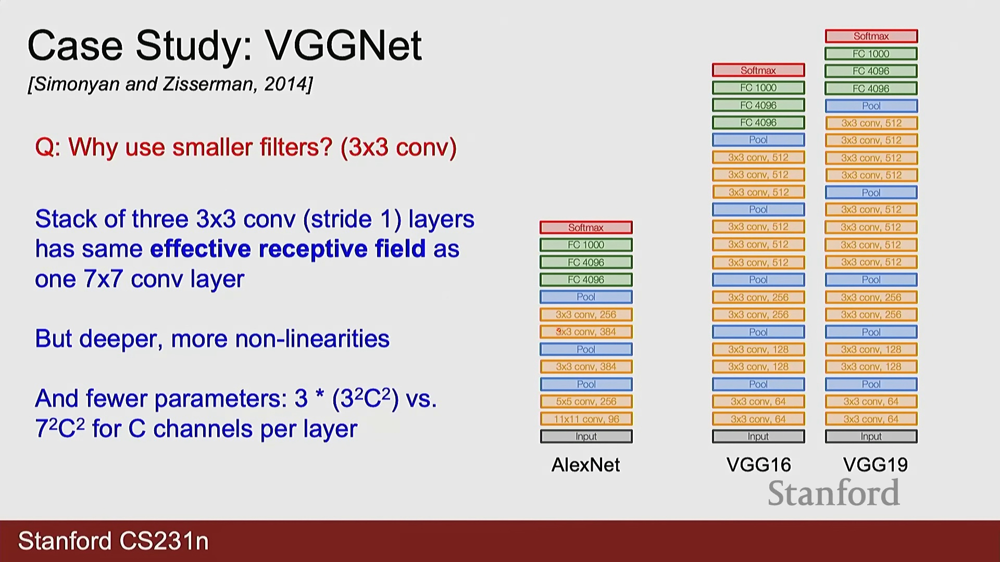

This first one is $3 \times 3$; the next one is $5 \times 5$, and then the next one is $7 \times 7$. We can visualize it here pretty easily. After having many blocks of those, you are just adding two each time. We have shown that a stack of three of these $3 \times 3$ convolution and stride 1 layers has the same effective field as one $7 \times 7$ layer.

The question is how much of this is justification after the fact versus how much of this is intuition they use to design experiments? I think it probably depends on the architecture; for some, it's more intuition focused. However, for ResNets, I do know it was a hypothesis that led to the creation. This is a really nice property: three of these $3 \times 3$ layers have the same effective receptive field as one $7 \times 7$ layer, and it also has fewer parameters.

If you imagine our channel dimension is staying the same, you have these $3 \times 3$ grids where we have your input number of channels. $3 \times 3 \times C$ would be the number of values in each of these filters. If we have $C$ of these filters, it's $3 \times 3 \times C \times C$, or $3^2 C^2$. We have three layers total, so through this lens, it's actually fewer parameters.

We are building a more complex and more nonlinear model here, achieving more with fewer parameters, allowing it to model more complex relationships among your input data.

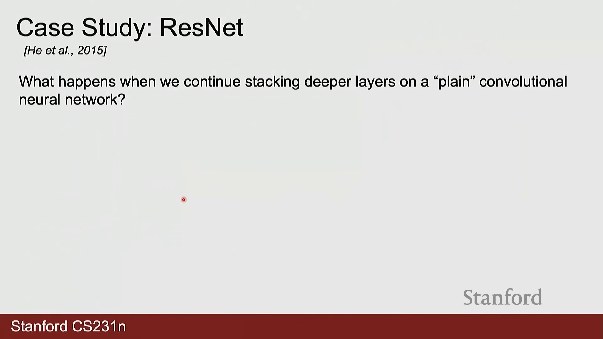

I will now talk about ResNets, bringing up the thought experiment someone asked a question about. There was an empirical finding that spawned much of the conversation around designing ResNets. The idea was shown that if you keep stacking deeper layers on a plain CNN network—building it larger and larger—what happens?

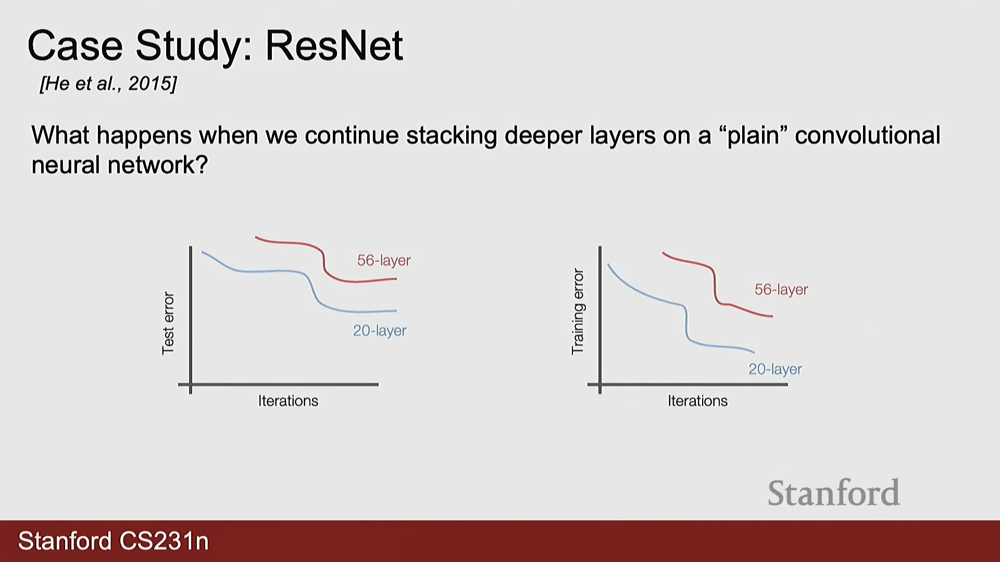

We found that the 20-layer model will actually have a lower test error than a 56-layer model. You might think this is because of overfitting, but it's not; if we look at the training error, the training error of the 20-layer model is also lower. It has a lower training and a lower test error, which basically means that the model is doing better on all accounts.

Why is the 56-layer model performing worse than the 20-layer model?

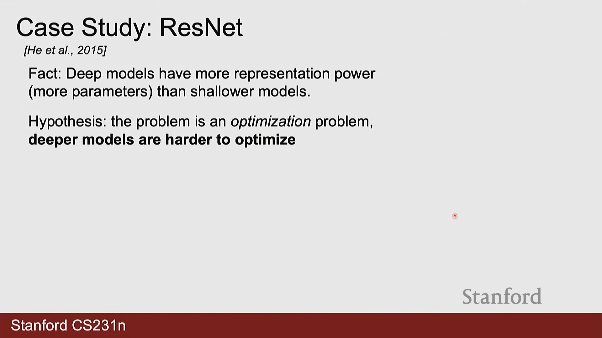

We know this is not caused by overfitting. These deeper models have more representational power, and theoretically they should be able to represent any model that a more shallow network can model. The set of possible mappings between your inputs and different values for your larger networks is a superset for your smaller networks. And then if you set half your layers to do nothing, you have exactly the same representation power as a model one half the size.

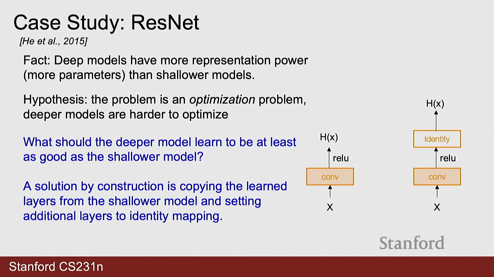

So I hinted at it before: how specifically could the deeper model learn to be at least as good as a shallow model? It's by setting one of the layers to essentially be an identity matrix or just an identity function. The model should be at least as good as the shallow model.

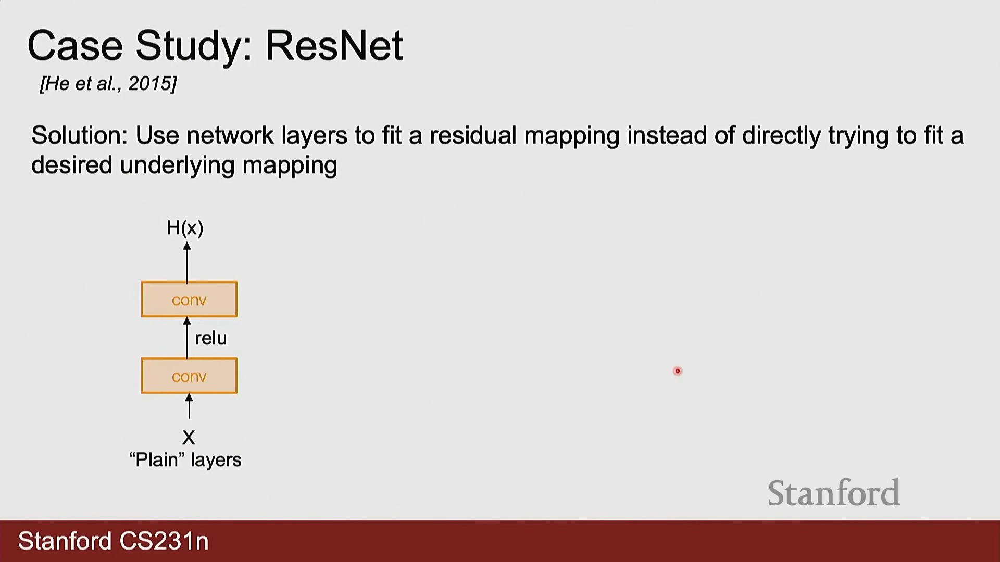

So, how do we actually build this intuition into our models? We want them to be able to be just as good as a shallower model if they want to be during optimization. The way that we do this is actually by fitting what's called a residual mapping instead of directly trying to fit a desired underlying mapping.

Basically, at this point, $F(x)$, which is called the residual map here, could just learn zero values for all the conv filters, and the output would be $0$. Then we would just add $x$ along here, and we would get $x$. This allows a very simple way for the model to bypass these layers if it doesn't need to learn anything. What this means is you can really easily now learn basically this identity function that we talked about earlier by just learning zero filters.

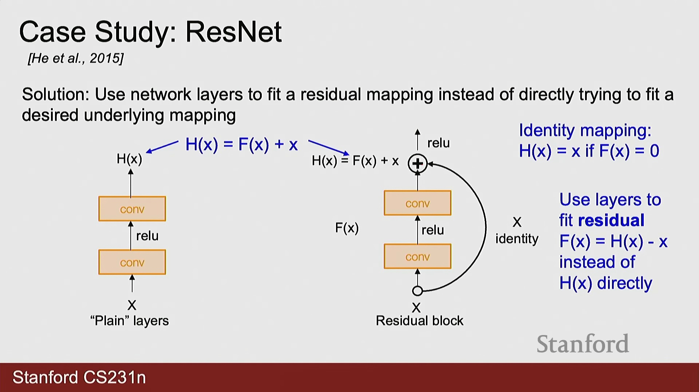

You're now just learning this sort of difference between your desired output here and the copied over block. The intuition was we need to build a model that can really easily model the shallower networks so it can be at least as good as a shallow model. Empirically, this showed to work extremely well too. So what is the residual block carry?

We have our input $x$. We pass it through two different convolutional layers and get our output $F(x)$. $x$ is just copied over here. This is exactly the same as $x$, and we add it to the output of these two blocks, which is $F(x)$.

Remember, $x$ is the output of one of the previous layers; or if it's the very first layer of the model, it would be the image. The question is whether maybe you just don't have enough data, and if you added enough data, then maybe you could train a model without these blocks. I think these blocks actually do extremely help you with learning from more data.

The issue was really an optimization problem. Residual blocks help you use more data more efficiently because you're able to model a greater number of functions.

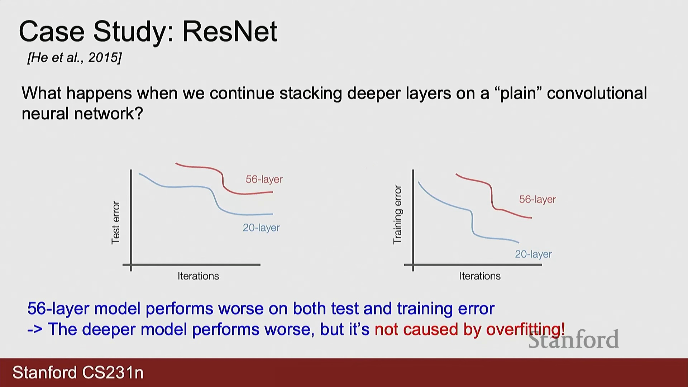

The answer is no; they were not converging to the performance of the smaller model, regardless of how long you trained it. And the reason is because it's being stuck in essentially local minimum.

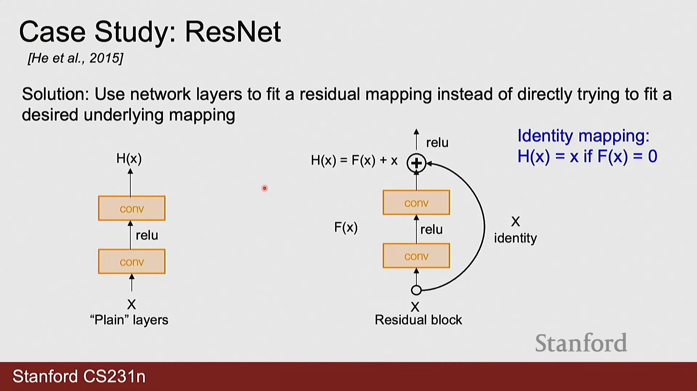

And when you add these residual connections, you're avoiding these. This is the actual explanation why this is the case is still, I would say, being a more active area of research. Oftentimes, this is truly an empirical finding, but there's some intuition behind it. In this case, the intuition was that we want to enable our models to do at least as well as the shallower models, which we know were performing better at the time.

It's not that you could just train it for longer and it would do better; it was actually a limitation—it was just completely unable to achieve as good as the shallower models.

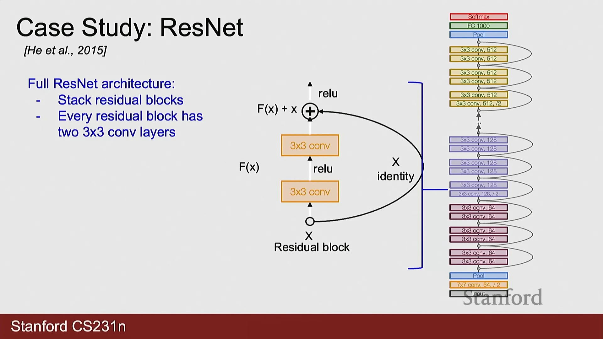

Here's the overall ResNet architecture. We have these stacks of residual blocks now. That's what these two blocks together mean: it's a residual block. We have a $3 \times 3$ convolution with a $\text{ReLU}$ followed by another $3 \times 3$ convolution.

We are copying over this $x$ value here, adding it to the outputs here, and then we're having a $\text{ReLU}$ afterwards. Each of these pairs of blocks is one of these residuals. That's why you see this line skipping over here because the value is getting added forward.

The region from 101 to 152 is where the performance wasn't really changing. It was marginally better, but performance changes maybe only $1\%$ at that point. I don't know how they got the number of 152. I think they wanted to try different values here.

You can see that—they are not exactly doubling, but there is a significant increase each time. Maybe they showed it somehow worked better than other; I actually don't know though. That's probably why they stopped at 152—it's because performance wasn't increasing as much anymore. There is thus a limit for given your compute setup, how large of a model you can train.

You need to train these models separately, so you have one model run for 18 layers and one for 34, etc. The question is: how do we think about the intuition of $\text{CNN}$ blocks, given we're using these residual connections? Because you can still think of it as higher levels of abstraction, and this is shown to be true in the layers. Instead of learning within the block itself—instead of just learning the higher level features—you're learning the delta from the original image to get the higher level features.

That's what you're learning in the block: you're learning the $\Delta$, but you're still achieving these higher level representations at each step. That part is the same, but the actual functional way of doing it is that you learn this $\text{F}(x)$ which you add your previous input to.

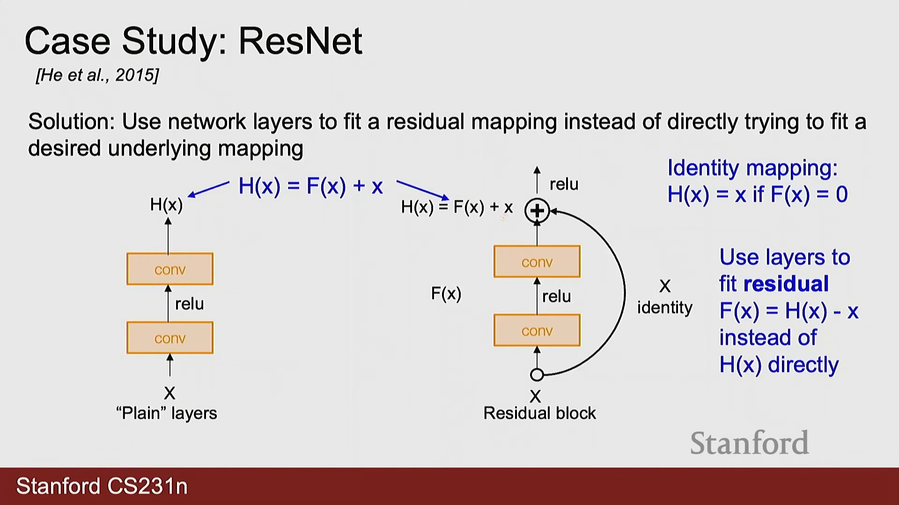

So it's like you're learning the delta. The question is: if you do addition, does that require you to have the same tensor size?

The answer is yes.

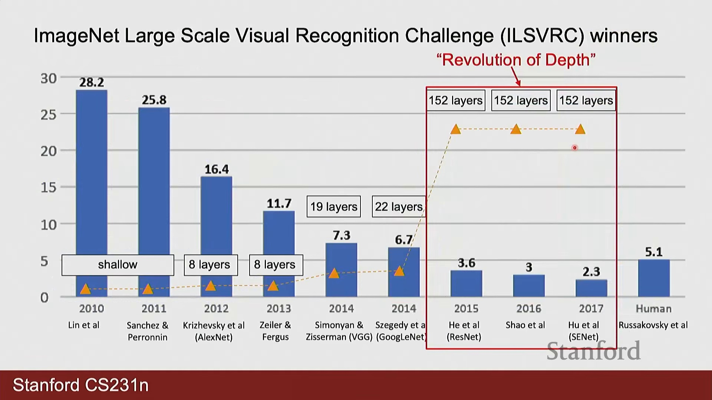

These residual connections are done before a pool, at least the regular one.

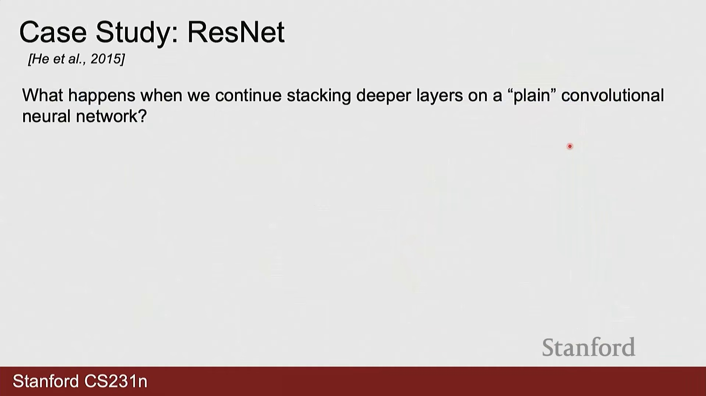

You could get around it by just having each value be spread out into multiple values, for example.

These are basically the main takeaways for ResNets. One other neat trick they do is that periodically, after a certain number of these blocks, They'll double the number of filters and downsample the spatial dimension.

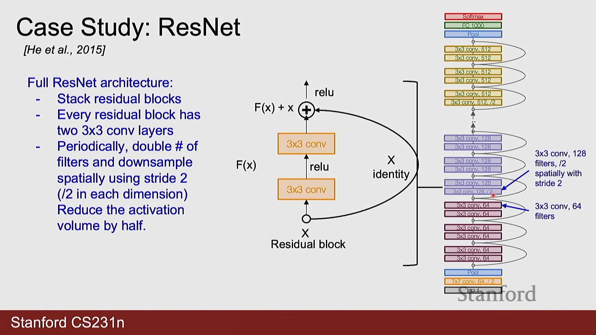

This is how to think of it. And then at the very end, it just becomes a vector that you then use for classification.

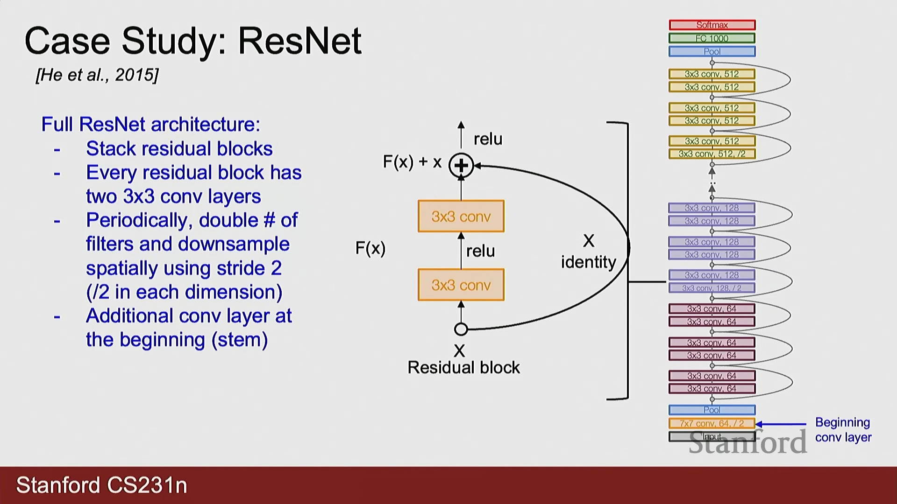

That's how you should be visualizing what's happening to the values in the network itself and the shape of them. It was just empirically shown that it did better if they added this here.

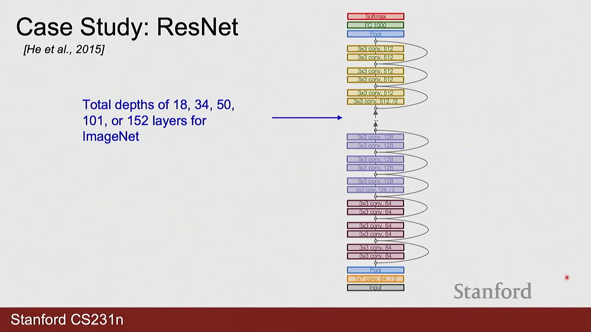

So this one is purely empirical finding.

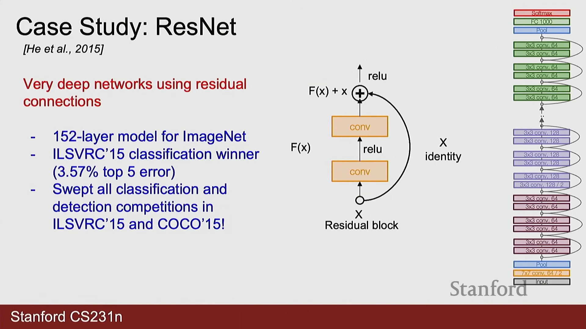

It was the first time they were able to train 100 plus layer models successfully, so it was a really big deal. Basically, ResNets were used in a huge variety of computer vision tasks afterwards.

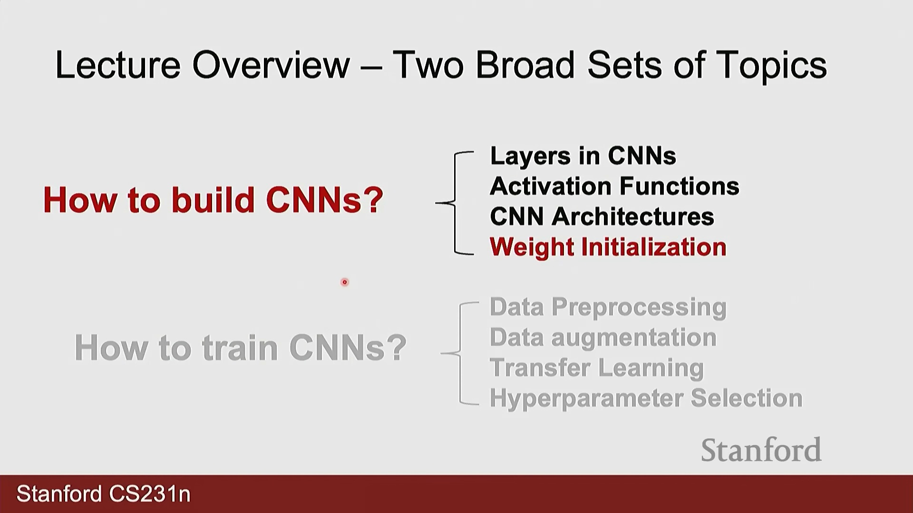

Almost every task in computer vision was using a ResNet at the time because they performed so well because of these residual connections. So we talked about why the smaller filter size is useful and having many layers of these is useful.

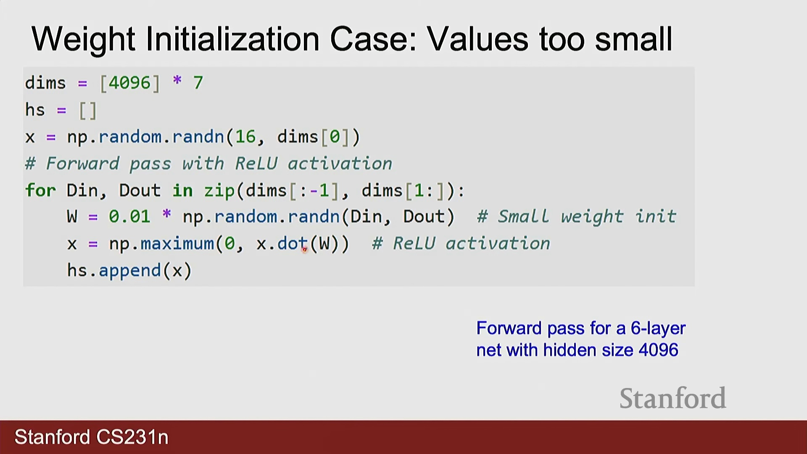

Depending on what values you choose, you could either put values that are too small or too large, which would cause significant issues for your model during training. Here it's basically a six-layer network where we have 4,096 dimensional features. This is just six layers of fully connected model and we initialize them.

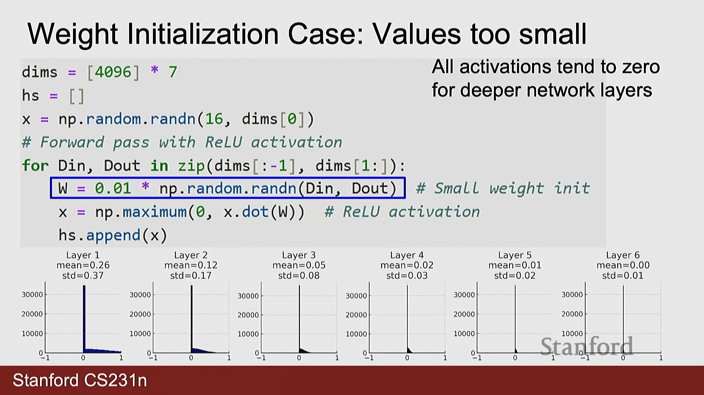

But as each layer progresses, because we had a really small weight initialization, it becomes smaller and smaller mean and standard deviation.

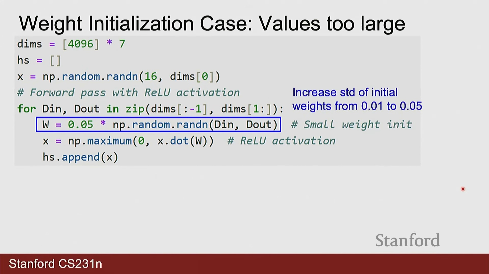

Ideally, we would want basically all of these to be the same for each layer because it makes our optimization problem much nicer to solve. If we say use $0.05$ instead of $0.01$, can anyone imagine what might be the issue here if we set it to too large of a value? So when it's too small, it goes to $0$, basically. What happens if it's too large?

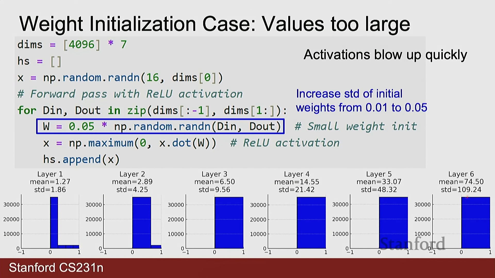

Basically, the activations get larger and larger at each layer. If you plot it here, you can see that by the end there's some massive mean and standard deviation. And if you're training a 152-layer ResNet, you can imagine that this becomes quite an issue very quickly. So how do you actually do this?

In this case, maybe the optimal value I think is $0.022$ or something, but how would you actually know that and how would you do this more generally across any layer? There are a few different ways you can initialize weights. I'll go over the most commonly used one today in class, but no, there are other ones. Generally, what they're a function of is the dimension of your values here.

So you'll have a different value for a 4,096 dimensional fully connected layer versus a 2048 dimensional one.

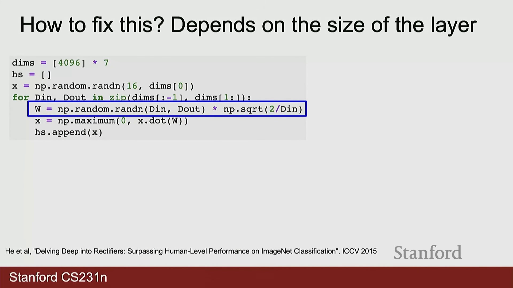

The specific formula we'll go through is called Kaiming Initialization. It's actually the same person who created ResNets. Kaiming, he was very famous. I mean, he still is a very famous computer vision researcher.

I think he's one of the most widely cited computer scientists of the last 10 or 15 years, maybe the most. He's extremely well known in the computer vision community. And he also came up with this idea of initializing the values to $\sqrt{\frac{2}{\text{input dimension size}}}$.

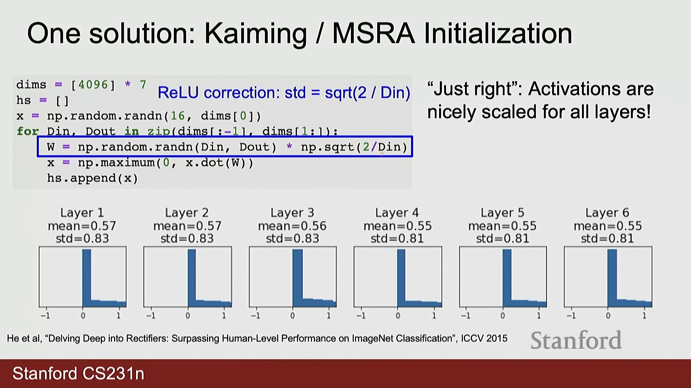

But if you do plot it, you see this does have the effect, so you can almost think of this as a magic formula where if you plug it in [you] get the desired properties. If you want to know the derivation, we link the paper here so feel free to look into that, but you can just take our word. I won't go through the details here, but it does this desired effect where the mean and standard deviation is unchanging.

You can also imagine that for any given setup, you could also, just through testing, try to find what is the value here.

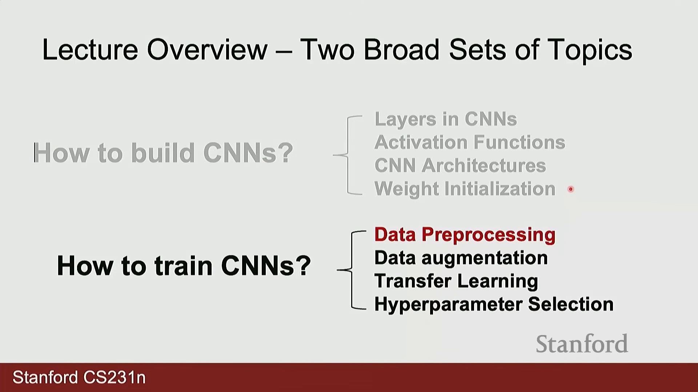

We covered quite a few topics already. I will pause very briefly to see if there are any questions about these points. The second part of the lecture is actually much less dense than the first part.

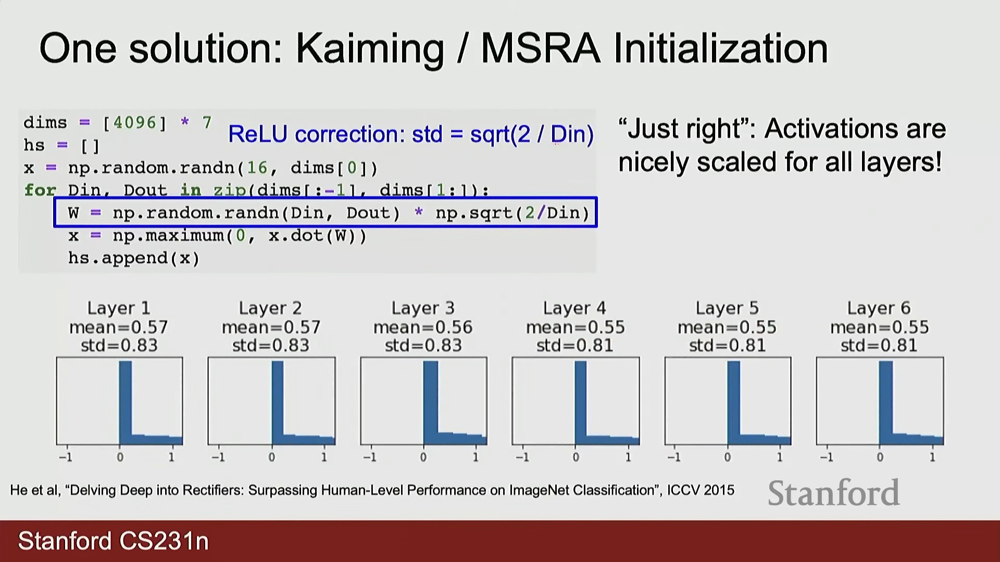

We will be mainly going over a lot of practical tips for when you are training these models. The question is, how do you do weight initialization for CNNs? You still use the same initialization, but your dimension $n$ here is the size of your kernel. If you have a 3 by 3 kernel with channels—say 6—it would be $3 \times 3 \times 6$, but it's the same idea.

You just calculate your dimensions differently depending on the layer type. You can think of it as the number of values roughly in each operation, but it does depend on the layer. Some layers use different weight initializations, but this addresses specifically how initialization applies to CNNs.

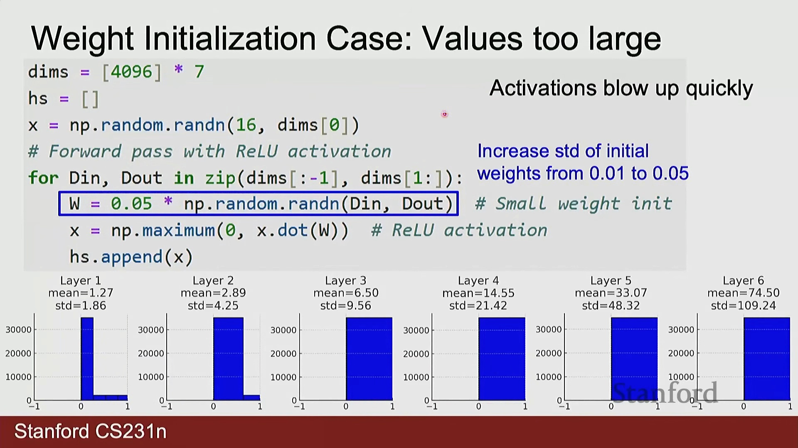

The question is, why do activations explode if you have too large of an initialization value? You imagine that at each layer of your initialized network, you have a set of randomly initialized values. If they are very large, then when you perform a ReLU activation afterward, and that doesn't actually cap the outputs of your layer—you can go to infinity with ReLU.

You could think of it as being like a recurrence relation where in a simple recurrence relation, you would want it to be one. After the ReLU, you basically have a standard deviation for what are your activations. Then you remove all the negative ones, and you are left with your outputs at that point. If you have really large values, you have a really large standard deviation.

When you remove the bottom half of it, your mean starts moving more positive and more positive. The conclusion of this discussion is that normalization would solve this activation issue where they are blowing up, but it still might be harder to optimize. It would solve this particular issue, but maybe it is still hard to optimize in the discussion.

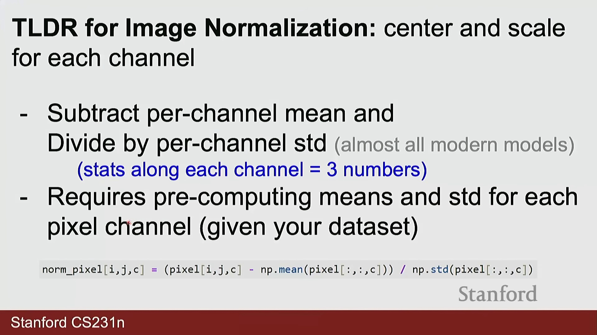

How do you actually train your model? The nice thing about data pre-processing for images is that it is really easy. If you have a giant image dataset, the standard way to do it is calculating the average red, the average green, and the average blue pixel along with the standard deviations. You take your input image, subtract the mean ($\mu$), and divide by the standard deviation ($\sigma$).

This is how you perform data normalization for images; it is very straightforward. It requires pre-computing the means and standard deviation for each pixel channel. Sometimes people use means that have already been calculated. A very common practice is to use the ImageNet means and standard deviations and apply those to your input images, even if you are training a model not on ImageNet.

This process is very dataset dependent. Any input image has this operation applied before the model sees it.

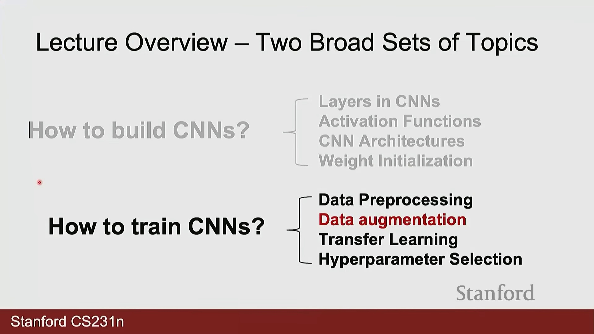

In terms of data augmentation, someone suggested earlier in class why don't we just add noise to our image? That is a great idea, and we will talk about the different ways you can add noise to your image here.

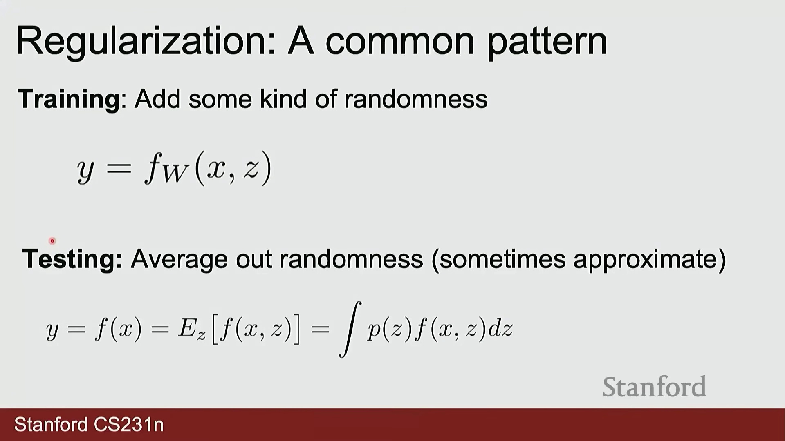

This helps with regularization and helps prevent your model from overfitting. You add some kind of randomness. At testing time, you then average out the randomness.

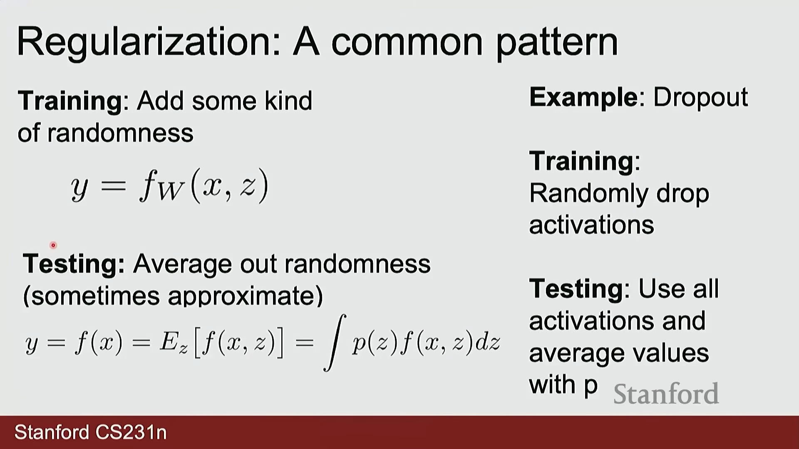

Sometimes this is approximate, but for example, for dropout, we saw that during training time we'll randomly drop, say, $50\%$ of the activations. And then at testing time, we'll use all the activations, but then we'll need to scale it down by the probability of dropout $p$.

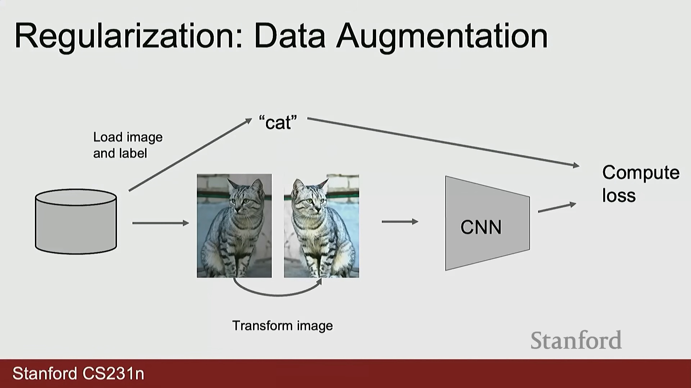

So this is a really common pattern. It's also used for data augmentation. You can imagine this: this cylinder here is like your dataset. You load an image and a label—we have a cat label, and we have our original image from our dataset.

Before we actually pass it into our model, it's extremely common, and basically always in modern deep learning, people will always use data augmentation for training computer vision models.

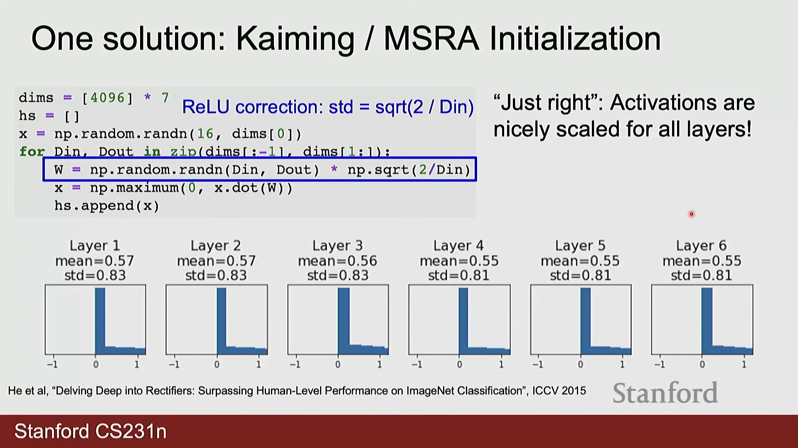

It makes it harder for the model to just memorize. How do we know the weight initialization is just right?

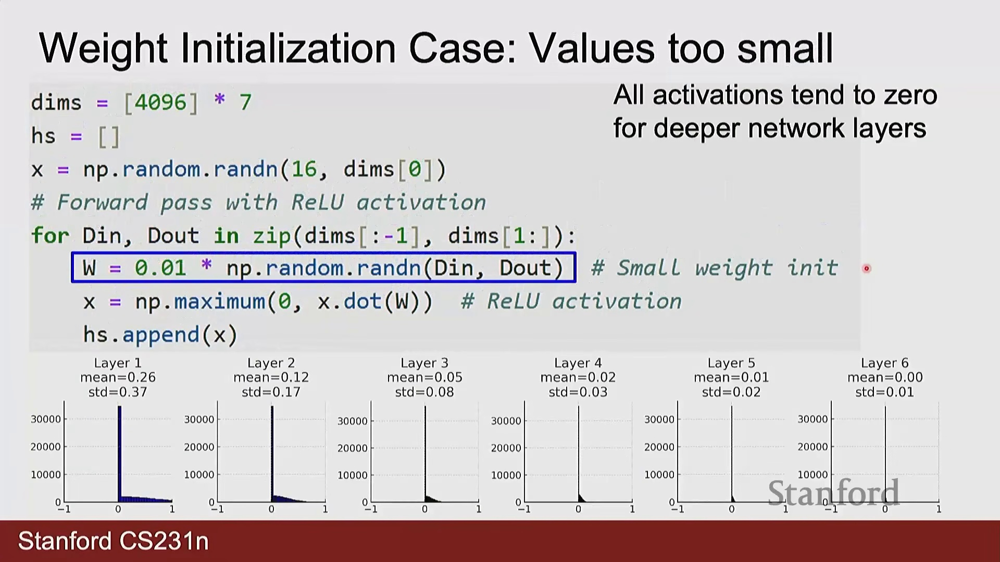

In this case, we saw mode collapse to $0$.

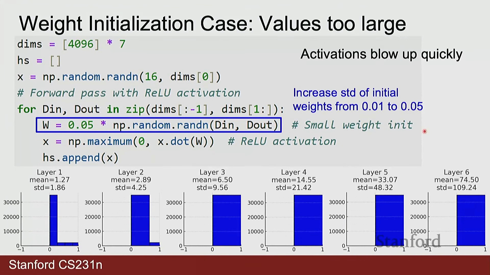

In this case, it was blowing up to infinity as we increased the number of layers.

The way you can ensure it always happens is by using the formula $\frac{E[W^2]}{var(W)}=1$. This will always initialize them well. In practice, that's how people do it. But generally for these linear or convolutional layers, you can use this formula here, which is called the He initialization.

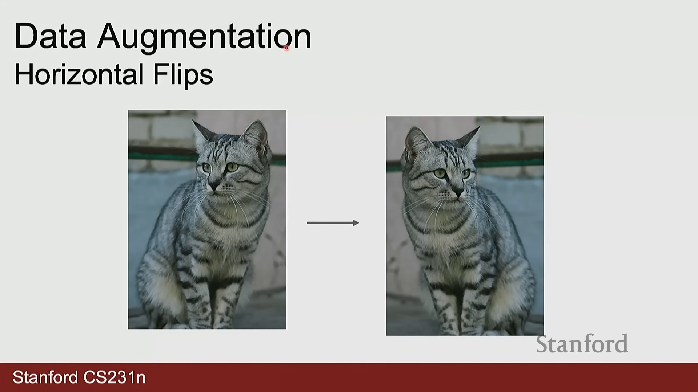

Back to data augmentation, what are the different augmentations you can do specifically? One of them is horizontal flipping. This depends on the problem. However, this is sometimes useful for everyday objects.

It's usually pretty good because most objects are symmetrical, so this property actually works pretty well. You could also imagine if you're looking at images from a microscope or overhead that you could also do a vertical flip, and that would make sense. But for everyday objects, vertical flipping actually doesn't really make sense because a cat is almost always seen in this position.

Maybe if you had a dataset where cats were in all different orientations, you could imagine that flipping or rotating or all these things would make sense for your dataset.

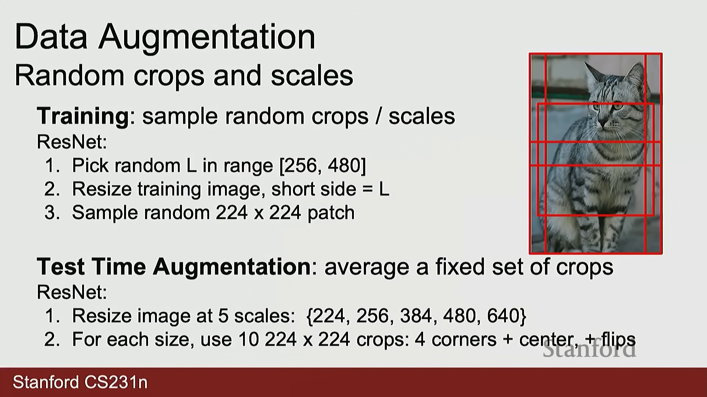

Another type of augmentation is this resizing and cropping idea. They might even take another crop afterwards. The most common strategy is you pick the length of what is basically the short side of your image. If you have an input image size for your model of $224 \times 224$ pixels, you would pick a value larger than this first and find some crop of your image that contains this larger scale $L$.

For example, if this is an $800 \times 600$ image and we use $256$ here, we resize the short side, so $600$ to be $256$, and then $800$ would be scaled correspondingly. We scale it to this $L$. We scale the short side to $L$ and then we crop a random patch of $224 \times 224$ pixels from that image. This is by far the most commonly used—random resized crop—is what it's called in most libraries.

It is used in most problems because it works pretty well and it reserves the relative resolution of your images. There's another neat trick you can do with augmentation called test time augmentation. If you really just want to get the best performance possible, you can basically get a bunch of these different crops. ...and resizes and run them all through your model and then average your predictions at the end.

For ResNets, people will often try a bunch of different scales, a bunch of different crop locations, and maybe even flip it. Usually you'll start getting diminishing returns, but you can get actually pretty good $1\%$ to $2\%$ performance boost by using this sort of test time augmentation.

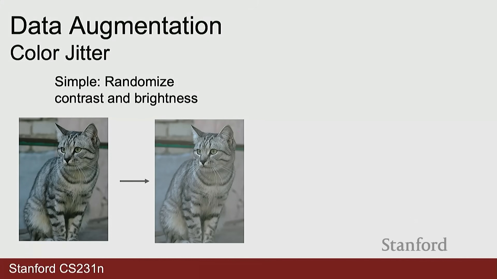

For final few augmentations, one is color jitter. Here we are specifically randomizing the contrast and brightness and scaling the image correspondingly. Maybe images look more muted, or I say the colors look more muted or more brighter, but these are very traditional image processing techniques. That is a pretty good way to judge what values you should pick for how much jitter you should have, how much brightness variance, etcetera.

Normally when I am starting a problem, I'll try a bunch of these different augmentations. I'll see what is making the data look different from the original data but still recognizable to me and still very easy to recognize.

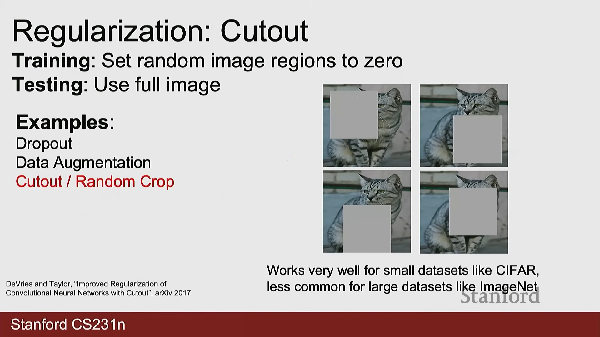

That is generally a good set of augmentations to use. You could almost imagine for your given setting what augmentations make sense. What ways can you transform your input data so that it is still recognizable to you as a human, but it makes it harder for the model to memorize the training examples?

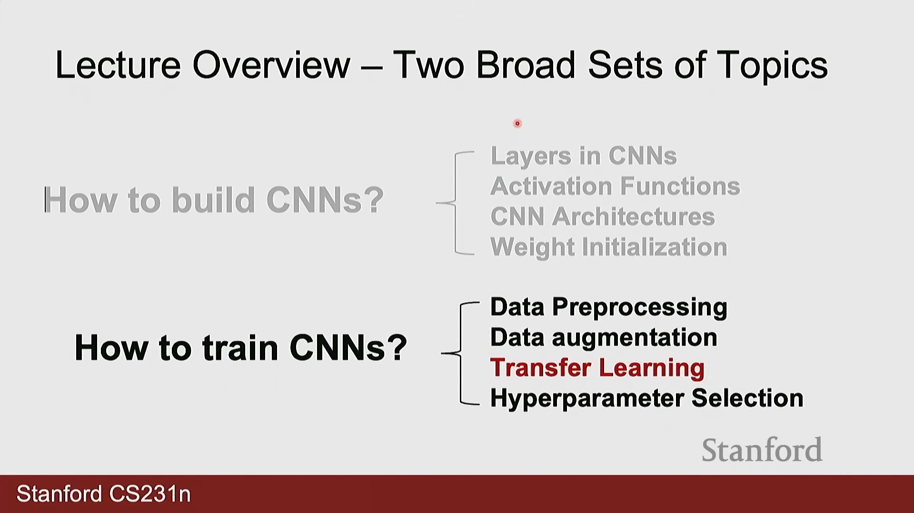

The final set of topics here are basically extremely practical.

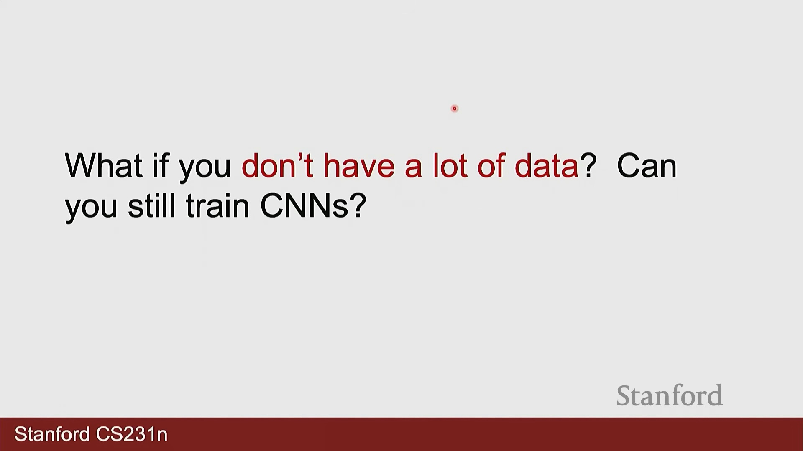

But this also applies outside the course to any computer vision domain you could be practicing in. In practice, many times we don't actually have so much data. ImageNet, the original version had a million images. Maybe you don't have a million images for your problem, which almost none of us do unless you have been collecting vast amount of data with a huge team.

So if you don't have a lot of data, can you still train CNNs?

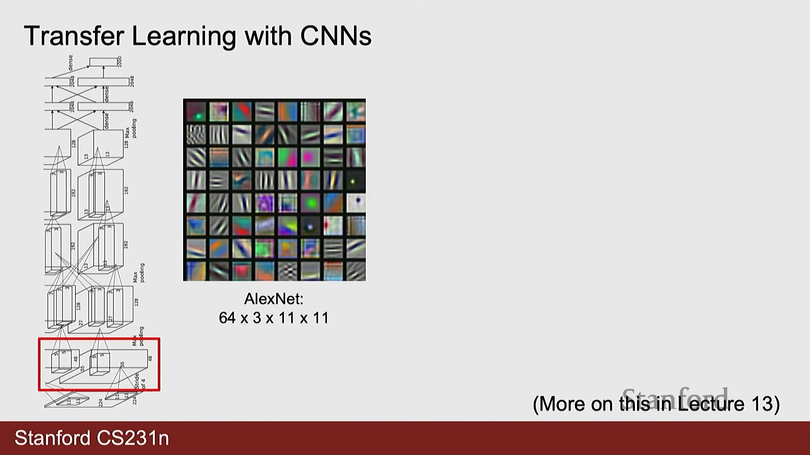

The short answer is yes, you can, but you need to be a little bit smart with how you do it. We showed last lecture how the different filters in your CNN are extracting different types of features. This goes back to someone asking about the hierarchy of features in convolutional neural networks. At the beginning, it is more of just edges or patterns or really small shapes.

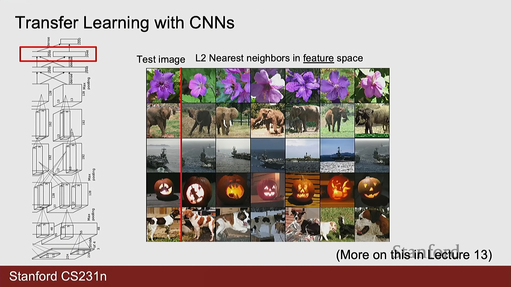

If we look at the difference here, it is the $L_2$ distance.

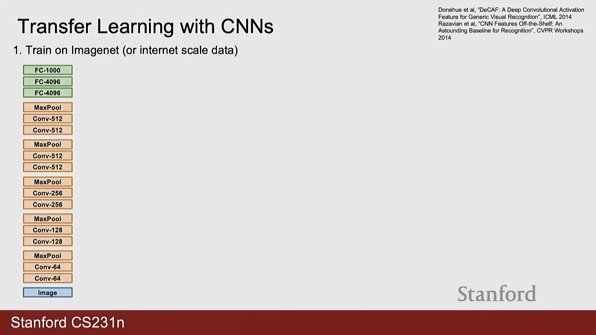

How could you use this in practice?

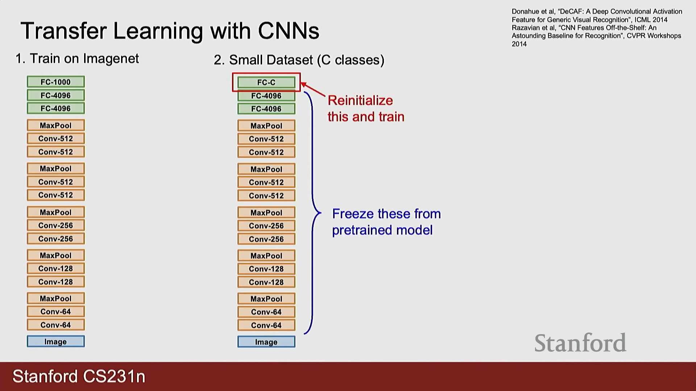

You can just freeze all of these layers so you don't train any of them. When you are training the model, you only train this layer here. It's actually extremely similar under that paradigm because you're not training it here.

For all of the problems I ever work on, I'm doing this step three here because I have maybe a million or ten million training examples. So, I'll start it with a model that was trained on billions [of images] that I don't have the compute for and then I'll fine-tune the model on my relatively smaller data set. When I fine-tune the whole thing, it can still be specific enough to my problem.

You're basically taking—say let's use a very concrete case where we're training a model on ImageNet. We take this model and we are replacing the final layer so that it's no longer outputting 1,000 classes; it's outputting the number of classes in your data set. We initialize this randomly using Kaiming Initialization, which we talked about before, but the rest of these layers are maintaining their values that they had before.

Then we have our vector of $4,096$, and we're just mapping that to the number of classes, and we're only training this mapping at the end. The question is, will you have some bias in your model because it was trained on ImageNet? The answer is definitely. So, if you do this method two, then the model will do best on data sets that look very similar to ImageNet.

These would be pictures of everyday things like laptops or maybe a classroom or a person, things like this where ImageNet has everyday objects. But if it was, say, photos of Mars, it would do a lot worse. There's definitely bias based on the training data of the pre-trained model. You want to get something that is in the same type of distribution where you're seeing the same kinds of objects or locations or things like that.

So the question is, what do you do when your data set is out of distribution?

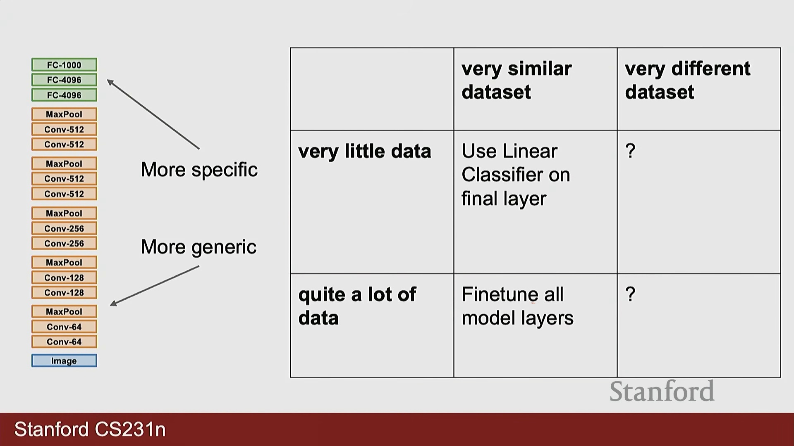

If you have a very similar data set but very little data, you can use the linear classifier strategy we just mentioned.

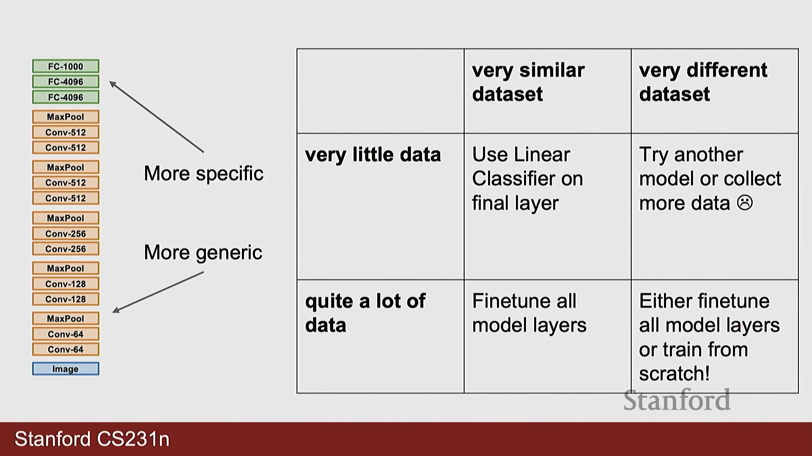

But what about when you have a very different data set? If you have very little data or a very different data set, you probably want to try to find a model that's trained on something close. There are specific techniques that researchers have looked into for out-of-domain generalization. This basic idea is that you have one domain, you train a model on one domain, and you are trying to learn a new domain that's different in some ways.

This is an active area of research, but I wouldn't say there's a general technique that always works; it's a bit problem dependent in that setting. Conversely, this works pretty well in practice. There are actually techniques for this, and it's a pretty active area of research. Certain models generalize better—I think language models are pretty good at learning a lot of different domains, for example.

Do you ever do anything between training one final layer and all layers?

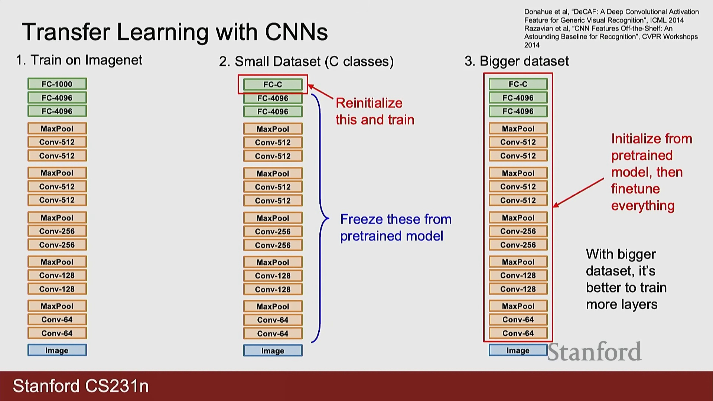

Yes, people have actually done a lot of work looking into training a subset of the layers. There's also a technique called LoRA, which we might go into in the transformers lecture. There are techniques you could use LoRA. It would need more explanation, but the basic idea is instead of fine-tuning the actual values, you're fine-tuning these differences between the values.

Layers, like how a ResNet, you're learning the difference. LoRAs are like that, but you do it with a very small number of parameters. I think the question is, how do they basically decide how many layers to pick? Why did they pick a large number of layers?

Specifically, why are there two convolution layers of each size instead of one? But you're able to model more non-linear relationships because you have these three activation functions rather than just one activation on the $7 \times 7$ filter. So basically, $3 \times 3$ is more expressive, but you're still looking at the same set of values as long as you have enough of them.

A larger set of smaller filters is more expressive than a smaller set of larger filters.

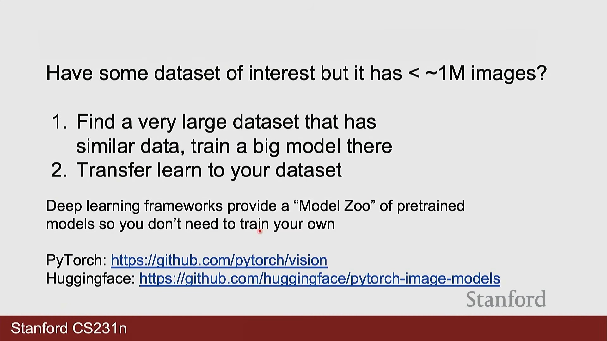

To proceed, try to find a large data set that has similar data. Get a model that was trained on that and then fine-tune it on your own data.

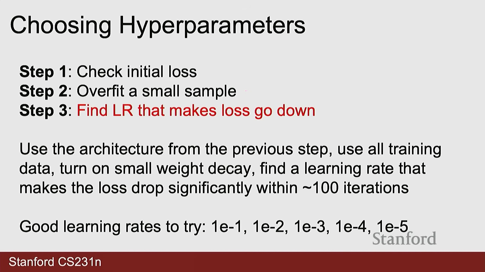

At the end, I will talk very briefly about hyperparameter selection. If you are having difficulty training your model and it is not working right away, the best thing you can do is to overfit on a small sample. This is the default debugging strategy in deep learning: you just have one data point and you want to see your training loss basically go to 0.

This is a really good training problem because it will also tell you what learning rates work and which ones don't work. You'll get a rough idea of the neighborhood of learning rates you should explore. This is always step one if you are having issues just running some code; this is how you debug.

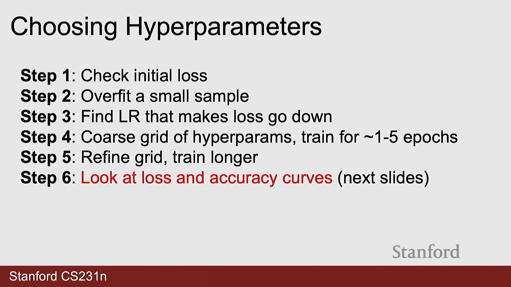

The second thing you would want to do after getting the initial results is perhaps trying a very coarse grid of hyperparameters. First, I would try with different learning rates and see what the training losses look like when trained on different learning rates. You want one that has the most sustained decreasing in the training loss over maybe one epoch.

That's a pretty good estimation, but you can train for longer. Once you get a good set of learning rates, you could then look into other hyperparameters.

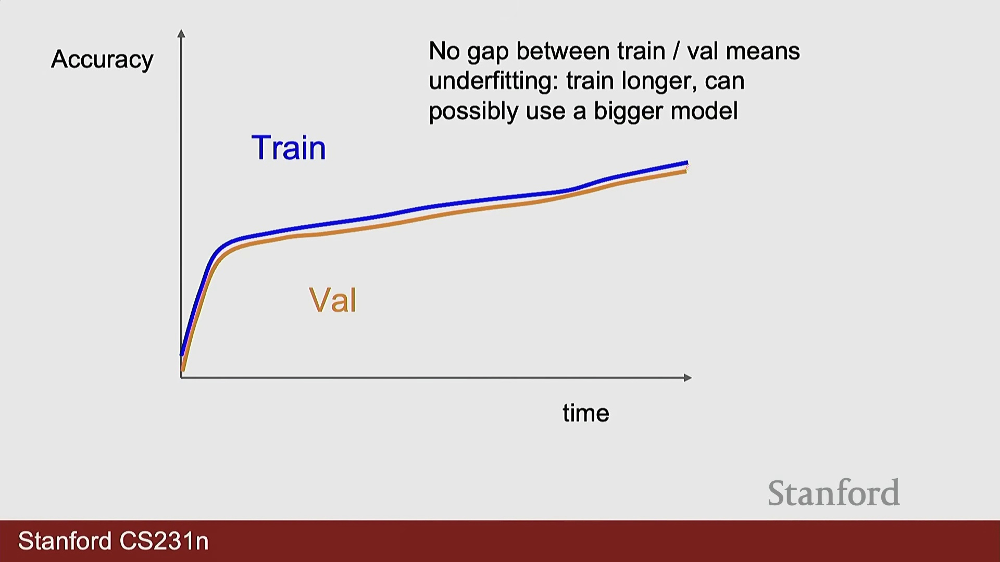

Specifically, besides the loss, you will also want to look at the accuracy curves: your training accuracy and your validation accuracy. If they are still going up, it means you want to keep training pretty reasonable. However, there might be a scenario where the training loss is going up, but your validation loss is going down—this is overfitting. If you are seeing very little of a gap here, then you can probably train for longer because generally, you want to just get to the point where your validation loss has been maximized.

So if you could just keep training, you could keep training.

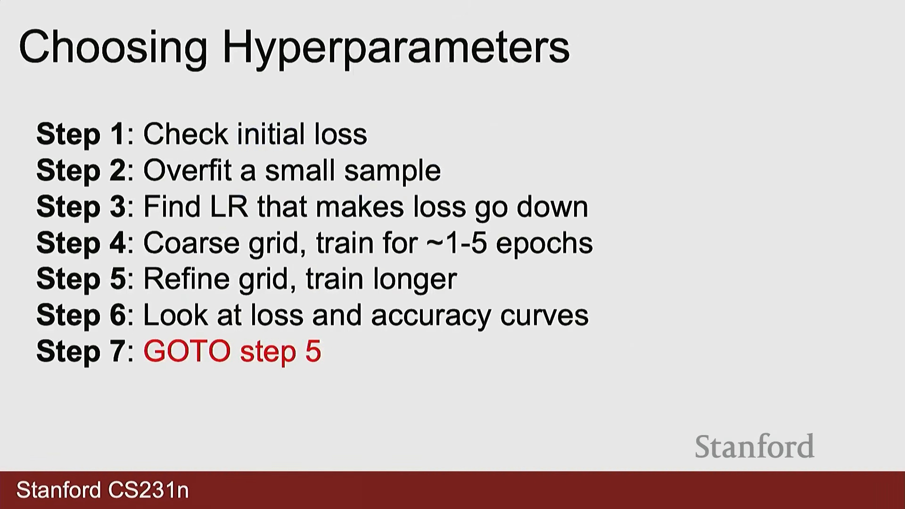

You basically can repeat this process over and over again.

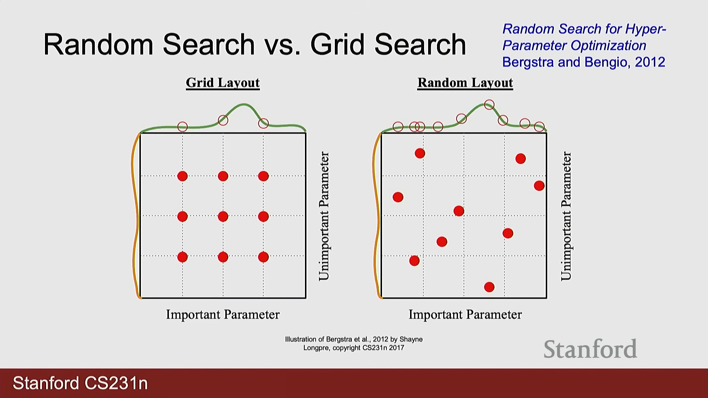

In practice, random search over the hyperparameter space works a lot better than a grid search where you're trying every set from a predefined set. In practice, you should define the ranges you want to try and then just randomly collect hyperparameters with values from those ranges. That is probably the best way to do it, and you just keep running until you get the best model.

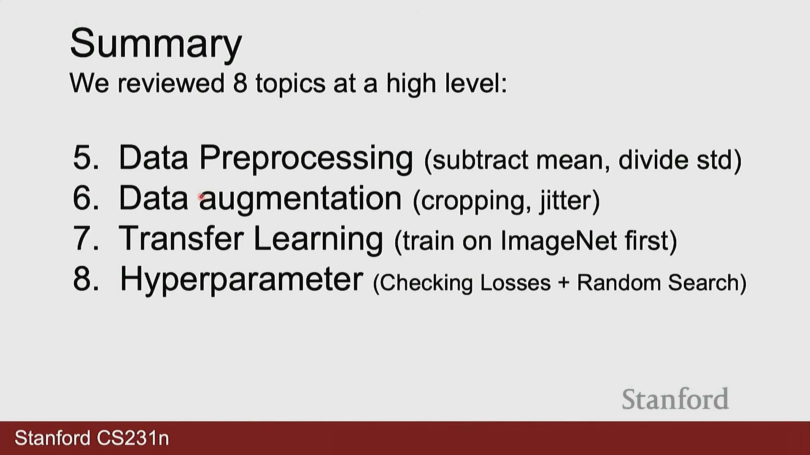

Transfer learning is a really neat trick for improving performance. We also covered how to pick the best hyperparameters.

So yes, we covered a lot in lecture today.
