# Stanford CS231N | Spring 2025 | Lecture 8: Attention and Transformers

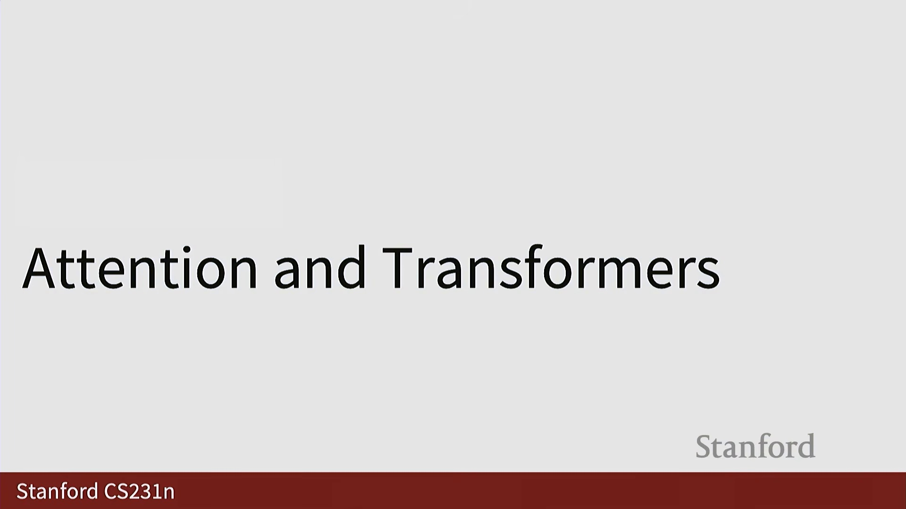

Welcome back everyone to lecture eight. Today, we're going to talk about attention and transformers.

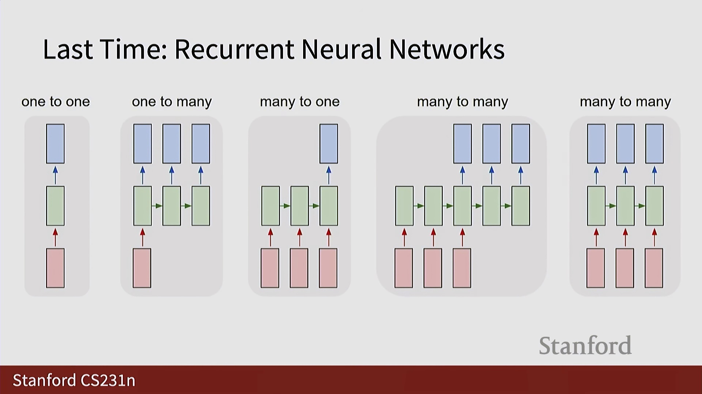

I think this is a really fun one. As a quick recap, last time, we were talking about recurrent neural networks. Recurrent neural networks were a new neural network architecture meant for processing sequences. In particular, we saw how neural networks, by processing sequences, let us tackle whole new kinds of problems than we could with convolutional networks before.

Usually, we had been thinking about one-to-one problems, where you input one thing like an image and then output one thing like a classification for what's in that image. There are also a bunch of other problems along this vein.

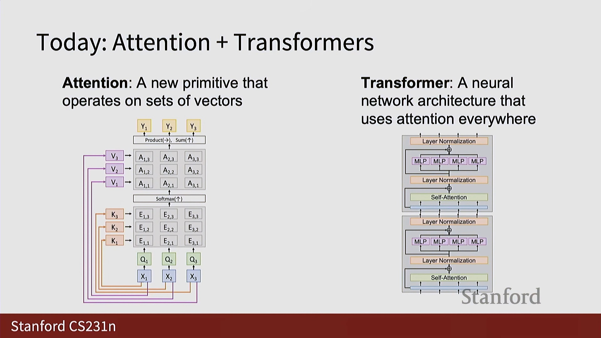

Today, we're going to build on that and talk about two things. The first thing is attention, which is a brand new neural network primitive that fundamentally operates on sets of vectors. The second thing we'll talk about is the transformer. The transformer is a different neural network architecture that has self-attention at its core.

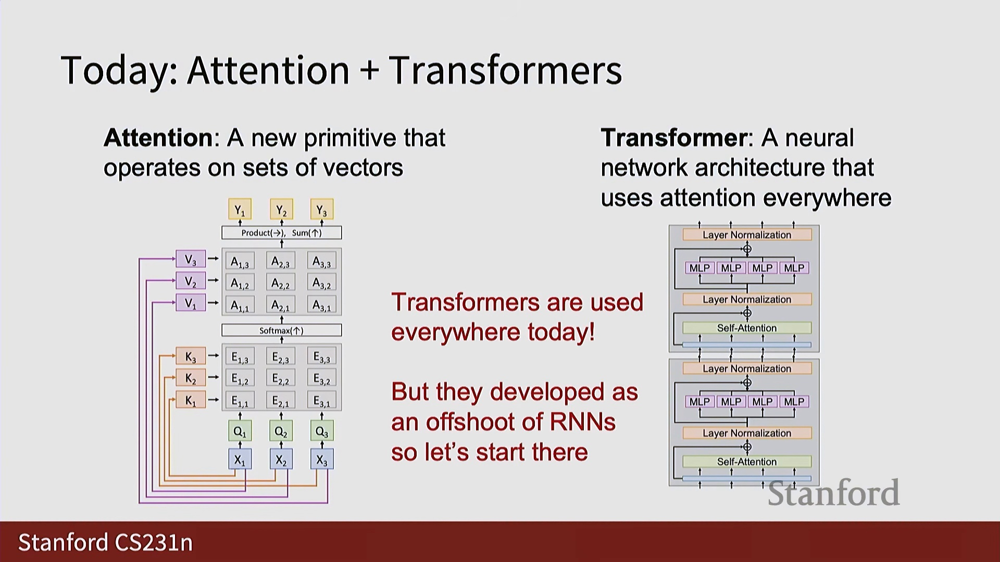

The spoiler alert is that transformers are basically the architecture that we use for almost all problems in deep learning today. But even though transformers are this state-of-the-art architecture that everyone is using for everything today, they have a relatively long history. When the moment that transformers came out, it feels like it ought to have been this big moment, a big sea change, a new architecture, a new thing.

But it actually didn't feel that way. In particular, these ideas around attention and self-attention developed out of recurrent neural networks. We're going to start there to talk about and motivate these problems. This is going to be a little bit mirroring the historical development of these ideas.

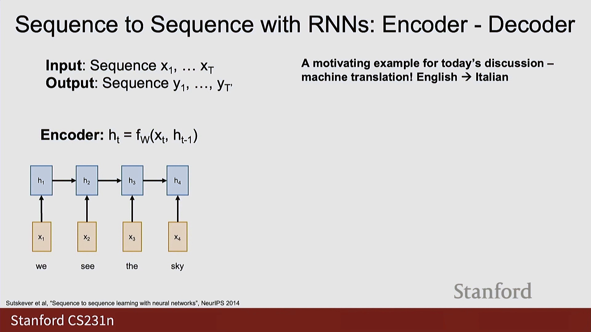

For that reason, we're actually going to roll back and recap a little bit about this idea of recurrent neural networks that we saw in the last lecture. As a motivating problem, let's think about the sequence-to-sequence problem of translation. We want to input one sequence, which is going to be a sequence of words in English. Then we want to output another sequence, which is going to be a sequence of words in a different language, Italian.

This is a perfect application of the kind of sequence processing algorithms—sequence processing architectures—that we saw in recurrent neural networks. Indeed, this idea of processing these sequence-to-sequence problems with recurrent neural networks goes all the way back to 2014, even a bit earlier than that. But people have been processing sequences with recurrent neural networks for more than a decade by this point.

The basic architecture for processing sequence-to-sequence problems with recurrent neural networks is that you typically start with one encoder. Your encoder is a recurrent neural network. Your recurrent neural network unit will then spit out a next hidden unit—a next hidden state at the next time step. We can then apply that same recurrent neural network unit over in time to process a sequence of potentially variable length.

In this case, we're using a recurrent neural network encoder that inputs the input sequence in English. We are using a kind of short sentence: "We see the sky."

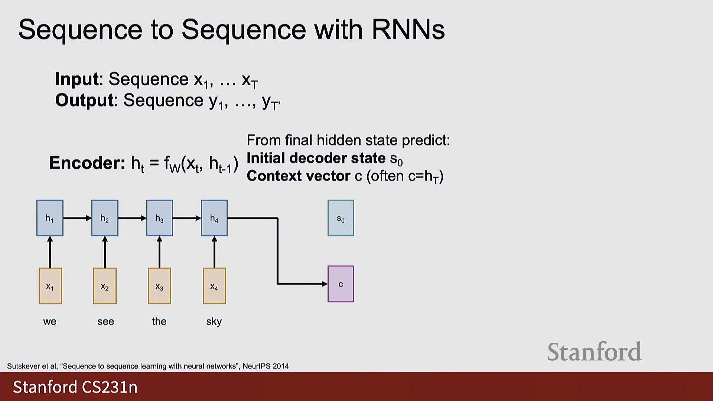

Each word in that sentence gets processed via one tick of the recurrent neural network.

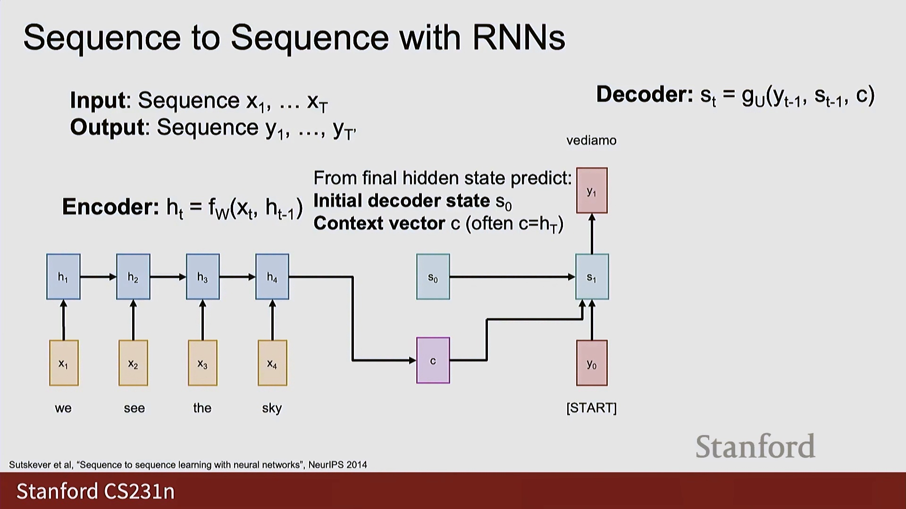

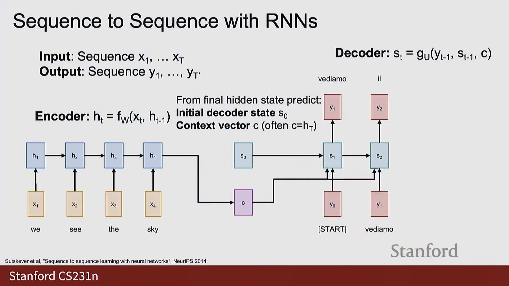

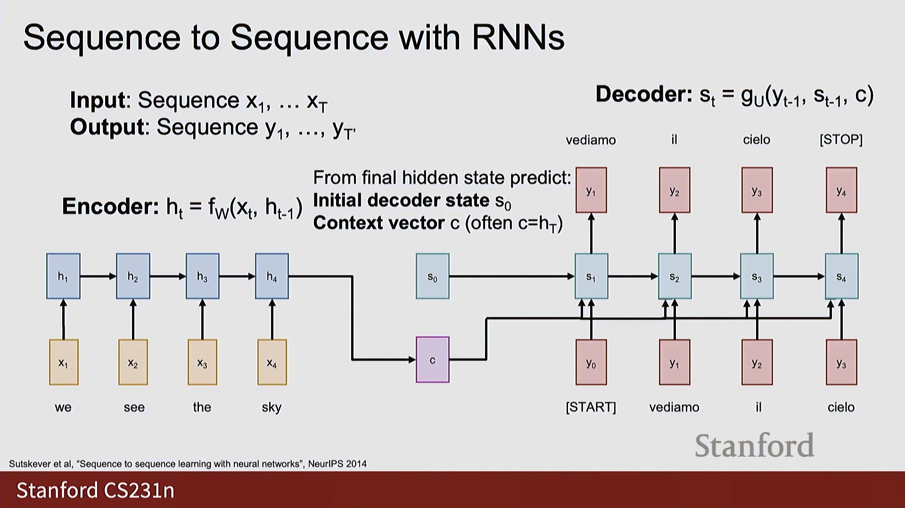

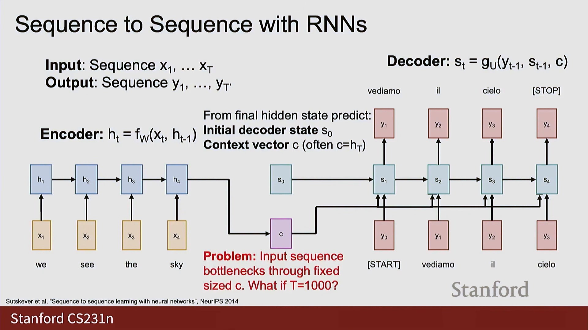

There are a couple of different ways that people would typically do this in recurrent neural networks. You can just think that the context vector is basically the last hidden state of the encoder recurrent neural network. The idea is that because of the recurrent structure of recurrent neural networks, the last hidden state incorporates information from the entire input sequence.

We can therefore think of that last hidden state as summarizing or encoding all of the information in the entire input sequence. This gives us one vector that summarizes that entire input sequence, which we can then use for whatever we want with it. In this case, what we want to do is translate that input sequence into an output sequence in a different language.

This decoder will be a different recurrent neural network with different learnable weights, but it has the same basic idea. It's going to take $s_{t-1}$, which is the previous hidden state in the output sequence, and $\mathbf{C}$, which is that context vector summarizing the entire input sequence. Then we unroll that output sequence just as we saw in the last lecture and produce words one at a time.

The idea is that we're going to tick this recurrent neural network one tick at a time; it's going to output words one at a time. This is basically a summary of what we saw last lecture, so it shouldn't be too surprising in light of the previous lecture. But there's a potential problem here: a communication bottleneck between the input sequence and the output sequence.

The only way in which the input sequence is communicating with the output sequence is via that context vector $\mathbf{C}$. That $\mathbf{C}$ is going to be a fixed length vector because the size of that vector is set when we define the size of our recurrent neural network. Maybe $\mathbf{C}$ might be a fixed length vector of like $128$ floats, or $1024$ floats.

But the size of that input vector is not going to change as our input and output sequence sizes grow or shrink. That's a potential problem. However, what if we are not trying to translate four words? What if we're trying to translate a whole paragraph, or a whole book, or an entire corpus of data?

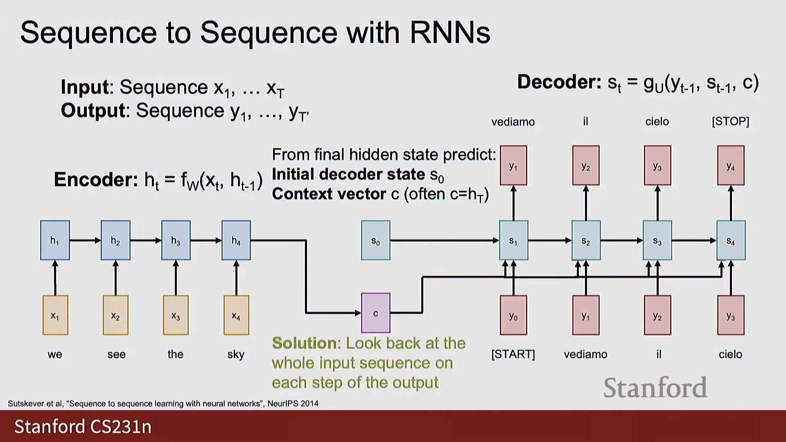

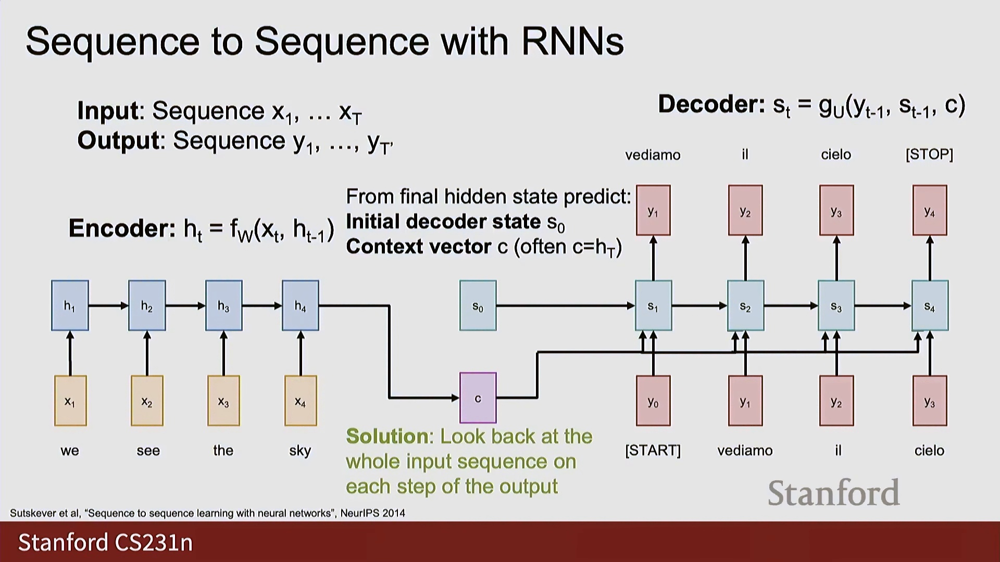

The solution here is actually let's not bottleneck the network through one fixed length vector. Instead, let's change the architecture of our recurrent neural network. Intuitively, what we want to do is not force a bottleneck in a fixed length vector between the input and the output. Instead, as we process the output sequence, we are going to give the model the ability to look back at the input sequence.

Every time it produces an output vector, we want to give the network the opportunity to look back at the entire input sequence. If we do this, there's going to be no bottleneck; it will scale to much longer sequences, and hopefully, the model architecture will work much better. That's the motivating idea that led to attention and transformers and all this great stuff that we see today.

It all came—one way of telling the story is that it all came from trying to solve this bottleneck problem in recurrent neural networks.

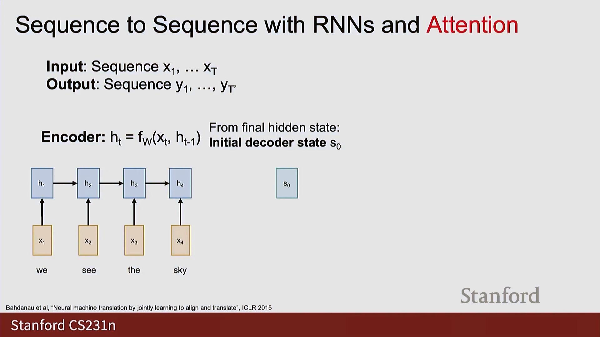

Let's see how we can actually implement this intuition and endow a recurrent neural network with the ability to look back at the input sequence on every time step. Here, we're going to start with the same thing: our encoder neural network is going to remain the same; no changes there. We still need to set some initial hidden state for the output sequence, so we need to set some initial decoder state $s_0$ in some way.

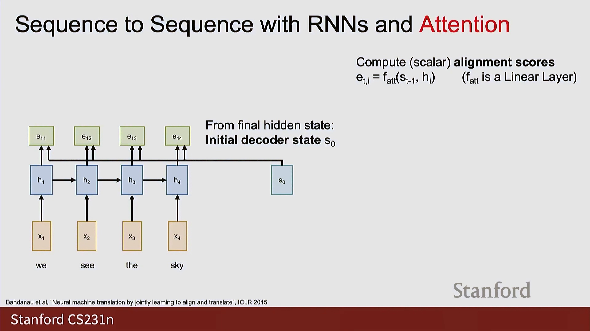

Once we have that decoder hidden state, what we're going to do is look back at the input sequence. In this case, there were four tokens in the input sequence, so we want to compute four alignment scores, each of which It's just a single number that says, "What is the similarity between the input sequence, the token of the input sequence, and this initial decoder state $s_0$?"

There are a lot of ways that we could implement alignment scores, but a simple way is just to use a simple linear layer that we're calling $f_{\text{att}}$. That linear layer is going to concatenate the decoder hidden state, $s$, with one of the encoder hidden states, $h$. It concatenates those two into a vector and then applies a linear transform that squashes that down into a scalar.

So now at this point, we've got this scalar alignment score for each step in the input sequence.

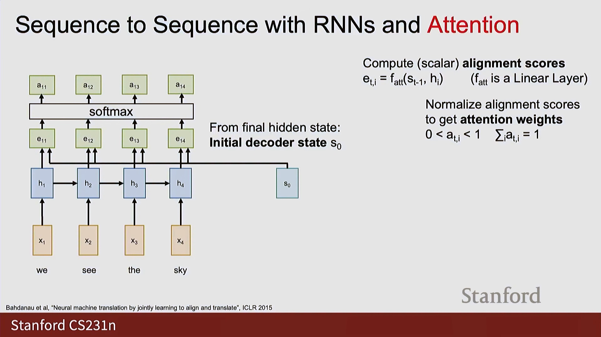

We then want to apply a $\text{softmax}$ function. These scalar alignment scores are totally unbounded; they're arbitrary real values from $-\infty$ to $\infty$. We want to put some structure on this to prevent things from blowing up, so one way that we do this is by applying a $\text{softmax}$ function. We've got four scalar values telling us the alignment of that decoder hidden state with each of the encoder hidden states.

Now, we apply a $\text{softmax}$ over those four values to give us a distribution over those four values. This means it has the property that each entry in the output $\text{softmax}$ probabilities will be between 0 and 1, and they will sum to 1.

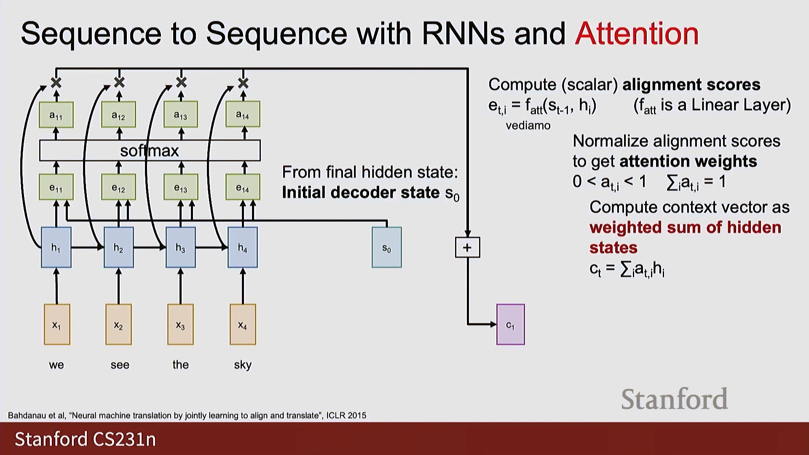

What we want to do now is take that distribution over the input tokens and use them to compute a vector summarizing the information in the encoder. The way that we do that is we take our attention scores, which are these numbers $a_{11}, a_{12}, a_{13}, a_{14}$. They're all between 0 and 1, and they sum to 1. We're going to take a linear combination of the encoder hidden states, $h_1, h_2, h_3, h_4$, and take a linear combination of those encoder hidden states weighted by our attention scores.

At this point, $c_1$ is basically some linear combination of the input encoder states, $h_1$ to $h_4$.

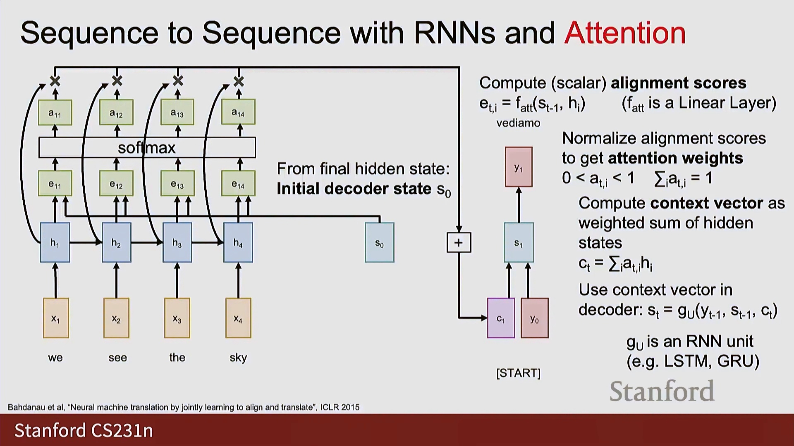

Things look basically the same as they did in the non-attention case. We have our context vector.

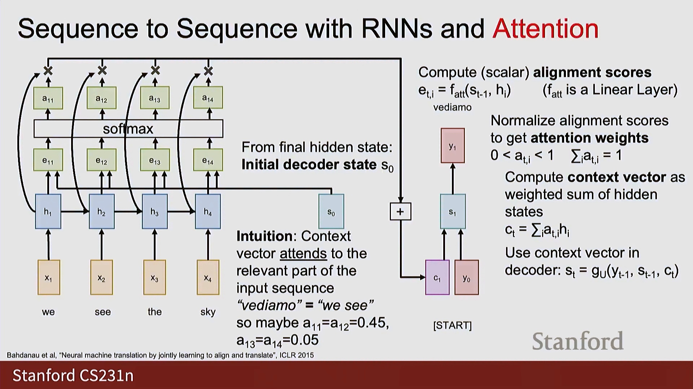

For example, part of the input as part of the input sequence has these two words we see. We might expect that, intuitively, when trying to produce the word, "vediamo," then the network will want to look back at the words "we see" and put higher attention weights on those. It doesn't really care about "the sky" because those words are not necessary for producing that *vediamo* output.

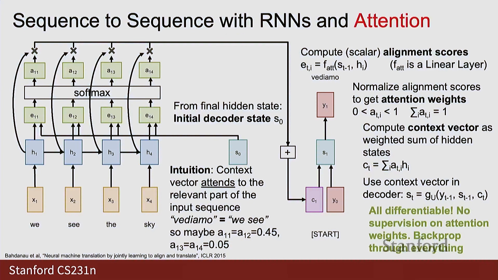

The other thing to keep in mind is that this is all differentiable. We don't need to supervise the network. We don't need to tell it which words in the input sequence were required for each word in the output. Instead, this is just a big computational graph composed of differentiable operations.

All of this can be learned end-to-end via gradient descent. At the end of the day, we're still going to have this cross-entropy $\text{softmax}$ loss, where the network is trying to predict the tokens of the output sequence. In the process of trying to predict the right tokens in the output sequence, it's going to learn for itself how... to attend to different parts of the input sequence.

So that's really critical. If we had to go in and supervise and tell the network the alignment between the two, it would be very difficult to get training data for this kind of thing. The question is, how do we initialize the decoder? We're actually using the word—you got to be careful—we're using the word "initialize" a little bit overloaded here.

So one question is, the decoder is itself a neural network that has weights. When we start training that network, we need to initialize those weights in some way. So then we will typically initialize the weights of the decoder randomly and then optimize them via gradient descent, just as we do with any other neural network weights. But there's a second notion of initialize.

And in that case, we need some rule or some way to set that initial hidden state of the decoder output sequence. There's a couple of different mechanisms for this. Sometimes, you might initialize it as the last hidden state of the encoder is one thing you'll sometimes do. Or sometimes, people even initialize the first hidden state of the decoder to be all zeros.

Any of those will work, as long as you train the network to expect that kind of input. So the question is, negations and XORs, will this cause a problem? Maybe. This is a hard problem.

But then you need a lot of data, a lot of flops to try to hope the network can disentangle this. But basically, recurrent unit takes three things as input. It takes in the decoder hidden state $h_{t-1}$, the previous decoder hidden state. It takes the current context vector $c_t$.

And it takes the current token in the output sequence. From that, we produce the next hidden state $s_t$. And then from the next hidden state, then we go and predict the output token. So that's actually the same setup as in the non-attention case.

I guess there's an implicit connection from—there's a connection from $s_0$ to $s_1$ that we're not drawing. Well, so there should have been another arrow from $s_0$ to $s_1$. We're basically letting the network decide for itself to look back at any part of the input sequence that it thinks might be relevant for the task at hand. And we want to let the network look back and pick out which are the relevant bits of the input for producing this bit of the output.

But again, we're not directly supervising it. We're not telling it how to use these attention scores. But the intuition is that we think that's a plausible thing that it might choose to do, given this mechanism.

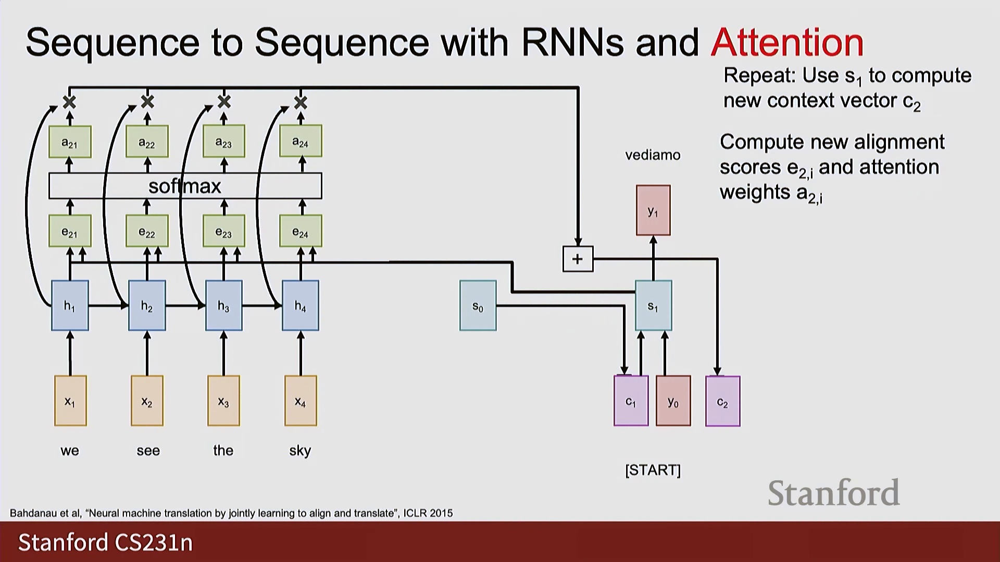

OK, so that's one tick of the output. And now, basically, we do it again. We do this whole process again for every time we tick the decoder RNN. Remember, the problem we were trying to solve is that previously, the decoder was bottlenecking through a single vector.

So now, basically, given our $s_1$, which is our computed first hidden state in the decoder, we're going to go back. You take $s_1$, go back and compute comparison, and use our attention mechanism to compute similarity scores between $s_1$ and all of the hidden states in the encoder. That will compute our similarity scores, using that exact same $\text{FATT}$—that same linear projection that we used at the first time step—to compute these alignment scores.

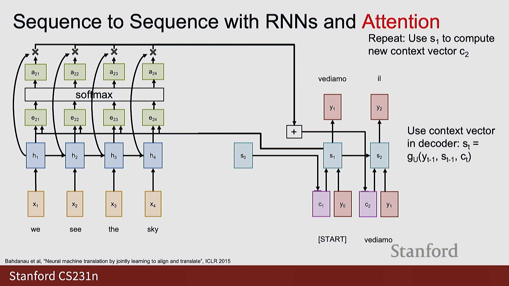

And then the whole thing iterates. We have a new context vector. We use that to run another tick of our decoder RNN unit that will now does include that mysterious missing arrow that wasn't there on the previous time step.

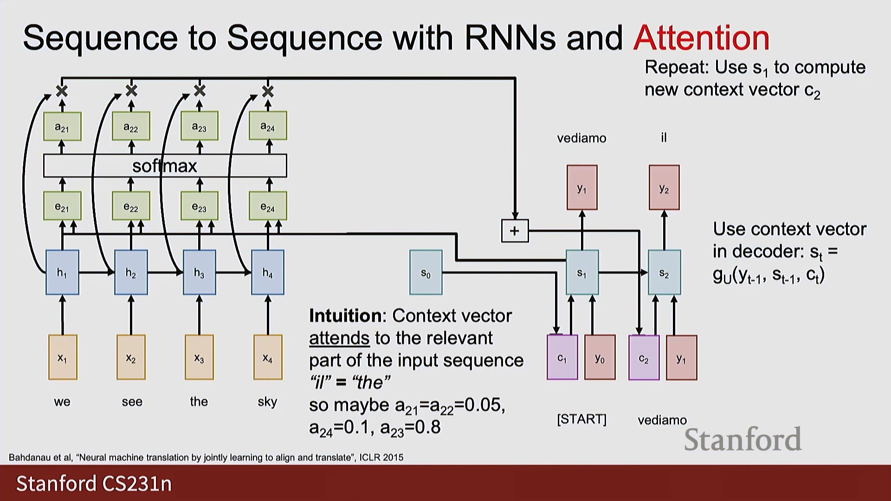

And again. Remember, in this case, it's producing $y_l$, which maybe is "the" according to the slide. I hope that's true. And then in this case, there's maybe a one-to-one correspondence between the word the network is trying to produce for this sequence and one of the words in the input.

But again, we don't supervise this. The network is deciding for itself how to make use of this mechanism, all driven by gradient descent on our training task.

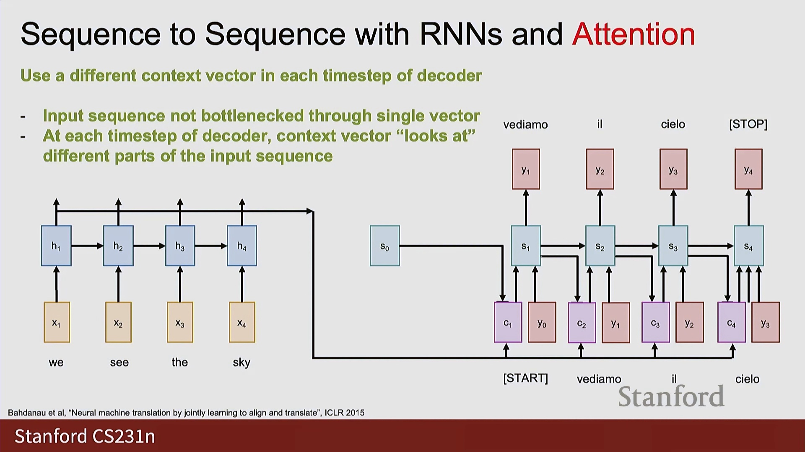

This whole thing is that we are just going to repeat that whole process for every tick of the decoder RNN. So now, this solved our problem. We are no longer bottlenecking the input sequence through a single fixed length vector. This is a pretty cool mechanism.

It is called attention because the network is attending, or looking at different parts of the input sequence at every moment in its output. We never told it what the alignment was between the input sequence and the output sequence.

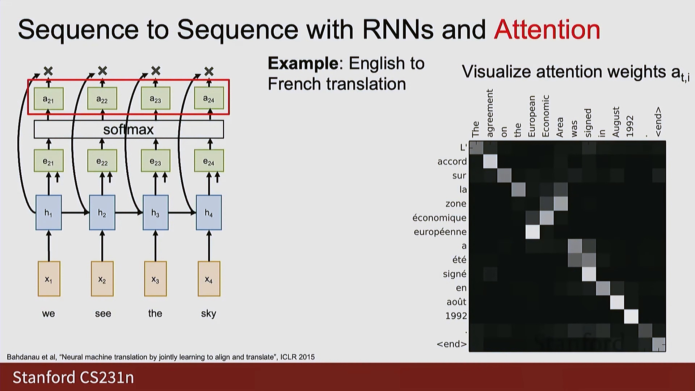

That gives us a way to interpret the processing of the neural network in some way. We can visualize these in a two-dimensional grid. Here, we are looking at an example of English to French translation.

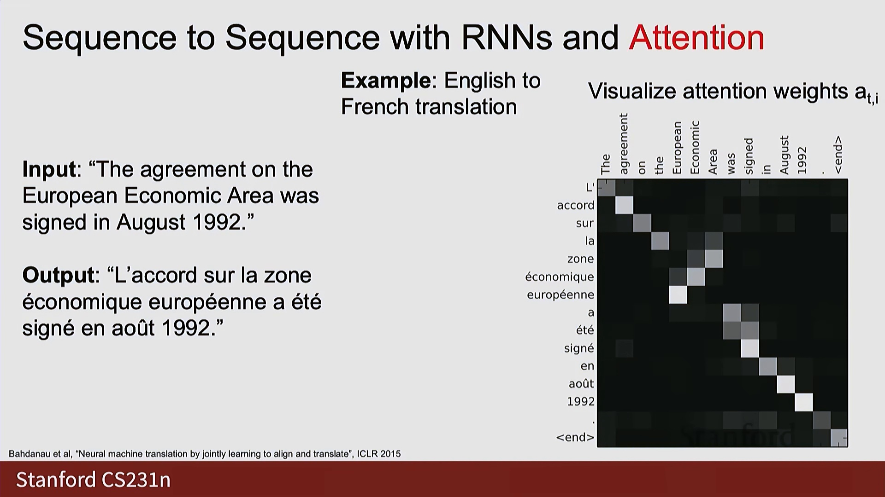

Across the top, we have our input sequence: "The agreement on the European Economic Area was signed in August 1992." Running down the rows is the output sequence, which is in French, which I will not attempt to pronounce. We visualize that in that first row. If you look at the first row of this matrix, we are visualizing that predicted probability distribution over the entire input English sentence.

When trying to predict that first word, "le," of the French sentence, it puts a lot of probability mass on the English word "the" and basically no probability mass on any of the other words. When predicting the second word of the output sequence, remember, it goes back and predicts a new distribution over the entire input sequence. That is going to be the second row in this matrix.

You can see that "accord" puts a lot of probability mass on "agreement" and no probability mass anywhere else.

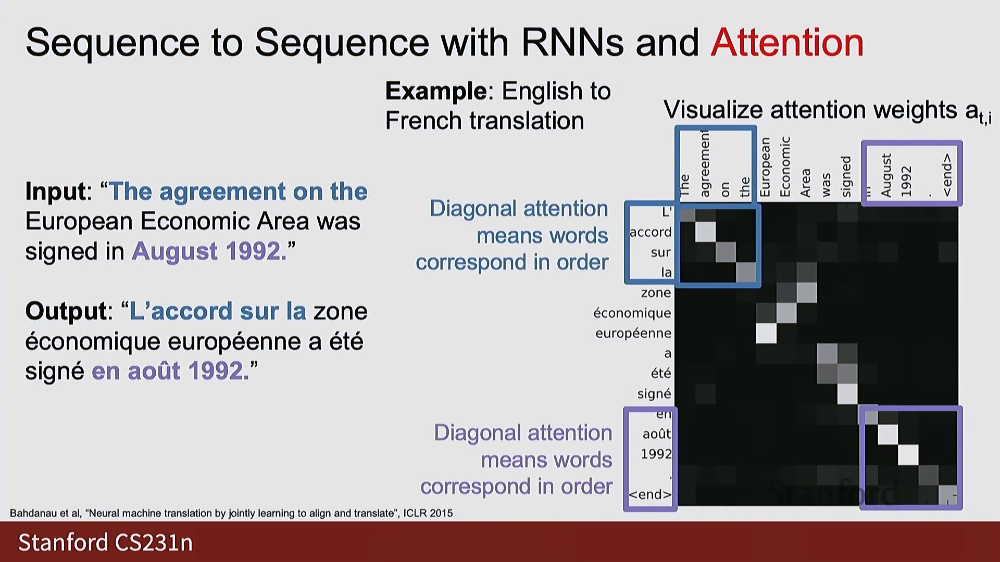

This gives us some sense that the network actually did figure out the alignment between the input words and the output words when doing this translation task. There are some interesting patterns here that pop up. In particular, we see that "The agreement on 'the'," the first four words of the input sequence, correspond to this diagonal structure in the attention matrix.

There is another one-to-one correspondence between words in the output and words in the input.

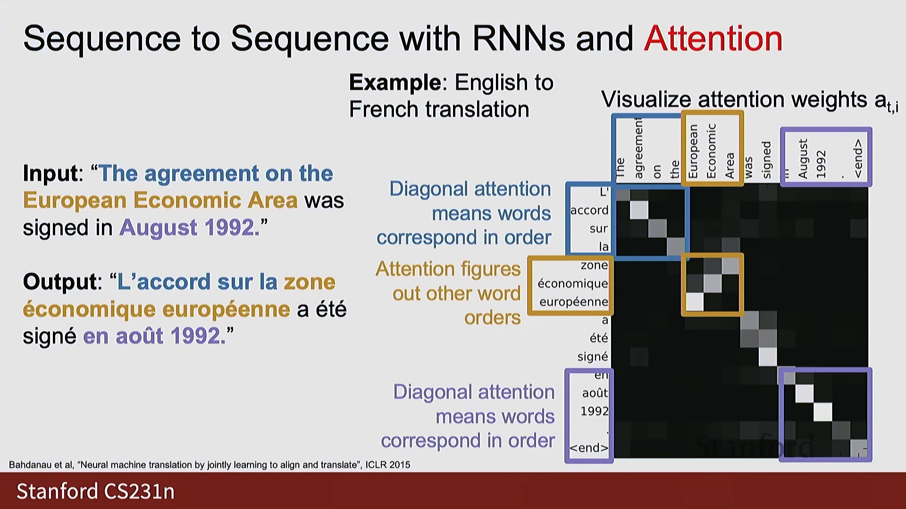

But we see some other interesting stuff in the middle here. In the middle, we see "European economic area." But in the French, we see words that look kind of like those in a slightly different order. How does it figure out the grammar?

That's the mystery of deep learning. We did not tell the network anything about grammar. We supervised it with a lot of input/output pairs. We told it, "Here's an input sequence in English; here's an output sequence in French."

We never told it anything about grammar. The network figures out for itself, in the process of doing the end-to-end task, how to make use of that mechanism to solve the problem we set for it. It is pretty amazing that it works. In this case, it figured out some of the grammar for itself.

It sees that we see this non-diagonal sort... Of backward diagonal in the attention matrix here. And that means that the network figured out for itself this different word order between words in English and words in French. Or in the middle, you see there's a little two-by-two grid here.

That corresponds to a situation where there might not have been a one-to-one correspondence between the English words and the French words. There might have been two French words that corresponded to two English words, and they didn't perfectly disentangle. I mean, the network just figures out this for itself over the process of training on a lot of data and putting a lot of compute through this.

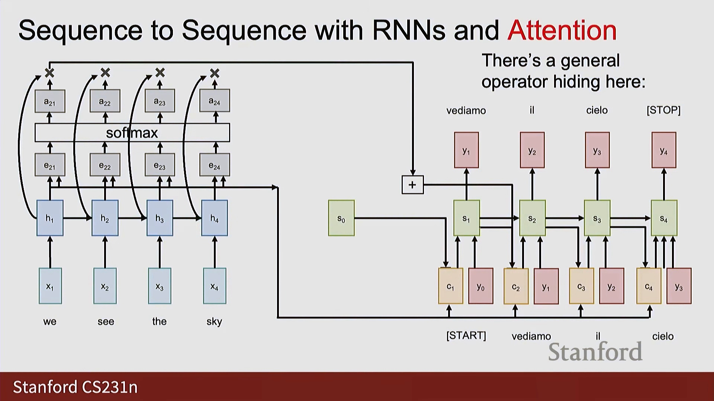

And that's pretty cool. OK, so there's actually—and this actually was the initial usage of attention in machine learning. It came from these machine translation problems.

So this was from a paper back in 2015, "Neural Machine Translation" by jointly alerting to align and translate. This paper actually just won the runner-up taste of Time Award at ICLR 2025. So that's pretty cool.

This has been a really impactful paper over time, but it turns out that there's actually a more general idea here and a more general operator hiding here. We approached this problem from the perspective of trying to fix our recurrent neural networks. But it turns out the mechanism that we used to fix the recurrent neural networks actually is something general, interesting, and really powerful in its own right.

So now, we want to try to pull that out, pull out this idea of attention, and divorce the idea of attention from the recurrent neural networks.

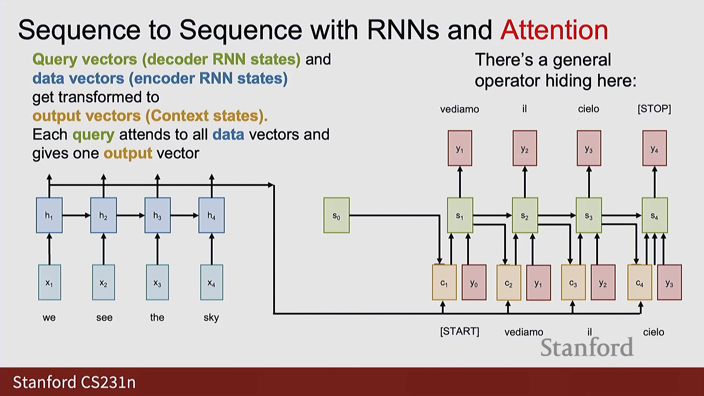

And that's where we're going towards. So let's think about what this attention mechanism was doing. Basically, what this attention mechanism did is there were a bunch of query vectors. So there's data vectors, which are like data that we want to summarize.

These are the encoder states of the encoder RNN. We have this input sequence, and we've summarized that into a sequence of vectors. The sequence of vectors is data that we think is relevant for the problem that we're trying to solve. And now, in the process of trying to make use of that data, we want to produce a bunch of outputs.

For each output, we have a query vector. A query vector is a vector that we're trying to use to solve—to produce some piece of output.

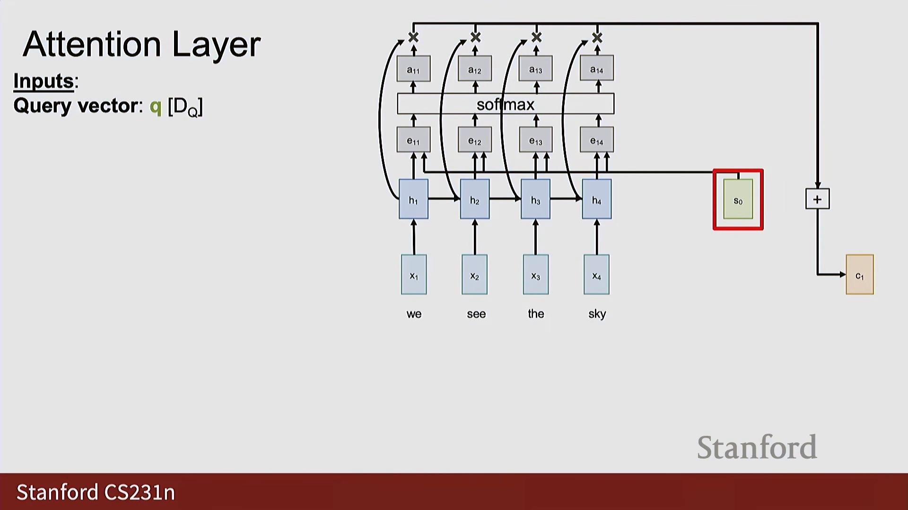

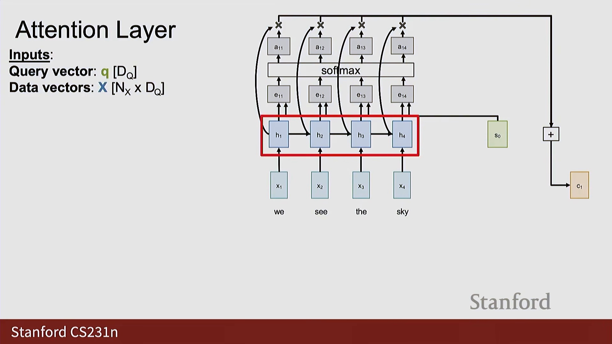

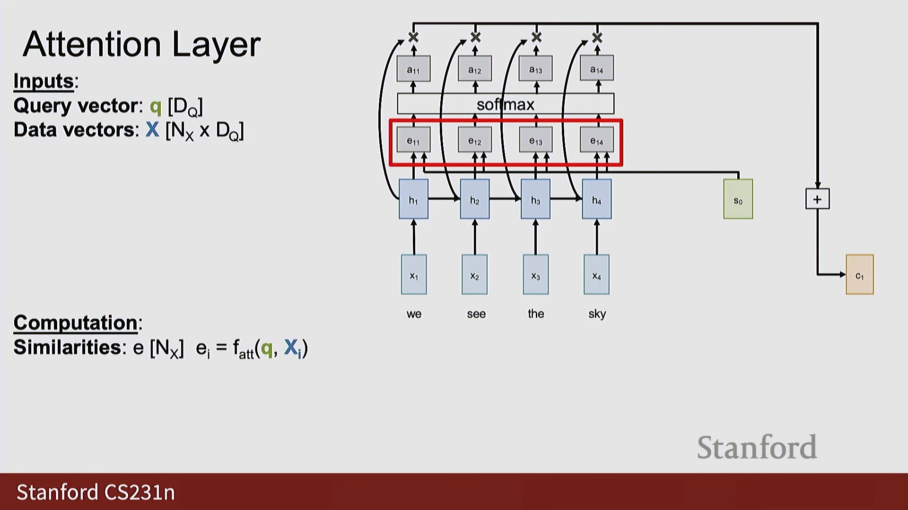

In this case, the query vectors are the hidden states of the decoder RNN. Well, okay, from the purpose of attention, this gets a little bit weird. So the output of the attention operator are the context vectors that we just talked about for the RNN. If we're thinking about just what does that attention operator do, the output of the attention operator are the context vectors that we feed into the RNN.

So then what is the attention operator doing? The attention operator is taking a query vector going back to the input data vectors, summarizing the data vectors in some new way to produce an output vector. And that's what the attention operator is doing. Does that make sense as a generalization of this attention mechanism that we just saw?

Yeah, I'll repeat it again because it's tricky. There's a lot of stuff flying around here, a lot of boxes. And we're changing the words that we're using to define the boxes. So I get it, there's a lot happening.

So what the attention operator is doing is there's a bunch of data vectors, which are the encoder hidden states. Then we have a bunch of query vectors, which are the things we're trying to produce output for. So our query vectors are these guys in green. So this is tricky because we're trying to go into this architecture and carefully cut out the attention part and cut it out from the RNN.

So then we're going to try to walk through this again from the perspective of just the attention operator. From the perspective of just the attention operator, we're going to start with just one query vector at first, which is one of the states in our RNN. We also have a bunch of data vectors, which are the encoder hidden states in the RNN. Now, the computation that we want to perform is, first, compute similarities between that query vector and all of the data vectors.

This is the exact same thing that we just saw, just written in a different way. We use this FATT function to compute the similarity scores—to compute similarities between each data vector and our one query vector.

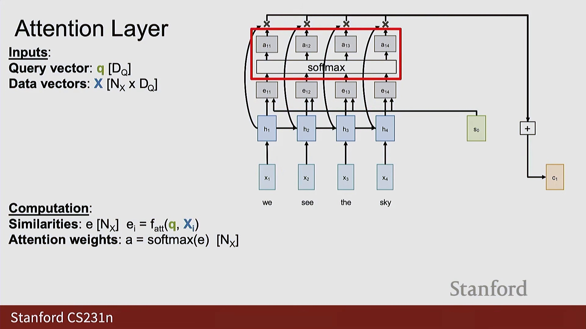

Once we have those similarities, we're going to squash them through a softmax to get attention weights. This will be a distribution over the data vectors that has been computed on the fly for this one query vector.

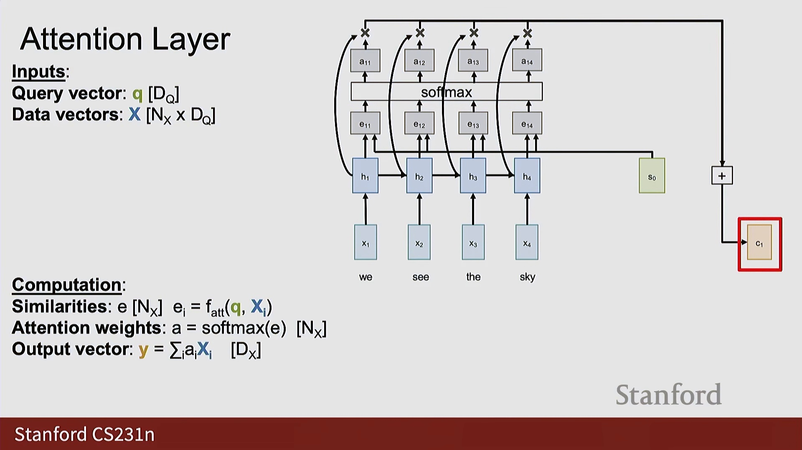

We then want to produce an output vector. This output vector is a linear combination of our data vectors, where those linear combination weights are the attention scores that we just computed. So, this is the output of the attention layer. In the context of the larger RNN that we saw, the output of the attention layer, or the attention operator, will become an input to the next tick of the decoder RNN.

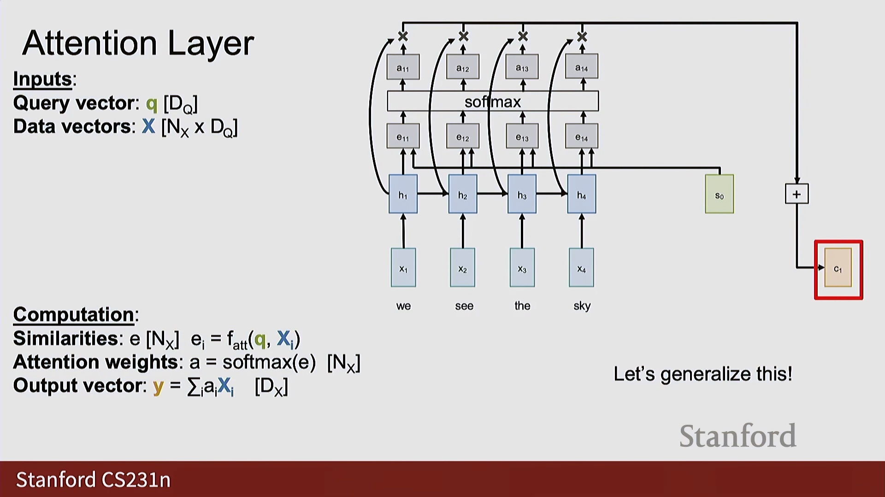

Then we get a new query vector. The attention operator doesn't care where that query vector came from. We just get a new query vector, go back, summarize the data vectors, and get a new output vector. That's the core of the attention operator.

However, we are going to make it simpler in practice. In principle, you could just slot in any function you wanted there. The first generalization we will do is actually the opposite of what was just suggested: making that similarity function simpler.

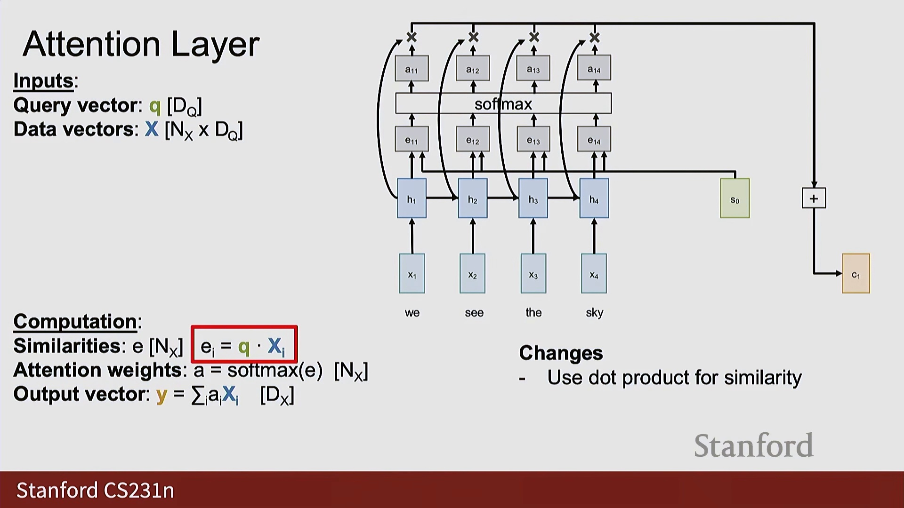

We established that in principle, it can be any function that takes two vectors and gives a similarity score. The simplest possible function that inputs two vectors and gives us a scalar similarity score is a dot product. So, we first use only dot products to compute similarity.

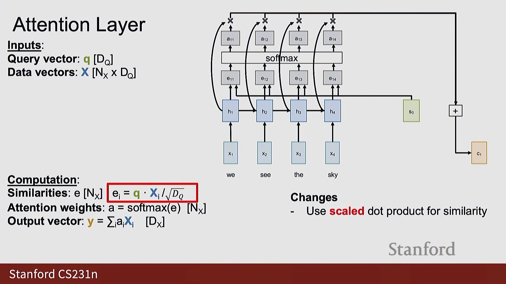

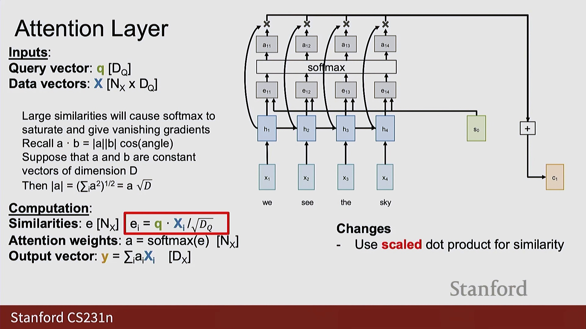

This results in more squashed probability scores as we go to higher dimensions. That can lead to vanishing gradients, which prevents learning. This is important because, as networks get bigger over time, we want higher dimensional vectors because that gives us more compute and more capacity. This scaled dot product is really important for preventing vanishing gradients here.

Our first generalization was to use scaled dot product similarity as our similarity measure.

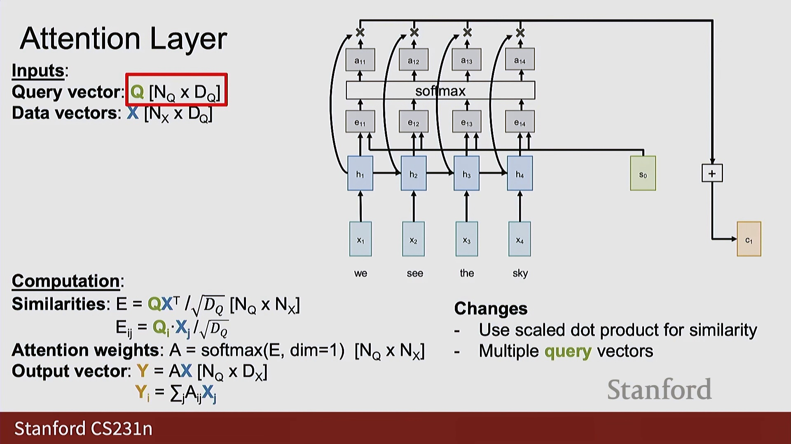

The next generalization is having multiple query vectors. In this case, we generalize it to have $N_q$. So, $Q$ is now a matrix of shape $N_q \times D_q$, meaning we have $N_q$ query vectors, each with dimension $D_q$. The data vectors remain a matrix of size $N \times D_q$.

The computation changes a little bit because when we compute these alignment scores and similarities, we want to compute all pairs of similarities between all of the input data vectors and all of the input query vectors. Each one of those similarities is a dot product, or a scaled dot product. So what's a very efficient, easy, and natural way for us to compute dot products between two sets of input vectors?

That turns out to be a matrix multiply. Because remember, when you do a matrix multiply, each entry in the output matrix is the inner product of one of the columns of one of your matrices and the rows of your other matrix. So then each entry in the output of a matrix multiply is exactly the dot product between the rows and the columns in the output.

Now, we still need to compute these attention weights. Remember, the attention weights we want to compute for each query vector. We want to compute a distribution over the data vectors. Well, we already have these—now, our similarity scores are not just a single vector of scores; they're now a matrix of scores giving all the similarities.

But we still want to compute a distribution over the data vectors for each query vector independently. So now, we need to compute the $\text{softmax}$ over just one of the axes of that matrix of similarity scores. This is basically the exact same computation that we just saw. We're just doing it in parallel for a set of query vectors all at once.

Next, we need to compute the output vectors. And remember, the output vectors were going to be a weighted combination of the data vectors, where those weights are the values in the $\text{softmax}$. It turns out that this is also something that matrix multiply does. So this is another interpretation of matrix multiplication.

So we can compute all at once with another matrix multiply between the attention matrix $\mathbf{A}$ and our data vectors $\mathbf{X}$. Again, you need to get the transposes in the right order to make this work out. Basically, this is the exact same operation that we just saw, but we're now doing it for a set of query vectors all at once. It turns out that we can do it all at once with just a couple of matrix multiplies.

A next way that we'll generalize this is notice that in this equation, the data vectors $\mathbf{X}$ are actually entering in two different places in this computation. The first place that we're using the data vectors $\mathbf{X}$ is to compute similarities with the query vectors in this similarities computation. But then we're also using the data vectors $\mathbf{X}$, again, to compute the output vectors.

The output vectors are now a linear combination of the data vectors weighted by our attention weights. It maybe seems a little bit weird to reuse the data vectors in those two different contexts.

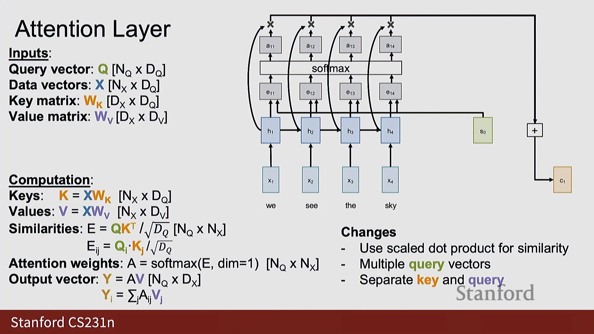

To do that, we'll introduce this idea of keys and queries. Now, what we're going to do is, we had a set of data vectors, but what we're going to do is, for each data vector, we're going to project each data vector into two vectors. One is a key vector. One is a value vector.

The idea of the key vectors are going to be compared with the query vectors to compute the alignment scores. And the value vectors are what we're going to compute linear combinations of in order to compute the output from the layer. So now, the data vectors $\mathbf{X}$, remember, we have $N$ data vectors, each of dimension $D_x$. So they need to have the same dimension as the query vectors.

Then we'll separately have another weight matrix that projects from $D_x$ to $D_v$, which... The dimension of the value vectors, which in principle could be different than the query vector dimension. We'll separately project each data vector into a value vector again, with a matrix multiply operator here. The intuition here is that it's like in a search engine; you want to separate what you're looking for from the answer you want in response to that query.

You go to Google, or these days, ChatGPT, and you type in something like, "What is the best school in the world?" That's your query. The value you get—well, that's the query that needs to be combined with the keys in the back end. But then the value, the data you want to get back from that query, is actually different from the query you typed in.

So we want to separate this idea: you put your query in—"What is the best school in the world?" That query needs to go match on all the different strings on the internet. And then the value you want to get back from that query is Stanford, which is a different value, which is different from the query that you put in. So that's the intuition.

Another intuition between separating the keys and the queries and the values in this way: the query is what I'm looking for. The key is—in the back end, we have some record of all the data there in the data vectors. But when we query, we want to match up against part of the potentially just part of the data vector. And then the thing we want to get back from the data vector is the value.

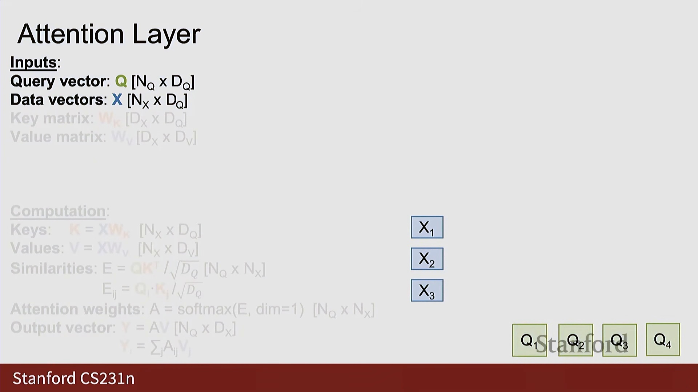

We're separating the usage of the data $\mathbf{v}$ectors into those two different notions of keys and values. Then we can visualize this in a different way. Now, we're finally throwing away the RNN and looking at attention just as an operator on its own so we can step through this operation again.

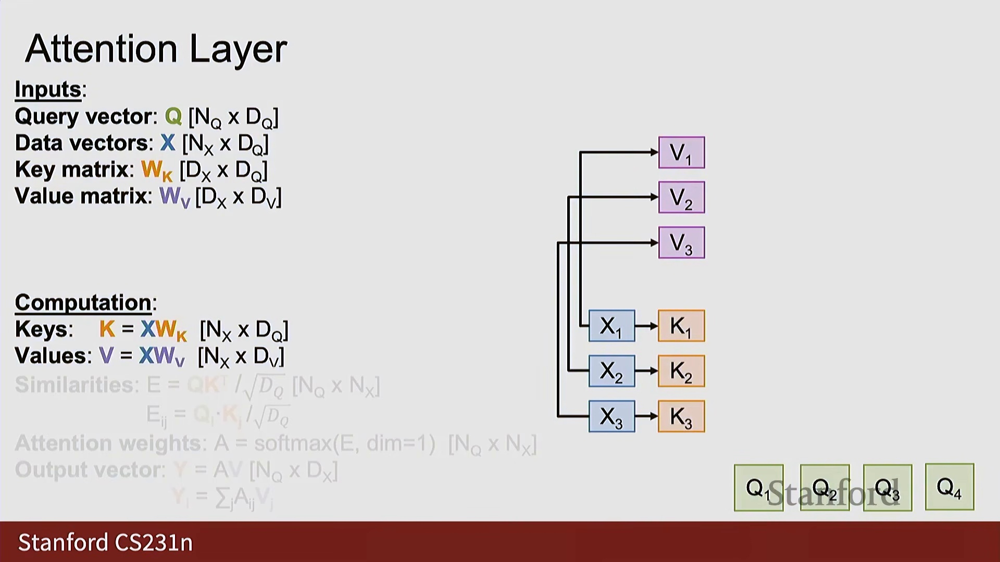

We've got our query $\mathbf{v}$ectors coming in. We've got our data $\mathbf{v}$ectors coming in. What we're going to do is that from the data $\mathbf{v}$ectors, we're going to project each data vector into a key and a value.

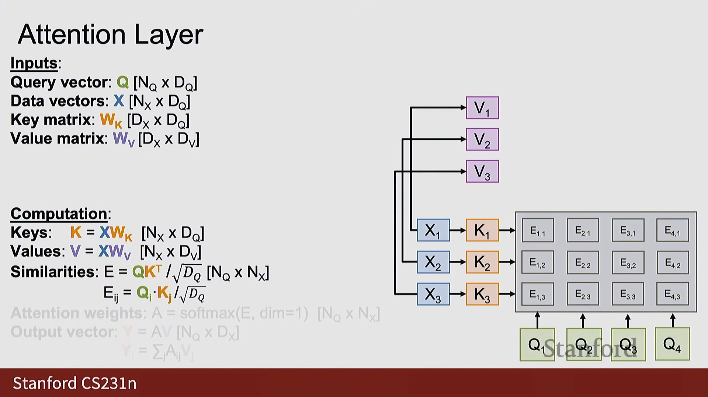

Then we're going to compare each key with each query to get our similarity scores. This is a matrix of scalars giving the similarities between each key and each query.

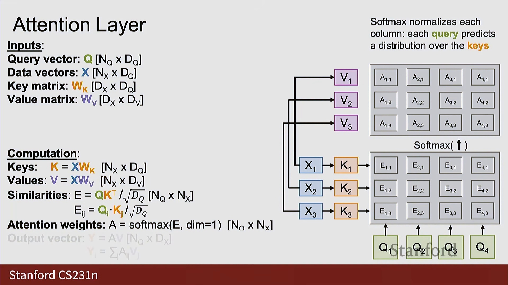

Once we have this matrix of similarity scores, we want to compute a distribution over each data vector for each query. That means we need to run softmax over this matrix of alignment scores, where we compute the softmax over each row.

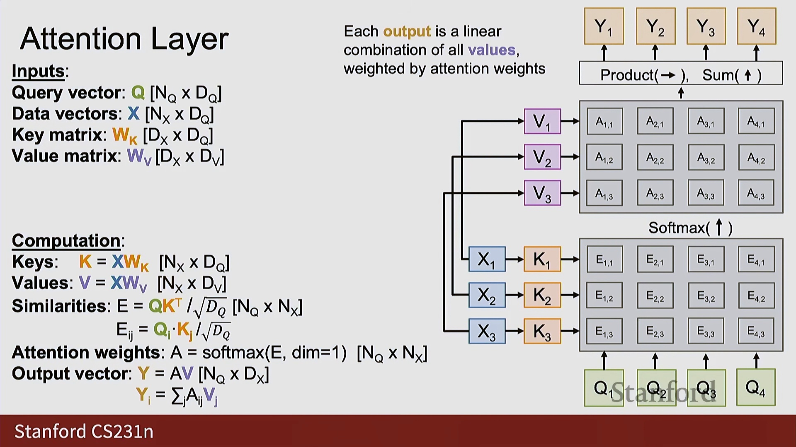

What we do is, we want to reweight the value $\mathbf{v}$ectors by the attention scores in the softmax. Actually, no, sorry, we want each column to be a distribution because we want, for each query, a distribution over the keys. This means we want softmax over the columns because we want it to be aligned to the columns. Then what we do is we've got this query one.

We've predicted this distribution over all of the keys from this computation. The same thing happens over here. Our second query got compared with all the keys. This is now the attention operator standing on its own, divorced from the recurrent neural network.

The question is, how do you divide the data vector into keys and values? The beautiful part is we don't have to say how. We just give the neural network the capacity to split it by itself by giving it this mechanism to project separately into keys and values. But we are not going to tell it how to do it.

The key matrix and the value matrix are just going to be learnable parameters of the model that will be learned via gradient descent along with everything else. The keys and values, you might think of it as some kind of filter. The data vector might have a lot of stuff in there. But for the task at hand, we might want to filter the data vector in various ways and only try to match our queries against part of it.

We only care about retrieving information from a different part of it. So you could think of those as filtering the information in the data vector in two different ways. This is basically our attention operator. There's no RNN here; this is just a neural network layer that you could have standing on its own.

It receives two inputs: the query $\mathbf{v}$ectors and the data $\mathbf{v}$ectors. It has two weights of learnable parameters, which are the key matrix and the value matrix. It inputs two sequences of vectors, outputs a sequence of vectors. This is a neural network layer in its own right that you could start to plug into your neural network architectures in various places.

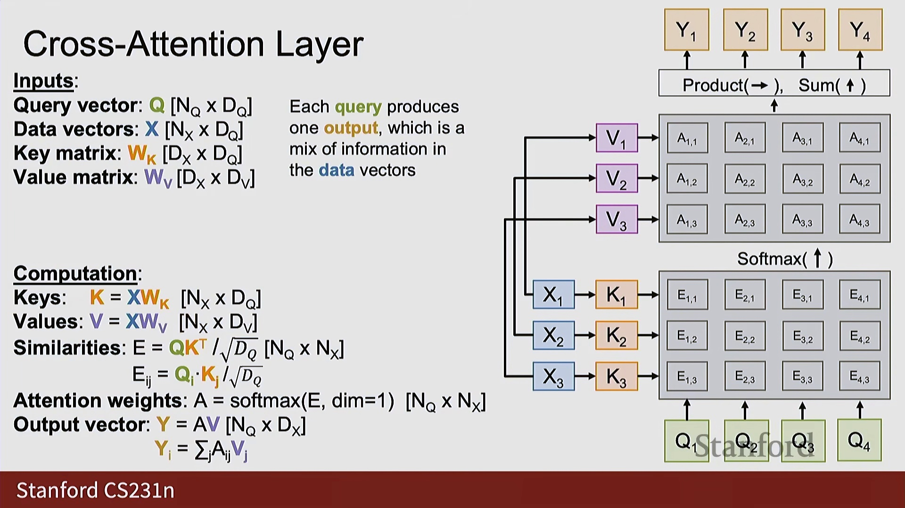

This is sometimes called a cross-attention layer because it has two sets of inputs coming in. The idea is that we have both data $\mathbf{v}$ectors and query $\mathbf{v}$ectors. They are potentially coming from two different sources, and this is sometimes useful. For example, if I have a set of queries, for each query, I want to go and summarize information from my data, which is potentially different.

or a different number, or totally different from my query vectors. So this is sometimes called a cross-attention layer because we're cross-attending between two different sets of things.

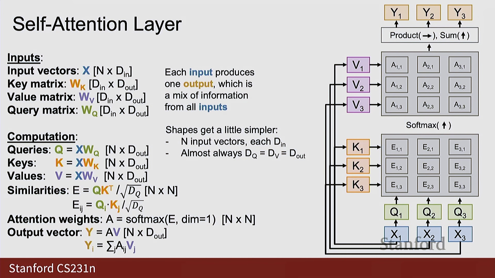

But there's another version of this that happens—maybe even more commonly—is a self-attention layer. So here, what we're going to do is, we only have one set of things. We only have one sequence of inputs. We have one set of vectors, one sequence of vectors that we're processing.

Now, we no longer have this separation between data vectors and query vectors. We just have one set of input vectors that we would like to process. So in a self-attention layer, we're going to have a set of input vectors, and we're going to produce a set of output vectors. We want to input a set of vectors $\mathbf{X}$, output a set of vectors $\mathbf{Y}$ that are the same number as the input vectors.

The mechanism of this is basically the same attention mechanism that we just saw. From each of our input vectors, we're going to project it to a query, to a key, and to a value. The equations change just a little bit, but the picture over here doesn't actually change very much. For each of our input vectors, we separately project it to a query, to a key, and to a value.

We have the exact same computation: we've got queries, we've got keys, we've got values. But all the computation is otherwise shared. The question is, what are $D_{in}$ and $D_{out}$? How are they sized?

These are going to be architectural hyperparameters of the layer. The same thing with a self-attention layer: $D_{in}$ and $D_{out}$ are going to be architectural hyperparameters of the layer. In principle, they could be different. There's enough flexibility in this architecture so that, in principle, $D_{in}$ and $D_{out}$ could be different, although I don't think I've almost ever seen that.

In practice, they are almost always the same. So I was a little bit extra general in the notation here.

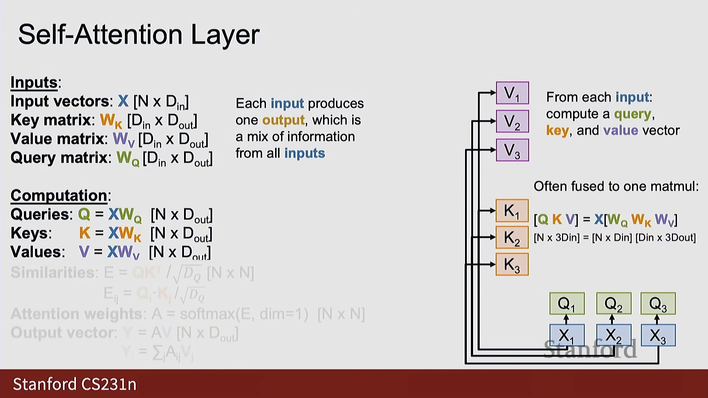

We do not necessarily need to walk through this. Oh, actually there is one important thing. I said that we are separately projecting the inputs into queries, keys, and values. That happens via three matrix multiplies with our three learnable weight matrices.

We have three learnable weight matrices: one for keys, one for values, one for queries. And we separately project the input vectors $\mathbf{X}$ into keys, queries, and values. If you've read transformers before, they sometimes separate between encoder and decoder transformers, or encoder-decoder attention. In that case, this would be the decoder-only attention if you've read transformer papers before.

This corresponds to the way that it is used in the decoder of the RNN in the initial example at the beginning of class. We are quite divorcing ourselves away from the RNN now. So this flavor doesn't really make sense to be used in the RNN that we saw at the beginning of class. But we've now generalized it to become a totally different operator that can be used all on its own.

In this particular generalization into self-attention, it actually no longer can be used in that decoder RNN. However, it is a very useful primitive that gets used in a lot of other places, it turns out. The question is, what's the benefit or difference between the self-attention versus the cross-attention? They would get used in different contexts.

In some situations, you naturally have two different kinds of data that you want to compare, which we saw for example in the machine translation setting. We have an input sentence. We have an output sentence. We believe that there's some natural structure in the problem—that there are two different sets of things that we want to compare.

That also might happen in, say, image captioning. Say, we have an input image; we want to produce an output sentence. There are two different kinds of things we want to compare: pieces of the image and tokens in the words that we're generating. For some problems, there is just this natural structure where you have two different kinds of things floating around.

But for other problems, there aren't two kinds of things; there's just one thing. Say you're doing image classification, then there's only an image. We just want to process the image. In that case, we just want to compare parts of an image with itself.

And that's where you would use a self-attention layer.

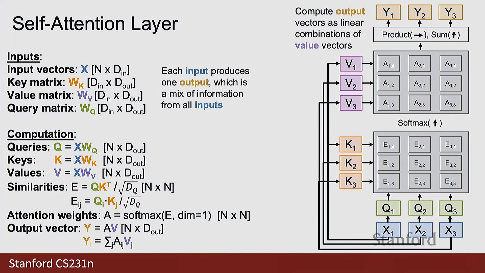

That's really beneficial.

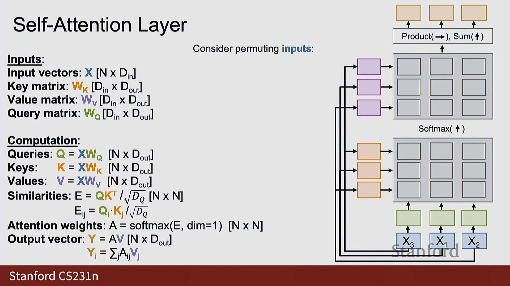

There are a couple interesting things about attention that I want to get through. For example, let's consider what happens if you permute the inputs.


Suppose we had a set of input vectors; what happens if you shuffle them and process them in a different order? Actually, a lot of interesting stuff happens. The keys, the queries, and the values will all end up the same because they are computed as linear projections of the input. We'll end up getting the same keys, queries, and values; they'll just be in a different order, shuffled in the same way that the inputs were.

Because our similarity scores were just dot products, we'll also end up with the same similarity scores, just again, shuffled in accordance with the way we shuffle the input.


Since softmax doesn't actually care about the order of its inputs, it is now operating on the same vector but shuffled.


This means there is a really interesting structure here called permutation equivariance. This means, in this case, that self-attention doesn't actually care about the order of the inputs. If we change the order of the inputs, we get the same outputs just shuffled in the same way. The computation of the layer does not depend on the order in which we present the inputs.


But this is sometimes a problem. Sometimes it is useful to tell the neural network what the order of the entries is.


As a quick fix for that, we will sometimes concatenate an additional piece of data onto each of the input vectors, called a positional embedding. This is basically some piece of data that tells the neural network: "This one's at index one, this one's at index two, this one's index three," and so on. The question is whether it goes to train to the same result.

The question of what vectors do I compute at the output does not depend on the order of the vectors in the input. But the order of the vectors I get from the output does depend on the order that they were presented in the input. There are other couple of tricks we can do with self-attention, but I'll go through these a little bit faster.


Sometimes, in a full self-attention layer, we allowed every piece of the input to look at every other piece. We can implement this via notion called masked self-attention. If you have a negative infinity in your alignment scores, then after you do a softmax, it's going to end up as 0. This means that if there is a negative infinity in the alignment scores, we end up with a 0 in the softmax score—in the scores after the softmax.


This mechanism allows us to control which inputs are allowed to interact with each other during the process of computation. So, we can use it to process a sequence of words; attention is very and then output is very cool. In this case, we are doing the same language modeling task that we saw last lecture with RNNs, but we can now just do it natively with this self-attention block.

However, in this case, we want to make the first output "is" only depend on the first word; the second output "very" is only allowed to depend on the first two words. We don't want to let the network look ahead and cheat.


Here is where we would use masking.

Another thing that we sometimes do with self-attention is called multi-headed self-attention, where you run $n$ separate independent copies of self-attention in parallel.


Why do you want to do this? Because it's more computation, it's more FLOPs, it's more parameters. Deep learning, we always want more and bigger. And this is another way that you can make this layer more and bigger and more powerful.

So what we're going to do is take our inputs $\mathbf{X}$, route them to $H$ independent copies of separate self-attention layers.


In this case, this is called multi-headed self-attention.


And this is basically the format that we always see in practice. Whenever you see self-attention used these days, it's almost always this multi-headed self-attention version.

In practice, it turns out that you can compute this all with matrix multiplies as well. So you don't have to run a for loop; you can compute each of these $H$ copies of self-attention all in parallel if you're clever and use batch matrix multiplies all in the right places.


In fact, this whole self-attention operator seems like a lot of stuff going on, but it's really, basically, just four matrix multiplies. We have one matrix multiply where we take our inputs and project them to queries, keys, and values.


We have another matrix multiply where we compute $Q\mathbf{K}$ similarity. For each $Q$, we compute the similarity against all the $K$'s. And that's one big batched matrix multiply in the multi-headed case.


We have another one called $V$ weighting, where we want to take linear combinations of all the values weighted by the softmax entries.


That can be done in another big batched matrix multiply. Finally, we have an output projection to mix information across our different heads of our self-attention.


They will all be random; they'll all have different weights critically. And those weights will be initialized randomly and different at initialization. So it'll end up learning to process them in slightly different ways. This is just a way to give extra capacity to the layer.

The only thing different between different heads is the weights. While the architecture is exactly the same, the computation is exactly the same, but they'll have different weights. Those weights will be initialized to different things at initialization. But other than that, it's all exactly the same.


Now, we've gotten to one really interesting place where we have three different ways to process sequences that we've seen in this class.


The first is recurrent neural networks. We saw that recurrent neural networks basically operate on 1D ordered sequences. They are powerful, and people liked them for a long time. However, they are fundamentally not very parallelizable because of this concurrent structure, where each hidden state depends on the previous hidden state.

This makes it a fundamentally sequential algorithm; there's no way to parallelize this across the sequence.


That makes them very difficult to scale and very difficult to make very big. Another primitive that we've seen is convolution. Convolution basically operates on multidimensional grids. We've seen it in two-dimensional grids in the case of images, but you can also run them on 1D grids, 3D grids, or 4D grids.

Convolution basically mixes information locally in $N$-dimensional grids. This is a very parallelizable primitive, but it has a hard time building up large receptive fields.


That still introduces some fundamental sequentiality in the way that we need to process large pieces of data. Self-attention is a separate kind of primitive that operates on sets of vectors. It naturally generalizes to long sequences, and there are no bottlenecks like those found in recurrent neural networks. There's also no necessity of stacking up many layers of them to let all the vectors look at each other.

In one layer of self-attention, every vector looks at every other vector. So with just one layer, you can do a lot of computation. It is also highly parallelizable. As we saw, the whole operation is just four big matrix multiplies.

The only downside of attention is that it's expensive. It ends up having $n^2$ compute for a sequence of length $n$, and $n^2$, or later $n$, or $n$ memory for a sequence of length $n$. If your $n$ ends up being like 100,000, 1 million, or 10 million, $n^2$ becomes very expensive. But you can solve that by buying more GPUs.

So that's basically the solution that people have come up with here. Basically, attention has become this super awesome primitive that is super powerful for processing very arbitrary pieces of data.


And you might be wondering, which of these you should use? Attention is all you need. It turns out that of the three, you can get a long way using only attention. Now, the question is, is parallelizable—what's the advantage of that?

The advantage of that is that in the history of computing, it gets hard to make processors faster. We've run up against this limit as a fundamental limit in hardware: that it's become very difficult to make individual processors faster. But what we can do very easily is get a lot of processors. So the way that we are able to marshal more computation over the last two decades is finding algorithms that do not require running on one really fast processor.

If we can find algorithms that do that, that's how we can scale up and get really big, powerful computations. Is there a trade-off with $n^2$? I think the $n^2$ is actually a good thing. So it seems bad; you're taught in computer science that parameters inside that $n$ is bad.

So actually, the more compute the network does on the input sequence—actually, maybe the better answer it could arrive at.


So it means that it's more expensive, but that's not necessarily a bad thing. Basically, the Transformer is now a neural network architecture that puts self-attention at the core of everything.


Our input is going to be a set of vectors $X$. Then we're going to run all those vectors through self-attention, which is, as we just said, this amazing primitive that lets all the vectors talk to each other.


After that, we'll wrap that self-attention in a residual connection for all the same reasons that we wanted to use residual connections in ResNets just a couple of lectures ago.

Then we will take the output of that residual connection, pass it through a layer normalization. Because as we saw in ResNets and in CNNs, adding normalization inside your architectures makes them train more stably.


But then now, there's something interesting. Because self-attention, basically, what it does is compares all the vectors with each other. And that's a very useful primitive; that's a very powerful thing to do. But we also want to give this network the ability to perform processing on vectors independently one-by-one.


So then there's a second primitive inside the Transformer, which is the multi-layer perceptron (MLP), also called FFN. Basically, this is a little two-layer neural network that operates independently—that is, run independently on each one of our vectors inside.


We'll also wrap the MLP in a residual connection, put a layer normalization, and put a box around the whole thing and call it a neural network block.


So this is our Transformer block.


And a Transformer is just a sequence of Transformer blocks. These things have gotten much, much bigger over time. The architectures haven't changed too much since 2017 when this was introduced. So this same architecture has scaled across many orders of magnitude in compute and size and parameters over the past eight years.


They can be used both for language modeling as we already seen. They also can be used for images.


And here, the application is fairly straightforward.


Given an image, we basically divide the image up into patches, project each of those patches separately into a vector.


Those vectors then get passed as inputs to our Transformer.


And then the output gives us one output from the Transformer for every patch in the input. So then this same architecture of a Transformer can be applied both to language and to images and to a lot of other things as well.


I mentioned there have been a couple minor tweaks to Transformers since they were first introduced.


But we're running out of time, so I'll just leave those as extra reading. So the summary of where we get to at the end of this lecture is, basically, two things that I promised at the beginning. One is that we introduced attention, which is this new primitive that lets us operate on sets of vectors. It's highly parallelizable.

It's basically just a couple of matrix multiplies. So it's highly scalable, highly parallelizable, highly flexible. It can be applied in a lot of different situations. So that's super powerful, super interesting, super exciting.

The transformers have been with us for eight years now, and I don't see them really dying anytime soon. So that's pretty exciting.


So that's basically it for today's lecture.

