# Stanford CS231N Deep Learning for Computer Vision | Spring 2025 | Lecture 10: Video Understanding

I think at the beginning of the course, we announced that we would have a few guest lecturers, people who previously taught the course, to come and give a single guest lecture about a topic that they're very familiar with. I'm very happy to announce we have the first one of those lectures today.

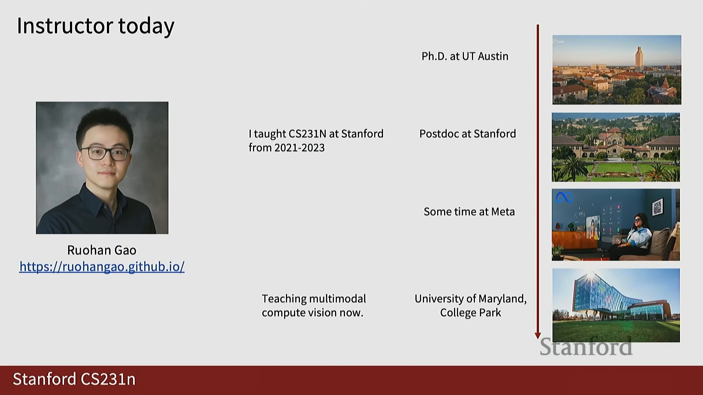

So I'll introduce Dr. Ruohan Gao. He is an Assistant Professor in the Department of Computer Science at the University of Maryland, College Park. He leads the Multisensory Machine Intelligence Lab there. He was previously an instructor for CS231N from 2022 to 2023 while he completed his postdoc with Fei-Fei Li, Jiajun Wu, and Silvio Savarese.

So without further ado, I'll leave it to Ruohan to give the presentation today. It's really exciting to be back to the class of CS231N. As you can tell, I'm very interested in multimodal stuff. This means not only vision, but also how we can make use of other sensory modalities like audio, tactile, or other modalities—just like us, humans—to perceive, understand, and interact with this multisensory world.

But of course, vision is the most important modality.

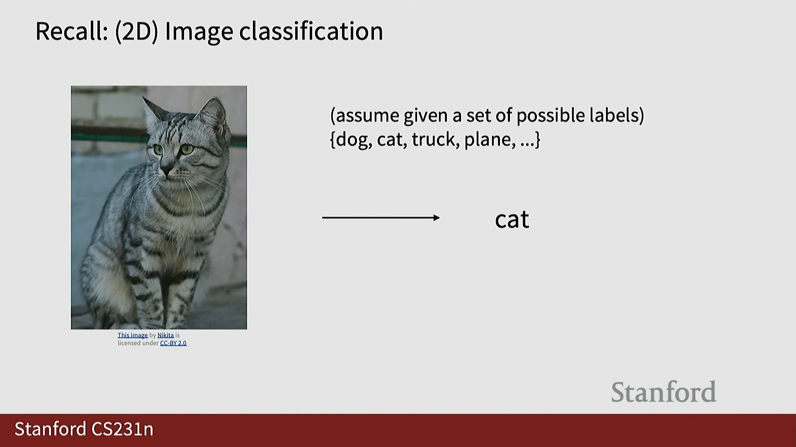

That's why we have this course, Deep Learning for Computer Vision. I'm sure up to this point that you guys are very familiar with image classification. Given a 2D image like this, how to give a label to see whether it's a dog, or it's a cat, or it's a truck, a plane.

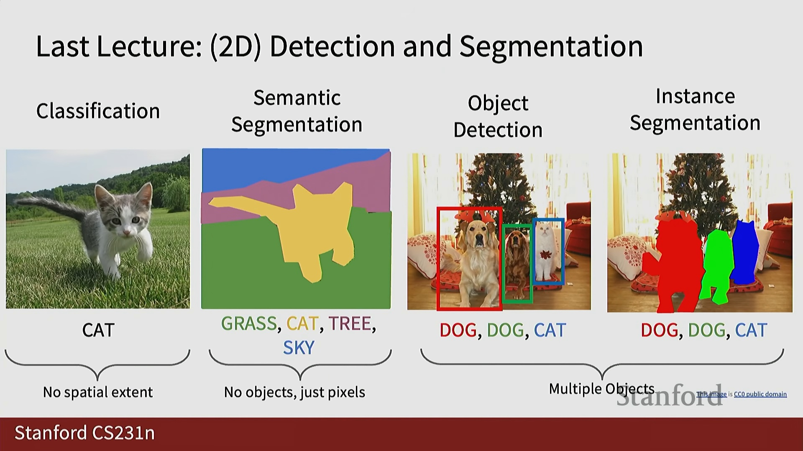

That's a 2D-based image classification. From the last lecture, I'm sure you have also learned some other tasks that you can do on images. Not only can you just assign a single label to say it's a cat or not; also, you can do semantic segmentation to segment the picture into different portions, components, and also have some semantic meaning—like where is grass, where is cat, where is tree.

You can also put a bounding box on top of the objects you detect in the image to see where the dog is, or where the cat is, and also do instance segmentation. With that, you not only want to know the categories but also for each category, if there are two dogs, I want to have a segmentation mask for each category. So a lot of tasks—classification, recognition tasks—you can do based on 2D images.

But that's not the only thing that we can use for computer vision systems to do. Our world is not just static like this. If we look at this image, hopefully up to this point you have learned a lot of tools that you can train some models to classify: this is a living room. You also have tools; you have learned how to put a bounding box to see that this is a dog and this is a baby.

And also, you can even have a segmentation mask to show where those objects you detect are in the image.

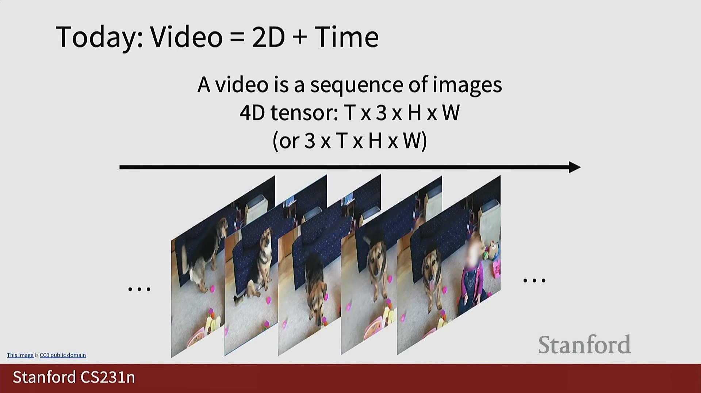

Today, we're going to focus on video understanding. So more formally, what is video? Basically, video is just like this 2D image plus time. There is an extra time dimension.

Now, we are tackling things not only in this 3D image but also now in 4D. $T$ is the temporal dimension, and $H$ and $W$ are the spatial dimensions. Now, we are considering this kind of image and videos as a volume of images of video frames. An example task is video classification, just like image classification.

So we are given a video like this—some person is running. We want to take these videos as input, and also we want to train some model, a deep learning model. We want to classify whether this person is doing swimming or running or jumping or what actions that he is doing, just based on this temporal streams of video frames. Also, from the previous lectures, I'm sure you have already learned some loss functions like cross-entropy loss and you can train an image classifier.

Similarly, you can use the similar tools; you just train a video classifier. You get some features, and you use the same loss functions and train a video classifier. The problem on video understanding is that how can we get features of videos that you can apply the loss functions you have learned from the previous lectures?

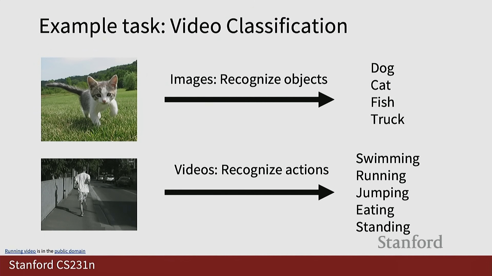

Another kind of difference between image classification and video classification is that the tasks you want to do might be a little bit different than the previous example. For image classification, usually, you care more about the scenes, the objects; you want to just do a classification: what is the object category? For videos, usually, just like this example I'm showing here, you only want to classify actions.

It's often actions where the person—what activities the person or some animals are doing in the videos. That's what we care about usually in video understanding. The nature of things to recognize can be a little bit different. And another problem that we want to be careful about for video understanding is that videos are usually very big.

When we talk about images, it's just like three times $H$ times $W$. It's a single matrix of some RGB numbers. But now, if we consider videos, it's a sequence of frames. It can be like 30 frames per second.

So in movies, sometimes, we can have even higher resolution and also temporal resolution video frames. You consider a space to store videos. For example, if we consider standard definition videos, it can take about $1.5$ gigabytes per minute if we store this video. If we consider even higher resolution, like $1920 \times 1080$, it takes like 10 gigabytes per minute.

So it takes a gigantic space in order to store this kind of video data. Also, there is no way for us to just fit this kind of data directly to GPUs. If we just have the input, then we have a lot of storage to store them, to store this kind of data. And also, there are other things you have to store, like the weights, the activations in your convolutional neural networks.

So then, your model will be very huge. What solutions can we have to make videos smaller to make them processable?

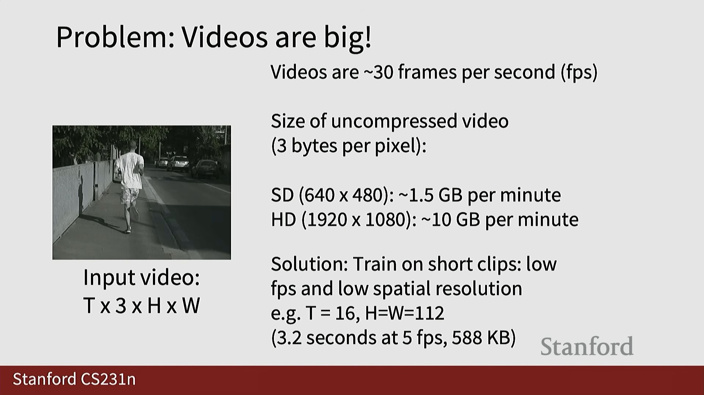

One simple solution is that we just make videos smaller. Although high definition videos and also the original videos are long, we can shrink things both temporally and spatially. For example, for $3.2$-second videos like this, we can maybe—for each second, maybe we don't need all the frames. Let's just take five frames because there are a lot of redundancies in the video frames.

If we take frames per second, and also we just have a smaller spatial resolution like $112 \times 112$. We can make the videos slightly smaller. For example, it's $588$ KB for this simple video. But definitely, we can also do larger resolution if you have the compute, just like images.

And also, how to train a model on these long videos?

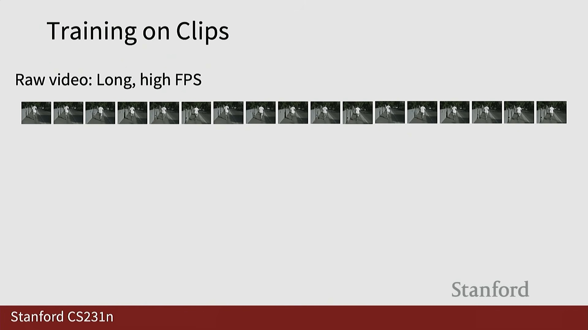

I showed that we are training this video classifier on $3.2$ seconds. But videos can be very long; they can be minutes, they can be hours. So one way that people do is that we train on clips, just like we train on chunks of this video frames using a video classifier.

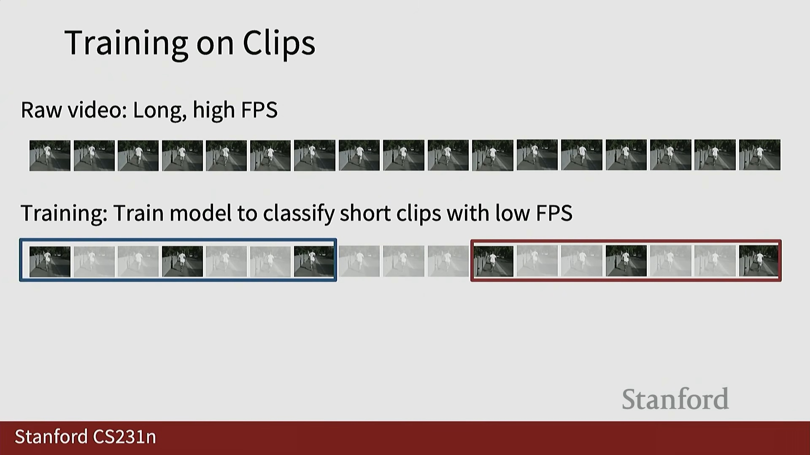

What we do is that we train models to classify short clips with some low fps (frames per second). We sample a lot of different clips and use them as training data.

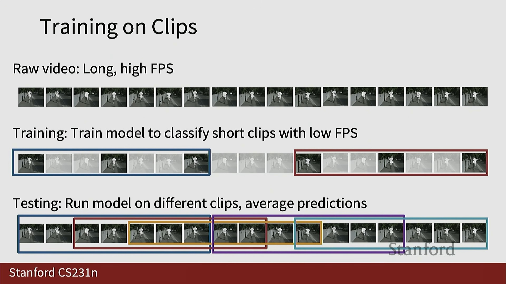

And then during testing, during inference time, we just run the model on different clips. And then we average the prediction results.

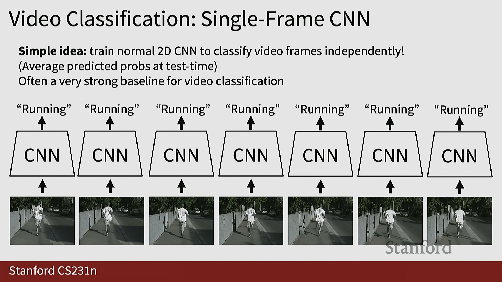

That is our prediction for this long video. What is a same post like video classification model we can use? I have mentioned basically video is just like a sequence of images, a sequence of video image frames. So one simple thing that we just treat them as images.

That's the simplest tool we already have. We just run single frame convolutional neural networks because we already have all the tools. We have learned that we can train an image classifier. If we just take our image classifier to just run on top of these video frames and treat them as images, we can indeed get decent predictions.

Especially a video like this. You can see that there are not many changes across videos. Maybe there are some different movements on the body. But generally, it looks pretty similar.

Maybe you run an image action classifier. On every frame, maybe all of the frames will tell you it's running. If you average the prediction results from each image, each video frame, then you will predict running for this particular video. So actually, also, it's usually a very strong baseline for this simple image classifier, especially for video like this because there are not too many changes across videos.

If you are trying to design some video classifier, you should always run this first because that's something simple to try. And maybe you can already get pretty decent results. So the question is, whether we just run single frame or we run a chunk of frames? Basically, we have a video of 30 frames.

Maybe you just sample a few frames. You use the image classifier to run on those sampled 10 frames and treat them as images. You directly average the results. That's basically the per-frame CNN.

I think you have some very important question: how to sample the frame? We want to sample some frames and run a CNN on them.

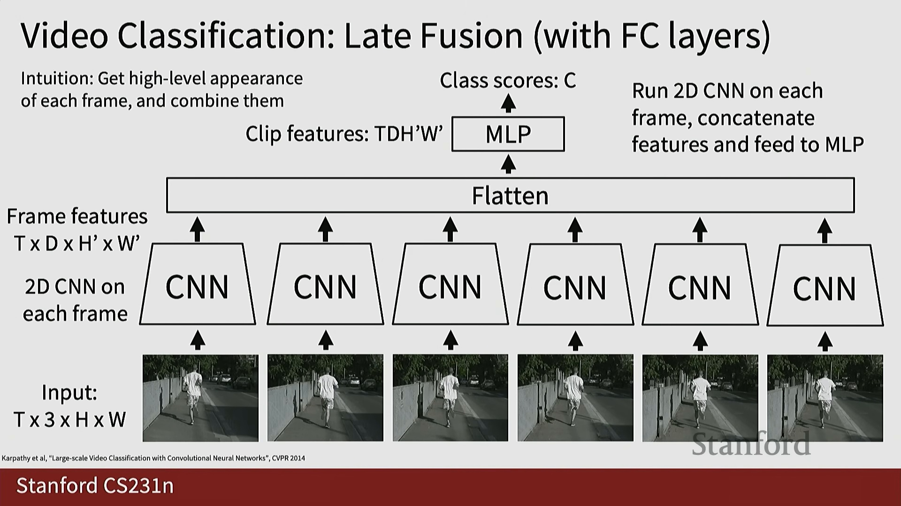

So, how do we get those frames? That is actually also an active area of research. One simple way is through random sampling. You might have a one-hour video, but you don't know where the interesting or important parts are.

You could just sample every minute and run an image classifier, averaging the results. Obviously, this may give good results, but perhaps it is not the smartest way to do sampling. There are other methods trying to propose smarter sampling strategies. Maybe you can sample one frame, and then use that decision to decide where else to sample.

I actually have some examples later in the lecture slides. This method is a very simple video classifier, just like we used with an image classifier—a single-frame CNN. Similarly, we can take one step further. Instead of directly running a single-frame CNN and averaging the prediction results, maybe we can do some fusion across features using several single-frame CNNs.

This is often called late fusion. Basically, the idea is that we still take 2D CNNs. For each frame, we use a 2D CNN and extract a feature vector. From this, we get maybe a feature map of $D \times H' \times W'$.

Since we have $T$ frames, we essentially have $T$ feature maps. The simple thing is to flatten all the feature maps into vectors and then concatenate them. We end up with a giant feature vector that contains all the information—all the features across all the frames. What we can do then is use tools we have learned, like fully connected networks.

We train an MLP that maps this vector to some neural dimension, and then we train a classifier on top of it to map it to a class score $C$. This process is called late fusion because we extract the feature maps and process them very independently. Then, at the very late stage, we concatenate the feature vectors and run fully connected layers to do the classification.

However, one drawback that you can probably tell from this example is that this fully connected layer introduces a lot of parameters. Because if we concatenate many—we flatten them across time—these feature vectors are dependent on how long or how large $T$ is; then you can have a giant feature vector. You want to map this into some lower dimension, which requires very large fully connected layers and thus introduces lots of parameters, making it inefficient.

Another way to do this is that instead of concatenating them, we don't use the giant feature vector with a fully connected layer mapping them to scores.

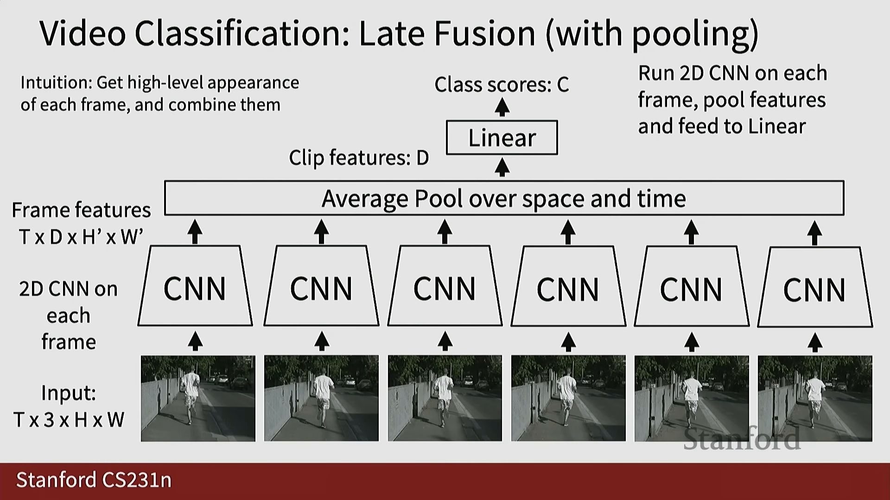

We can actually just perform simple pooling. When you pool, you don't increase the length of the feature vector. If you have some feature dimension for a single frame and you pool across time for $T$ frames, you are doing a temporal aggregation. Based on this clip feature $D$, instead of $D \times T$, you just still have a feature vector of dimension $D$ if you perform pooling.

You then use a linear layer to map $D$ to some dimension $C$ that matches the class score, and train the cross-entropy loss on top of it. This is also late fusion, but we are using pooling. The good side here is that now you don't need very large fully connected layers. But the downside is that pooling can get rid of information that may be important.

That’s the drawback of this operation. I call it late fusion because the important part is "late," and when it's late, some information may have already been lost.

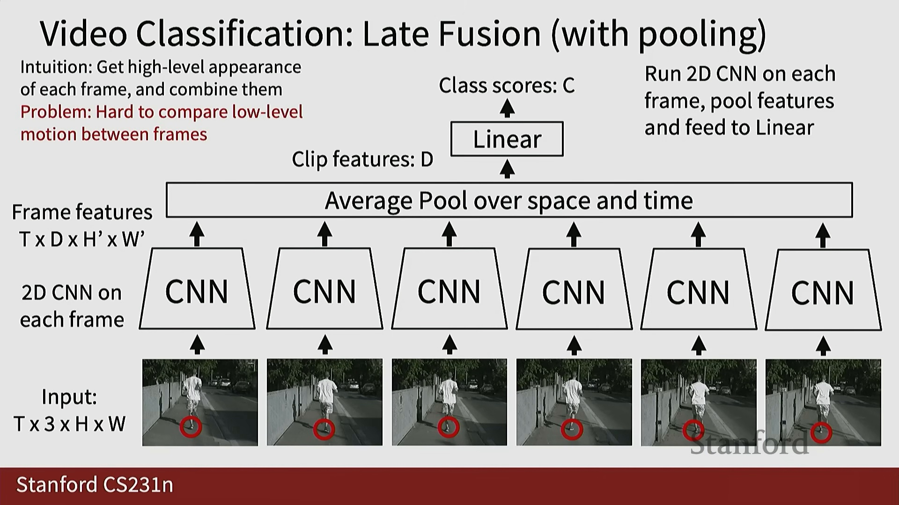

If you use 2D convolution networks to process images—for example, as shown in these red circles—what is very important to recognize is that this video is actually about the motion of this man's feet, right? It's moving up and down, up and down. If we just use a single 2D CNN to process them independently as a 2D image and extract some feature map, and then up to very late stage of the feature maps, it doesn't contain the information of this movement of the feet of this man anymore.

At this very late stage, some information of this feet up and down is showing these red circles, which should be useful cues. But now, it's not there in the feature maps.

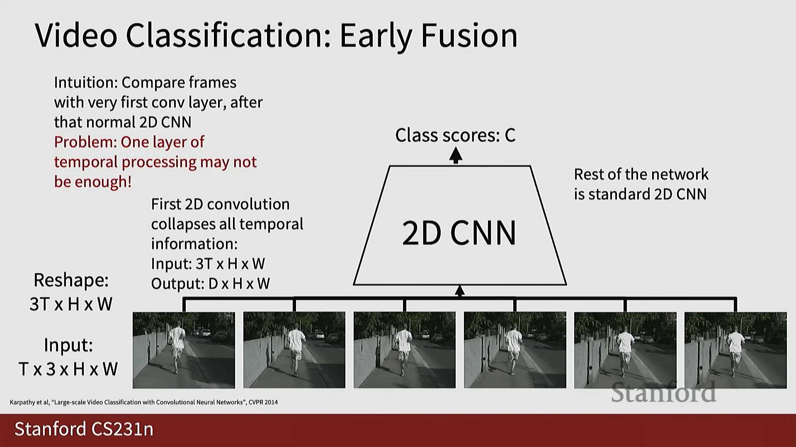

The intuition is that if you extract features from the earlier layers, it's very close to the original video frames. So there is a larger chance it will contain this low level information, this movement from the video frames. Also, if you concatenate them or pool them across time, it will analyze the motion across time. But because we are processing a lot of convolution pooling up to a late stage, even at the very late stage, it contains more high level information like semantic information instead of this low level motion information.

So that's why it's most likely it's not there. This is the downside of late fusion. Instead of doing late fusion, we can do early fusion. To do early fusion, if we want to make use of the feature vectors more closer to the actual video frames, we can just take this input and then directly reshape them to $3T \times H \times W$.

We directly aggregate the information temporally from the very beginning. Then we use some 2D convolution—the first 2D convolution layer—to map them from channel dimensions $3T$ to $D$. Basically, we use the 2D convolution to process this temporal information in the first layer to map the channel dimension from $3T$ to $D$, processing the video frames and all of the information from the frames at the very beginning of the convolutional neural networks.

The rest of the network is then standard 2D CNN. The only difference is that now, we destroy and collapse all the temporal information using a single layer. Then the rest is just like image classification, which uses standard cross-entropy loss. For each frame, we get features like $D$, and each single frame will give you a feature $D$.

So you have $T$ of these feature vectors $D$. For pooling, we are pooling over the features. We can do mean pooling to average the features or max pooling with max over the features. After that, we still get a feature that is $D$.

It's pooling over the features, not the frame. The downside of early fusion is that although we are explicitly trying to handle the motion from the early layer, we are too ambitious. We're trying to capture everything in a single layer; we just concatenate all the frames and then collapse all the information using a single convolution network. Maybe it's not going to achieve what we want it to achieve.

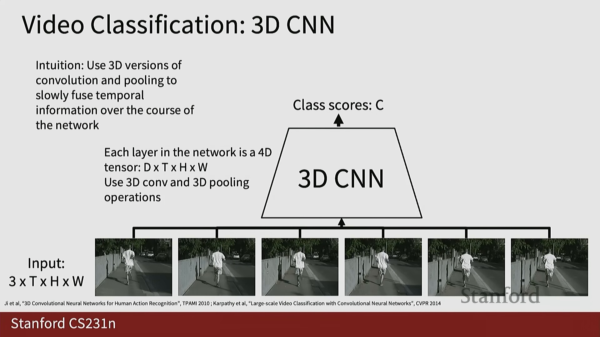

Another solution is that instead of doing late fusion or early fusion, maybe we should do something in between. That's slow fusion, which is exactly what this 3D convolutional neural network is doing. The intuition is that we want to use this 3D version of convolution and pooling; we want to slowly fuse the information over the course of the network.

Instead of doing it at a very late stage or at a very early stage, we gradually shrink over temporal dimension and spatial dimension to get these 3D feature maps. This is the idea of the 3D convolutional neural network. We just use 3D convolution and a 3D pooling operation. What is 3D convolution, 3D pooling?

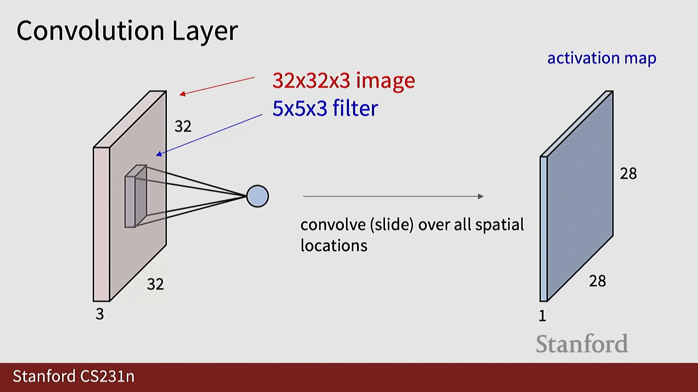

You have learned 2D convolution for a 2D convolution layer. Basically, you take an image like this—a $32 \times 32 \times 3$ image. If you use 2D convolution, you learn that for each kernel, you have this filter; you can have this convolution kernel that is maybe $5 \times 5 \times 3$, running like a sliding window approach that slides across space and goes all the way in the depth dimension.

For each computation, you map that to a single value in the final activation maps. Finally, you obtain this activation map of $28 \times 28 \times 1$ in this case. You convolve over all spatial locations and map this channel dimension—the depths go all the way over the channel dimension—and then map from 3 to 1 in this case. The difference is that for 3D convolution, we just have one extra dimension.

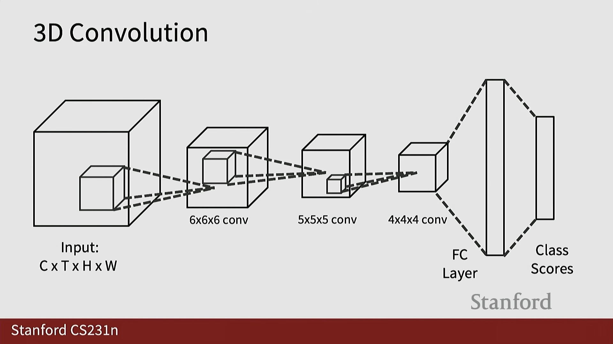

Here, you can think of that—here, the input is $C \times T \times H \times W$. The extra thing is this $T$ dimension; that is a temporal dimension. But what I'm showing here, because we can only show things in 3D, we cannot show things in 4D. So there's actually one dimension that is not shown here: that is the $C$ dimension, the channel.

You can think of it that for each grid point in this feature map, there are many features—there are $C$ features in that grid point. For a 3D convolution, basically, if we are talking about a $6 \times 6 \times 6$ convolution, because we have one extra dimension: Instead of sliding over the spatial dimension just in the $H$ and $W$ dimensions over the images, now we are sliding over this cube.

We are sliding over this cube of dimension $T \times H \times W$. So it includes both the spatial dimension and the temporal dimension. It also goes all the way along the channel dimension. Gradually, you can [do this] just like 2D calculus.

The other part is just like the 2D convolution; it's just that we have this extra dimension. You then get a $6 \times 6 \times 6$ 3D convolution, and maybe another layer of $5 \times 5$. Finally, after performing these 3D convolution operations, and flattening the feature vectors, you use fully connected layers to map them to the class scores. That is basically the idea of 3D convolution.

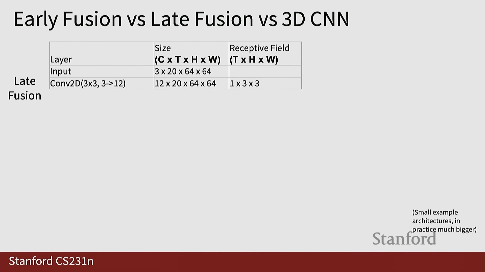

Let's walk through some toy examples to better understand it and compare the early, late, and the 3D convolution neural networks, just to give you a flavor of how it works.

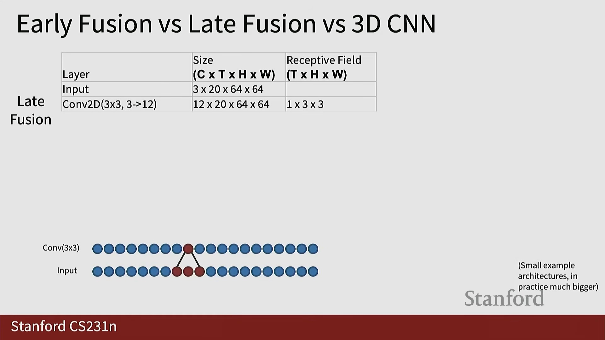

For late fusion, you can think of that, for example, in this case, maybe originally the input is $3 \times 20 \times 64 \times 64$ (with $T=20$ being the temporal dimension and $64$ being a spatial dimension). You use a 2D convolution because we are doing late fusion. We don't do anything over the temporal dimension initially; we just keep the $20$, the temporal dimension.

We just build up the receptive field spatially. Now, we have a 2D convolution layer to map the channel dimension from $3$ to $12$, but we just keep the temporal dimension of $20$.

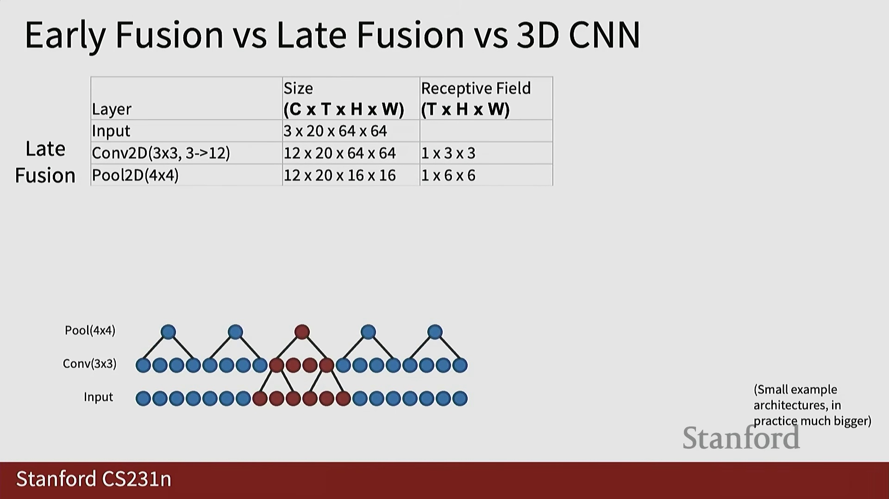

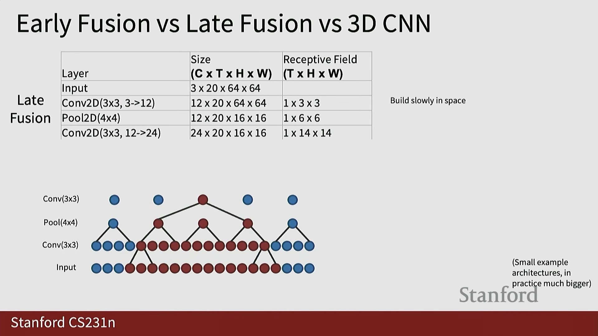

Then gradually, maybe we use some pooling layers. Still, we didn't do anything with the temporal dimension, so it's still $20$. But because of the pooling operation, we build up the receptive field in the spatial dimension. We then maybe use another 2D layer, and now the feature map is $24 \times 20 \times 16 \times 16$.

We also gradually increase the spatial receptive field, but it will still keep the temporal dimension of $20$. We didn't do anything over the temporal dimension. Finally, just using a single global average pooling, we pool across the feature map $20 \times 16 \times 16$. We pull over both time and the spatial dimension.

From this $20 \times 16 \times 16$, we get a $1 \times 1 \times 1$ feature point. Basically, we collapse everything in the final single layer, building up the temporal receptive field in a single layer.

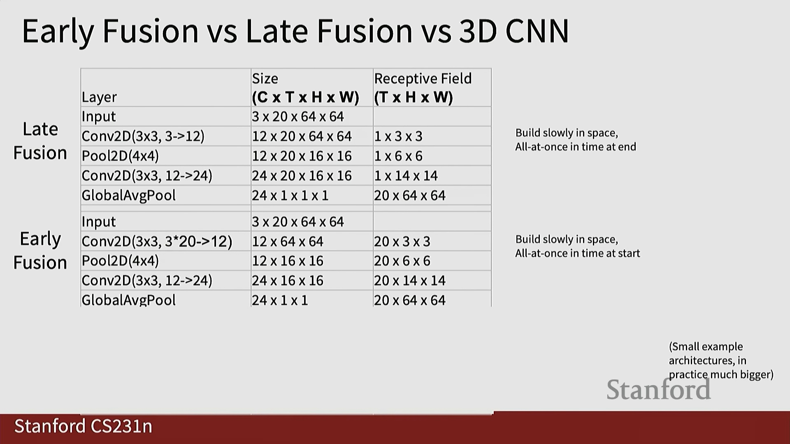

For early fusion, what's the difference? Now, instead of building slowly in space or at once in time at $N$, now we are building slowly in space and all at once in time at the very beginning.

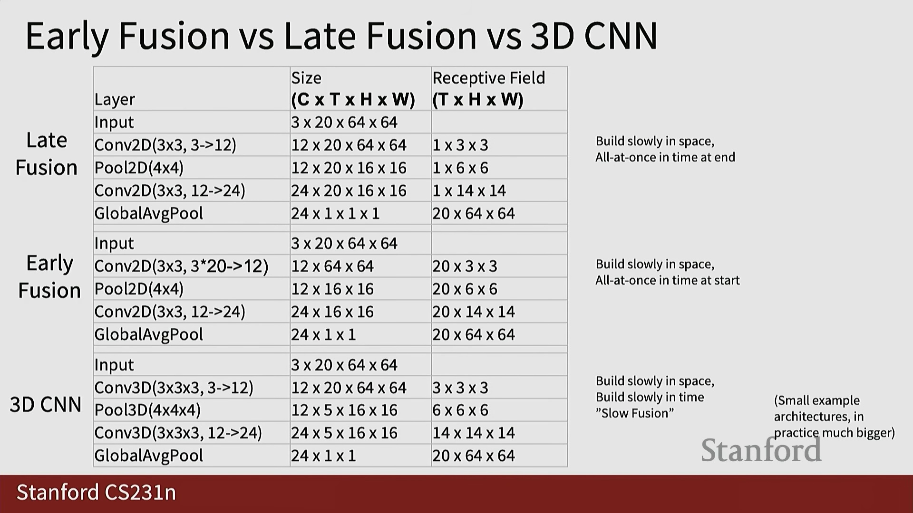

The input is still $3 \times 20 \times 64 \times 64$. We just use a single conv 2D layer; we treat this $3 \times 20$ as a single channel dimension. We map everything—there's $3 \times 30$. We treat all of them as the channel dimension, and then map them to $12$.

We use a single convolution layer, 2D convolution layer, to collapse all the temporal information from the very beginning. We build the temporal receptive field in the first layer, so now the temporal receptive field becomes from $1$ to $20$. Then the spatial receptive field gradually builds up. We use pooling and conv 2D to build up the spatial dimension just as late fusion.

Finally, we use global average pooling. With global average pooling, we are only trying to do the averaging/pooling across space. So we build slowly in space, but all at once at the very beginning. That's early fusion.

What about 3D convolution neural networks? For a 3D convolution layer, basically, we build slowly both in space and time. That's why we call it slow fusion. The input can still be the same $3 \times 20 \times 64 \times 64$, but now we are using 3D convolutions.

In the first layer, we map things from $3$ to $12$. We also keep the temporal dimension in this case. Then we build up a little bit temporal receptive field and a spatial receptive field, and then we use a pooling layer. Then we pull a little bit of this temporal feature and also spatial features.

We further build up both the spatial and temporal receptive field, and we have another Conv3D layer to further build up the spatial and temporal receptive field. Finally, we're using a global average pooling. Now, we are pooling over these $4 \times 16 \times 16$ feature map, which further increases the temporal and spatial receptive field. We are building up gradually in both space and time.

That is the difference between early fusion, late fusion, and 3D convolutional neural networks. You can see that for the early fusion and 3D convolutional neural networks, both of them build receptive fields over time.

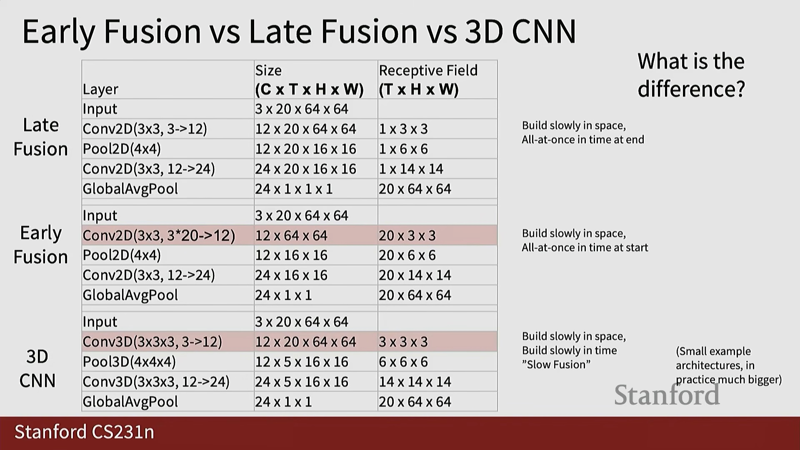

But what is the actual difference?

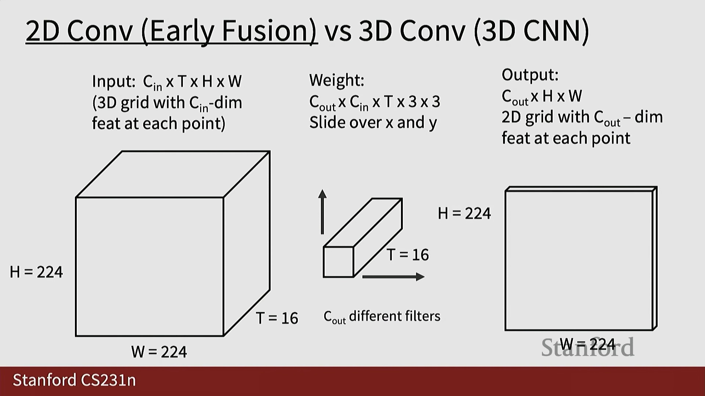

If we think of it as a feature vector for each spatial grid point, the common filter, if it's a 2D convolution, for this grid point, it will consider all the temporal dimensions. It is local in space but extends fully in time.

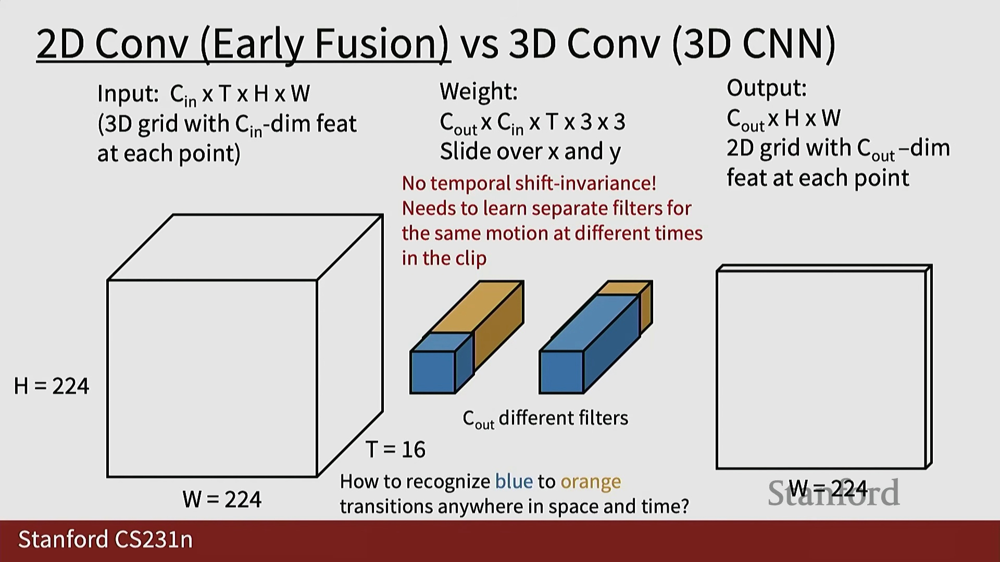

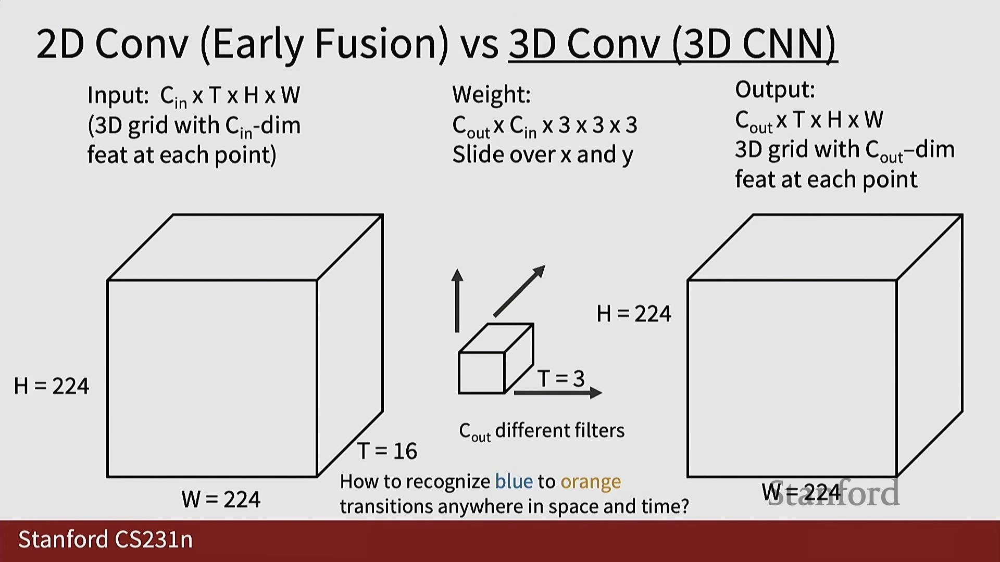

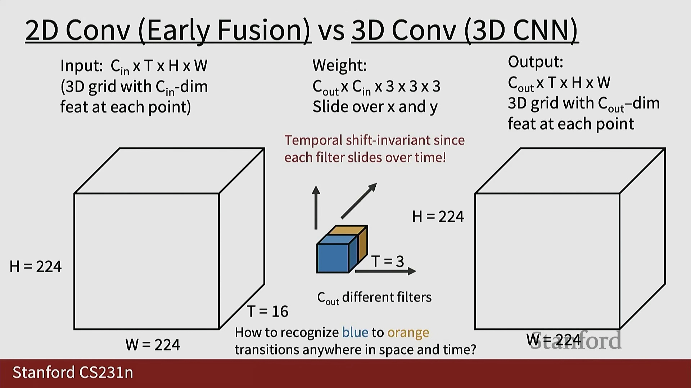

That is the filter in a 2D convolutional neural network. If we directly go all the way through the time dimension in this 2D convolution, what problem is going to happen? The shortcoming of that is that there will be no temporal shift invariance. This is because the 2D filter now extends fully in time.

But it is the same change from blue to orange. If we go all the way through time, the filter extends fully in time. If we want to learn the global transition across different times, then we have to have a whole separate filter in order to learn this; we have to learn a different kernel to learn these different transitions across at different time steps.

There is no temporal shift invariance. How do we recognize this kind of blue-to-orange transition just anywhere in space and time? Just like when we are doing image classification, we want to have some spatial invariance. We want to be able to recognize the image contains a cat no matter where the cat is—on the top corner or left corner—we want to share the kernels to be able to recognize things at a different spatial location.

Here, we want to be able to learn these different types of motion and different types of temporal patterns at different time steps. That is exactly the benefit of 3D convolutional neural networks. Instead of extending fully in time in this $T$ dimension (originally for this early version $T$ extends all the way in the temporal dimension, where $T$ is equal to 16), now if $T$ is equal to 3, we can slide over the temporal dimension.

Just like we learned spatial invariance using a filter and local regions, this Conv filter only spans a local window in time and slides over in the time dimension. The benefit is that now we can have some temporal shift invariance because each filter slides over time. We can reuse this filter to recognize different motion patterns across these dimensions.

The transition from blue to orange can now be recognized at every moment in time. The benefit of this is that we don't have to have separate filters; we are more representation efficient. We don't need to learn separate filters anymore. That is basically the main difference between 2D Conv early fusion and the 3D convolutional neural network.

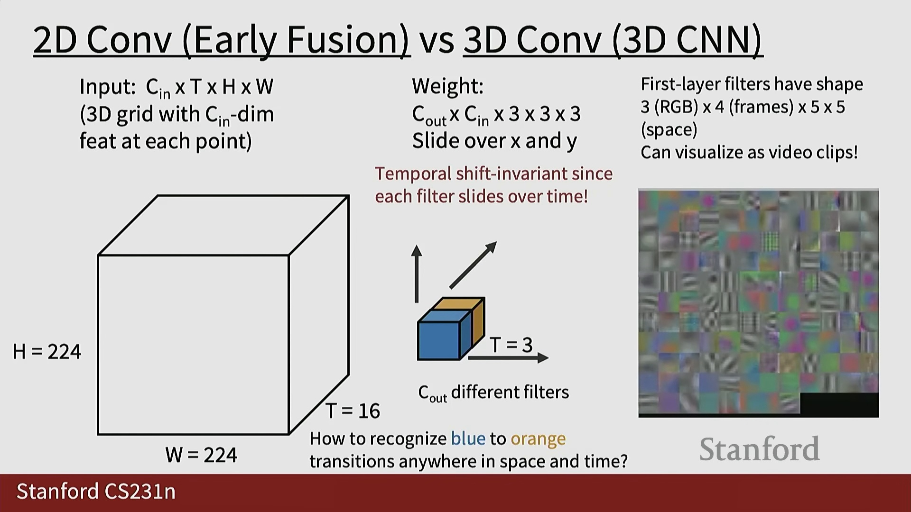

In the last lecture, you have already seen some examples of tools that we can use to visualize what we have learned in a 2D convolutional network. Similarly, we can also visualize filters just for this 3D convolution networks as these video clips.

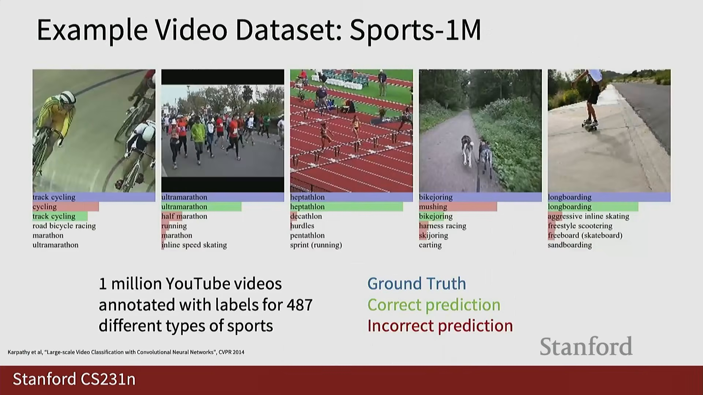

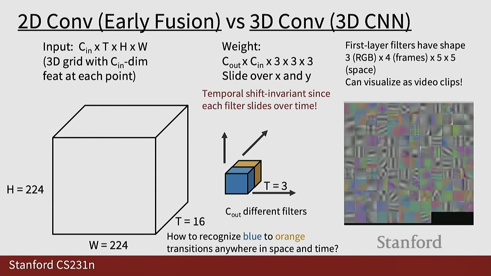

The learned filters from the 3D convolutional networks extend both in space and time, so we can see it as a video clip. Some of them are just like those filters you have seen for image classifiers. You can have this color patterns and also these different edges, but you can also see that there are some other filters. There are some temporal transitions from one corner to another or from some edge pattern to another.

Some doesn't learn motion, while others maybe focus on just the color patterns, but some learns motion in different directions. We can visualize these kernels like this to interpret them. Two differences exist; one is slow fusion. In terms of convolution operation, it involves 3D convolution.

The 3D convolution and 2D convolution are totally different because you have an additional dimension: the temporal dimension. So, the difference is that you have a temporal dimension in the convolution operation. Practically, we use 3D convolutional neural networks (CNNs). They gradually build this receptive field over space and time.

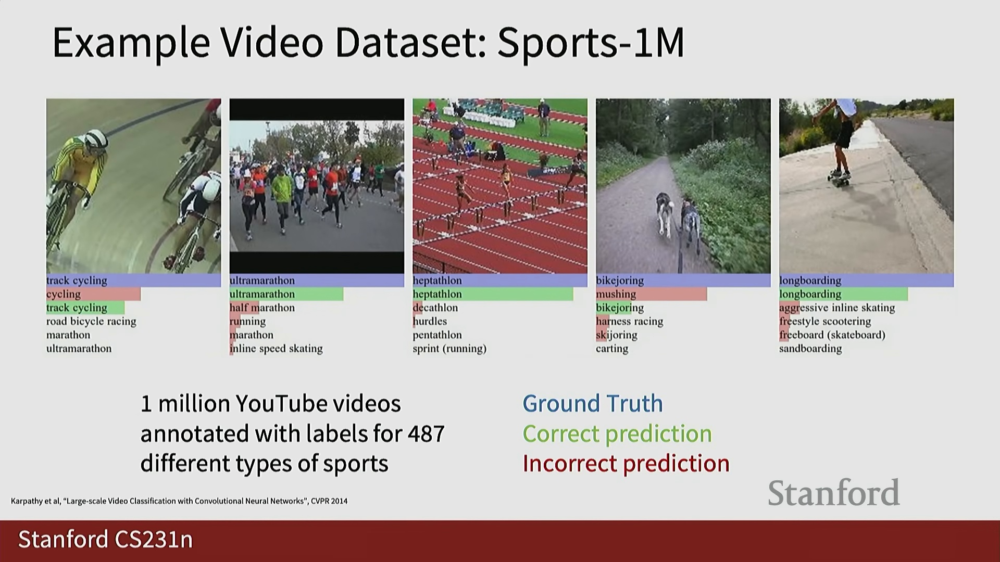

We have talked about these tools, 3D convolution networks or architectures. But what data can we use, just like ImageNet? Or what data can we use to train a video classifier? One example challenge dataset that people have been tackling is called Sports 1 Million, which was introduced in 2014.

For this dataset, you can see what tasks we can do. We can do very fine-grained sports category classification. The blue shows the ground truth, yellow shows the top five predictions, green shows the correct prediction, and red shows the incorrect prediction. You can see that the action categories in the dataset are very fine-grained; there are 487 different types of sports, such as marathon or ultra marathon.

There can be various types of sports categories in this dataset.

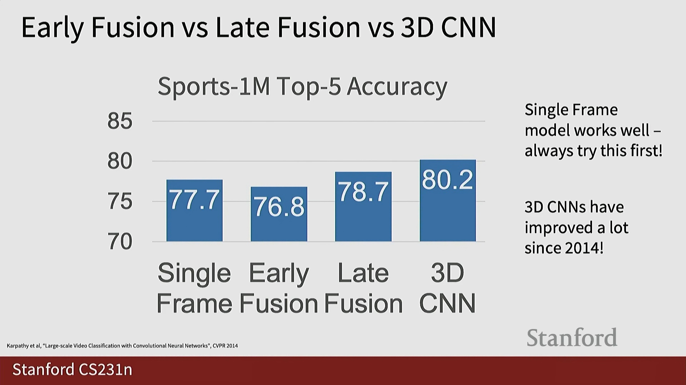

Here are some results if we train these different types of classifiers on the Sports 1 Million dataset. A very shocking result you might notice is that for a single-frame model—which I asked you to try if you wanted to develop a video classification model—it actually has very good performance. The single-frame model, when treated as an image classifier, gives a top five accuracy of $77.7\%$.

For the early fusion we talked about, the performance is slightly worse, and for late fusion, it is slightly better. If we use 3D convolutional neural networks on this dataset, it gets like a $2\%$ to $3\%$ boost. The takeaway message here is that you should definitely try the single-frame model; it actually works pretty well. However, the 3D CNN I showed here was used in 2014, but over the past 10 years, we have seen a lot of advancements.

The numbers are also getting much better, as I am going to talk about in later slides. For both training and testing, it treats videos as images and trains an image classifier—that is exactly what a single frame is doing. If I understand the question correctly, it uses an image classifier, but it is training on many frames from videos; it is not just a single frame per video.

Also, because this dataset is huge, videos are very large. When people share video datasets, we cannot just share them like ImageNet. People download from some database because videos are really huge. Like this dataset has maybe 1 million videos.

It is not feasible to download or share all of them. Originally, the video was shared as a list of YouTube URLs. But one thing you can expect from these URLs is that people modify or delete their videos. So the original list might have 1 million videos, but now, perhaps half of the videos are already gone or maybe not available.

Therefore, this dataset is not very stable because of this reason.

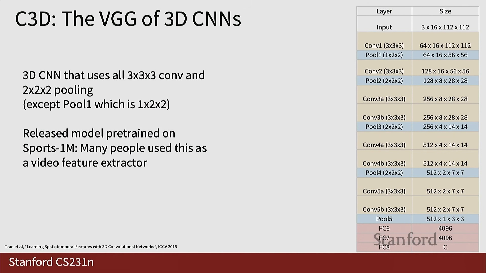

As I mentioned, 3D CNNs have been improving gradually since May 2014. One early popular version of this 3D convolution network was a model called C3N network. It is actually very simple. It's very similar to the VGG architecture we use for 2D image classification.

But now, we just convert things to three-dimension convolution neural network. For example, for the 3D CNN, you use $3 \times 3 \times 3$ conv and $2 \times 2 \times 2$ pooling. Except maybe for the first layer, it has some changes. So the overall architecture is very similar to VGG architecture; we just have this extra dimension.

And so that's why it's called the VGG of 3D CNNs. The model was trained on this Sports-1 million dataset, as I just mentioned. Because it was introduced like in $2014$, at that time, imagine that you want to train such a model. It needs a lot of compute because not too many people had access to a lot of GPUs at that time.

Actually, this model was trained at Facebook. They released the pre-trained weights; they trained the 3D model on Sports-1 million and then they released the feature pre-trained model as a feature extractor. So many people who could not afford to train a video model themselves started to use this model as a feature extractor. They can just take a video and extract features from it using this pre-trained model—a 3D model—and then maybe train some other linear classifier.

That's why it got popular. So the question basically is about what we are talking about—classification about how many frames we should take as input in terms to extract the features? For all these models we are talking about, we assume that we are just passing a clip, a predefined length, like 16 frames or 32 frames, to train a single model that always takes 16 frames or 32 frames as input.

There are other techniques we can talk about regarding how we're going to aggregate this clip-level prediction, but for now, we're just doing clip-level feature extraction.

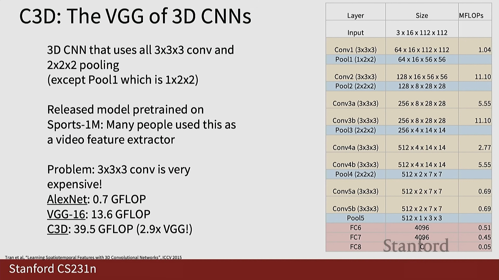

The downside of this 3D CNN is that it's very computationally expensive. Basically, we just directly, in a brute-force way, make this VGG style from 2D to 3D. You can see that for AlexNet, for this GFLOP (basically, what it means is gigaflops), it tries to measure how many floating point operations you need for a single forward pass—basically just trying to measure whether the network is efficient or not.

So for AlexNet, it takes $0.7$ GFLOPS. For VGG-16, it takes like $13.6$ GFLOPS. But for C3D, you are actually doing this kind of mapping from 2D to 3D, and now it takes like $39.5$ GFLOPS. So it's $2.9$ times VGG, so it's not very efficient.

That's the downside of this kind of network.

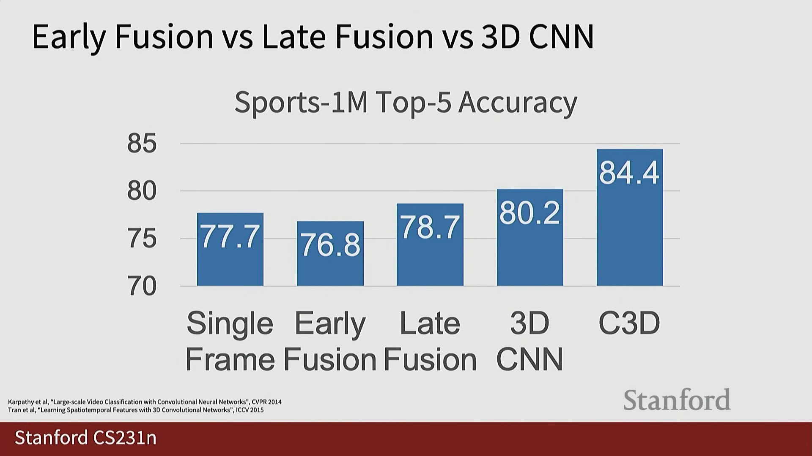

And if we look at the performance on Sports-1 million, this is just $360$ now, getting about $4\%$ gain in terms of top five accuracy. So this is just one example of the 3D convolution network we can do, but there definitely can be other things right. We are talking about a lot of tricks that we can do for 2D image classification; we can have residue connections like you have seen in ResNet.

But definitely, we can also add that to improve, say, $3\text{D}$ by adding some residual connections or other techniques we talked about in 2D convolutions. Indeed, there are also a lot of work on trying to improve this in different types of video architectures, and papers on that. But apart from that, let's think maybe a little bit more on whether we should treat space and time in a separate way because those are indeed very different things: spatial information versus temporal information.

So maybe we should actually explicitly try to model things that exist there temporally—that is motion.

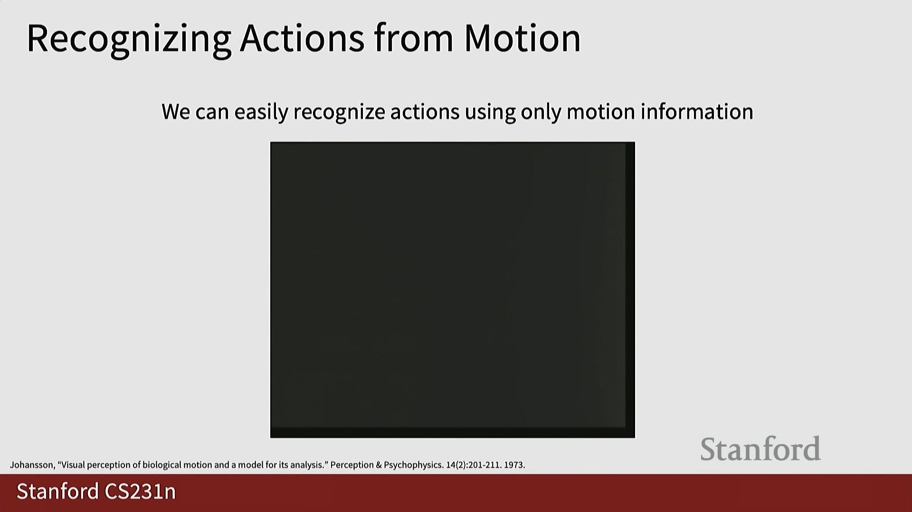

Humans actually can do an incredible job processing motion. So maybe take a guess what actions the humans are doing here in this simple video. You can say it out if you want: "What's this? Just from these very few points, you can actually do a good job just to recognize what actions that this person is doing or maybe two persons.

There are not any appearance information; just a few points, just motion. We can actually have a very good understanding about some activities. That is going on in these videos. So that's why how we process appearance and motion might be very different.

Maybe we should have separate networks to process them.

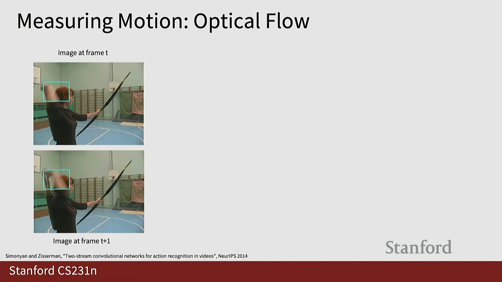

Indeed, that's kind of the motivation for this work that was introduced in 2014. They are trying to propose a two-stream network to process appearance information and the motion information separately. One way to explicitly measure motion is to use a concept called optical flow.

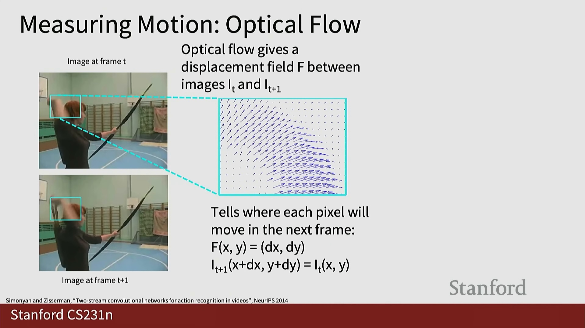

The idea is that we want to measure the changes of the pixels in adjacent frames. For every pixel in the first frame, we want to know how it's going to move in the second frame. It calculates the velocity for points within the frames and provides an estimation of where those points could be in the next sequence. For example, for frame $t$ and $t+1$.

This flow field has two dimensions and tells where each pixel will move in the next frame. The vector $F(x, y)$ is equal to $(d x, d y)$. Then, the pixel at position $(x + d x)$ in the next frame ($I_{t+1}$) is equal to $I_t(x, y)$ in the current frame. It's a way to explicitly measure motion of the pixels.

There are many papers that do research and compute optical flow given a pair of frames. There are ways to make different types of assumptions; some assume the optic flow just assumes brightness stays constant as things move, and then propose techniques to compute this flow. Once you get it, it captures the motion information for two adjacent frames.

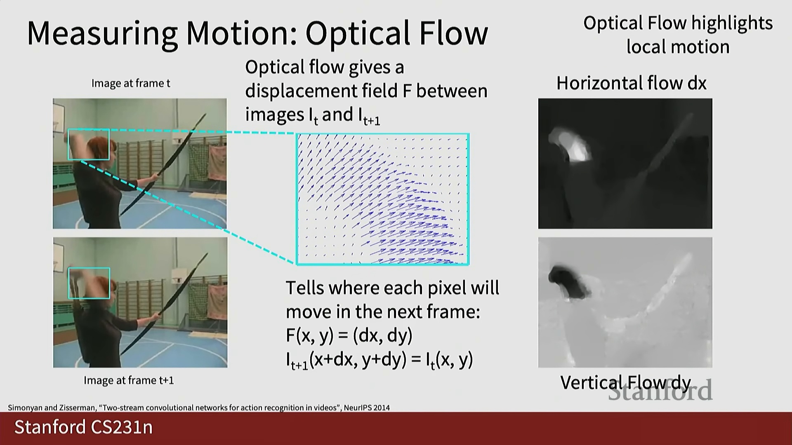

These are two dimensions because they try to capture how pixels move horizontally and vertically. You can visualize it separately by looking at the horizontal motion (horizontal flow, $d x$) and the vertical flow ($d y$). It captures both horizontal and vertical movement.

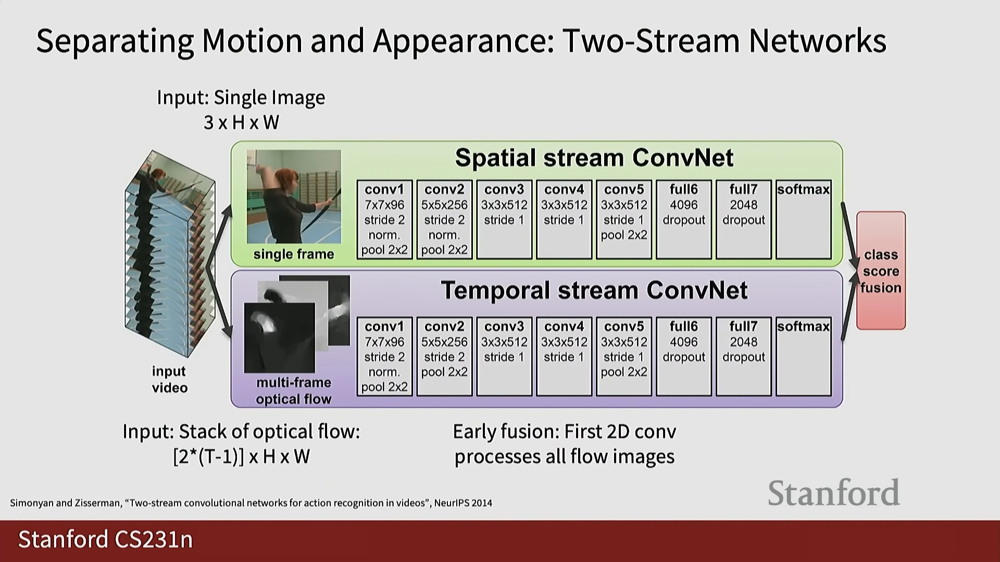

Once you have a way to capture this kind of low-level motion cues as optical flow, people propose two-stream networks to train a motion classifier and an appearance classifier. This is a famous two-stream network for action recognition. It has a single frame model that does appearance classification to determine what the action is. You then have a separate stream—the temporal stream ConvNet—that takes this multi-frame optical flow.

For every two adjacent frames, it computes the optical flow map and separately treats the horizontal motion optical flow and vertical flow, stacking them together. They process these using a temporal stream convolutional neural network before making a prediction. They aggregate the prediction results for both the motion stream and the appearance stream to get the final prediction.

This is the idea of this two-stream network, and it actually works pretty well on another dataset called UCF-101, which has 101 action categories.

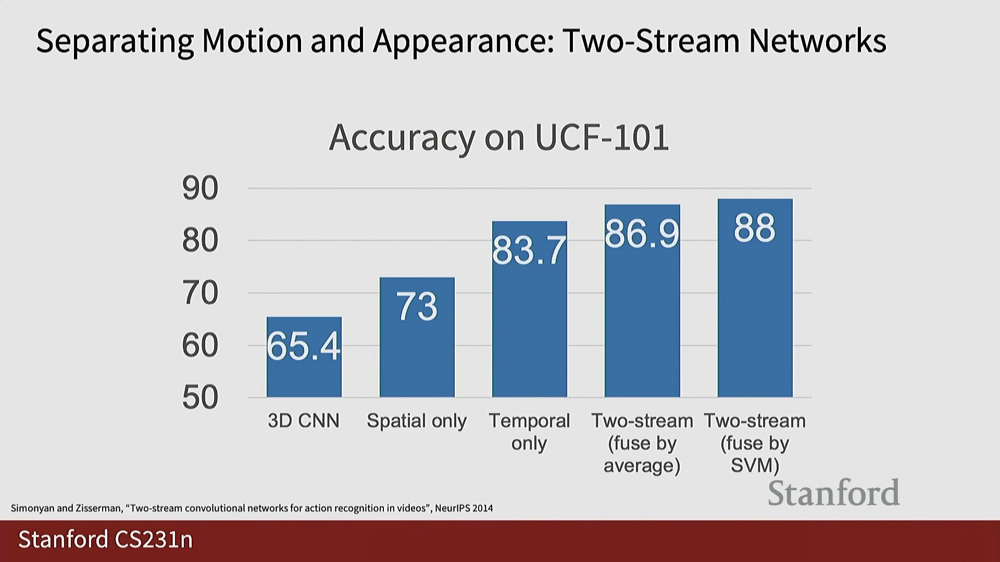

One surprising thing you can see is that using only motion actually works very well. Compare the performance of a 3D convolution network (which uses spatial information) with just the appearance stream and the temporal only (motion stream). You can see that the motion stream actually works much better compared to the spatial-only stream or the appearance stream.

My hypothesis is that it is easier to avoid overfitting because for the motion, there are a lot of background details which may not be important for action classification. But for the motion stream, it actually contains the key information—the movements—which makes it less likely to overfit.

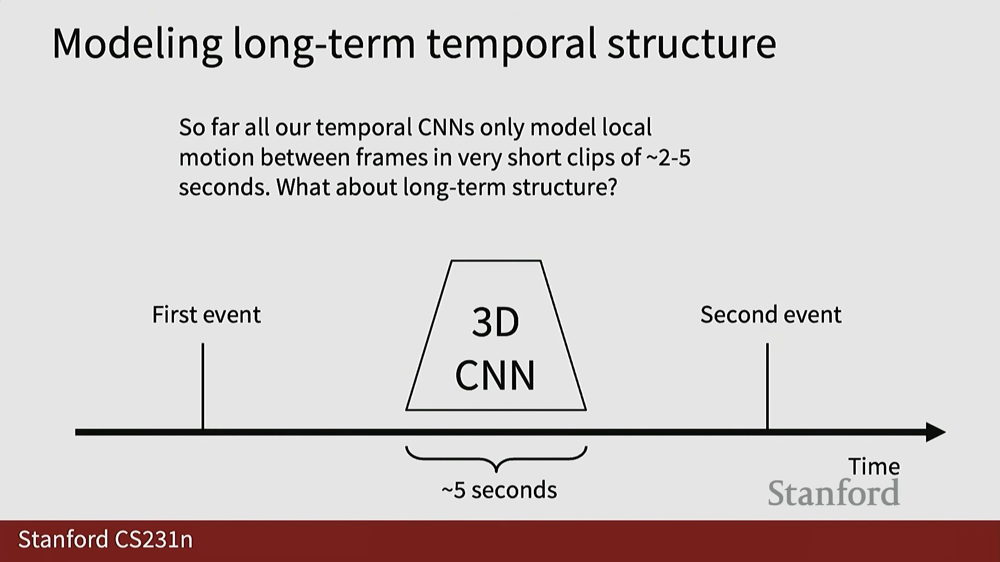

You can get better results on this dataset. So far, we have been talking about short-term structures in videos. Earlier, people asked how many frames we should use for classification. It is very important to model the long-term temporal structure to recognize actions at a more distant time.

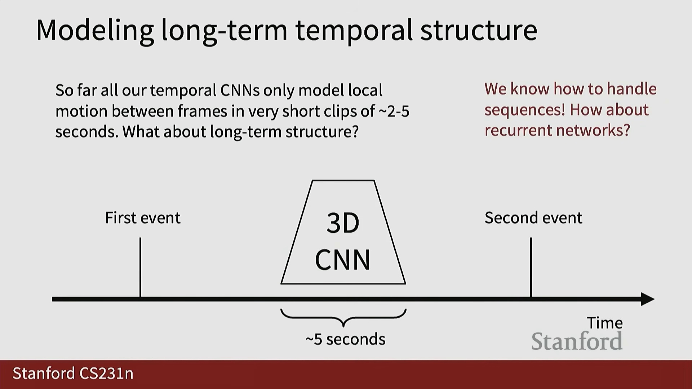

We already have tools to handle sequences by using recurrent networks—to process a sequence of words for captioning and prediction tasks.

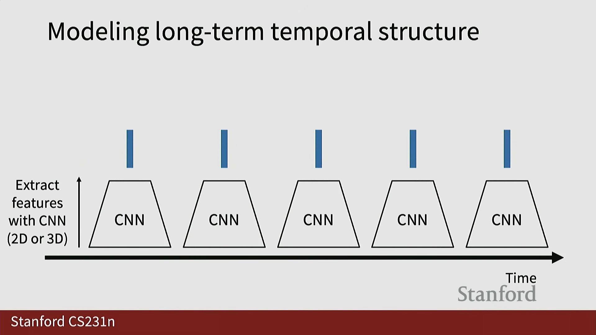

We can also use similar tools, just with recurrent neural networks, even when we have convolutional neural networks, whether it's a single-frame convolutional... networks to get a 2D feature vector or use a 3D convolution network to get a feature vector from a clip. But if you have a much longer video, we can get a feature vector, and then we just use the RNNs or LSTMs we have talked about to model the long-term temporal structure.

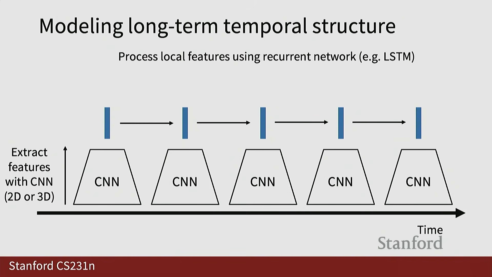

We just process the local features using these recurrent networks and make a final prediction at the last time step if we want to do a single video-level classification, where we're just doing a many-to-one output at the end of the video.

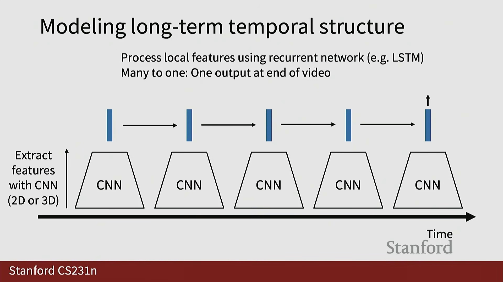

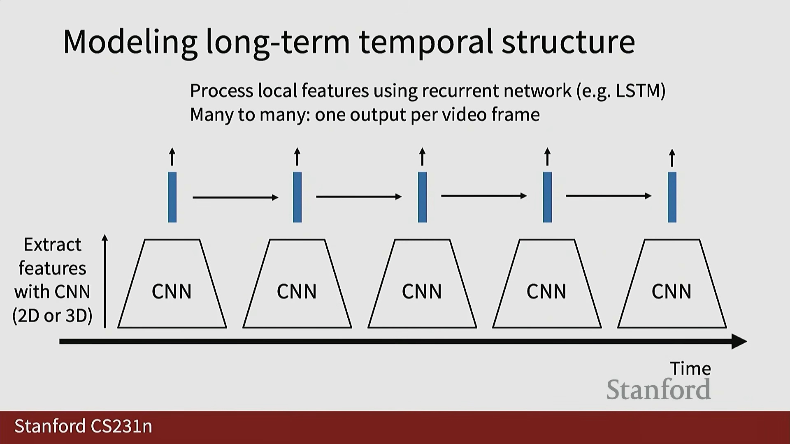

We can also do one-to-one mapping like we talked about. So for each frame, we can make a prediction. Maybe there are some predictions we want to make for each video frame. And we can also get this output from an LSTM or recurrent neural network.

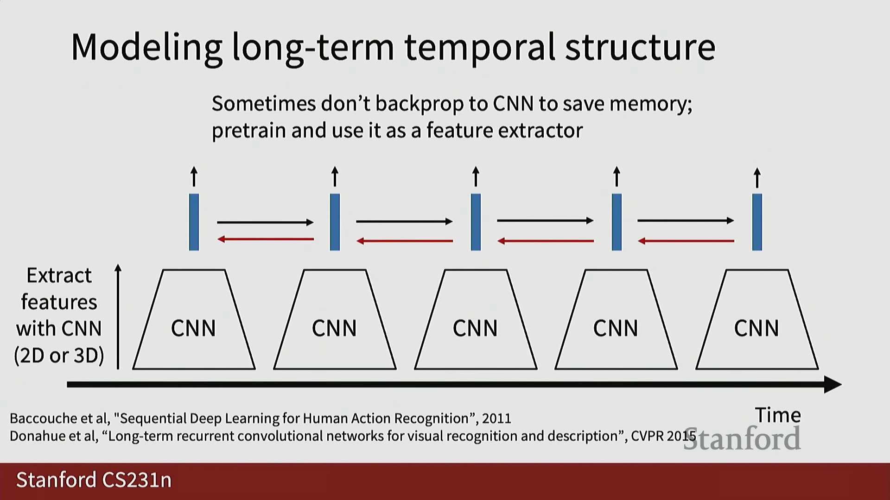

Actually, this kind of idea has already been explored in 2011. Actually, that's way ahead of its time because AlexNet was introduced in 2012. It was more popularized by the 2015 paper. If you want to train these kinds of recurrent architectures for modeling long-term temporal structure, you can often only backpropagate through this [INAUDIBLE].

Or you can fuse the CNNs. You can pre-train them on some clips, on image classification. Otherwise, you have a huge network with a recurrent part and this convolution part. It's very hard to train them end-to-end.

So you can just use it [INAUDIBLE] 3D as a feature extractor and train these recurrent neural networks.

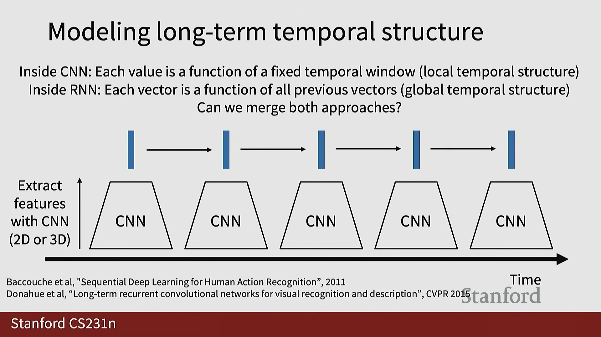

We have already seen two approaches to model the temporal structure. How about we combine these two approaches: the convolutional neural networks and the recurrent neural network? Both of them have some advantages, so we can maybe just combine them in a single architecture to process this video data.

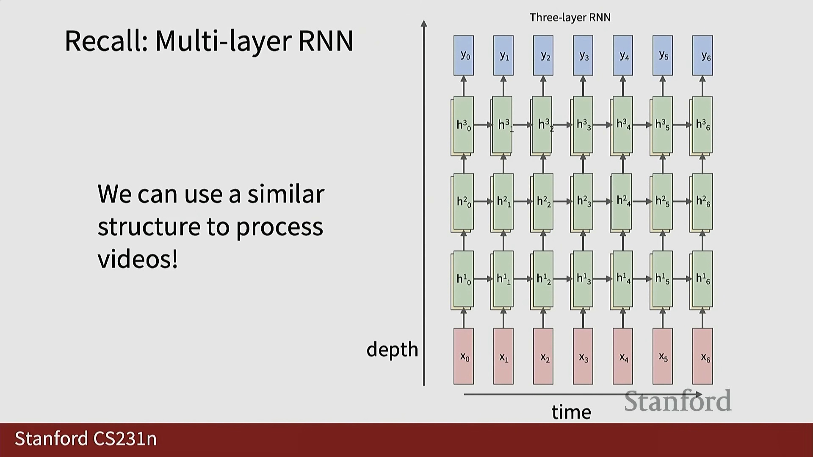

Indeed, we can take some inspiration from these multi-layer recurrent neural networks we have talked about. Each timestep can take these previous hidden timestep from the same layer, and also the output from the same timestep from the previous layer.

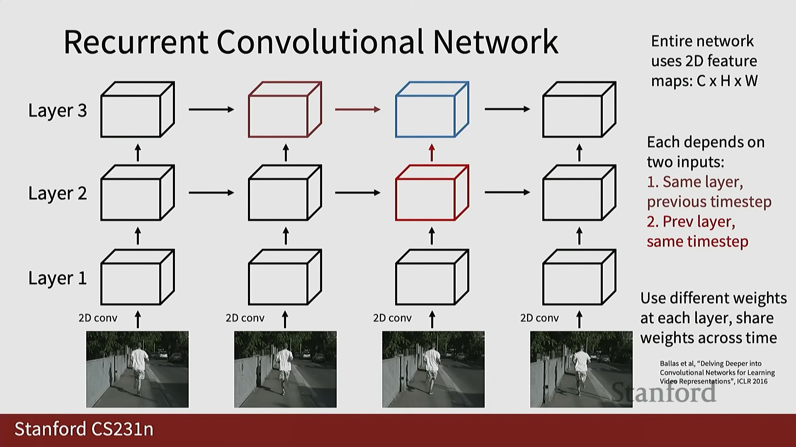

That's basically the idea of this multi-layer RNN. Similarly, we can just do it for videos.

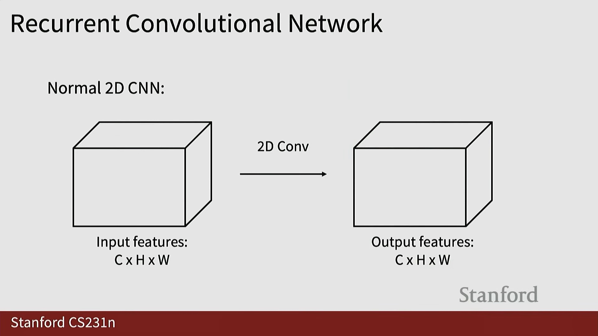

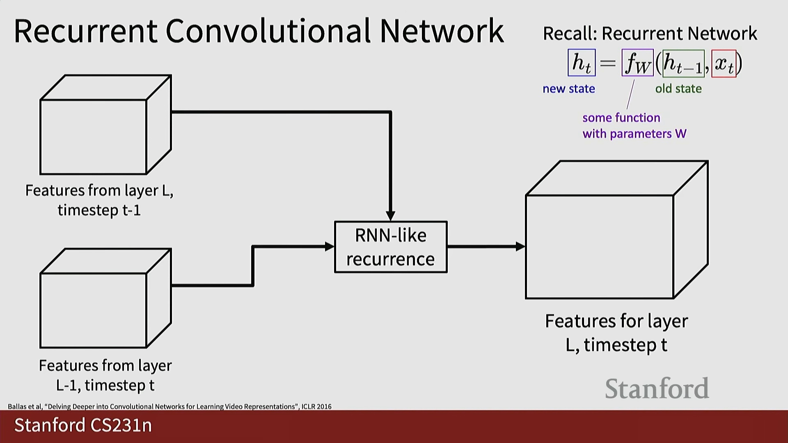

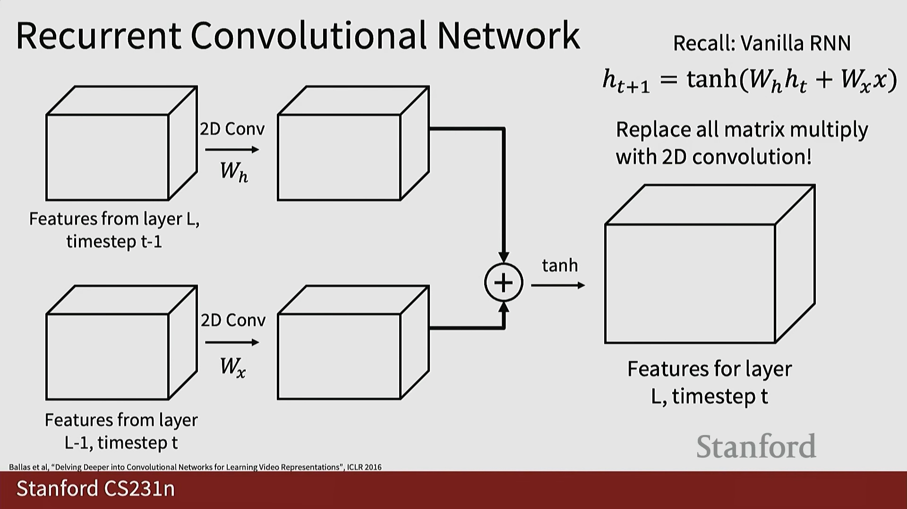

Now, we introduce these Recurrent Convolutional Neural Networks. We build a grid of features, where each one is a three-dimensional vector. This means two spatial dimensions and one channel dimension. So each feature vector has the form $C \times H \times W$.

Each step depends on two inputs for each vector: for each feature map, it depends on the feature map from the same layer by the previous timestep. But it also depends on the feature map from the previous layer but at the same timestep. You recall in a 2D convolution network that we just map this feature map from some input feature to an output feature.

But here, for this Recurrent Convolutional Network, we can just use as input these two 3D tensors: one from the same layer and previous timestep, and one from the previous layer at the same timestep. You recall that the recurrent network has a form where it has some hidden layer feature map, $h_{t-1}$. It takes the input of this current timestep, applies some function with some parameter $W$, and then processes the new state feature vector, $h_t$.

That's basically the key of RNN. Now, instead, we just change these vectors from RNN. We replace all this matrix multiplication in recurrent neural networks with 2D convolutions. This gives us the Recurrent Convolutional Neural Networks.

We do 2D convolution instead of doing this matrix multiplication. We also process features from the previous layer, at the same timestep, and do this as well. After doing these two 2D convolutions, we add them together, use another $\tanh$ layer, and then we get the feature map for the current hidden layer. That's basically the idea of the Recurrent Convolutional Neural Network: basically, we can combine convolution operations and recurrent operations.

We can also actually do this for any kind of recurrent neural network variants like GRUs and LSTMs, maybe you have already learned from previous classes.

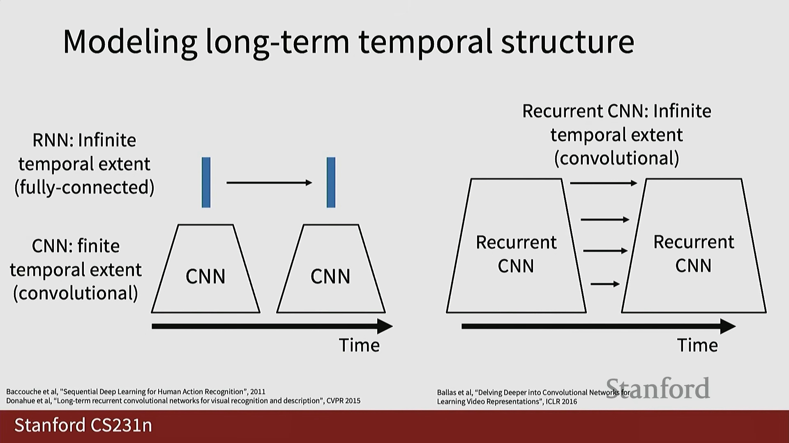

By doing so, we can successfully combine the benefits of the two. We have both spatial and temporal fusion inside this Recurrent Convolutional Neural Network.

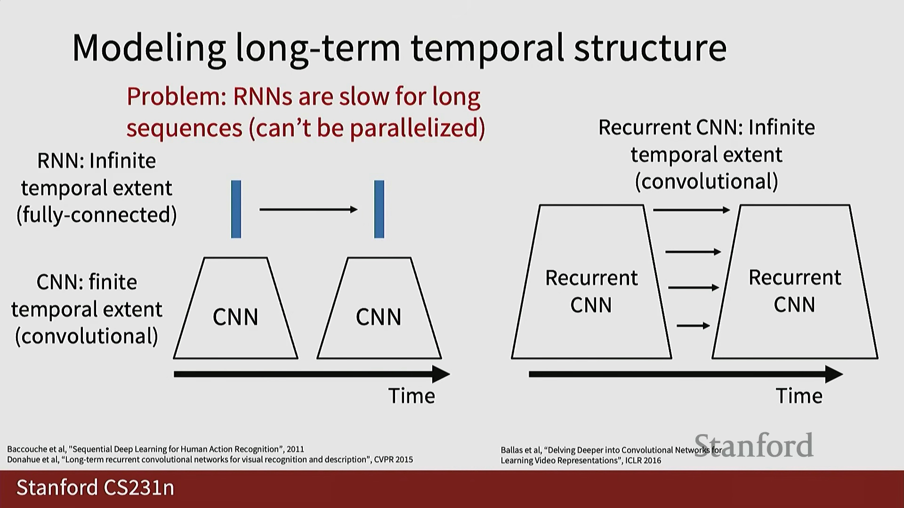

But this model was not used too much because there's one large downside of recurrent networks, which you may have already... learned that RNNs are very slow for processing non-sequence data. And videos are usually very, very long, and you have to process them in parallel. But RNNs are very hard to be parallelized.

There's another important model we have learned, I think in the previous lectures, what we can do.

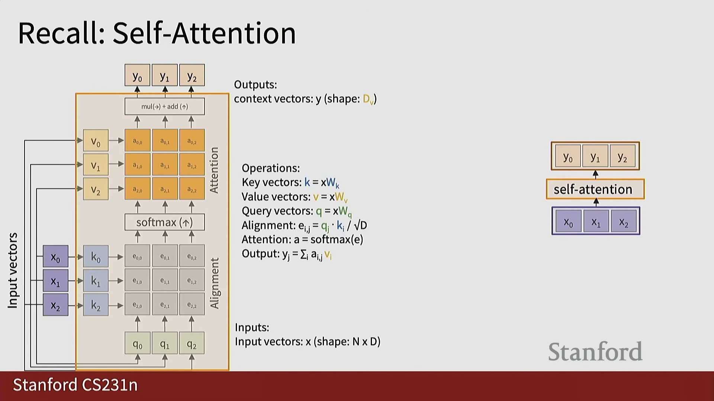

We can also use operations like self-attention to process videos. For self-attention, you have this queries, keys, and values. You can use self-attention layer as a standalone operation to process images. Here, we can also do it for videos.

One very large advantage of self-attention is highly parallelizable. All the alignment and these attention scores for all the inputs can be done completely in parallel.

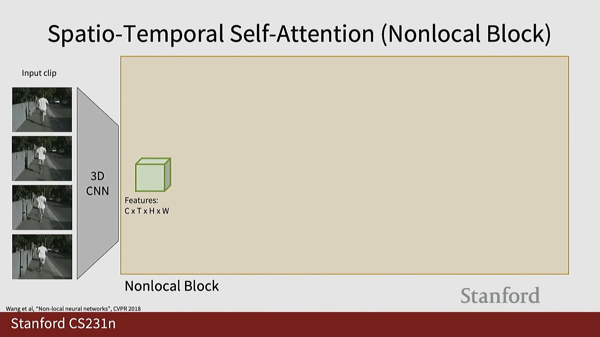

So indeed, people are trying to use self-attention also in videos. So they just pass self-attention directly to 3D. Maybe you have some 3D convolutional neural network.

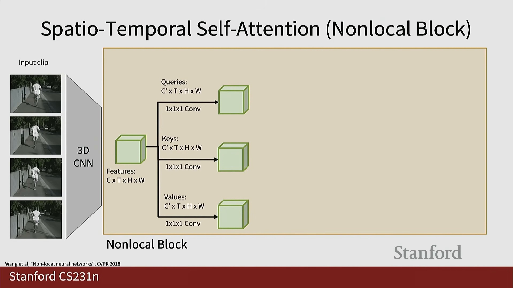

You get some feature map like $C \times T \times H \times W$. Then similarly, you can get some query feature maps. You can use some $1 \times 1 \times 1$ 3D convolutions to change the channel dimension to map them to a query feature map that is $C'$ times $T \times H \times W$.

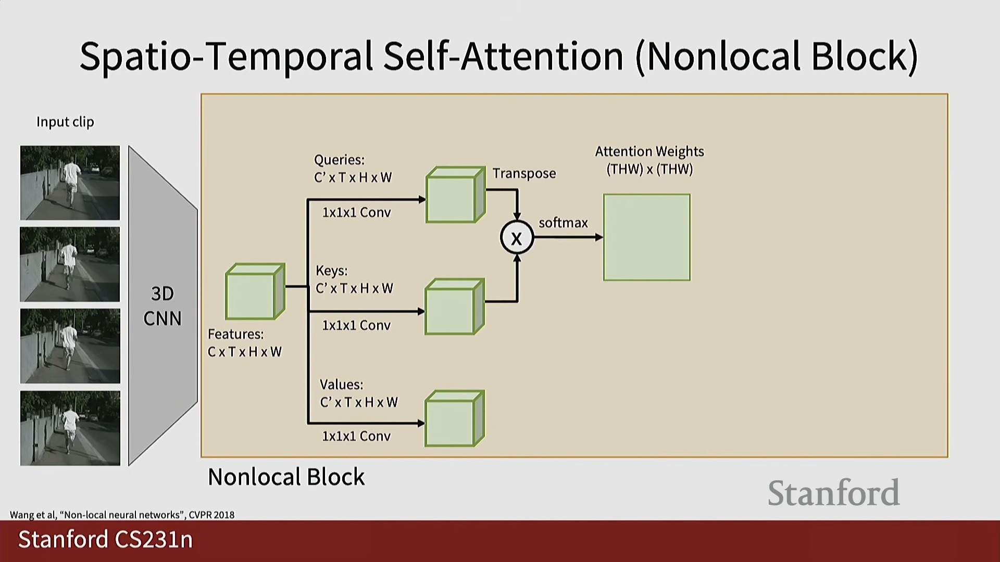

Similarly for keys, you get this feature map; for values, get these feature maps. Then you want to get some attention weights. Basically, you're doing some transpose of this feature map from queries and the vectorized multiplication gets an attention score for each query and key feature pair.

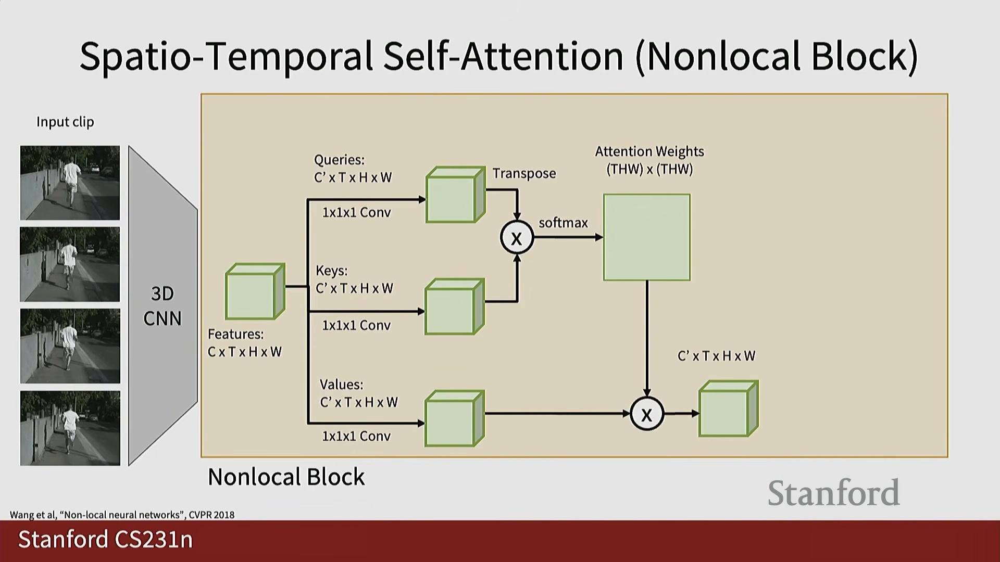

You can then get this attention map and use it to condition the values, and you can get another value, a feature map.

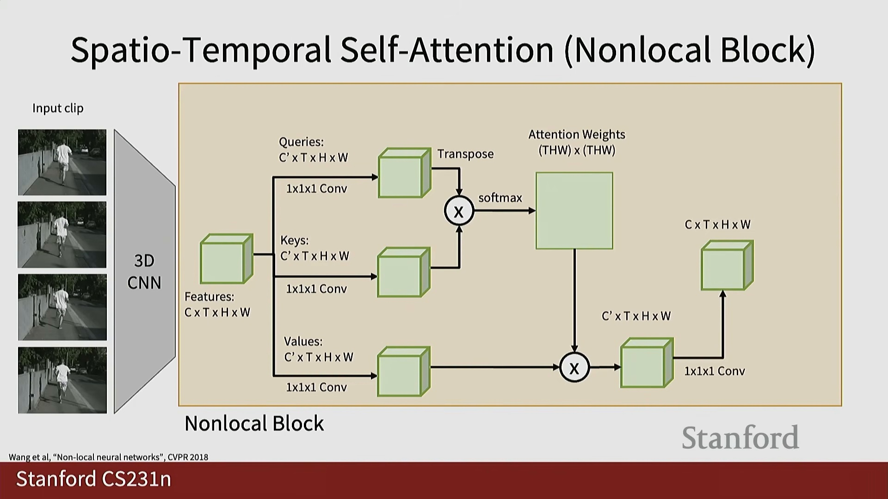

Then you can map them using another $1 \times 1 \times 1$ convolution to map them back to the same dimension $C$, so that it can be concatenated with the original feature input.

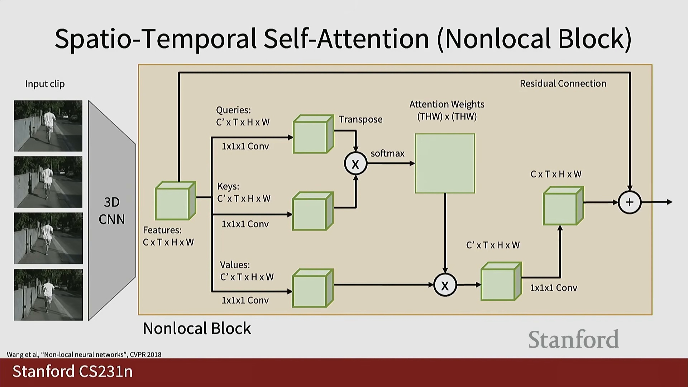

So that is a residual connection. In total, you can see that it's very similar to the self-attention operations, but now we move things to 3D. This is one block that is very independent; it can stand on its own. You see in this paper, it's called nonlocal neural network.

It introduces a block and calls it a nonlocal block. You can use it as a building block for processing videos to do video understanding.

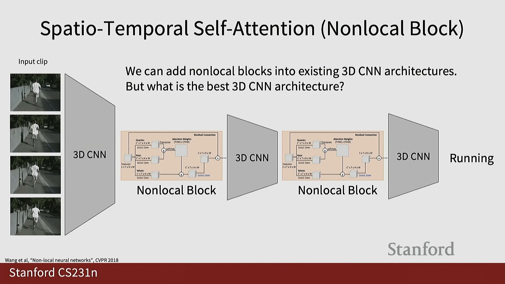

For example, you can just add these nonlocal blocks into existing 3D convolutional neural network architectures. You can have some 3D CNN on a nonlocal block, and another block of 3D CNN added on a nonlocal block. Each nonlocal block is basically very powerful to fuse across both space and time, and finally, into this classification. The one thing we haven't talked about is what is this 3D convolutional neural network?

So what we should use here?

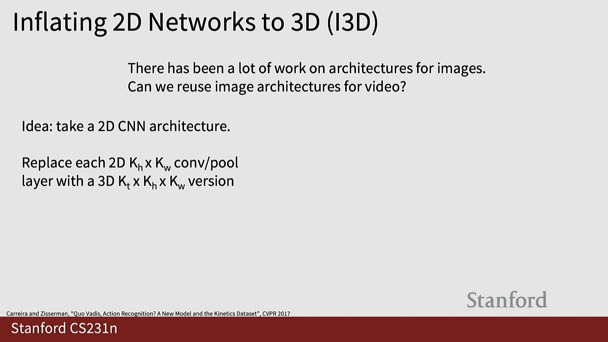

There is a very interesting idea that people have explored in the past that is: can we reuse the 2D convolution neural network many successful architectures we have talked about or learned, directly to 3D? We just do some inflation of these 2D networks. Then, we can get 3D convolutional neural networks. For this work, it's called I3D architecture.

The idea is that they just take a 2D CNN architecture. They replace each 2D conv pool layer that originates of dimension $K_h \times K_w$. But now, we replace with a 3D version, that is a $K_t \times K_h \times K_w$, just inflated basically.

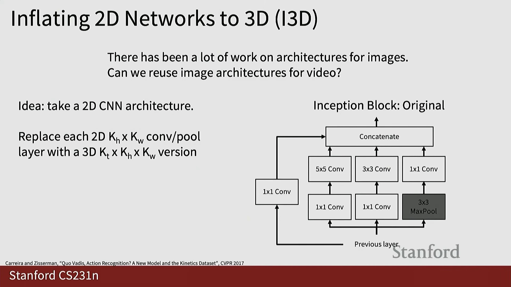

They use it on top of the Inception block.

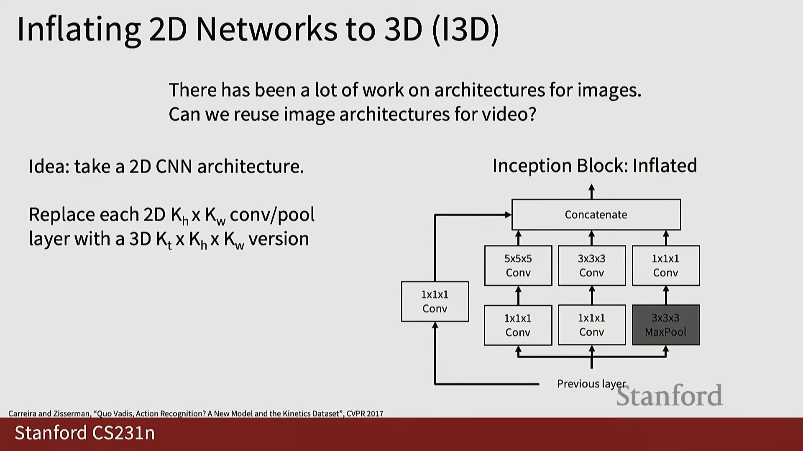

After they're doing this inflation, you have an architecture for processing videos directly—just reusing existing architectures. Now we can transfer the architecture that works pretty well in 2D to work also in 3D.

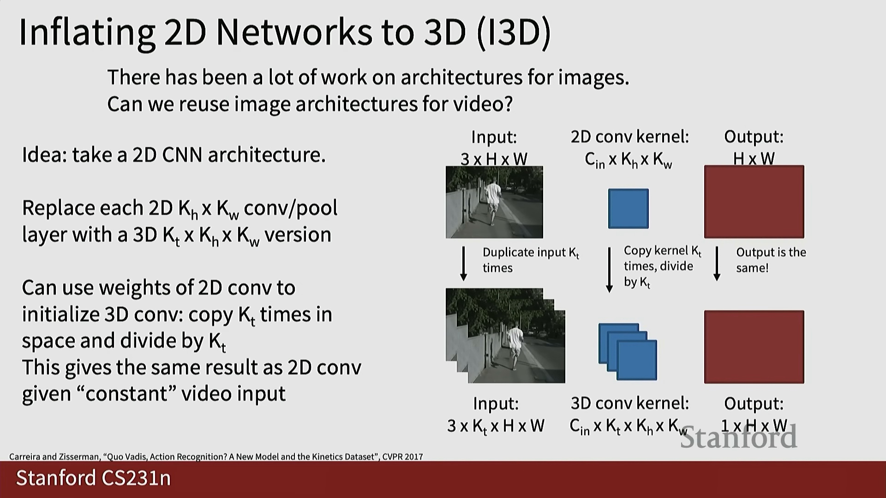

Taking one step further, people also have been trying things that not only we can transfer the architectures, but actually, we also can transfer the weights because we have already pre-trained a lot of architecture models on image datasets. Maybe we can actually reuse the weights we have learned there; there are maybe some good prior information. One thing you can do is that you can just initialize the inflated CNN with weights trained on images.

For example, you have maybe for one—originally, you have this 2D conv kernel. You just copy the kernel by $K_t$ and you divide it by $K_t$. Originally takes one single image as input. Now, you take this video of $T \times K_t \times H \times W$ as input because we have divided them.

And you just use this inflated version and copy the weights by $K_t$ times. Then, you will get the same output if you just input a single frame or a video of constant frames. So now, we have a way to recycle this existing 2D image based on this architecture and weights from 2D image understanding.

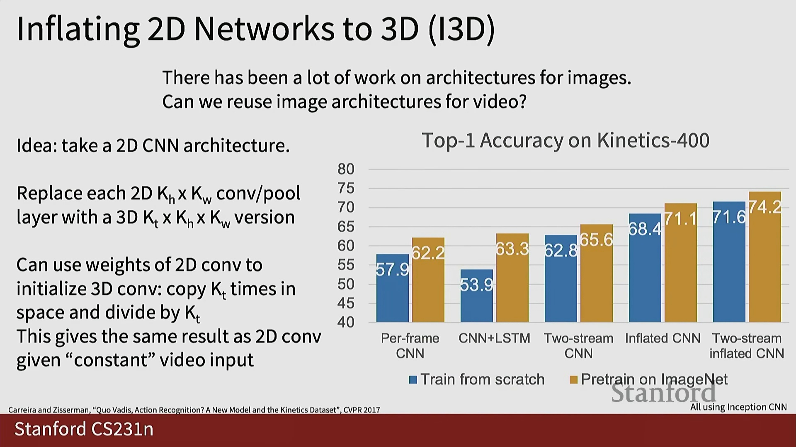

And actually, it works pretty well. If you look at the performance, you inflate them compared to this two-stream convolutional network; it actually has better performance. You can also inflate not only the appearance frame. You can also inflate a motion stream, so it gets some further improvements.

Basically, this is just like a technique you can do to reuse this kind of independent from the 3D convolutional networks. You can build this non-local blocks, this part. What I'm trying to say is that we have a lot of 2D convolution neural network weights; successful people have shown that they are very successful. And if we want to reuse them, people have shown that they can actually copy the weights and reuse their weights directly use them to operate on videos.

So, basically, that's the high-level idea. After doing this initialization, you can still fine-tune on the video data, but you have the pre-trained weights from images. We can give good initialization for training the video models. This idea of the I3D network is basically trying to copy the weights and doing the inflation.

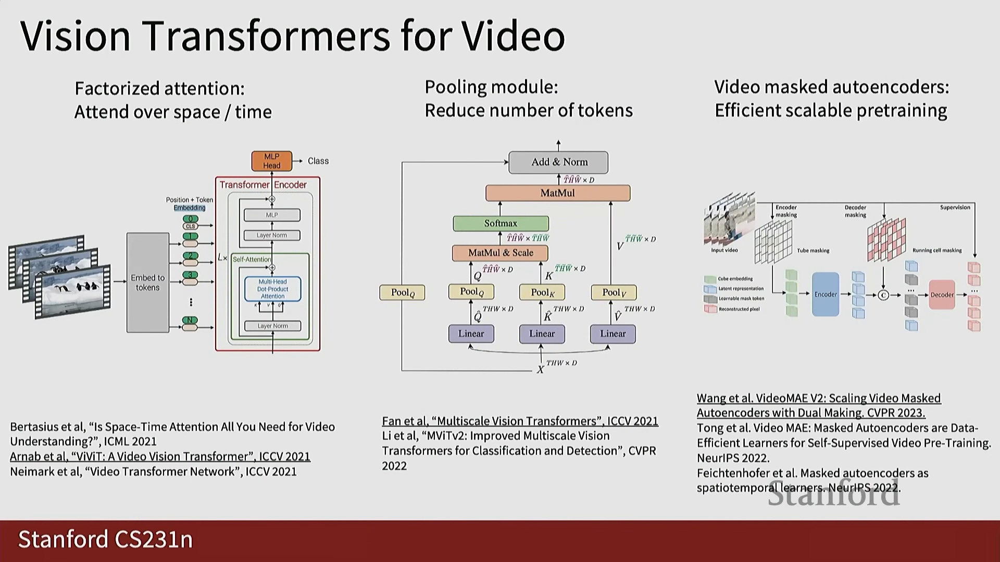

So, this is also just one example of a video understanding net model, and there are also many other video transfer models proposed for video understanding. For example, this work, Space-Time Attention, is trying to do more factorized attention to attend both space and time. Also, there are some other methods trying to be more efficient in terms of the Transformer architecture, or this Mask Autoencoder you have heard about doing more efficient, scalable video—video level pre-training for video understanding.

I'm not going to talk them here in the class, but if you are interested, you can check out their papers because many progress has been made to have better media understanding models.

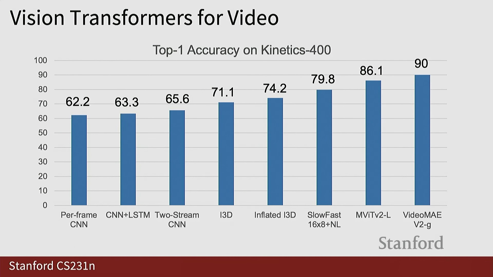

If you look at the performance of Progress that way, I think we started from a single-frame model $62.2$ on this—this is another dataset, Kinetics-400. You can see that for this video model encoder, it already gets to 90% accuracy.

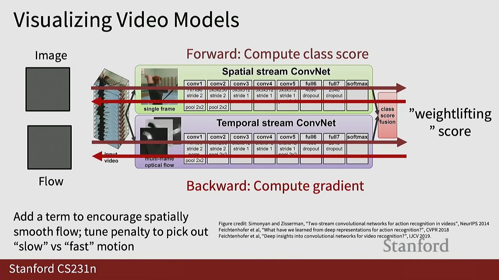

Some new Transformer models have been proposed, so we are doing very well on classifying the videos. Similar to the image classification in the last class, we can also use similar tricks for visualizing video models. We can take this two-stream network as an example. We can randomly initialize an appearance image and a flow image; we are doing a forward pass and then compute the score.

Then, we can backpropagate with respect to the score of a particular class and using gradient ascent to maximize the classification score, just like what we're doing the visualization for the image-based model.

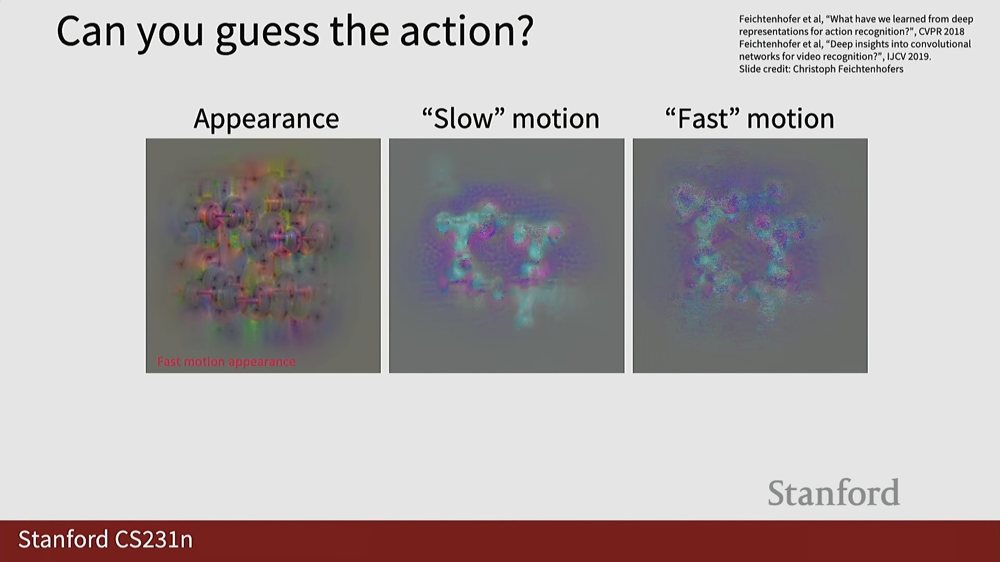

This is how we can visualize or interpret what has been learned. On the left is the optimized image for the appearance stream. It might be hard to guess what is happening in the visual stream. On the right, it's an optimized image for the flow stream.

One has some temporal constraints to prevent the temporal stream from changing too fast, so you can capture slow motion. The other captures real motion, so you can guess what the action is. Maybe in this case, it's pretty clear. You can see that the middle one is doing some bar shaking, and the right one is doing some overhead pushing, the motion.

It's indeed actually—you can see that this video model is learning something about this motion.

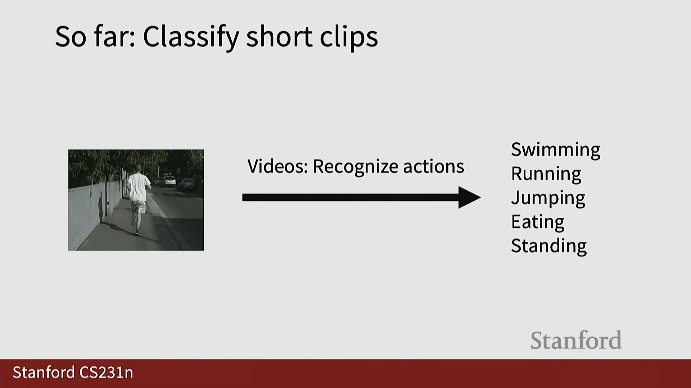

So far, I have been talking about how we can classify these short clips, like swimming or running. But another very important thing is how we can deal with other tasks.

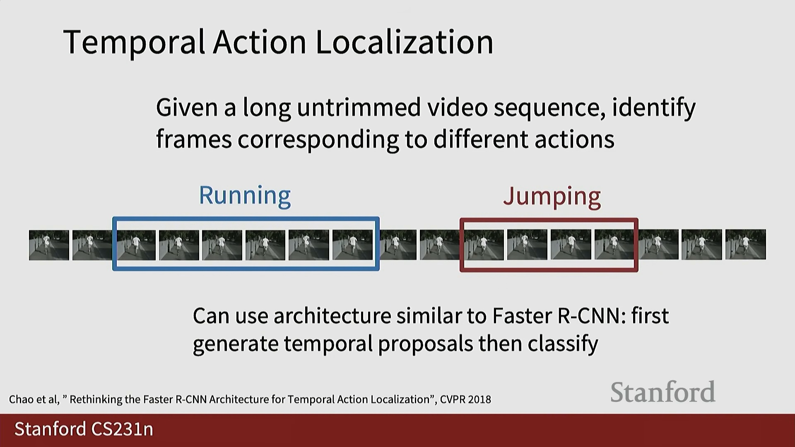

This is called temporal action localization; it is not only that we want to just do clip-level classification. Sometimes, we want to localize, just we want to do object detection. Now, we want to localize where in the video the action is happening. Maybe sometimes the person is running; sometimes it's jumping.

This is another class called temporal action localization. You can also use similar ideas from Faster R-CNN. You can just generate some temporal proposals and then doing the classification.

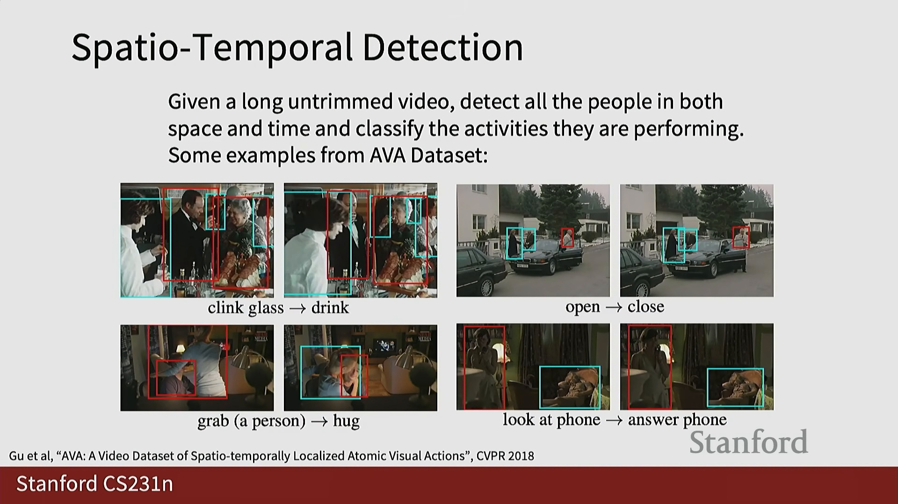

And also, you can also do both. This is a spatial temporal detection. Basically, you want to localize not only in space but also in time—where the action is happening in space and where the action is happening temporally. So this is another task called spatial temporal detection.

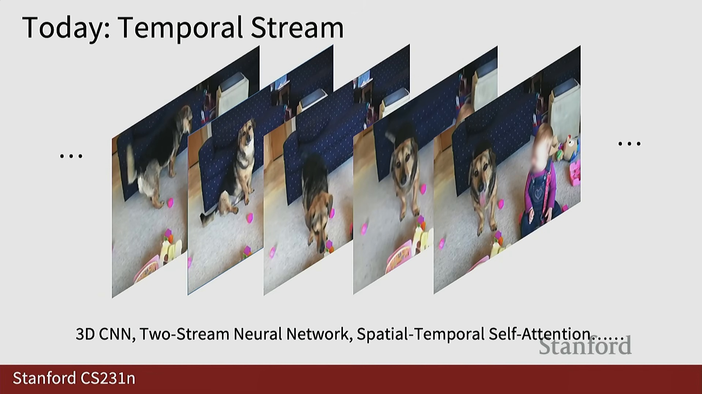

So far, I have been talking about the temporal stream and the architectures we can use to do 3D CNNs, two-stream neural networks, [and] spatial-temporal self-attention. We have already talked about some tools to do that. But maybe in the final 10 minutes, let's just revisit. Let's revisit the example that we started today, where I showed you a video.

But that's still maybe not the full picture. [VIDEO PLAYBACK] [BABY LAUGHING] [DOG BARKING] [END PLAYBACK] So, we are looking at video. I think in video understanding, there is another very important dimension that we have never covered until now. That is this: there is sound.

There are other modalities in videos. If we miss that ingredient, you lose a lot of fun. There are emotions you can perceive. There are interactions you can do if you combine this visual and motion.

So if we have this audio in mind and we have this vision stream, then people also have proposed many other interesting tasks. We have explored other tasks for doing video understanding.

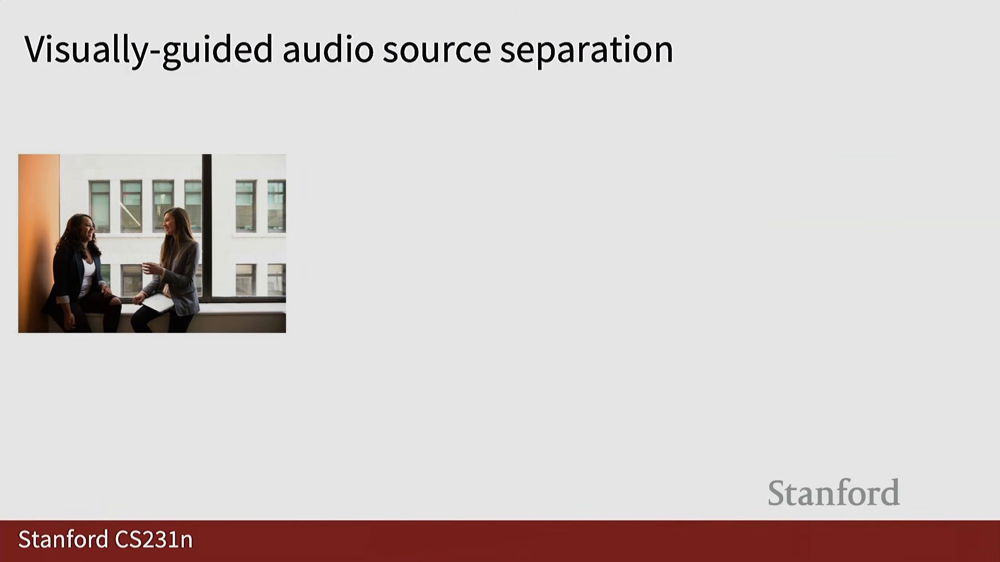

Here's another example: in videos that maybe there are some multiple objects, multiple speakers. One task, an example task that I also personally have explored in the past with a visually-guided audio source separation.

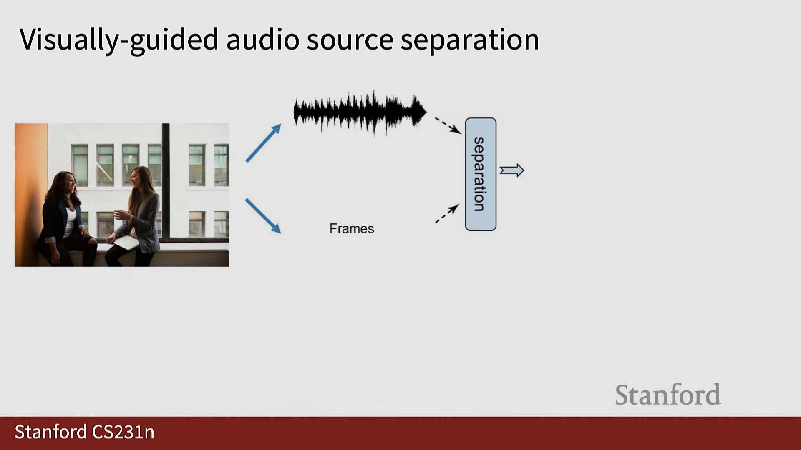

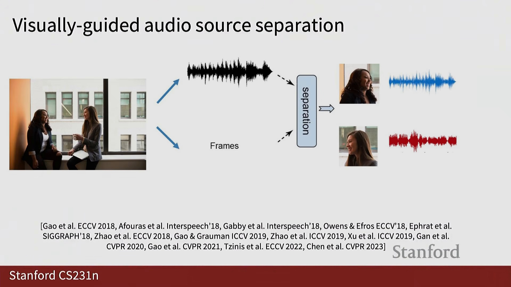

You can actually understand trying to process things visually and acoustically. You can use the visual information to guide the source separation. You want to separate the sound components. You want to use the visual information to separate into some sound components.

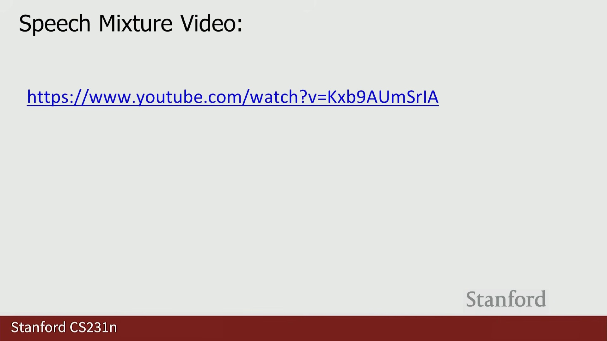

This is called visually-guided audio source separation. Just to give you an example for this task: for example, here is a speech mixture. Maybe sometimes, you want to hear the sounds for each person individually. And then we can use their visual information and audio information to process them together, to separate their sounds.

We can separate the voice for the left speakers. Only we can do this for people, for speech. When we have to process audio and speech and the visual stream.

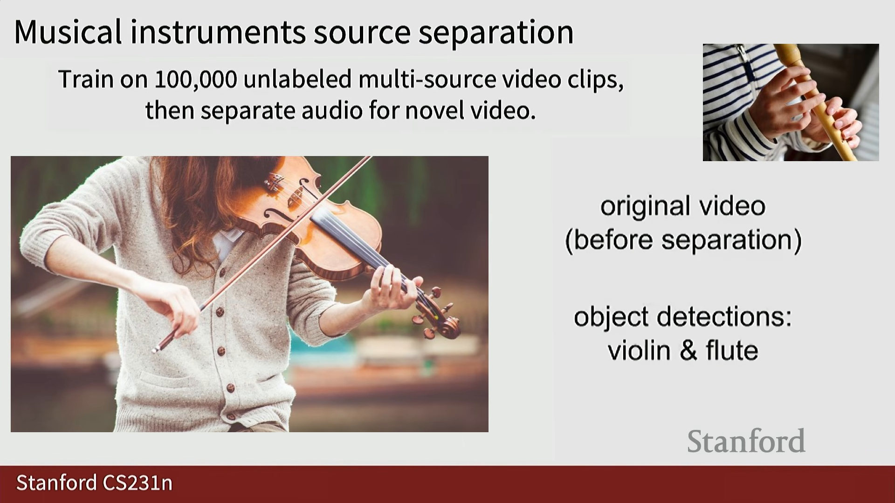

But we can also do this for other types of sounds, like music instruments. We can even do musical instrument separation by analyzing the motion, the object-centric information with the audio stream and doing the separation.

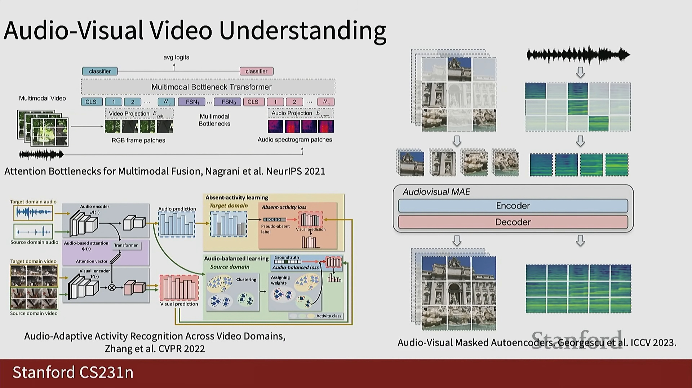

So this is another example for this task. Also, once we introduce this new modality of audio, and we just want to do video understanding classification, audio can also be useful cues. Indeed, there are other works in audio-visual video understanding proposed from transformer attention-based models. Not only do we want to map images or videos to patches, but also map those audio spectrums to patches and use some transformer architectures for doing the classification.

Or even, we can do some mask autoencoder style. We want to predict the patches for the images and also spectrograms when doing video understanding.

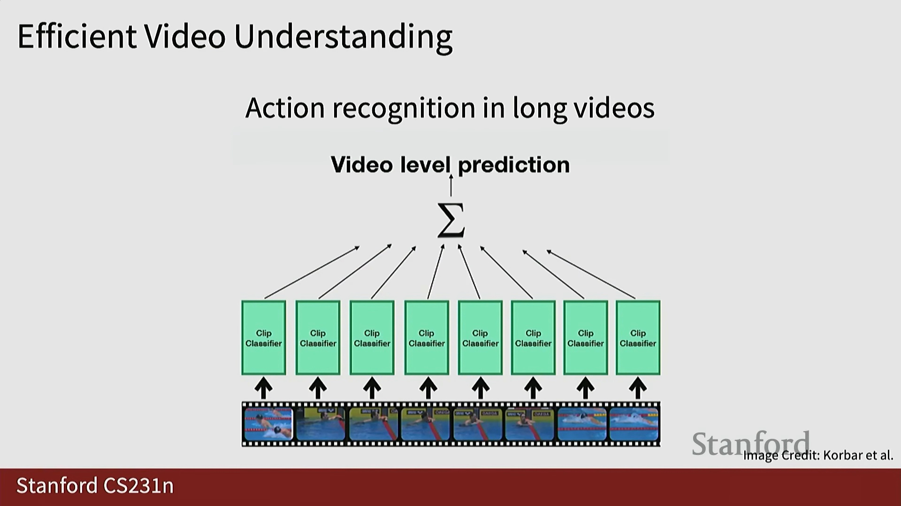

Another aspect people have been exploring is how to do efficient video understanding. I will just quickly give some examples. Throughout this class, I think I'm mainly focusing on clip level classification—just giving a clip, how to do this classification. And after we classify a lot of clips, we want to aggregate the information to get a video level prediction.

That's action recognition in long videos.

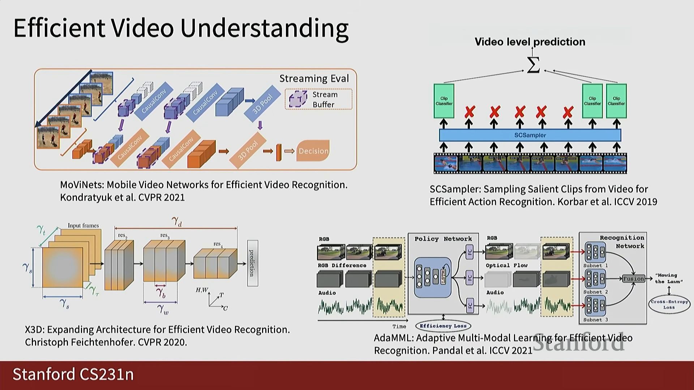

For efficient video understanding, why would we want to do efficient video understanding? Because videos are very long. We cannot afford to process every clip one by one. So we're trying to increase the efficiency for a single clip; just building like this X3D is trying to build better 3D convolution neural networks.

But also, that we're trying—like this SD sampler—trying to predict which clips are the most useful. You can then only combine the predictions and only run your clip classifier on those important clips. Also, they are doing policy learning, trying to predict which modality we should use in order to do this action classification. We can select whether we want to use video, or how many video clips, or whether we want to use audio or other sensory data.

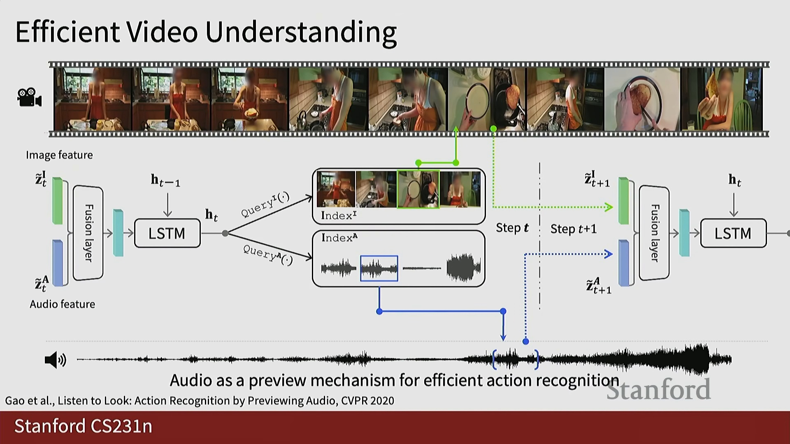

So here's one example that we can also use audio as a preview mechanism. To predict where are the important moments. And then we use that as a guiding clue to process the clips and to average the results.

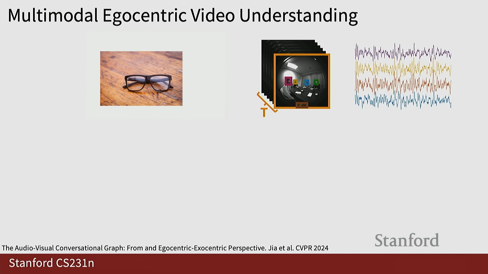

So that's about efficient video understanding. So that's also one area of research. Also, nowadays, there are people moving to VR and AR, the smart glasses. In the future, I'm guessing there are a lot of egocentric video streams.

That's another aspect of video understanding. Not only do you have these egocentric videos, but you also have this multi-microphone, microphone array, multi-channel audios. So how to do better under video understanding from these egocentric multimodal egocentric video streams is also a hot topic.

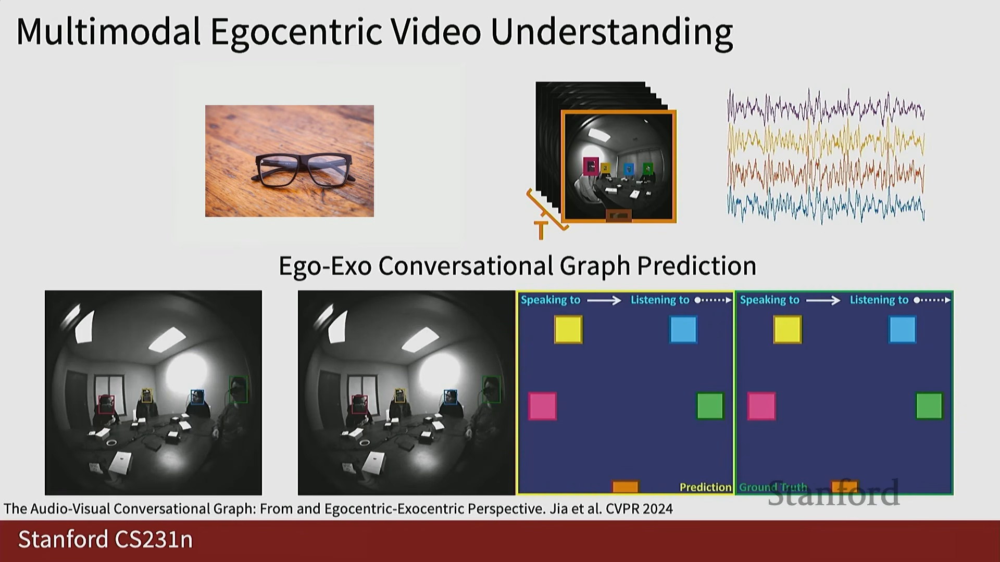

We have explored that we can use process video streams, the audio, multi-channel audio, and visual information to predict who is speaking to whom and who is listening to whom. Imagine in the future you wear these smart glasses. You want to use it to help you understand these different types of social interactions. So that's egocentric video understanding.

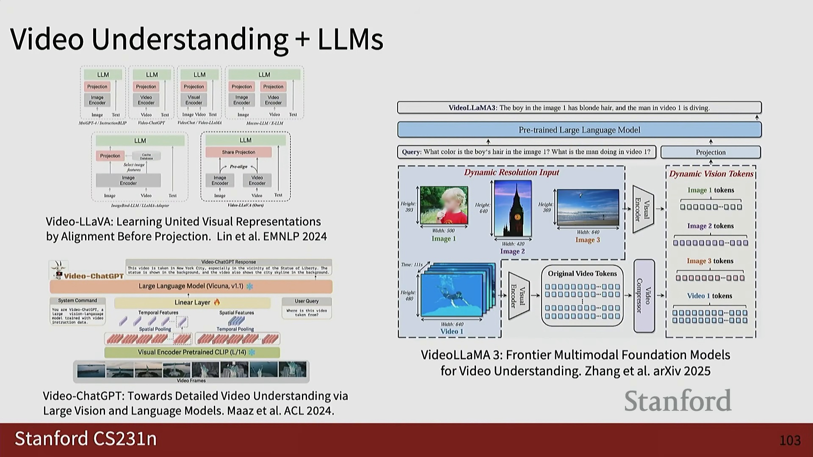

For my final slide, definitely LLMs right now, there are also a lot of ongoing work trying to build video-level foundation models.

How to connect the video understanding to LLMs? Indeed, there are works trying to just map the videos to tokenize them and map them to the LLM embedding space and maybe prompt the video foundation model—where the person is, what the person is doing in the video. And then you output some text to describe the videos. There are many works trying to connect video understanding [to] LLMs.

So that's also a hot topic right now.

