# Stanford CS231N Deep Learning for Computer Vision | Spring 2025 | Lecture 13: Generative Models 1

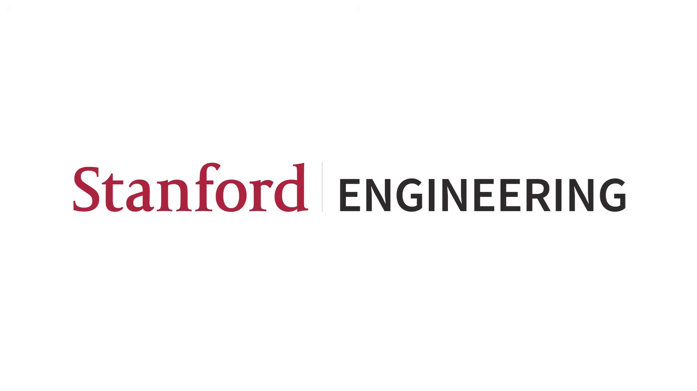

Welcome back to CS231N lecture 13.

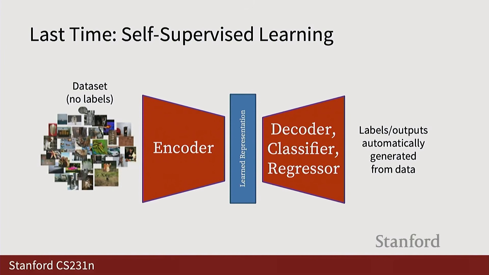

Today we're going to talk about generative models. So we talked about things like rotation of different tasks that we can use as pretexts to formulate these self-supervised learning objectives. Typically, this is usually a two-stage procedure.

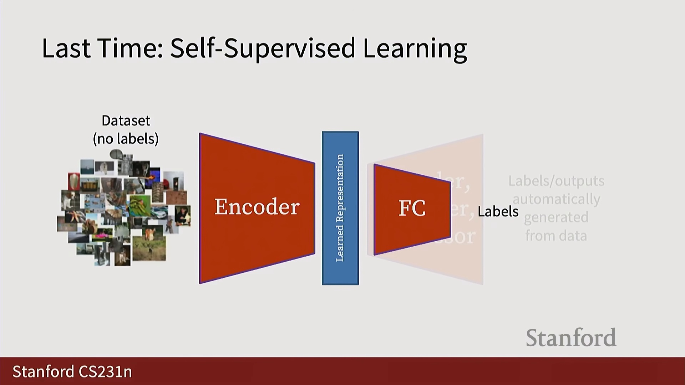

First, you're going to go and learn this self-supervised encoder–decoder on your self-supervised task on all the data that you can find. In the process of self-supervised learning, it's going to learn something about the general structure of images or of data. Then you can transfer that knowledge to downstream tasks where you have small amounts of human labels.

We want those tasks to be improved by this generic knowledge that we've learned through this self-supervised pretext task.

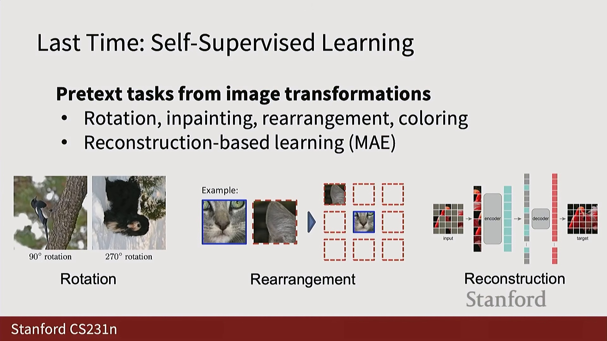

We talked about a couple of different kinds of pretext tasks last time, including rotation, rearrangement, and reconstruction. In the case of rotation, maybe you rotate the image and you ask the model to predict how much it was rotated. Or in reconstruction, maybe you're going to delete some parts of the input image, and then ask the model to fill them in as an inpainting or reconstruction task.

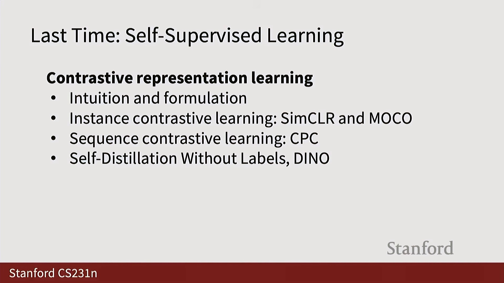

These are fairly successful. We also talked last time about a different formulation of self-supervised learning called contrastive learning, which has been very successful.

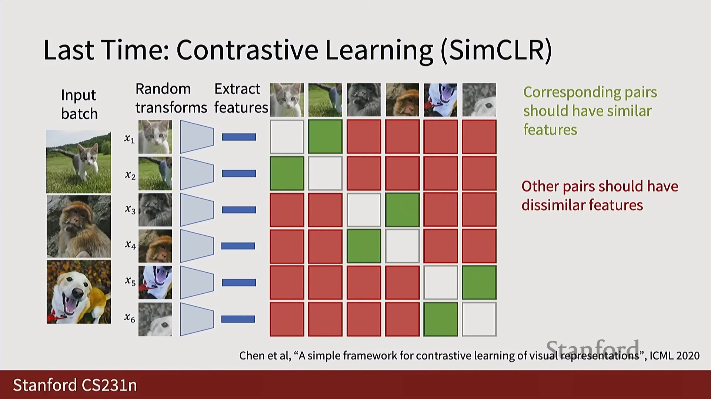

The way that you usually do this in the context of self-supervised learning is you're going to start with your input images. Again, these are unlabeled images; you don't have labels for them. For each input image, you're going to apply two random transformations. For instance, for the cat, we took one crop around the cat's face and another crop around the backside of the cat.

And around the monkey, we took one around the monkey's face and also dropped it to black and white, et cetera. Basically, for each one of your input images, you're going to apply two or possibly more than two—but two is a nice minimal subset—random perturbations to your input image. Then you want to apply this notion of contrastive. For each of the two augmentations that came from the cat, we want those two feature vectors to be the same, so we color them green.

You basically compute this big $n^2$ similarity matrix—well, I guess it's $2n \times 2n$, so it's $4n^2$. If you have $n$ images and put two perturbations on each, so we have a giant $2n$ by $2n$ matrix for all these perturbed augmented samples that we got. We basically want to pull together the two augmentations that came from the original image. And for every pair of augmentations that came from different original images, we want to push them apart.

That's the basic idea of contrastive learning.

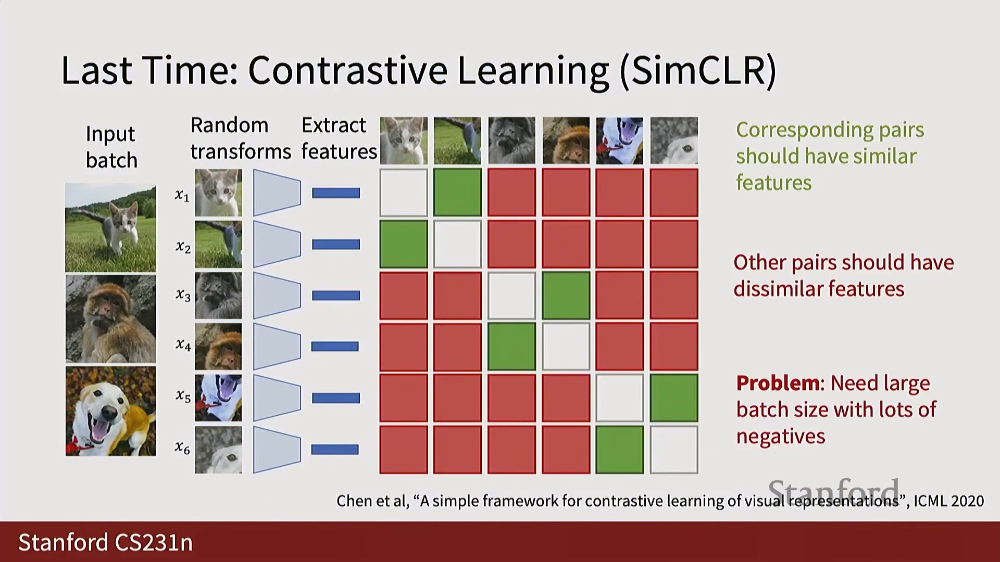

If there aren't that many samples, it's too easy to pick out two cat ones that looked similar. But you might ask, "Is there some way you can get away without that?"

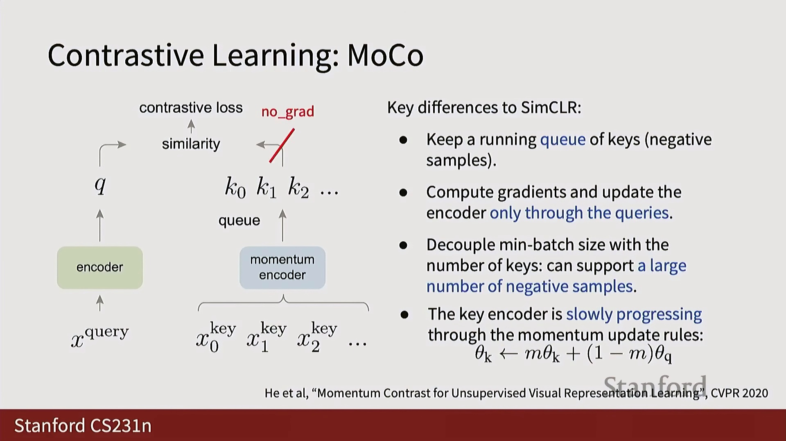

That leads to a couple of approaches that I don't want to go into too much detail.

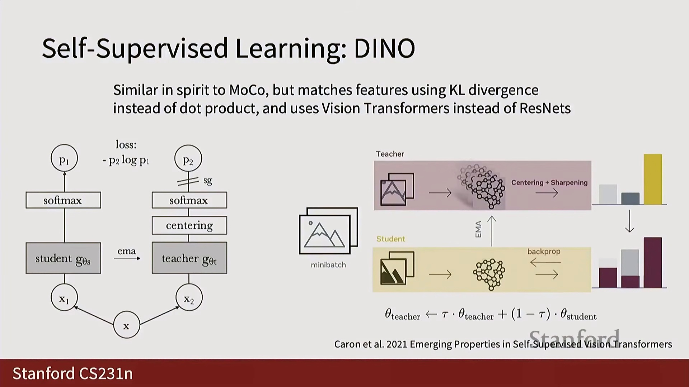

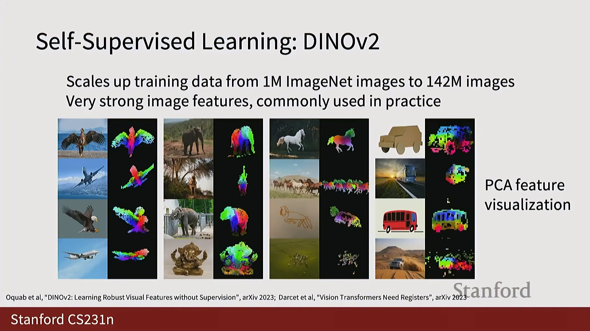

I actually don't want to walk through these and tell you exactly how they work. I just want to make you aware of their existence and give you the general flavor of what they are trying to achieve. In MoCo, or momentum contrast approach, to self-supervised learning, the setup is very similar to what we just saw in SimCLR. You're taking data; you're getting augmented pairs; you run them through a feature encoder.

You want to pull together the ones that are similar and push apart the ones that are dissimilar. The thing that differs, however, is that we want to get away with not having to have a gigantic batch size at every iteration. To do this, they keep a queue of samples from previous iterations of training. At every training iteration, I've got my $x$ (query) as my current new batch of data.

And I have this $q$, $\{x_0, x_1, x_2\}$ (key), which are previous batches of data that I've seen on previous iterations of training. My current batch of data is going to run through my encoder network the same as I always did and compute the contrastive loss the same way that we did with SimCLR. The problem is that we don't want to backpropagate into the momentum encoder because it has too much data; it has too big of a batch.

We can't afford to fit that in GPU memory, so we want to not have to backpropagate through that part. This means that we cannot update this momentum encoder—the second encoder—via gradient descent. Instead, we are going to do something different. The momentum encoder will have its own set of weights; we're going to learn them not via gradient descent.

What we are going to do is have the momentum encoder be an exponential moving average of the weights of the normal encoder. So the normal encoder, we're going to learn via gradient descent—everything is normal. We'll forward prop or back prop; we'll get gradients; we'll make a gradient update step on the typical encoder, that's the normal thing. So the momentum encoder has this other update rule where it's a lagging, trailing, exponential moving average of the encoder weights.

I don't have a great intuition or explanation for why this exactly makes sense, but there is very strong empirical evidence that this works. That's the state of things. This was fairly successful; there were a bunch of follow up papers that pushed this direction. Another one that you should be aware of is called DINO.

But the loss is a little bit different. Instead of using a softmax, they use some KL divergence loss. The big difference in DINO V2 is that they scaled up the training data quite a lot. In deep learning, we like bigger networks; we like bigger data; we like more GPUs; we like more FLOPs; we like all of those things.

And DINO V2 was able to find a recipe for self-supervised learning that successfully scaled up to this much larger dataset and gives very strong self-supervised features. This tends to be used quite a lot in practice today if you want to pick up features and then fine tune them or supervise them for some of your own downstream tasks. Again, I don't expect you to know all the details of how this works.

But I want you to know that it exists in case you want to pick it up and use it for some of your own projects in the future. So that's basically all I had to say about self-supervised learning. Any questions about that before we move on to the meat of today's lecture?

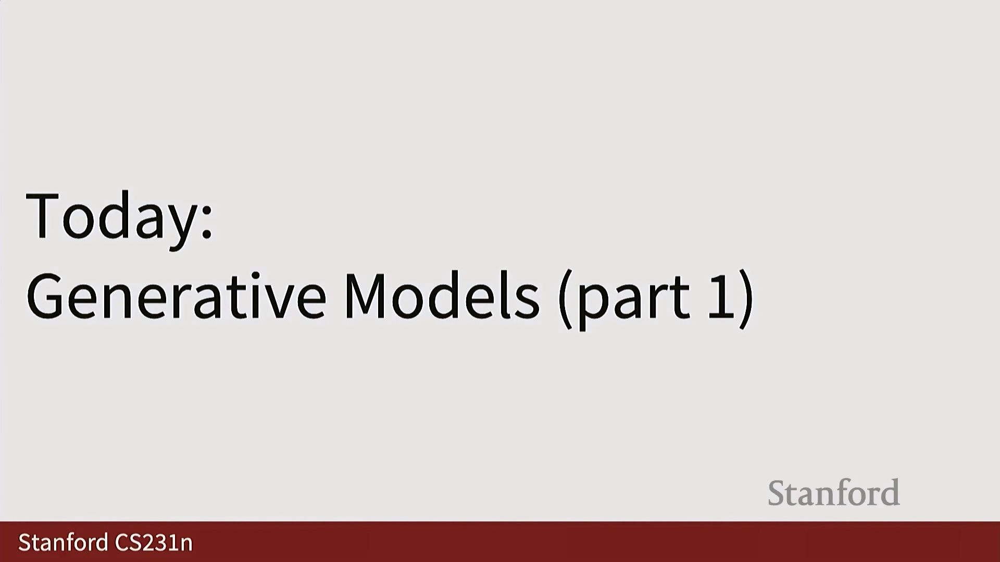

Guess not. So today the main topic is generative models. And this has given rise to things like language models. These can be viewed as generative models, as we'll see, all image generation models, and video generation models.

These really went from just absolutely not working at all when I was in grad school. You would look at these samples and peer into them, and they just look like low resolution, complete blurry garbage. But somehow you could view some promise in them. So this is an area of deep learning that basically didn't work at all with the first time we taught this class, and that's really cool that it now does.

But that said, a lot of the fundamental ideas around generative modeling actually have remained the same. The ideas about how you think about data, what are approaches for modeling them—a lot of those mathematical fundamentals actually have not changed that much in the past decade. What changed is more compute, more stable training recipes, bigger datasets, distributed training, and the ability to scale all this up into more useful tasks.

I think, was really what drove the progress over the past decade. There were some algorithmic tweaks, especially we'll see that next lecture when we talk about diffusion models.

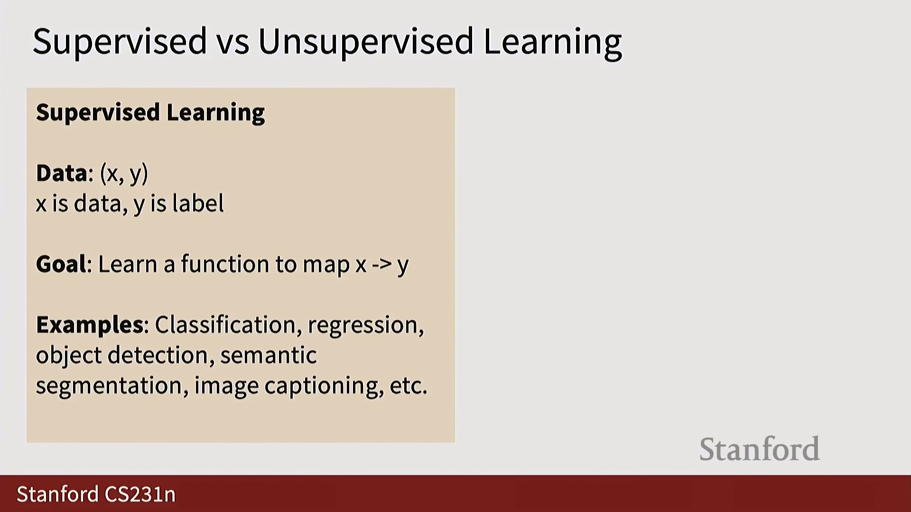

But first, before we talk about generative modeling, I wanted to step back a little bit and talk about supervised versus unsupervised learning. So I wanted to talk about those a little bit just so we get our terminology and our nomenclature clear. Supervised learning is what we've mostly been doing all semester except for last lecture. In supervised learning, we have a dataset of pairs, $x$ and $y$.

And the goal is to learn some function that maps from the input data $x$ to the target or label $y$.

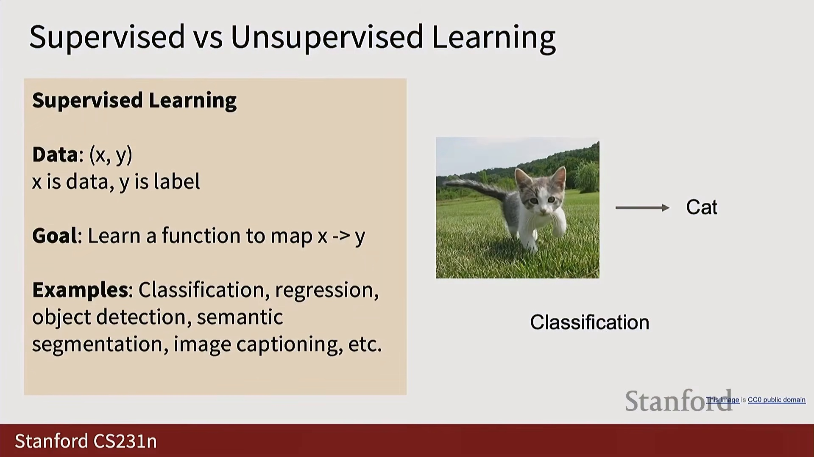

We've seen a lot of examples of this approach so far.

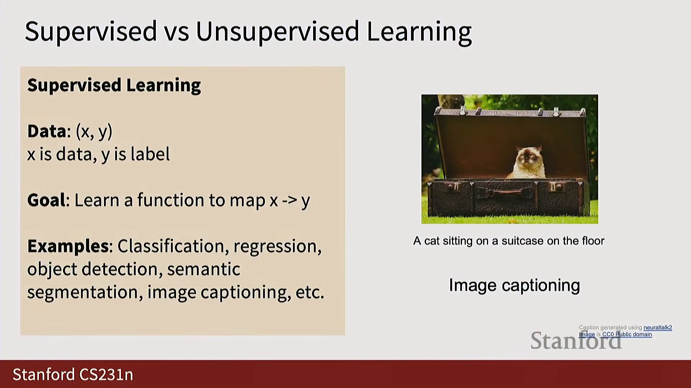

Something like image classification: our input $x$ is an image, and the output $y$ is going to be a label.

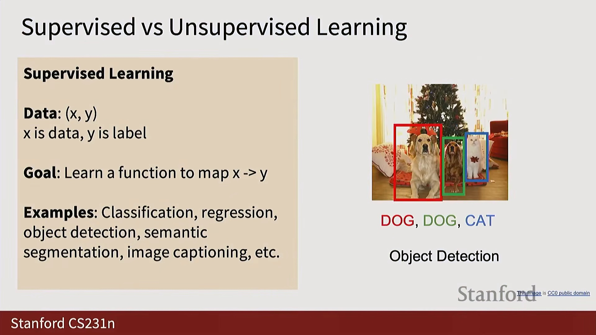

Or image captioning: the input $x$ is going to be an image, and the output $y$ is going to be some piece of text describing what we see in that image.

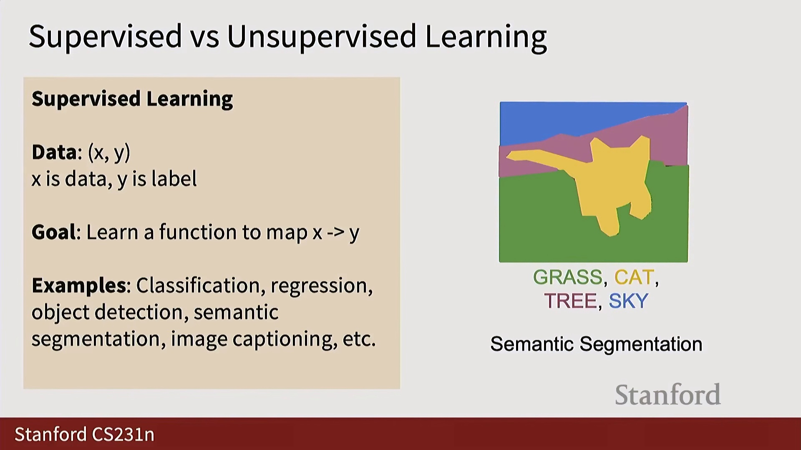

Object detection: input is an image, output is a set of boxes and category labels describing the objects that appear in the image. Or segmentation: maybe you assign a label to every pixel in the input image.

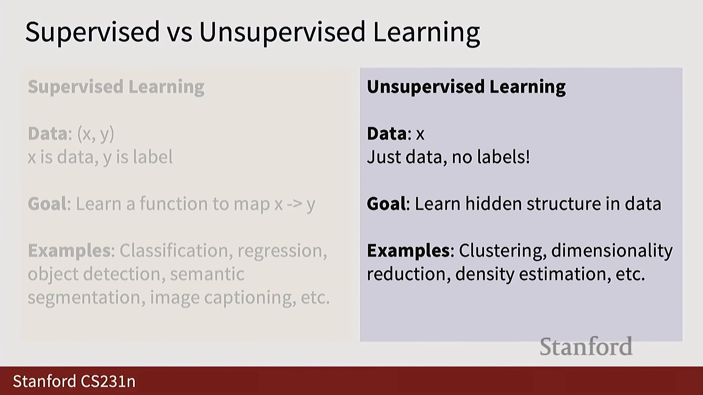

Now, unsupervised learning is something a bit more fishy and mysterious and hard to describe. But the idea of unsupervised learning, or sometimes self-supervised learning, is that you don't have any labels; you just have data. You just have samples $x$. You just have images.

And you want to learn some structure from that data. There's no particular task you're necessarily targeting. You're just trying to uncover good representations, good structure in all of that data. Why?

So that you can—as we talked about in self-supervised learning often—so you can apply it to downstream tasks later on. But the task itself in unsupervised learning is often somewhat unspecified.

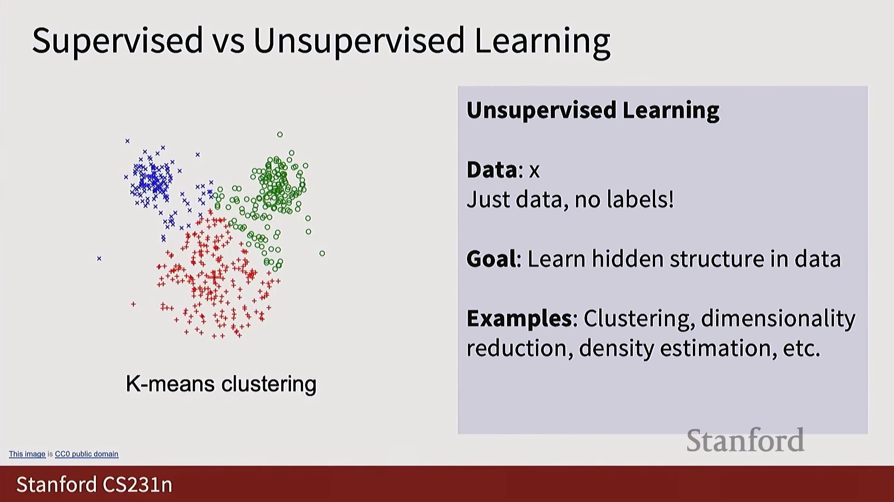

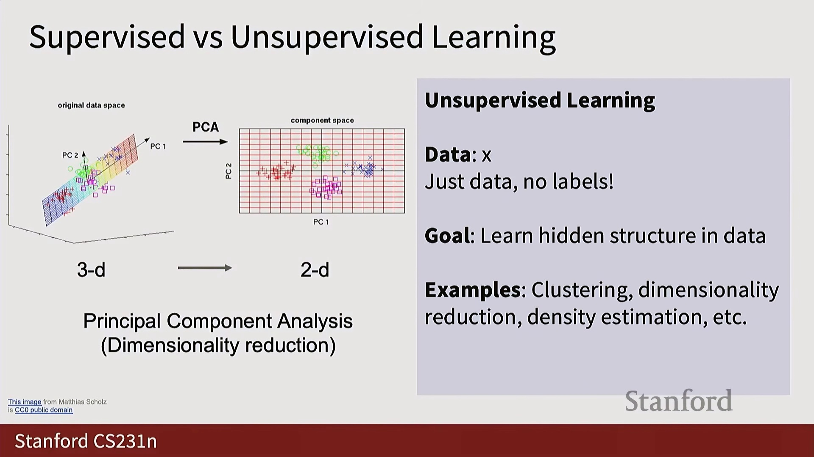

Or dimensionality reduction—PCA—where we're trying to uncover some lower dimensional subspace or lower dimensional manifold that explains the structure of our data. And again, this is something we're trying to discover from the data itself.

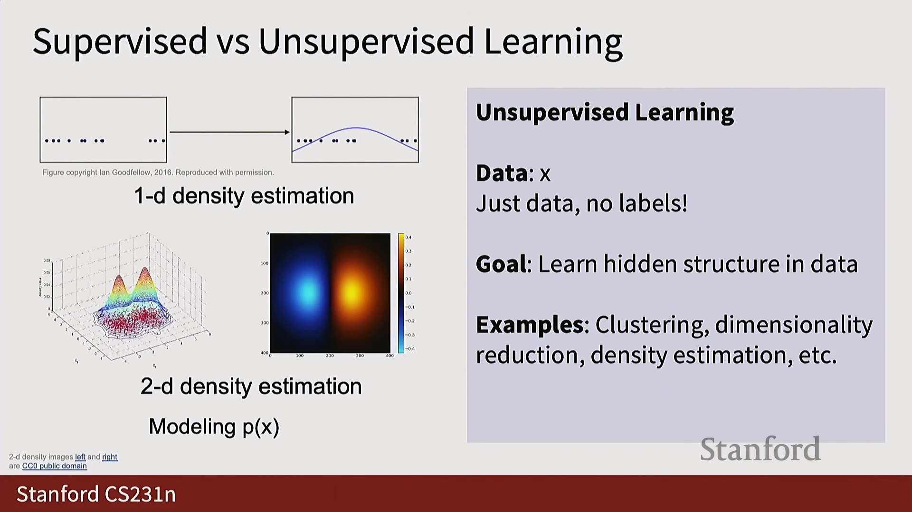

We don't have annotations of what this ought to be. Or density estimation: maybe we're trying to fit a probability distribution to the data. We're trying to understand what is the probabilistic function that gave rise to the data samples that we're seeing. And again, we don't have explicit labels for this or explicit training set for this.

So this is some hidden or latent structure that we're trying to uncover through the process of training. So this unsupervised dichotomy is something that you always should keep in mind. And you can do unsupervised learning, which is not probabilistic or not generative necessarily. Something like clustering, something like PCA—often they have probabilistic interpretations.

But these are examples of unsupervised learning that don't necessarily have a generative or probabilistic interpretation or don't have to be thought of as such. So I often like to think about the unsupervised dichotomy as one spectrum along which methods or systems can lie.

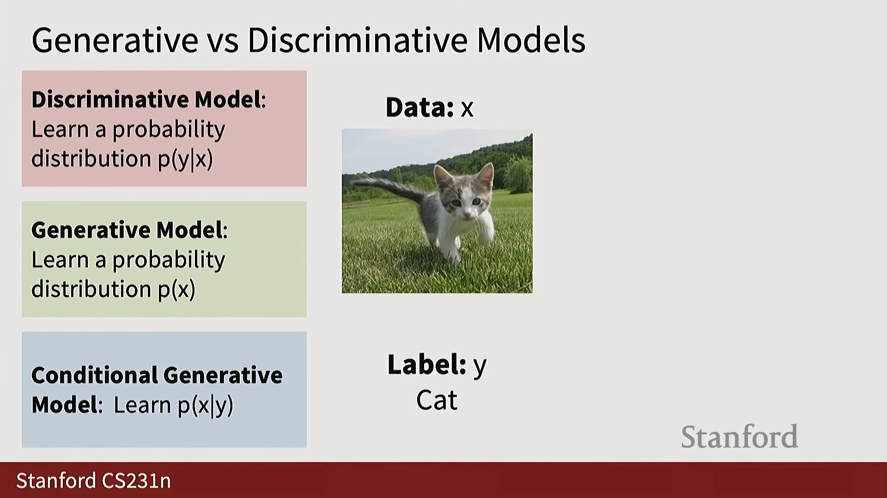

A separate spectrum along which we can classify systems or tasks is that of generative versus discriminative models. And these are inherently probabilistic. When we talk about generative or discriminative models, we're always imagining some probabilistic structure in our data that we're trying to uncover or learn from. The difference is exactly what the probabilistic relationship between the variables that we're trying to model is.

In discriminative models, typically we have some $y$ and some $x$. We usually think of $x$ as something large, high-dimensional, usually an image in our case.

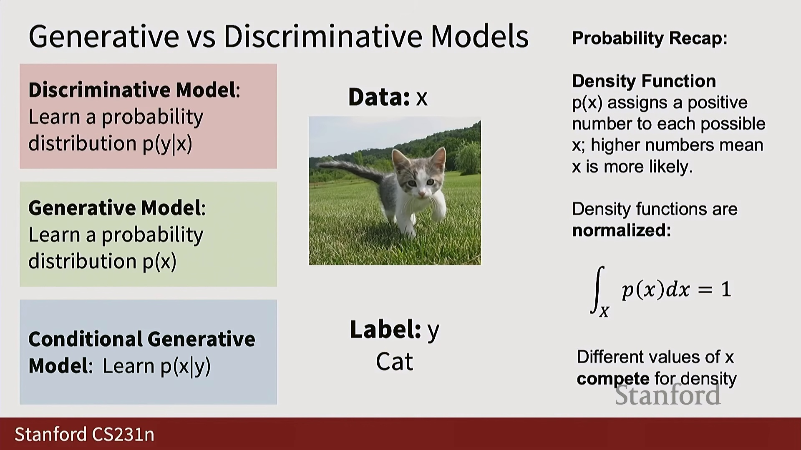

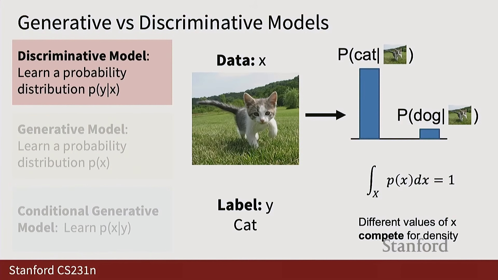

The $y$ is some label, description, or auxiliary information, like your text, your caption, or a category label. When you talk about a discriminative model, we're trying to learn a probability distribution of $y$ given $x$. We are trying to learn a distribution over labels conditioned on our input image $x$. To really appreciate what's going on probabilistically, you need to remember one very important feature of probability distributions: they are normalized.

This normalization constraint really gives rise to the power of probabilistic models in some sense because the constraint means that all of your $x$'s need to compete for probability mass. All of those $x$'s are in competition because there's only a fixed unit amount of mass to go around. So if you want to push up the probability of one $x$, necessarily, the probabilities or densities of other $x$'s have to go down.

In these different formulations of probabilistic models, basically what's changing is what are the variables that are competing for probability mass. If our labels are discrete and categorical, like cat or dog, that means we have a fixed amount of probability from 0 to 1, and cat and dog must sum to 1.

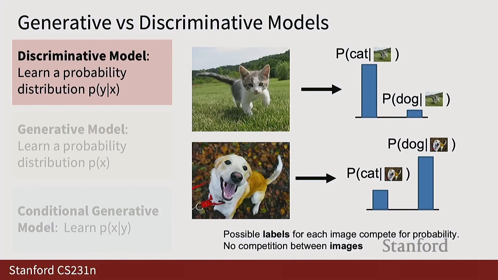

We have a separate probability distribution over the labels for every input $x$. Crucially, notice here that there is no competition among images for probability mass. Because every image is inducing its own distribution over the label space, there's no competition for mass across different images.

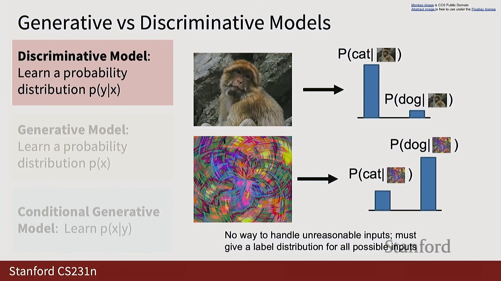

One interesting facet of discriminative modeling is that they have no real way to reject unreasonable inputs. It has no freedom to say this is unreasonable; it's forced to output a distribution over the fixed vocabulary that we assigned at the beginning.

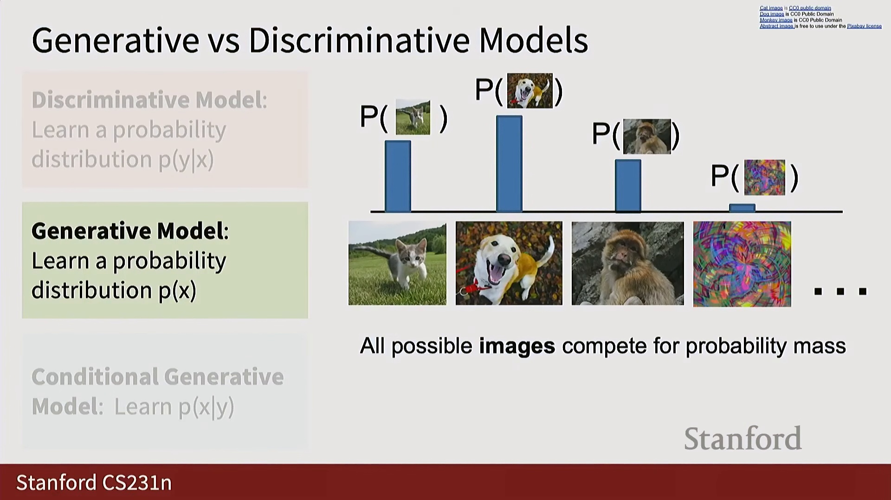

Now, a generative model is something very different. In a generative model, what we're doing is learning a distribution $p(x)$. We want to learn a distribution over all possible images $x$. This means that all possible images that could ever exist in the universe are now all competing with each other for probability mass.

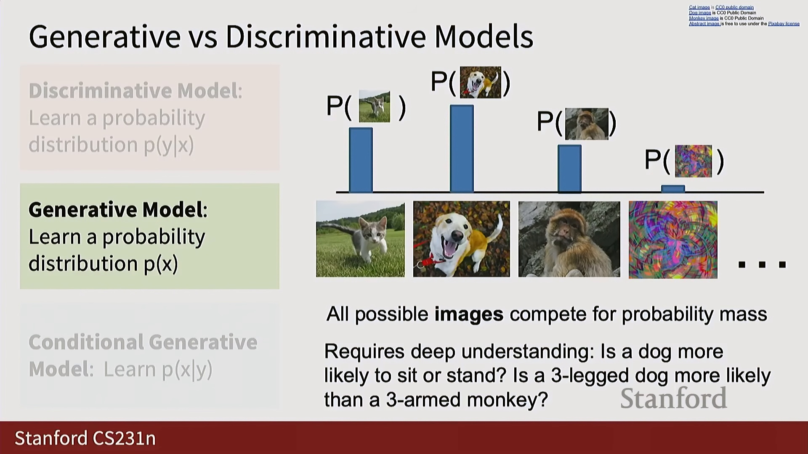

This requires confronting some very deep and philosophical problems about the world because now all images are competing for probability mass. Probably the three-legged dog should get more probability mass because you can have that happen by a dog losing a leg. But how are you going to get a three-armed monkey? That seems much more rare unless you're modeling sci-fi images or something like this.

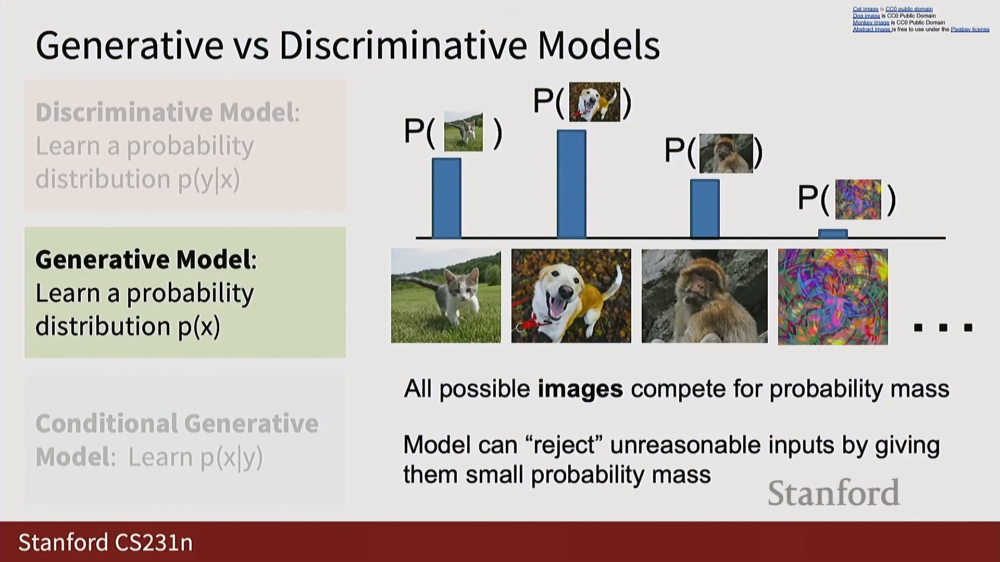

This is not a reasonable input." The way that it can do that is by assigning low or even zero probability mass to any one image that it gets. Maybe in our generative model, maybe we only want it to be a generative model of zoo animals. And if we want to have a generative model of zoo animals, then if we feed in an image of abstract art, it should have zero probability mass.

So now we have a mechanism for rejecting or saying that this type of image is not within the scope of what we care about.

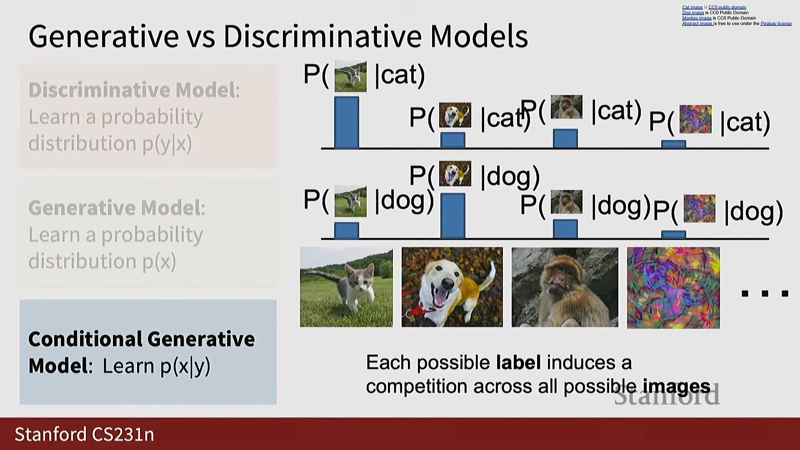

Now a conditional generative model is even more interesting. This is where we're learning a conditional distribution over images $x$ conditioned on some label signal $y$. This means that for every possible label, we are now inducing a competition among all possible images. Maybe the monkey and the dog image should be somewhat higher because they are still mammals at least, but the abstract art should be very low, maybe even $0$.

A different distribution among images exists if we're conditioning on the dog label. It might have been a whole paragraph of written text, or it might have been another image plus a piece of text. This is why I think that generative modeling is such an interesting topic because it looks simple. All we did was flop the $x$ and the $y$.

How hard could it be? But suddenly, it required us to think really hard about what's going on in the visual world. Also interesting is that we wrote down discriminative generative models and conditional generative models as three separate categories of things, but actually they are all related.

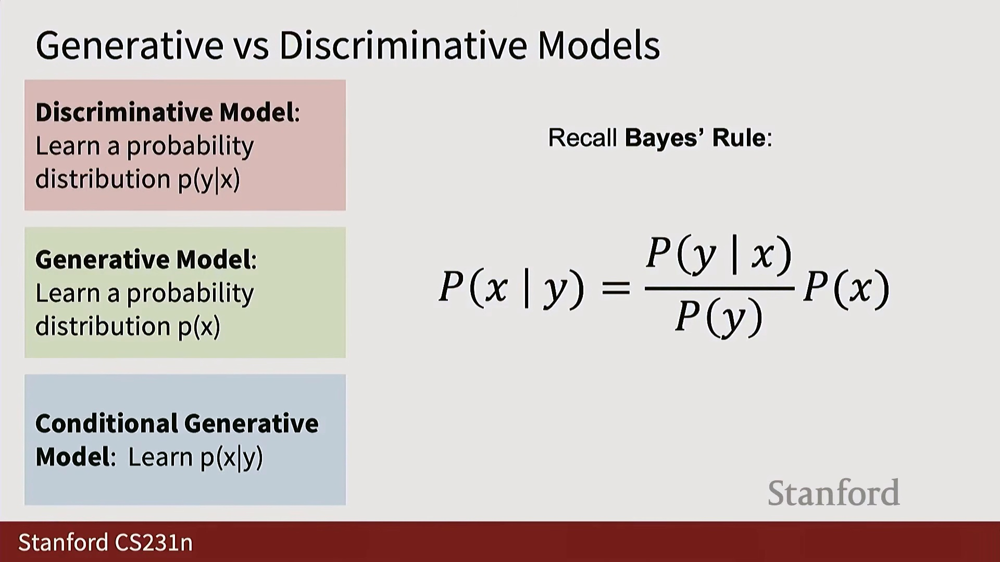

They are related through Bayes' rule, which is one of the most amazing relationships in probability.

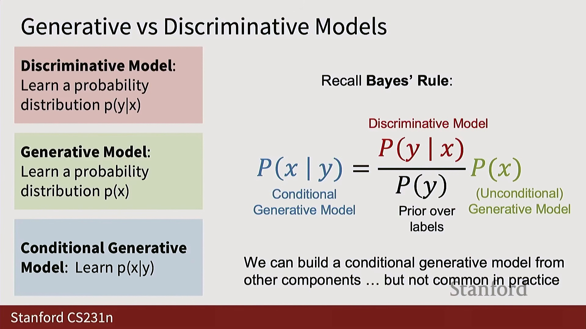

In general, you can always rearrange Bayes' rule in some way so that if you have any two of these, you can always get a third one, which is pretty cool. In theory, you can, in principle, build a conditional generative model out of the other two components. Although, in practice, this is not really how you do it; you tend to learn conditional generative models from scratch on their own.

As we'll talk about in diffusion, you do end up sometimes learning conditional and unconditional models jointly for some reasons. It is nice to keep in mind that there's a very deep relationship across these different flavors of probabilistic models. So then you might be wondering, what can we do with these different flavors of probabilistic models.

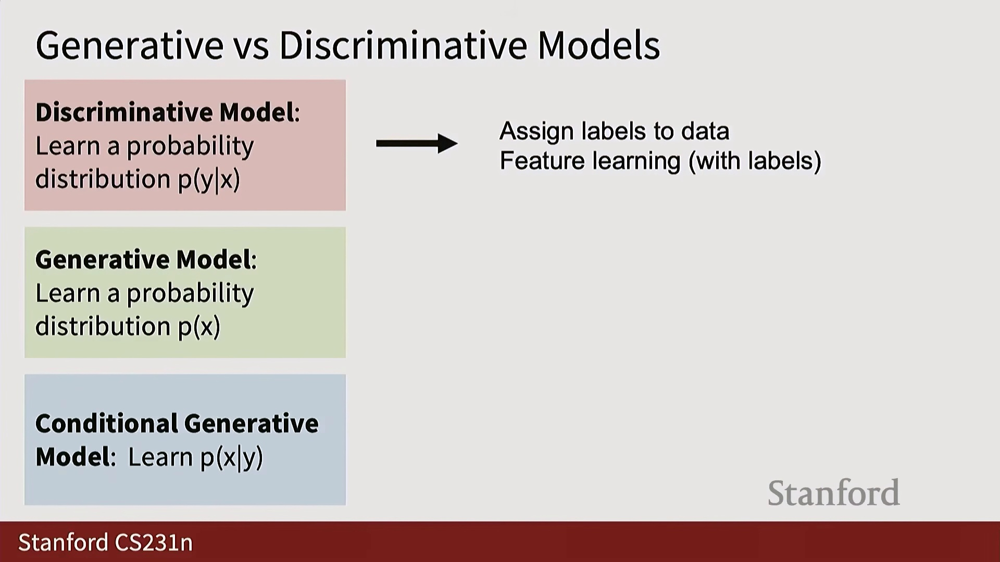

With discriminative models, this shouldn't require a lot of creativity; we've seen a lot of examples so far this quarter. After you train them, you can assign labels to data. You could also do feature learning.

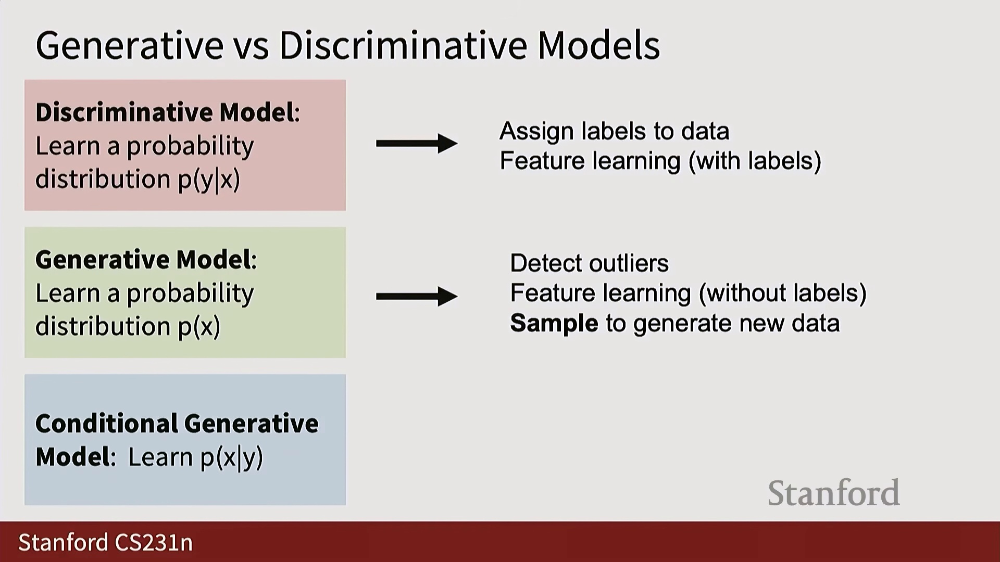

These unconditional generative models, I think, are actually useless in general. What they let you do is maybe detect outliers. They look at images and ask if they really have low probability mass—are they unreasonable images? You can use them for feature learning without data or labels.

Hopefully, in the process of trying to fit an unconditional distribution $p(x)$, the model learns some useful feature representations. In principle, you could use this unconditional generative model to sample and produce new samples $x$. But I think this is actually useless because it gives you no control over what is being sampled. If you have an unconditional generative model of images, you can sample from it to get a new image, but you have no control over what's in that image.

So I think it's mathematically interesting to think about how to build such models, but I don't think they have as much practical significance.

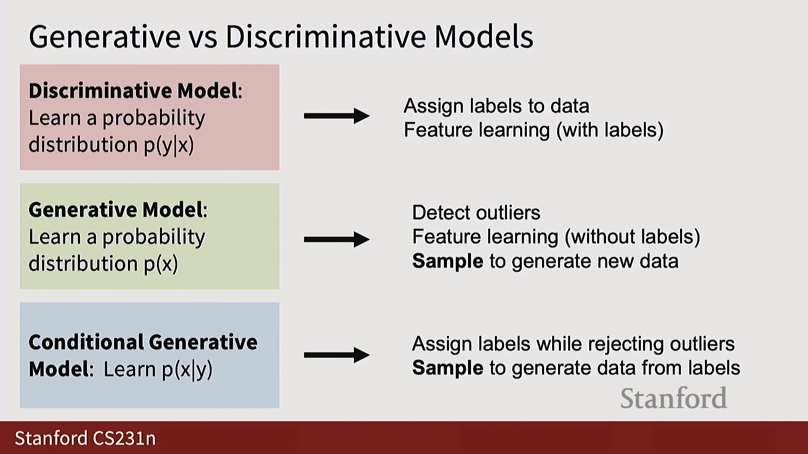

Conditional generative models are the most useful and the most interesting; these are the generative models that get trained and used in practice by far the most. You can, in principle, use them to assign labels while rejecting outliers. You could say, if I have a piece of data $x$, then look at the $p(x|y)$ over all of my possible $y$'s, and Then I could reject if that's too low among all the possible $\mathbf{y}$'s.

So in principle, you could use conditional generative models to do some classification while also maintaining the ability to reject outliers. Although I don't think that's really used too much in practice. This is where I think all the magic, where all the excitement is.

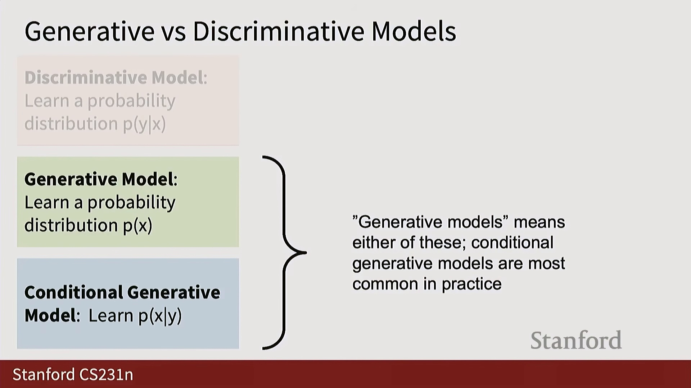

But I don't think unconditional generative modeling is super useful. It's almost always conditional generative modeling that you really want to do in most cases. For an unconditional generative model, what are the inputs and outputs? I didn't really tell you that, and I was sneaky there because how you parameterize that actually depends a lot.

There are many different formulations for all of these things. The inputs and outputs of the network are going to vary quite a lot depending on the formulation. We are going to talk about a whole taxonomy of those in a couple of slides.

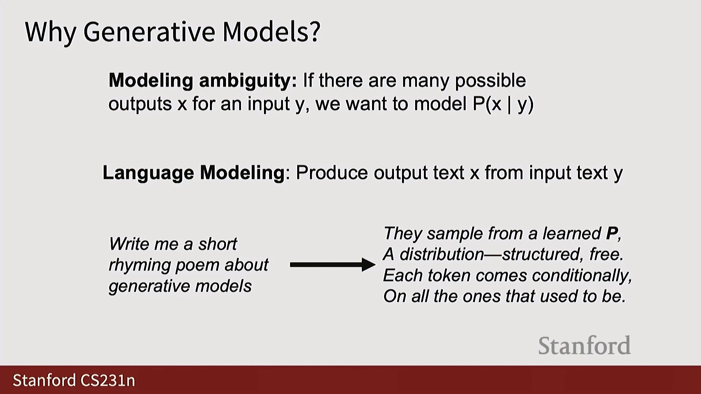

### Why Generative Models? The main reason you want to build generative models is whenever there's some ambiguity in the task you're trying to model. The beauty of a probabilistic model $p(\mathbf{x}|\mathbf{y})$ is that it's probabilistic. There might be a whole space of possible outputs $\mathbf{x}$ conditioned on that input label $\mathbf{y}$.

Sometimes there isn't ambiguity; sometimes there's just a deterministic mapping. For instance, I look at an image and want to ask how many cats are in the image. There are just three cats. There is only one answer.

But in a lot of cases, it's more subtle. If I ask for a picture of a dog wearing a hot dog hat, there are a lot of different images that could exist based on that query—there's uncertainty in the output. That's exactly what generative models are trying to model. They model a whole distribution of outputs conditioned on their input signal.

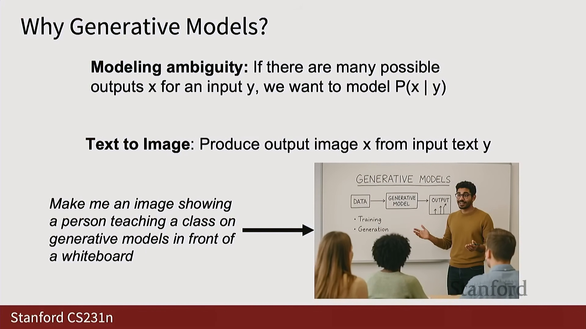

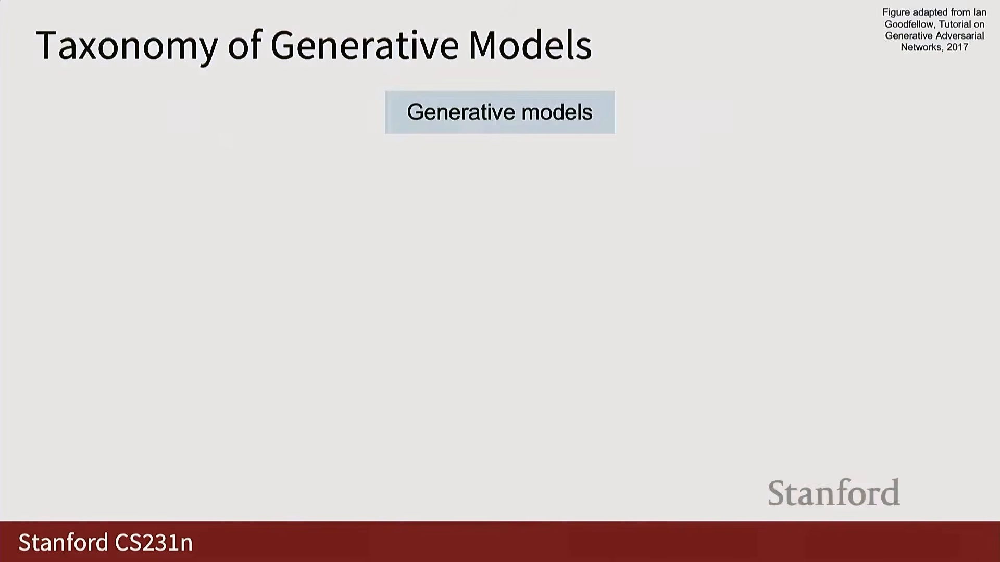

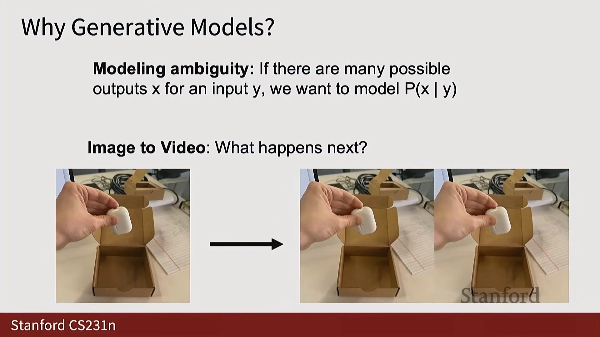

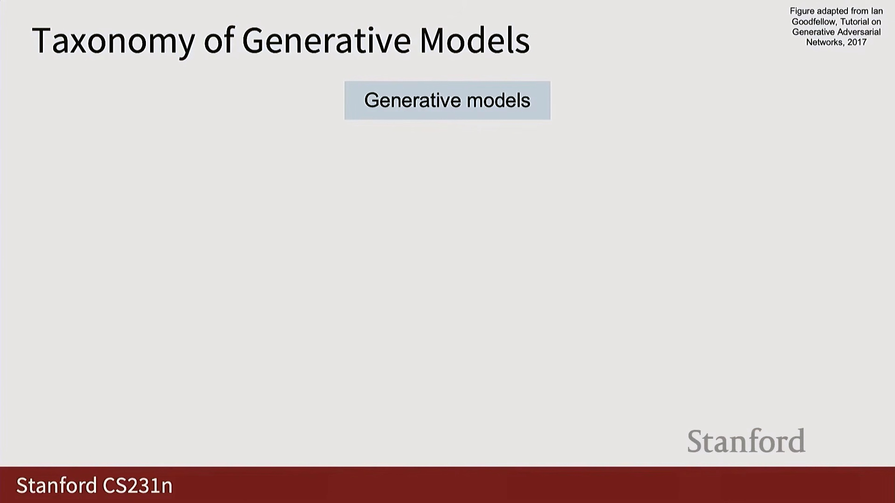

Anytime there is ambiguity in the output that you want the model to produce conditioned on the input, that's where you want to turn to a generative model. We will see a couple of examples of where this has gotten used a lot in the last couple of years. One example is language modeling. In language modeling, what you're often trying to do is predict output text $\mathbf{x}$ from input text $\mathbf{y}$.

Here’s an example from ChatGPT: The input is "write me a short rhyming poem about generative models." And wow, it actually works! This is crazy; this didn't work at all when we first taught this class. This is a conditional generative model.

You could imagine there are a lot of different possible rhyming poems that one might write, and the model had to pick one of them. The beauty of a generative model is that it, in principle, models that whole distribution over possible outputs conditioned on that input. Other examples include text-to-image: "Make me an image showing a person teaching a class on generative models in front of a whiteboard."

ChatGPT gave you a different example; there's a whole different space of possible images that might match this input text. A generative model allows you to model that whole space and sample from that space depending on what you want. We also have image-to-video: Input an image, and what happens next? A generative model, in principle, lets you model and sample from these possible futures.

### Conclusion: The Math of Generative Models This is why we want to care about generative modeling. Anytime there's ambiguity in the output, that's when you want to try to turn to a generative model to solve it. It turns out this is a huge field.

This subfield tends to have more math and more equations, which I find interesting. There is this whole taxonomy of different kinds of generative models that people build.

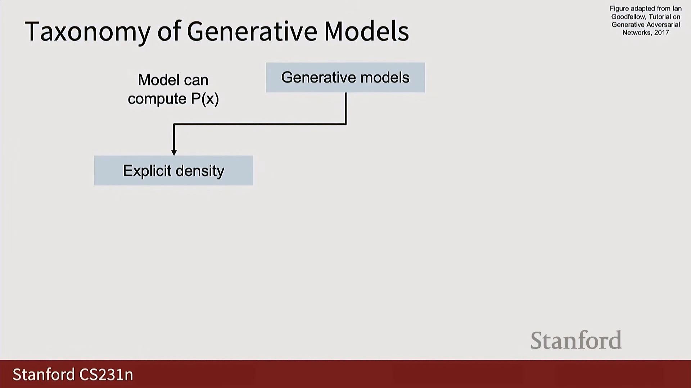

On the one hand, you can imagine one part of the family tree or what we call explicit density... Methods. These are ones where the model actually does: the whole thing is we're trying to model $p(x)$ or $p(x|y)$. With these explicit density methods, you can actually compute—you can get that value out, $p(x)$, for any sample $x$.

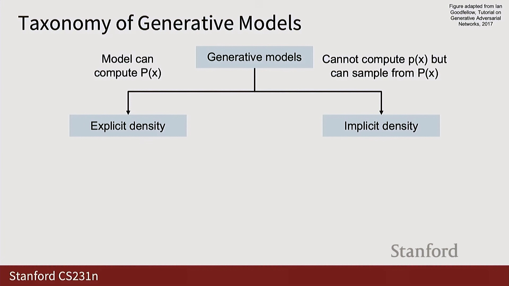

The counterpoint are implicit density methods. So the difference here is that in an implicit model, you can't actually access the value of the density function, but you can sample from the underlying density function somehow. The model has implicitly learned to model the density even if you can't get the value out. Not always, but sometimes.

Maybe all you care about is generating samples and getting a good diversity of samples.

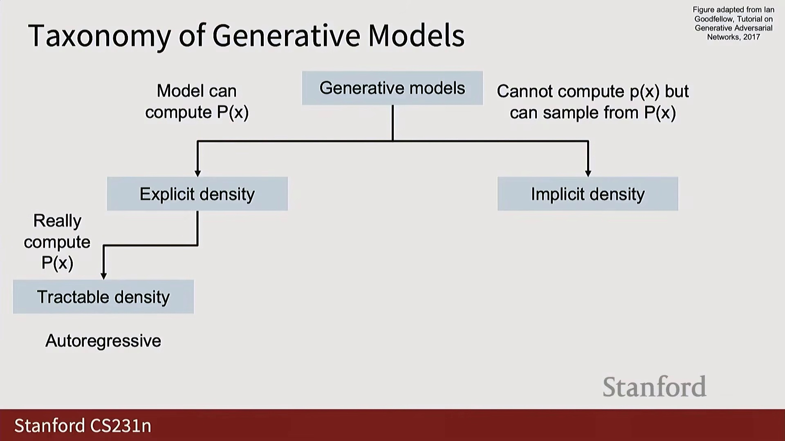

Then things break down and cascade and get more fractal-like from here. Inside explicit density methods, there are ones where actually yeah, you can really compute the real $p(x)$ that's being modeled.

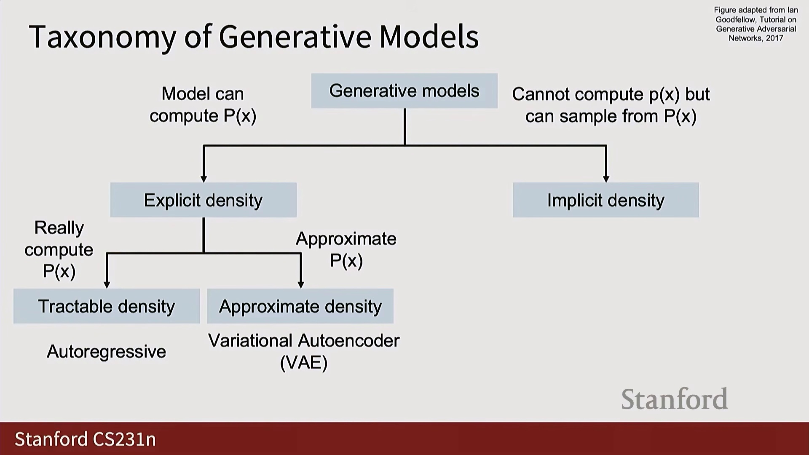

Autoregressive models are one example of that. Other versions of explicit density methods are ones where you can get a density value out, but it's not the real one. It's some approximation to the true density of the data. Variational autoencoders are one example of an explicit but approximate generative method that we'll see.

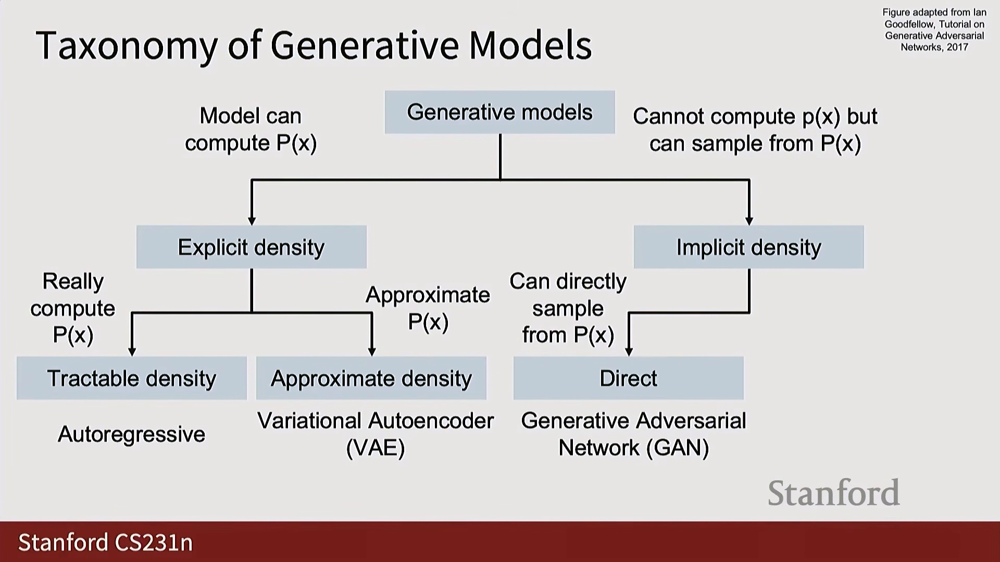

Now, on the other branch of the family tree, we can think about direct methods for implicit density. These are ones where maybe it requires a single network evaluation to just draw a sample from the underlying distribution that's being modeled.

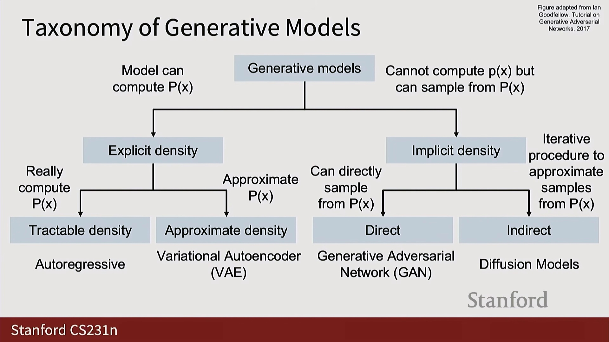

A Generative Adversarial Network (GAN) is an example of a generative model in this part of the family tree. The other part is—I don't know if it has a good name, I called it indirect. But this is a name I made up yesterday, so please feel free to correct me if there's a better term for this. These indirect ones are where you can sample from the underlying density $p(x)$ that's being modeled, but it requires some iterative procedure.

There's no feed-forward function that you can input and get the sample directly out. There's some iterative method that you need to run in order to draw a sample from the underlying density that's being modeled. Diffusion models are an example of this that we'll see next time. So yes, exactly.

So, the question was, can you just treat that indirect iterative procedure as a black box and then treat that as a direct sampling method? In principle, yes. But in practice no, because your samples end up approximate depending on exactly the method. With diffusion models, you would need to take an infinite number of steps in order to draw a true sample, so instead we approximate that with a finite number of steps.

And that's true of other methods as well. Diffusion models are the most common for this today. But some Markov chain method or MCMC method in years past might have also had this property where there is an iterative procedure. But if you want to draw an exact sample from the distribution that's being modeled, you need an infinite number of steps to converge.

So we always approximate that by taking a finite number of steps. I was pretty proud of this taxonomy because it's very symmetric. There's four leaves.

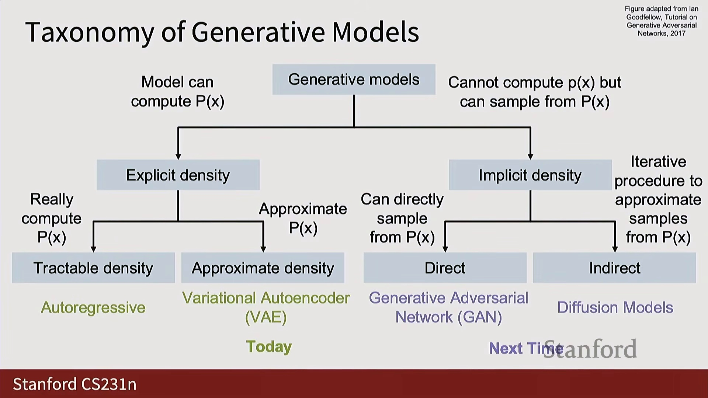

There's two branches. And we're going to cover half the tree today and half the tree next time. So I thought that was a pretty nice breakdown. The question is, what's the difference between the approximate density and directly sampling from an implicit $p(x)$?

The difference is that in an indirect but implicit method, there's no density value anywhere to be found. You can't compute one at all, but you can still iteratively sample in some way. With an approximate density method, you can still get a value out—you can actually get a density value out, that's going to be some approximate or bound to the true $p(x)$.

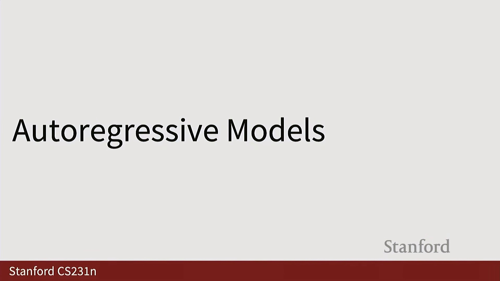

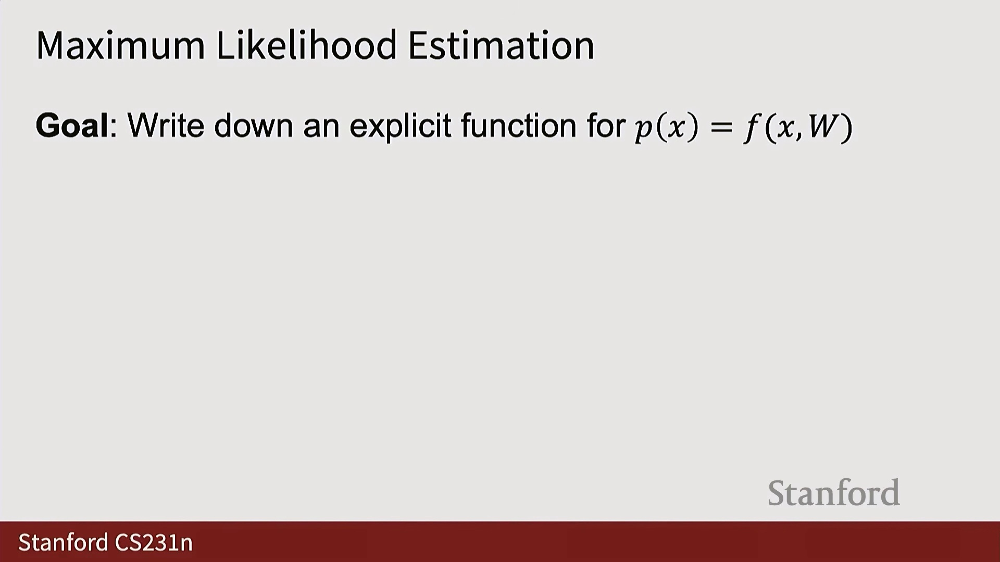

Then the first such generative model that we'll actually talk about in a little bit more concrete specificity are autoregressive models. Maximum likelihood estimation is actually a quite general procedure that we can use to fit probabilistic models given a finite set of samples. The idea is we're going to write down some explicit function for the density.

We said that some methods are going to explicitly model the density. Let's do it with a neural network.

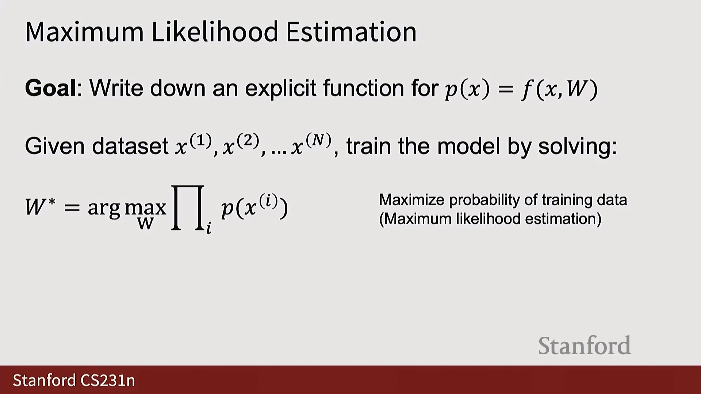

So then, we're going to train the data—given a data set of samples $\{x_1, x_2, \dots, x_N\}$—we're going to train the model via this objective function. We want to find the weights that make the dataset most likely. Note that we said likelihood rather than probability; that's a deep philosophical rabbit hole you can fall into. The difference is what we're varying.

If you think about probability, you imagine that the density is fixed and we're sliding $x$ around, changing what is the probability of $x$ under a fixed distribution. So you have to think very carefully in these equations what's being fixed and what's varying. The unsaid thing behind all of this is that we assume there is some underlying true probability distribution $p_{data}$, which was used by the universe to generate the data that we are seeing.

In some sense, what we always want to do is try to model that true underlying unknown distribution $p_{data}$. What we are trying to do through our learning procedure is uncover that unknown distribution $p_{data}$ given a finite number of samples from that unknown distribution. A standard trick we do here is assume that the data was i.i.d., independent and identically distributed.

Because it's independent, we can factor it down into an independent likelihood of each of the samples.


The common trick that we always use is the log trick. Since $\log$ is a monotonic function, maximizing something is equivalent to maximizing the $\log$ of that something. The $\log$ is also very convenient because it swaps sums and products. It's common instead of maximizing the likelihood of the data, we maximize the log-likelihood of the data, which is the same as maximizing the likelihood.

Once we apply the $\log$, that product splits into a sum, and sums are easier to handle.


We then slot in our neural network because our neural network is now directly outputting the density. This gives a direct objective function that we could use to train a neural network.

This idea of maximum likelihood estimation is very general.


You have to be careful with indices here; I said the subparts.


These are subparts of a single sample, so I use a subscript.


In the previous slide, we had a superscript to indicate different samples $x_1$ to $x_N$, so be careful with that. A superscript on this slide is for different samples $x$; a subscript on this slide means different parts of the same sample. We assume that there's some canonical way to break up our data sample $x$ into some sequence of subparts.


We can now apply the chain rule of probability. The probability of $x$ is just the joint probability of all of the subparts $x_1$ to $x_T$. This is the chain rule of probability; it requires no assumptions and is always true for any joint distribution of random variables. This gives us our objective function.

You could basically train a neural network that's going to input the previous part of the sequence and then try to give us a probability... distribution over the next part of the sequence. Does that sound familiar? Does that sound like something we've done before?

RNNs, yes. That's exactly what an RNN is doing.


An RNN has this very natural structure: by passing hidden states along forward through time, the hidden state always depends on the beginning of the sequence up to the current point. So then there's a very natural way to use RNNs for autoregressive modeling. You have your sequence of hidden states that are basically summarizing your sequence.


Have we seen anything else that can do this? Yes, transformers, and particularly masked transformers. So we can also use transformers for autoregressive modeling, and they are very commonly used for this. The problem with autoregressive modeling is that you need to break your data up into a sequence.

This is very natural with text data because text data is naturally a 1D sequence. It's even a 1D sequence of discrete things, which is great because it is very easy to model probabilities of discrete things. We have been doing that all semester with our favorite cross-entropy softmax loss. The cross-entropy softmax loss is always distribution over fixed discrete number of categories.

The network predicts a score for each one of those; normalize it with a softmax, and train with a cross-entropy loss. We know how to do that. That's why these things fit very naturally for language models because language is already discrete. Language is already a 1D sequence.

Images are more tricky because images are not naturally 1D. Images are also not naturally discrete. We often think of images as continuous, real valued things.


But you have a hammer; you are going to whack some nails. People definitely apply autoregressive models to images in a naive way at least some years ago. One thing you can do, one thing you can do to model images with autoregressive models is to treat an image as a sequence of pixels. Each pixel is actually just three numbers.

In most displays and in most representations of images, those numbers are actually discrete. Most JPEGs or PNGs—most of the file formats we use to store images—are typically 8-bit per channel. So there is only a fixed number of values that each pixel can take. A pixel is just three single byte values; a single byte is like an integer from $0$ to $255$.

So a pixel is just three integers, and each integer can be $0$ to $255$. What we can do is take our image and then rasterize it out into a long sequence where each element of the sequence is one of the subpixel values of our image. We've turned our image into a one-dimensional sequence where each entry in that sequence is a discrete value. So you can apply autoregressive modeling directly to that sequence in exactly the way that you might have for a language model using an RNN or a transformer.


Very expensive. A reasonable image that you might want to model is maybe $1024 \times 1024$. That's not even that high resolution, really, but that's a pretty good resolution. But if you have a $1024 \times 1024$ image, that's going to be a sequence of three million pixels.

People actually can model these days sequences in the millions, but it gets very expensive. There has got to be a more efficient way to do this.


A spoiler alert that we will talk a little bit more next lecture is that this actually has made a resurgence in the last couple of years. That's something we will talk about a bit more next lecture.


From autoregressive models, we next turn to variational autoencoders.


And variational autoencoders are pretty fun. Variational autoencoders are going to do something else. a little bit different. Instead, they're still going to be an explicit method.

They're still going to be some density that we can compute, but it's going to be intractable. We're going to be able to approximate it. Why are we going to do that? We had a perfectly good method that computed densities exactly.

And what we're going to give up for that is we're going to gain something. We're going to gain the ability to compute reasonable latent vectors over our data. We're going to have vectors that represent our data that pop out naturally from the learning process.


Oh, the motivation for breaking stuff up in a sequence in autoregressive models because it factors the problem. It makes each part easier to model. So imagine you're doing language modeling, and you have a vocabulary of $V$ words. And I want to model the probability of two words jointly.

How many possible two-word sequences are there? There's $V^2$. How many possible three-word sequences are there? There's $V^3$.

And in general, if you have how many $T$-word sequences with a vocabulary $V$ are there? It's $V^T$. So that's bad. It grows exponentially.

And that's quickly going to become completely intractable if we want to go to long sequences. So then the reason we break that up is so that we don't have to model it all at once. We factor it in this way and predict only one part conditioned on the previous parts. Good question.

Can we apply the log trick to mitigate that? Yeah, exactly. So in practice, you'll never actually see these probability density values modeled. Almost always you're going to work in log probabilities instead.

The model is going to output log probabilities. You're going to compute your loss in log space.


For numeric stability, you're almost going to compute everything in log space in practice. And it does that for every point in the sequence. So you could actually recover this exact probability density value by multiplying out the values that all points in the sequence. And I can compute what was the actual next token, what was the predicted probability of the next token, and then multiply all of those across the entire sequence.

So that's how we can recover the exact density value out of one of these autoregressive models. And that actually would apply either to an RNN or a transformer. Good question. So then in a variational autoencoder, things get hairy.


We're actually going to drop the $V$ and talk about autoencoders for just a couple of slides because I don't think we've done that yet this course.


In a variational autoencoder, this is basically going to be an unsupervised method for learning to extract features $\mathbf{z}$ from inputs $\mathbf{x}$ without labels. And this actually is in this vein of self-supervised learning that we just talked about. Our notion is that the features ought to extract useful information about the data. Maybe they somehow implicitly encode what is the identity of objects in the image, how many of them there are?

What are the colors of them? We want this feature vector $\mathbf{z}$ to contain useful information about the input $\mathbf{x}$. And this encoder itself could be a neural network of any architecture. It could be an MLP, transformer, CNN, whatever you want.


But inputs are data $\mathbf{x}$, and then it's going to output some vector $\mathbf{z}$. And then the question is, how do we do this without labels?


We actually saw a lot of examples of this in the previous lecture. But there's a very simple one, which is just try to reconstruct the input. So we're going to now have a second part of the model called the decoder, which is going to input $\mathbf{z}$ and then output back an $\mathbf{x}$.


And we want—oh, I dropped the $\mathbf{x}$. And we're going to train this thing so that the output from the model should actually match the input. In some sense, the stupidest loss function ever. We're just training the model to mimic the identity function.

Why do we do that? We already know the identity function. Why are we spending a lot of flops and training a neural network on a big data set to just learn the identity function that we already know? It's because we're going to bottleneck it in some way.

If this model had infinite capacity, for example, if that $\mathbf{z}$ vector was very wide, if there were no constraints on the learning, I would expect a neural network to just nail this problem. But we don't want to do that because we explicitly don't care about learning this objective. We already know the identity function. We don't need an expensive neural network to compute it.

What we want to do is force the network to try to learn the identity function under some constraint. And the constraint that you often use in a traditional autoencoder is by bottlenecking that representation $\mathbf{z}$. In particular, that means that that vector $\mathbf{z}$ in the middle is going to be much, much smaller than the input $\mathbf{x}$.

So your input $\mathbf{x}$ might be a high resolution image, maybe a $1024$ by $1024$ image that we said is composed of three million floats. But then that $\mathbf{z}$ might be like $128$ dimensional latent code. So the model is now asked to solve this problem where I want to reconstruct the output— reconstruct the data $x$, but squash it through this bottleneck representation in the middle.


But what if we want to use this to generate data? If we had some procedure for sampling $z$'s that matched the data distribution in some way, then we could sample a $z$, pass it through our learned decoder, and now generate a new sample. This is an implicit method.


The problem is that we've kicked the can down the road here a little bit because if we want to generate images, we want to generate $x$'s. We have a dataset of $x$'s. How do we do that? We said we would solve that by training this autoencoder.


Now we have a dataset of $z$'s, and we need to sample in $z$ space—it's not any easier, so we're stuck. The idea of Variational Autoencoders is: what if we could force some structure on the $z$'s? But what if we had a mechanism to force the $z$'s to come from a Gaussian distribution or some other known distribution? If that were the case, then we could just draw a sample at inference time.

After this model is trained, draw a sample from that known distribution, pass it through the decoder, and now we would have our sample. Forcing these autoencoders to be probabilistic and to enforce a probabilistic structure on that latent space exactly is what a variational autoencoder tries to do. Variational means it's a long story; it has a long history around that terminology in the literature.

But basically, Variational Autoencoders are a probabilistic spin on our traditional autoencoder. More concretely, we assume that our training data $x_i$. Note here that the superscript $i$ means these are different independent samples of $x$. We assume that each $x_i$ was generated from some underlying latent vector $z$, that there's some $z_i$ lurking under the surface associated with every $x_i$.

In the universe's procedure for generating data, it first generated the $z$, then it generated the $x_i$ from the $z_i$. Everything contained in that latent vector $z$ was needed to generate the image we saw. We can't see those latent vectors $z$; we can never observe them. We don't have a dataset of them.

After training, we could generate a sample by drawing a $z$ from that known distribution and passing it through the decoder; that's going to give us a sample. We typically assume a simple prior—almost always a unit Gaussian distribution is by far the most common. How do we possibly train this? This feels like an impossible problem: we want to train a network that gets these $z$'s and finds a $z$ for every $x$.

Since we can never observe the $z$'s, this seems impossible. What are we going to do? We're going back to maximum likelihood. If we indeed had a dataset of $x$'s and $z$'s, we could use maximum likelihood to directly maximize the log probability $\log p(x'|z')$.

We could use the exact same thing that we previously saw, training a conditional generative model $p$ of $x$ conditioned on $z$.


But we don't know $z$. But let's pretend we do for a moment. Because we don't know $z$, we could try to marginalize. We know that $p(x)$ is equal to—maybe there's some joint distribution of $x$ and $z$ that must exist even though we can't observe it.

In principle, you could integrate out the $z$ to marginalize over it to get a $p(x)$. We can pretend there's a joint distribution $p(x, z)$, marginalize out the $z$, and still do maximum likelihood.

Let's see how this works. Using the chain rule, we break up that $p(x|z)$ from the joint probability $p(x, z)$. into $p(x | z)$ and just $p(z)$. So this $p(x | z)$, that's okay.


We could compute that with our decoder here on the left, that's a neural network that we're hoping to train. This $p(z)$ term is okay. We're going to assume that that's a unit Gaussian or some other simple distribution that we can compute or reason about.


But this integral kills us. In general, we have no feasible way to integrate over the full space of a neural network's input. This $p(x | z)$ is going to be some very complicated function that's modeled by a neural network. There's going to be no way that we can analytically or exactly integrate this.

You can train neural networks for individual parts here. So the whole underlying notion here, whenever you're doing this probabilistic modeling, is like we're going to write down some probabilistic terms. Hopefully, some of them are going to be simple distributions that we can write down analytically and reason about. Some of them are going to be learned neural network components.

So we're assuming that $p(x | z)$ is going to be some neural network that we could, in principle, learn via maximum likelihood. But we're starting to write down what objective could we use to learn that neural network via maximum likelihood. And we're out of luck here because you have no way to integrate over $z$.


So we could try something else. Bayes' rule, that's the other thing we always do in probability. So let's try Bayes' rule. If we have Bayes' rule, we have another formula that we can use to write down $p(x)$.

So $p(x)$ we can write down using Bayes' rule in this equation on the screen.


Let's see what we can do with these terms.


So this one, $p(x | z)$, again, we can compute that with our decoder. $P(z)$, again okay, this one's—we assume this is Gaussian, so we can compute something with it.


There's no integrals here. That's good. So we're in good shape. But now we're out of luck, this $p(z | x)$ term.

This posterior of $z$ given $x$, we have no good way to compute this. In order to compute this term, you would also need some kind of integral—out of luck.


We can't compute it. What are we going to do? Let's use another neural network. And the whole thing is, we want this other neural network to try to approximate the true $p(x | z)$ of the first neural network.


And you can't really enforce this in general, but let's put a neural network there and see what we can do.


So that's what we do when training a variational autoencoder. We're basically going to jointly learn two different neural networks. One is the decoder, which inputs the latent code $z$ and outputs a distribution over the data $x$. The other is an encoder, which is going to input the data $x$ and output a distribution over the latent codes $z$.

And each of these are going to be separate neural networks that are separately trained with their own independent weights.


There's a question you might have, which is, how can you possibly output a probability distribution from a neural network?


That seems confusing and hard and unclear. So the trick here is we're going to actually force everything to be a normal distribution. And we're going to have the neural network output the parameters of the normal distribution. And the model is going to output the mean of that diagonal Gaussian distribution.

And typically for the decoder, we'd assume a fixed variance or standard deviation $\sigma^2$. Now, for the encoder network, same idea. The model is going to input the data sample $x$. And then it's going to output the parameters of a Gaussian distribution that models the distribution $q$ of $z$ given $x$.

And here it's very important that we assume the diagonal structure, because otherwise we would have to model $h^2$ entries in that full covariance matrix. So instead we'll just ignore any correlation structure among the different values. And now that means that the diagonal covariance is now a vector that's the same size as the data itself. So that means this $\mu$ of $z$ given $x$, and this $\Sigma$ of $z$ given $x$ are both vectors.

of the same shape as $z$. So we basically have the neural network output two vectors of the same shape, and then treat them as the parameters of this Gaussian distribution. That's how we can output a distribution from a neural network.


If you do maximum likelihood on this thing with a fixed standard deviation, it actually becomes equivalent to $L_2$, and that's a nice trick. Instead, we're always going to output the mean. And then it turns out if you write this down, that constant $\sigma^2$ just comes off as a constant in the front. In practice, maximizing the log likelihood of a Gaussian distribution with a fixed variance along the diagonal is equivalent to minimizing $L_2$ distance between the mean and the $x$, which is nice.

Is there some weird invariance or non-invariance structure here of what the pixel shifting? That would be more a property of the architecture that you would choose to build the neural network. You could try to build into your network architecture that's predicting these. You could try to build some invariance or equivariance properties into the architecture.

But yeah, you're right that, in general, that's not accounted for at the loss level here.


So now we've got this idea. We've got an encoder, a decoder. One is inputting $x$, outputting a distribution over $z$; the other is inputting a distribution over $x$. What's our training objective?


Basically, the idea is we want to do maximum likelihood. That's usually the single thing that we want—that's the guiding principle behind a lot of objectives in generative modeling. So we want to maximize $\log p(x)$. We can then use Bayes' rule to write that as $\log p$ of this Bayes rule expression.


This is an exact equivalence. We're going to do something silly; we're going to multiply the top and bottom of this by our $q(z|x)$.


We do some logarithm math. After taking logarithms, we break this up into three separate terms.


You need to make another magical observation, which is that $p(x)$ actually does not depend on $z$. So far, this sequence of three terms is all in exact equivalence; these are all exact equalities. Even though there's a $z$ in this expression, we actually don't depend on $z$ because all the $z$'s would cancel out. If you have something that doesn't depend on $z$, you can always wrap an expectation over $z$ of that thing.

So in this case, since this is our $p(x)$, we can feel free to wrap an expectation $\mathbb{E}$ over $z$ sampled according to any distribution that we want of $p(x)$. Because that internal thing does not depend on $z$, this is always true for any distribution that we might choose to take this expectation over.


Then because expectation is a linear thing, we can apply that expectation to each of these three terms upstairs. Now we have these three terms, each of which looks very mysterious.


This first one we're going to carry down as it was before. The second two are actually KL terms. We can rewrite this exactly as this first term (which is an expectation $\mathbb{E}$...), plus these two other KL terms. Now, these all look crazy, but if we stare at each of these terms, we can actually recover an interpretable meaning.


For each of these three terms. The first one is actually a data reconstruction term. If we walk through what this is saying, it's saying that we are going to sample a $z$. We are going to sample $z$ by $q(z|x)$, which is our encoder.

So we are going to take our $x$, pass it to the encoder. The encoder is going to predict a distribution $q(z|x)$.


Then, from that predicted distribution, we're going to sample a $z$. We are going to take an expectation over all such $z$ and maximize the log probability of $x$ given $z$. This is basically a data reconstruction term. So this is a data reconstruction term.

The middle one is a prior term. This is measuring the KL divergence between $q(z|x)$ and $p(z)$. Remember, $q(z|x)$, this is the encoder, is inputting the data $x$ and outputting a distribution over the latent space $z$. So this is the predicted distribution over the latent space from the encoder.

And this other term, $p(z)$, this is the prior. This is the prior that we assumed for the latent space, usually a diagonal Gaussian. So this is just measuring how much does that latent space that's learned by our model match the prior. The third term gets us in trouble.

This third term is $q(z|x)$, so that's the predicted distribution over $z$ given the input data $x$ to the encoder, and how much does that match $p(z|x)$? That's this flipped around distribution of what the decoder is modeling. And this one, we are out of luck. We cannot compute this term because remember what got us into trouble in the first place was this $p(z|x)$.

The whole reason we introduced $q$ was because we could not compute this $p(z|x)$. So now what do we do? We're going to throw it away. Because we know that KL divergences are always greater than or equal to $0$.

So we can throw it away and get a lower bound to the true probability. If we throw away that last term, then we know that $\log p(x)$ is greater than or equal to those two terms: our reconstruction term and our prior term. This will be the loss that we use to train our variational autoencoder. The idea is that this is an approximation to the true log likelihood.

It is a lower bound to the log likelihood. If we maximize the lower bound, hopefully that will also maximize the true log likelihood even though we are not doing it exactly. So that's our training objective for variational autoencoders. That's the summary.

You are going to jointly train an encoder $q$ and a decoder $p$ to maximize what is called a variational lower bound on the true data log likelihood. This is also sometimes called the Evidence Lower Bound, or ELBO. It's just the ELBO. We are going to maximize the ELBO.

It has this particular term: we have these encoder network and this decoder network. That's what we do. To walk through what the training procedure looks like more explicitly, we are going to have this neural network encoder inputs $x$, outputs the distribution over $z$. Then we are going to apply this KL term to the predicted distribution.


Then we draw a sample $z$ from the predicted distribution.


Even though this looked like a large, scary slides of math, it actually led to not too crazy of a training objective for this thing.


I think this variational autoencoder is actually very interesting because these two losses fight against each other in a very interesting way. The reconstruction loss wants the sigma to be $0$ and the $\mu_x$ to be a different and unique vector for each data $x$. Because if that were the case, then we could perfectly satisfy the reconstruction objective.

We would have a separate unique vector for every data point. And there would be no probability in there. We could perfectly reconstruct everything. So that's what the reconstruction loss wants.

But the prior loss actually wants the sigmas to be all one because it wants to be unit Gaussian, and it wants all the $\mu$'s to be 0, which is very different from what the two losses want.


Once you've trained it, you can sample $z$ from your prior, run through the decoder, and get a sample.


You can vary them separately, and maybe those separate dimensions often encode something useful or interpretable or orthogonal about your data. In this case, we took a VAE, trained it on a data set of handwritten digits. You see that as we vary two dimensions of the latent space, the digits smoothly morph from one category into another. This is a pretty common property of VAEs.


So that's basically it for today.


To recap what we talked about, we talked about supervised versus unsupervised learning.


We talked about these three different flavors of generative modeling, and then we talked about one branch of this family tree of generative models.

